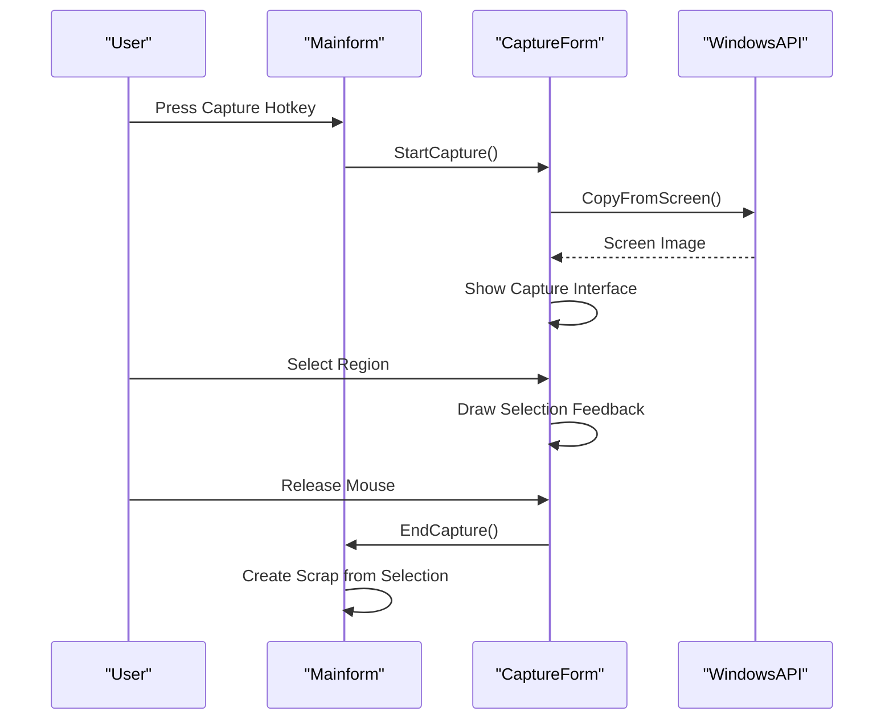
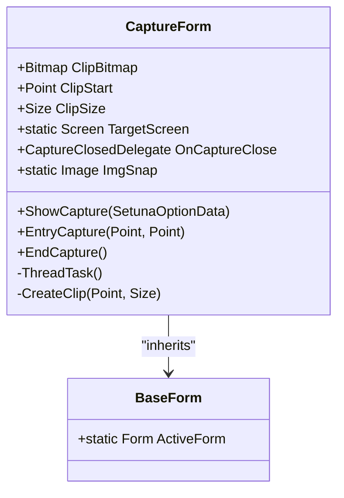
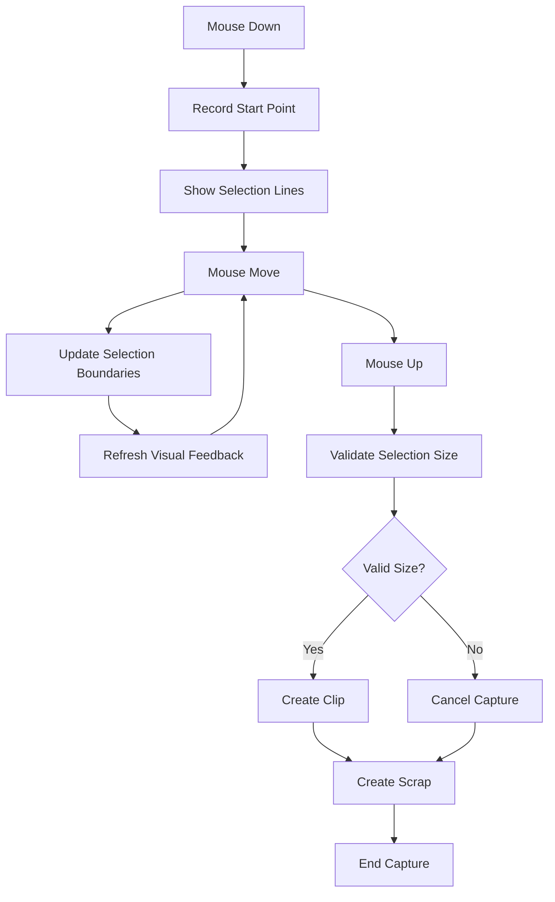
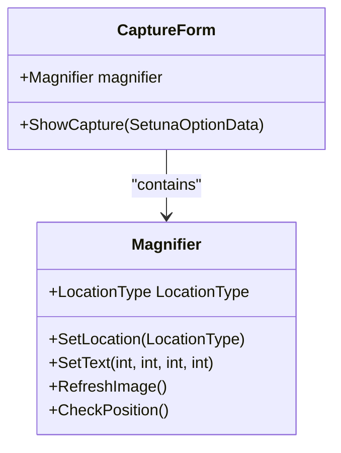
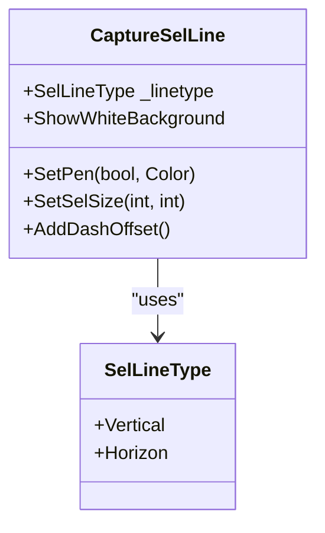
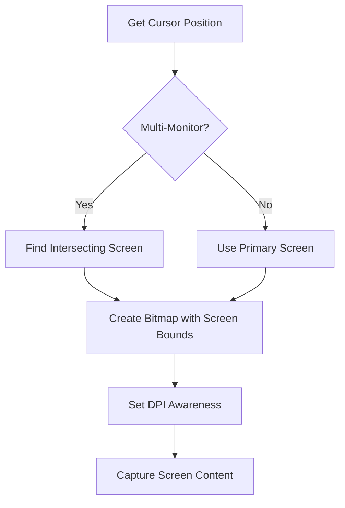
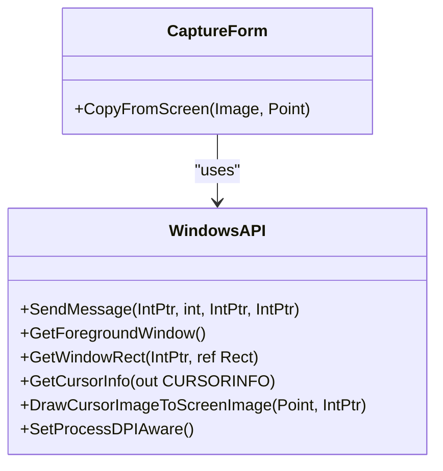
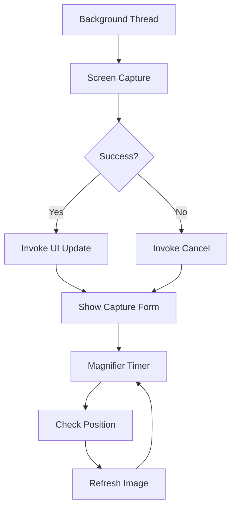

# Screenshot Capture System

<cite>
**Referenced Files in This Document**   
- [CaptureForm.cs](file://SETUNA/Main/CaptureForm.cs)
- [CaptureForm.Designer.cs](file://SETUNA/Main/CaptureForm.Designer.cs)
- [CaptureInfo.cs](file://SETUNA/Main/CaptureInfo.cs)
- [CaptureInfo.Designer.cs](file://SETUNA/Main/CaptureInfo.Designer.cs)
- [CaptureSelLine.cs](file://SETUNA/Main/CaptureSelLine.cs)
- [SelLineType.cs](file://SETUNA/Main/SelLineType.cs)
- [Magnifier.cs](file://SETUNA/Main/Magnifier.cs)
- [RGBColor.cs](file://SETUNA/Main/RGBColor.cs)
- [WindowsAPI.cs](file://SETUNA/Main/Common/WindowsAPI.cs)
- [BaseForm.cs](file://SETUNA/Main/Common/BaseForm.cs)
- [Mainform.cs](file://SETUNA/Mainform.cs)
</cite>

## Table of Contents
1. [Introduction](#introduction)
2. [Capture Workflow Overview](#capture-workflow-overview)
3. [CaptureForm Implementation](#captureform-implementation)
4. [Region Selection and Visual Feedback](#region-selection-and-visual-feedback)
5. [Crosshair Cursor and Magnifier Integration](#crosshair-cursor-and-magnifier-integration)
6. [Selection Styling with SelLineType](#selection-styling-with-sellinetype)
7. [High-DPI and Multi-Monitor Handling](#high-dpi-and-multi-monitor-handling)
8. [WindowsAPI Integration for Screen Capture](#windowsapi-integration-for-screen-capture)
9. [Performance Optimization](#performance-optimization)
10. [Common Issues and Troubleshooting](#common-issues-and-troubleshooting)

## Introduction
The Screenshot Capture System in SETUNA provides a comprehensive solution for capturing screen regions with advanced visual feedback and user interface elements. The system enables users to capture full-screen or region-based screenshots through a hotkey-activated workflow, with features including crosshair cursors, magnification, and real-time selection feedback. This document details the implementation of the capture system, focusing on the core components that enable precise screenshot capture and user interaction.

## Capture Workflow Overview
The screenshot capture process begins with a hotkey activation that triggers the `StartCapture` method in `Mainform.cs`. This initiates a sequence where the `CaptureForm` is displayed, allowing the user to select a region or capture the full screen. The workflow involves several key steps: screen capture preparation, region selection, visual feedback rendering, and final scrap creation. The system uses a multi-threaded approach to capture the screen image while maintaining responsive user interface elements.

**Diagram sources**
- [Mainform.cs](file://SETUNA/Mainform.cs#L116-L156)
- [CaptureForm.cs](file://SETUNA/Main/CaptureForm.cs#L193-L285)
- [WindowsAPI.cs](file://SETUNA/Main/Common/WindowsAPI.cs#L139-L149)

**Section sources**
- [Mainform.cs](file://SETUNA/Mainform.cs#L116-L156)
- [CaptureForm.cs](file://SETUNA/Main/CaptureForm.cs#L193-L285)

## CaptureForm Implementation
The `CaptureForm` class serves as the central component for screenshot capture operations. It inherits from `BaseForm` and manages the entire capture process from initialization to completion. The form creates a transparent overlay across the target screen, allowing users to select regions while seeing the underlying content. Key properties include `ClipBitmap` for storing the captured image, `ClipStart` and `ClipSize` for defining the selection area, and event handlers for capture completion.

The implementation uses Windows API calls through P/Invoke to access low-level screen capture functionality. The `CopyFromScreen` method utilizes `BitBlt` to copy screen pixels into a bitmap, with optional mouse cursor inclusion. The form handles mouse events to track selection gestures and keyboard events for capture confirmation or cancellation.

**Diagram sources**
- [CaptureForm.cs](file://SETUNA/Main/CaptureForm.cs#L71-L89)
- [BaseForm.cs](file://SETUNA/Main/Common/BaseForm.cs#L3-L17)

**Section sources**
- [CaptureForm.cs](file://SETUNA/Main/CaptureForm.cs#L15-L871)
- [CaptureForm.Designer.cs](file://SETUNA/Main/CaptureForm.Designer.cs#L1-L53)

## Region Selection and Visual Feedback
The region selection system provides visual feedback through the `CaptureSelLine` and `selArea` components. When a user begins selecting a region, four `CaptureSelLine` instances (two horizontal and two vertical) are positioned to outline the selection boundaries. These lines are implemented as transparent forms with custom painting to render the selection edges.

The selection process begins with a mouse down event that records the starting point, followed by continuous updates during mouse movement to show the expanding selection area. The `DrawSelRect` method calculates the selection boundaries and updates the visual elements accordingly. When the user releases the mouse button, the `EntryCapture` method validates the selection size and initiates the capture process.

**Diagram sources**
- [CaptureForm.cs](file://SETUNA/Main/CaptureForm.cs#L525-L594)
- [CaptureForm.cs](file://SETUNA/Main/CaptureForm.cs#L637-L665)

**Section sources**
- [CaptureForm.cs](file://SETUNA/Main/CaptureForm.cs#L525-L665)

## Crosshair Cursor and Magnifier Integration
The system enhances precision selection through crosshair cursor and magnifier features. When enabled in the options, a crosshair cursor appears at the current mouse position, consisting of horizontal and vertical lines that span the screen. These are implemented using `CaptureSelLine` instances with specific styling for the fullscreen cursor mode.

The magnifier feature provides real-time zoomed preview of the area around the cursor. Implemented in the `Magnifier` class, it displays a small window showing a scaled-up view of the cursor's surroundings. The magnifier automatically repositions itself to avoid obscuring the cursor and updates at regular intervals through a timer-driven refresh mechanism.

**Diagram sources**
- [Magnifier.cs](file://SETUNA/Main/Magnifier.cs#L8-L124)
- [CaptureForm.cs](file://SETUNA/Main/CaptureForm.cs#L174-L177)

**Section sources**
- [Magnifier.cs](file://SETUNA/Main/Magnifier.cs#L8-L124)
- [CaptureForm.cs](file://SETUNA/Main/CaptureForm.cs#L174-L177)

## Selection Styling with SelLineType
The visual appearance of selection lines is controlled by the `SelLineType` enumeration and associated styling properties. The `SelLineType` enum defines two values: `Vertical` and `Horizon`, which determine the orientation of the selection lines. Each `CaptureSelLine` instance uses this type to configure its rendering behavior.

The styling is managed through the `SetPen` method, which accepts a boolean for solid/dashed lines and a color parameter. Dashed lines use a specific pattern (4px on, 4px off) with animated dash offset to create a moving effect. The implementation uses Windows Forms graphics primitives to draw the lines with appropriate styling based on user preferences stored in `SetunaOption`.

**Diagram sources**
- [SelLineType.cs](file://SETUNA/Main/SelLineType.cs#L4-L10)
- [CaptureSelLine.cs](file://SETUNA/Main/CaptureSelLine.cs#L30-L75)

**Section sources**
- [SelLineType.cs](file://SETUNA/Main/SelLineType.cs#L4-L10)
- [CaptureSelLine.cs](file://SETUNA/Main/CaptureSelLine.cs#L30-L75)

## High-DPI and Multi-Monitor Handling
The capture system includes specific handling for high-DPI displays and multi-monitor configurations. The `GetCurrentScreen` method determines which monitor contains the cursor position by checking intersection with each screen's bounds. This ensures that the capture operation targets the correct display in multi-monitor setups.

For high-DPI scenarios, the system creates a bitmap with dimensions matching the target screen's bounds, using `PixelFormat.Format24bppRgb` for consistent color representation. The `WindowsAPI.SetProcessDPIAware` method is called to ensure proper DPI scaling behavior, allowing the application to render correctly on high-resolution displays.

**Diagram sources**
- [CaptureForm.cs](file://SETUNA/Main/CaptureForm.cs#L288-L298)
- [WindowsAPI.cs](file://SETUNA/Main/Common/WindowsAPI.cs#L20-L21)

**Section sources**
- [CaptureForm.cs](file://SETUNA/Main/CaptureForm.cs#L288-L298)
- [WindowsAPI.cs](file://SETUNA/Main/Common/WindowsAPI.cs#L20-L21)

## WindowsAPI Integration for Screen Capture
The system leverages Windows API functions through P/Invoke declarations to perform low-level screen capture operations. Key API functions include `GetDC` and `ReleaseDC` for device context management, `BitBlt` for bitmap transfer, and `GetWindowRect` for window positioning. The `CopyFromScreen` method orchestrates these API calls to capture the screen content efficiently.

Mouse cursor inclusion is implemented through the `DrawCursorImageToScreenImage` method, which uses `GetCursorInfo` to determine the current cursor state and `DrawIcon` to render it onto the captured image. This integration allows for complete screen captures that include the mouse pointer at its current position.

**Diagram sources**
- [WindowsAPI.cs](file://SETUNA/Main/Common/WindowsAPI.cs#L12-L149)
- [CaptureForm.cs](file://SETUNA/Main/CaptureForm.cs#L314-L365)

**Section sources**
- [WindowsAPI.cs](file://SETUNA/Main/Common/WindowsAPI.cs#L12-L149)
- [CaptureForm.cs](file://SETUNA/Main/CaptureForm.cs#L314-L365)

## Performance Optimization
The capture system implements several performance optimizations to ensure responsive operation during the capture process. A background thread handles the screen capture operation to prevent UI freezing, with the result communicated back to the main thread through `Invoke`. The magnifier uses a timer with 100ms intervals to balance update frequency with performance impact.

Visual elements are optimized through selective invalidation and updating. The `CaptureSelLine` class only refreshes when the selection size changes, reducing unnecessary repaint operations. The system also minimizes GDI object creation and ensures proper disposal of graphics resources to prevent memory leaks during repeated capture operations.

**Diagram sources**
- [CaptureForm.cs](file://SETUNA/Main/CaptureForm.cs#L205-L209)
- [Magnifier.cs](file://SETUNA/Main/Magnifier.cs#L22-L28)
- [CaptureForm.cs](file://SETUNA/Main/CaptureForm.cs#L302-L311)

**Section sources**
- [CaptureForm.cs](file://SETUNA/Main/CaptureForm.cs#L205-L311)
- [Magnifier.cs](file://SETUNA/Main/Magnifier.cs#L22-L28)

## Common Issues and Troubleshooting
The system addresses several common issues in screenshot capture applications. Inaccurate selection on multi-monitor setups is mitigated by the `GetCurrentScreen` method, which accurately determines the target display based on cursor position. For high-DPI displays, the application sets DPI awareness to ensure proper scaling.

Performance issues with real-time magnification are addressed through the timer-based refresh mechanism, which limits updates to 10 times per second. Memory management is handled through proper disposal of bitmap and graphics objects, with null checks and safe disposal patterns in the `OnClosing` event handlers.

When selection size validation fails (less than 10x10 pixels), the system cancels the capture operation to prevent creating unusable scraps. The error handling includes comprehensive try-catch blocks around critical operations like screen capture and GDI calls, with console logging for debugging purposes.

**Section sources**
- [CaptureForm.cs](file://SETUNA/Main/CaptureForm.cs#L647-L650)
- [CaptureForm.cs](file://SETUNA/Main/CaptureForm.cs#L337-L342)
- [CaptureForm.cs](file://SETUNA/Main/CaptureForm.cs#L462-L470)
- [CaptureInfo.cs](file://SETUNA/Main/CaptureInfo.cs#L18-L26)