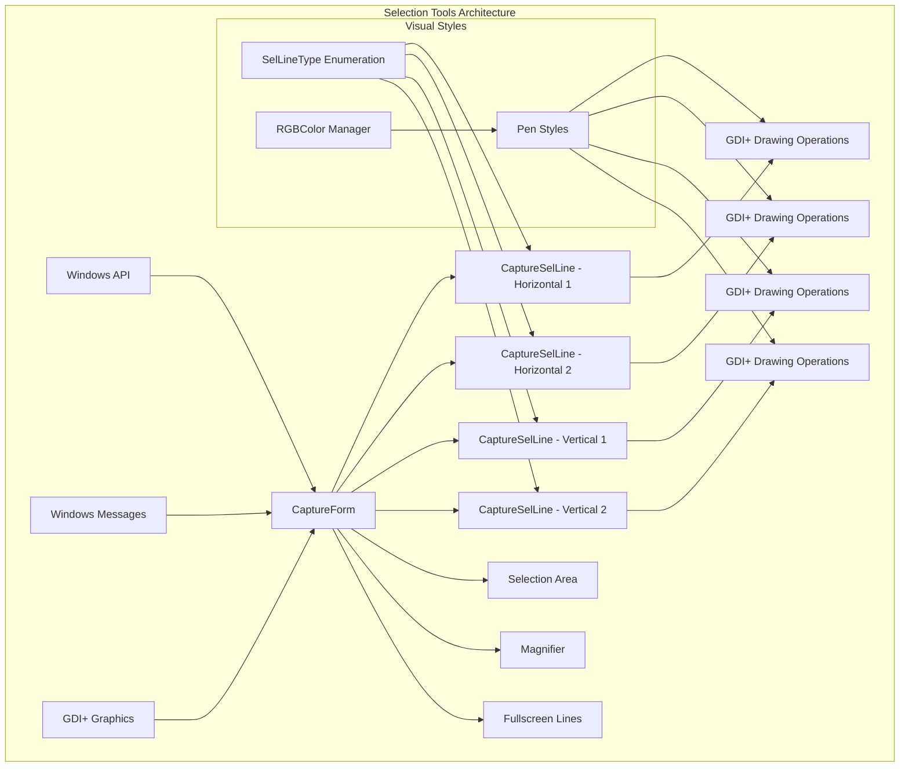
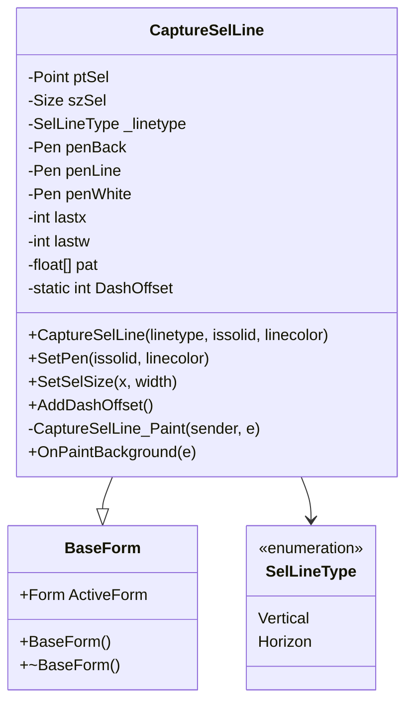
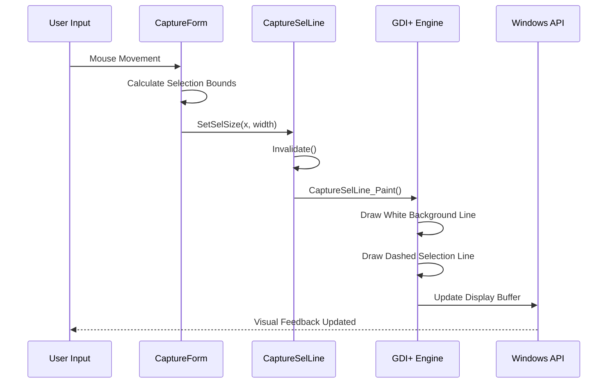
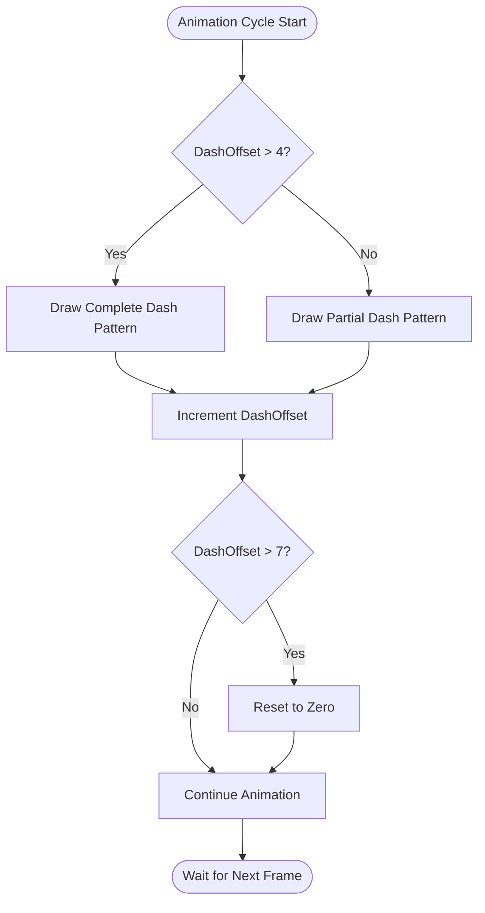
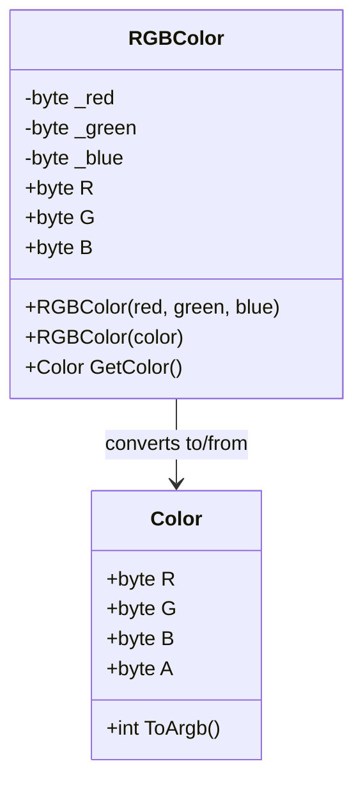
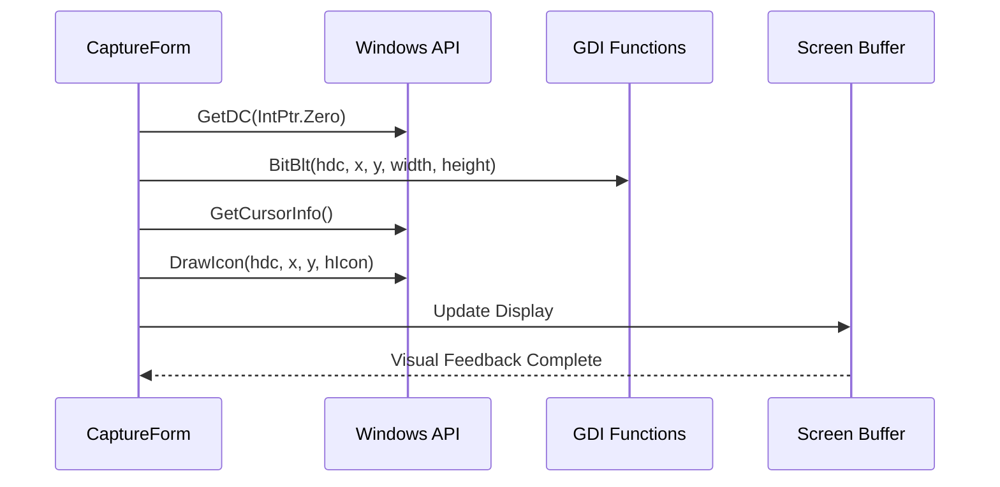
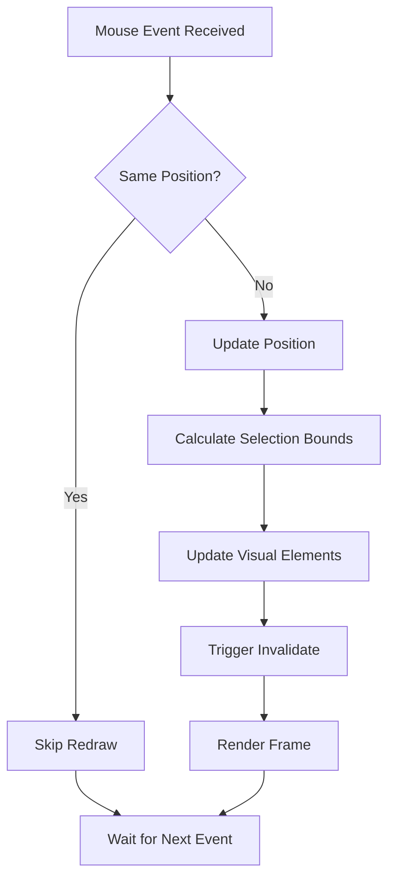
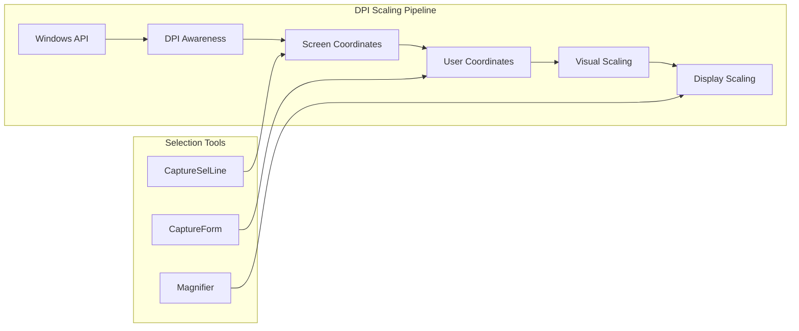
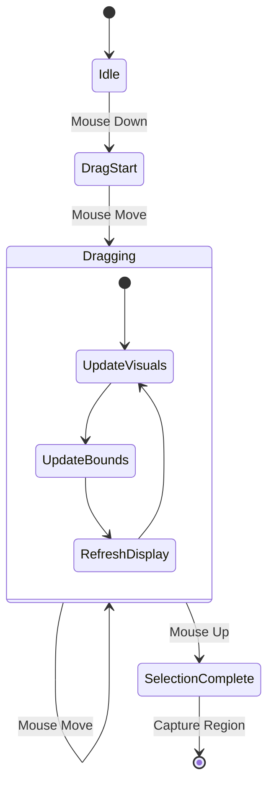

# Selection Tools

<cite>
**Referenced Files in This Document**
- [CaptureSelLine.cs](file://SETUNA/Main/CaptureSelLine.cs)
- [SelLineType.cs](file://SETUNA/Main/SelLineType.cs)
- [RGBColor.cs](file://SETUNA/Main/RGBColor.cs)
- [CaptureForm.cs](file://SETUNA/Main/CaptureForm.cs)
- [WindowsAPI.cs](file://SETUNA/Main/Common/WindowsAPI.cs)
- [Magnifier.cs](file://SETUNA/Main/Magnifier.cs)
- [BaseForm.cs](file://SETUNA/Main/Common/BaseForm.cs)
</cite>

## Table of Contents
1. [Introduction](#introduction)
2. [Architecture Overview](#architecture-overview)
3. [Core Selection Components](#core-selection-components)
4. [Visual Feedback Rendering](#visual-feedback-rendering)
5. [Color Management System](#color-management-system)
6. [Windows API Integration](#windows-api-integration)
7. [Performance Optimization](#performance-optimization)
8. [High-DPI Scaling Support](#high-dpi-scaling-support)
9. [Event Handling and Mouse Interaction](#event-handling-and-mouse-interaction)
10. [Troubleshooting Guide](#troubleshooting-guide)
11. [Conclusion](#conclusion)

## Introduction

The selection tools in SETUNA provide sophisticated visual feedback mechanisms for screenshot capture operations. These tools enable users to precisely define regions for capture through dynamic visual indicators that respond in real-time to mouse movements. The system combines GDI+ drawing operations with Windows API integration to deliver smooth, responsive selection experiences across various display configurations and performance scenarios.

The selection framework consists of multiple interconnected components that work together to provide crosshair guidance, border highlighting, and customizable visual styles during region selection. This comprehensive system ensures accurate pixel-level precision while maintaining excellent performance characteristics even during rapid mouse movements.

## Architecture Overview

The selection tools architecture follows a modular design pattern with clear separation of concerns between visual rendering, event handling, and system integration.

**Diagram sources**
- [CaptureForm.cs](file://SETUNA/Main/CaptureForm.cs#L141-L162)
- [CaptureSelLine.cs](file://SETUNA/Main/CaptureSelLine.cs#L8-L173)

**Section sources**
- [CaptureForm.cs](file://SETUNA/Main/CaptureForm.cs#L141-L162)
- [CaptureSelLine.cs](file://SETUNA/Main/CaptureSelLine.cs#L8-L173)

## Core Selection Components

### CaptureSelLine Class

The `CaptureSelLine` class serves as the primary visual feedback component, responsible for rendering selection boundaries and crosshair indicators. It inherits from `BaseForm` and utilizes GDI+ for high-performance drawing operations.

**Diagram sources**
- [CaptureSelLine.cs](file://SETUNA/Main/CaptureSelLine.cs#L8-L173)
- [SelLineType.cs](file://SETUNA/Main/SelLineType.cs#L4-L11)
- [BaseForm.cs](file://SETUNA/Main/Common/BaseForm.cs#L3-L17)

### Selection Line Types

The `SelLineType` enumeration defines two fundamental visual orientations for selection boundaries:

| Type | Description | Usage |
|------|-------------|-------|
| `Vertical` | Renders vertical selection boundaries | Used for left and right selection edges |
| `Horizon` | Renders horizontal selection boundaries | Used for top and bottom selection edges |

**Section sources**
- [SelLineType.cs](file://SETUNA/Main/SelLineType.cs#L4-L11)
- [CaptureSelLine.cs](file://SETUNA/Main/CaptureSelLine.cs#L30-L42)

## Visual Feedback Rendering

### Crosshair and Border Implementation

The selection system employs sophisticated GDI+ drawing operations to render visual feedback during region selection. The rendering process involves multiple layers of graphical elements that combine to create the final visual representation.

**Diagram sources**
- [CaptureForm.cs](file://SETUNA/Main/CaptureForm.cs#L587-L633)
- [CaptureSelLine.cs](file://SETUNA/Main/CaptureSelLine.cs#L78-L110)

### Dynamic Dash Pattern Animation

The selection lines implement animated dash patterns to enhance visual feedback. The `AddDashOffset()` method manages the animation cycle, creating the illusion of movement for dashed lines.

**Diagram sources**
- [CaptureSelLine.cs](file://SETUNA/Main/CaptureSelLine.cs#L11-L17)

### Transparency and Overlay Management

The selection system supports transparent overlays with configurable opacity levels. The `ShowWhiteBackground` property controls whether white background lines are rendered beneath the primary selection lines.

**Section sources**
- [CaptureSelLine.cs](file://SETUNA/Main/CaptureSelLine.cs#L78-L110)
- [CaptureSelLine.cs](file://SETUNA/Main/CaptureSelLine.cs#L113-L117)

## Color Management System

### RGBColor Structure

The `RGBColor` structure provides a specialized color management system for selection tools, offering precise control over color channels and conversion capabilities.

**Diagram sources**
- [RGBColor.cs](file://SETUNA/Main/RGBColor.cs#L6-L67)

### Custom Color Schemes

The color management system enables creation of custom color schemes for selection lines and overlays. The structure supports both individual channel manipulation and direct Color object conversion.

**Section sources**
- [RGBColor.cs](file://SETUNA/Main/RGBColor.cs#L6-L67)

## Windows API Integration

### Screen Capture and Pixel Data Access

The selection tools integrate deeply with Windows API functions to capture accurate pixel data and manage screen coordinates. The system utilizes GDI functions for efficient screen copying operations.

**Diagram sources**
- [CaptureForm.cs](file://SETUNA/Main/CaptureForm.cs#L317-L366)
- [WindowsAPI.cs](file://SETUNA/Main/Common/WindowsAPI.cs#L130-L148)

### Cursor Position Tracking

The system maintains precise cursor position tracking through Windows API calls, enabling real-time updates of selection boundaries and visual feedback.

**Section sources**
- [CaptureForm.cs](file://SETUNA/Main/CaptureForm.cs#L317-L366)
- [WindowsAPI.cs](file://SETUNA/Main/Common/WindowsAPI.cs#L130-L148)

## Performance Optimization

### Double Buffering and Rendering Efficiency

The selection tools implement several performance optimization techniques to ensure smooth rendering during rapid mouse movements:

| Technique | Implementation | Benefit |
|-----------|----------------|---------|
| Double Buffering | `DoubleBuffered = true` in constructor | Eliminates flicker during redraws |
| Selective Invalidation | `base.Invalidate()` only when bounds change | Reduces unnecessary repaint cycles |
| Efficient Pen Management | Reuse pen objects with color updates | Minimizes GDI resource allocation |
| Optimized Paint Events | Minimal paint logic in `CaptureSelLine_Paint` | Faster response to mouse movements |

### Mouse Event Optimization

The system optimizes mouse event handling through intelligent filtering and debouncing mechanisms:

**Diagram sources**
- [CaptureForm.cs](file://SETUNA/Main/CaptureForm.cs#L587-L633)

**Section sources**
- [CaptureSelLine.cs](file://SETUNA/Main/CaptureSelLine.cs#L120-L140)
- [CaptureForm.cs](file://SETUNA/Main/CaptureForm.cs#L587-L633)

## High-DPI Scaling Support

### DPI-Aware Window Management

The selection tools incorporate DPI awareness through Windows API integration, ensuring accurate positioning and sizing across different display configurations:

**Diagram sources**
- [CaptureForm.cs](file://SETUNA/Main/CaptureForm.cs#L19-L20)

### Adaptive Visual Scaling

The system adapts visual elements to maintain consistent appearance across different DPI settings while preserving selection accuracy.

**Section sources**
- [CaptureForm.cs](file://SETUNA/Main/CaptureForm.cs#L19-L20)

## Event Handling and Mouse Interaction

### Comprehensive Mouse Event Processing

The selection system handles multiple mouse events with precise coordination between different visual components:

**Diagram sources**
- [CaptureForm.cs](file://SETUNA/Main/CaptureForm.cs#L525-L633)

### Real-Time Coordinate Updates

The system maintains real-time coordinate synchronization between mouse positions and visual selection boundaries, ensuring pixel-perfect accuracy.

**Section sources**
- [CaptureForm.cs](file://SETUNA/Main/CaptureForm.cs#L525-L633)

## Troubleshooting Guide

### Common Rendering Issues

| Issue | Symptoms | Solution |
|-------|----------|----------|
| Flickering Selection Lines | Intermittent visual artifacts | Enable double buffering |
| Incorrect Line Positions | Selection lines misaligned | Verify DPI scaling settings |
| Slow Mouse Response | Delayed visual feedback | Check paint event optimization |
| Color Corruption | Incorrect selection colors | Validate RGBColor conversions |

### Performance Troubleshooting

For optimal performance during selection operations:

1. **Monitor Paint Events**: Ensure minimal paint logic in selection line handlers
2. **Optimize Pen Creation**: Reuse pen objects rather than creating new instances
3. **Coordinate Validation**: Verify screen bounds calculations before rendering
4. **Memory Management**: Properly dispose of graphics resources

**Section sources**
- [CaptureSelLine.cs](file://SETUNA/Main/CaptureSelLine.cs#L78-L110)
- [CaptureSelLine.cs](file://SETUNA/Main/CaptureSelLine.cs#L120-L140)

## Conclusion

The selection tools in SETUNA represent a sophisticated implementation of visual feedback systems for screenshot capture operations. Through careful integration of GDI+ drawing operations, Windows API functions, and performance optimization techniques, the system delivers responsive, accurate, and visually appealing selection experiences.

The modular architecture enables easy customization of visual styles while maintaining high performance standards. The combination of real-time mouse tracking, adaptive scaling, and efficient rendering techniques ensures reliable operation across diverse hardware configurations and display settings.

Future enhancements could include additional visual styles, enhanced accessibility features, and expanded customization options for professional screenshot capture workflows.