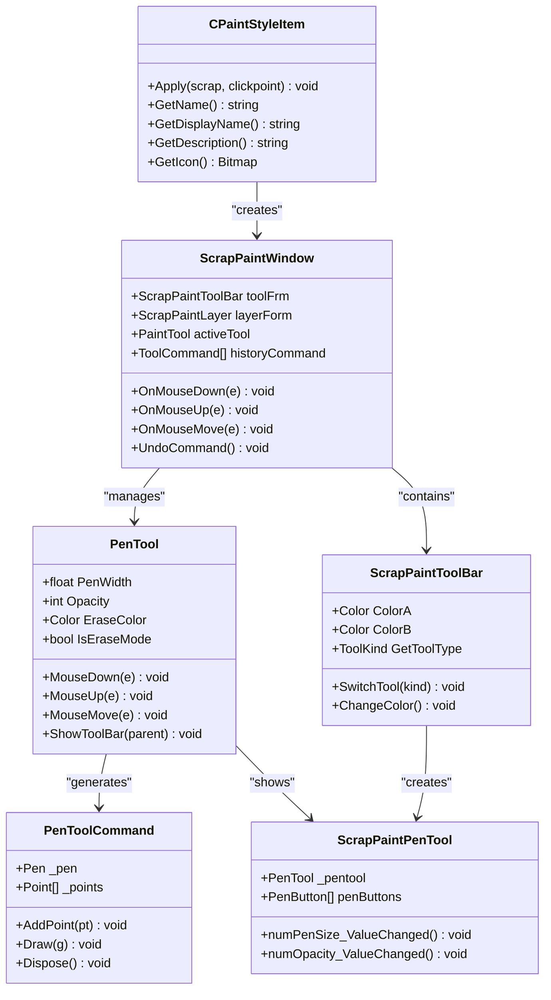
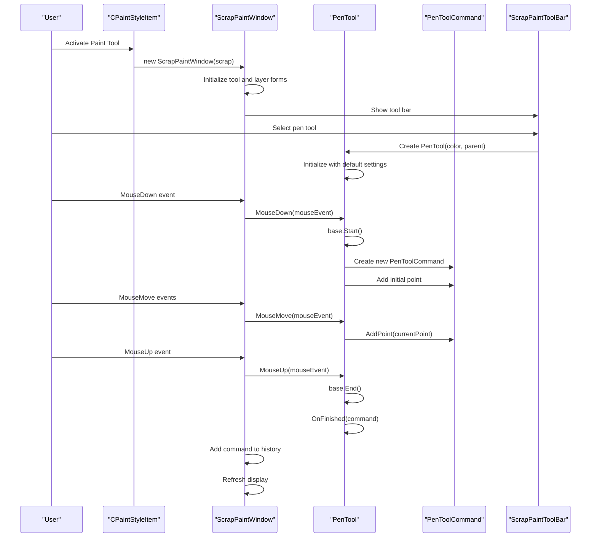
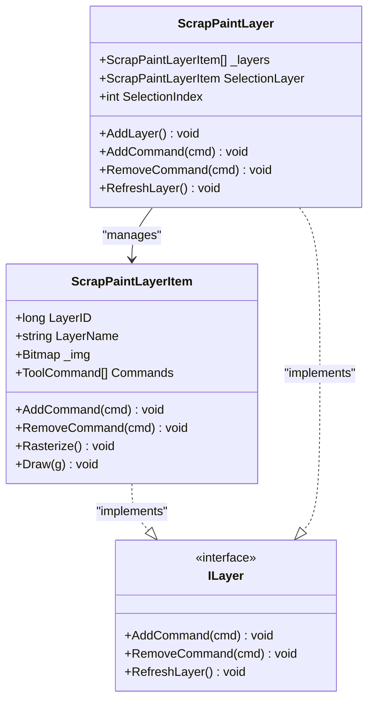
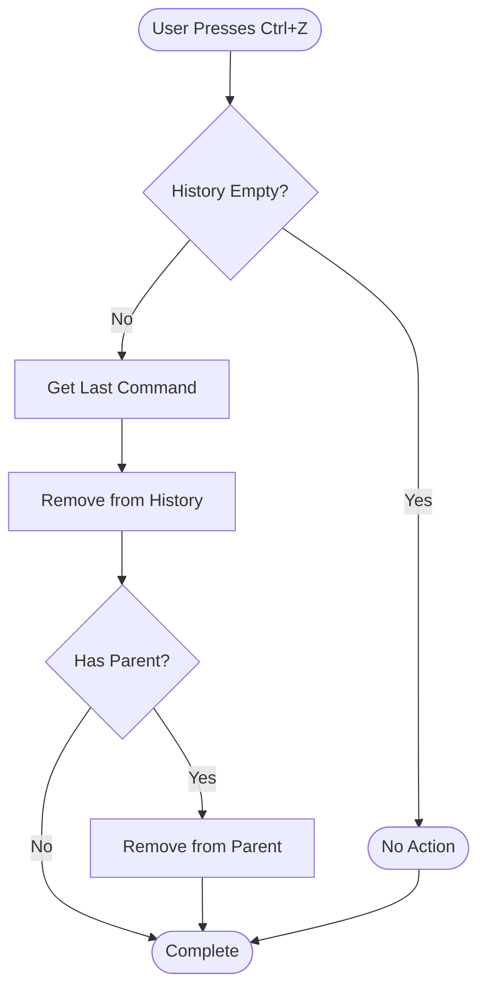

# Freehand Drawing Tools

<cite>
**Referenced Files in This Document**
- [CPaintStyleItem.cs](file://SETUNA/Main/StyleItems/CPaintStyleItem.cs)
- [PenTool.cs](file://SETUNA/Main/StyleItems/PenTool.cs)
- [PenToolCommand.cs](file://SETUNA/Main/StyleItems/PenToolCommand.cs)
- [ScrapPaintWindow.cs](file://SETUNA/Main/StyleItems/ScrapPaintWindow.cs)
- [ScrapPaintToolBar.cs](file://SETUNA/Main/StyleItems/ScrapPaintToolBar.cs)
- [ScrapPaintPenTool.cs](file://SETUNA/Main/StyleItems/ScrapPaintPenTool.cs)
- [ToolCommand.cs](file://SETUNA/Main/StyleItems/ToolCommand.cs)
- [PaintTool.cs](file://SETUNA/Main/StyleItems/PaintTool.cs)
- [ScrapPaintLayer.cs](file://SETUNA/Main/StyleItems/ScrapPaintLayer.cs)
- [ScrapDrawForm.cs](file://SETUNA/Main/StyleItems/ScrapDrawForm.cs)
- [PenButton.cs](file://SETUNA/Main/StyleItems/PenButton.cs)
- [ScrapPaintLayerItem.cs](file://SETUNA/Main/StyleItems/ScrapPaintLayerItem.cs)
</cite>

## Table of Contents
1. [Introduction](#introduction)
2. [System Architecture](#system-architecture)
3. [Core Components](#core-components)
4. [Drawing Workflow](#drawing-workflow)
5. [Tool Configuration](#tool-configuration)
6. [Layer Management](#layer-management)
7. [Undo/Redo System](#undoredo-system)
8. [Performance Optimization](#performance-optimization)
9. [Usage Examples](#usage-examples)
10. [Troubleshooting](#troubleshooting)

## Introduction

The freehand drawing functionality in SETUNA is built around a sophisticated brush-based drawing system that enables users to annotate screenshots with precise, customizable strokes. The system is centered on two primary components: CPaintStyleItem and PenTool, which work together to provide intuitive drawing capabilities with advanced features like variable pen width, opacity control, and erase mode.

The drawing system operates within a layered architecture that supports multiple drawing tools, real-time rendering, and comprehensive command history management. It provides users with the ability to highlight regions, annotate diagrams, and create professional-quality annotations directly on captured screenshots.

## System Architecture

The freehand drawing system follows a modular architecture with clear separation of concerns:



**Diagram sources**
- [CPaintStyleItem.cs](file://SETUNA/Main/StyleItems/CPaintStyleItem.cs#L6-L54)
- [ScrapPaintWindow.cs](file://SETUNA/Main/StyleItems/ScrapPaintWindow.cs#L8-L291)
- [PenTool.cs](file://SETUNA/Main/StyleItems/PenTool.cs#L7-L136)
- [PenToolCommand.cs](file://SETUNA/Main/StyleItems/PenToolCommand.cs#L8-L48)
- [ScrapPaintToolBar.cs](file://SETUNA/Main/StyleItems/ScrapPaintToolBar.cs#L9-L205)
- [ScrapPaintPenTool.cs](file://SETUNA/Main/StyleItems/ScrapPaintPenTool.cs#L10-L98)

## Core Components

### CPaintStyleItem: Entry Point

CPaintStyleItem serves as the primary entry point for the drawing functionality. It inherits from CStyleItem and provides the bridge between the main application and the drawing interface.

**Key Features:**
- Initiates the ScrapPaintWindow when activated
- Provides localized tool descriptions
- Manages the drawing session lifecycle
- Refreshes the original scrap after drawing completion

**Section sources**
- [CPaintStyleItem.cs](file://SETUNA/Main/StyleItems/CPaintStyleItem.cs#L6-L54)

### PenTool: Drawing Engine

PenTool is the core drawing engine that handles mouse events and manages the drawing commands. It extends PaintTool and provides specialized functionality for brush-based drawing.

**Core Capabilities:**
- **Mouse Event Handling**: Processes MouseDown, MouseMove, and MouseUp events
- **Variable Pen Width**: Supports configurable stroke thickness
- **Opacity Control**: Allows transparency adjustment for strokes
- **Erase Mode**: Specialized mode using pink color (PenTool.EraseColor)
- **Real-time Rendering**: Immediate visual feedback during drawing

**Implementation Details:**
- Maintains a current PenToolCommand for active drawing
- Handles tool switching and cleanup
- Integrates with the toolbar system for configuration

**Section sources**
- [PenTool.cs](file://SETUNA/Main/StyleItems/PenTool.cs#L7-L136)

### PenToolCommand: Command Pattern Implementation

PenToolCommand implements the Command pattern to manage individual drawing operations. Each stroke creates a new command instance that encapsulates the drawing data and rendering logic.

**Technical Specifications:**
- **Pen Configuration**: Uses System.Drawing.Pen with round caps
- **Point Storage**: Maintains a list of drawing points
- **Curve Rendering**: Utilizes Graphics.DrawCurve for smooth strokes
- **Memory Management**: Proper disposal of resources

**Section sources**
- [PenToolCommand.cs](file://SETUNA/Main/StyleItems/PenToolCommand.cs#L8-L48)

## Drawing Workflow

The drawing workflow follows a structured sequence that ensures consistent behavior and proper resource management:



**Diagram sources**
- [CPaintStyleItem.cs](file://SETUNA/Main/StyleItems/CPaintStyleItem.cs#L9-L15)
- [ScrapPaintWindow.cs](file://SETUNA/Main/StyleItems/ScrapPaintWindow.cs#L125-L163)
- [PenTool.cs](file://SETUNA/Main/StyleItems/PenTool.cs#L30-L47)

### Mouse Event Processing

The system processes mouse events through a hierarchical approach:

1. **ScrapPaintWindow Level**: Captures all mouse events and delegates to active tool
2. **PenTool Level**: Handles specific drawing logic and command creation
3. **PenToolCommand Level**: Manages individual stroke data and rendering

**Event Flow:**
- **MouseDown**: Initializes drawing session and creates first point
- **MouseMove**: Continues adding points to current stroke
- **MouseUp**: Finalizes stroke and adds to command history

**Section sources**
- [ScrapPaintWindow.cs](file://SETUNA/Main/StyleItems/ScrapPaintWindow.cs#L125-L163)
- [PenTool.cs](file://SETUNA/Main/StyleItems/PenTool.cs#L30-L47)

## Tool Configuration

### Brush Properties

The drawing tool provides extensive configuration options through the ScrapPaintPenTool interface:

| Property | Type | Description | Default Value |
|----------|------|-------------|---------------|
| Pen Width | float | Stroke thickness in pixels | 3.0 |
| Opacity | int | Transparency level (0-255) | 255 |
| Color | Color | Drawing color | User-defined |
| Erase Mode | bool | Pink color mode for erasing | False |

### Erase Mode Implementation

The system implements a specialized erase mode using the special pink color (PenTool.EraseColor):

**Technical Implementation:**
- Uses Color.Pink as the erase indicator
- Automatically sets opacity to 255 for erase operations
- Disables opacity controls in erase mode
- Applies transparent background to erase strokes

**Usage Pattern:**
```csharp
// Detect erase mode
private bool IsEraseMode => PenTool.EraseColor.ToArgb() == _color.ToArgb();
```

**Section sources**
- [PenTool.cs](file://SETUNA/Main/StyleItems/PenTool.cs#L18-L18)
- [PenTool.cs](file://SETUNA/Main/StyleItems/PenTool.cs#L107-L121)
- [ScrapPaintPenTool.cs](file://SETUNA/Main/StyleItems/ScrapPaintPenTool.cs#L35-L47)

### Toolbar Integration

The ScrapPaintToolBar provides intuitive access to drawing tools and configurations:

**Tool Selection:**
- Pen Tool (笔工具): Standard drawing mode
- Eraser Tool (消しゴム工具): Pink color erase mode  
- Text Tool (文字工具): Text annotation capability

**Color Management:**
- Two-color palette system (ColorA, ColorB)
- Quick color swap functionality
- Color picker integration

**Section sources**
- [ScrapPaintToolBar.cs](file://SETUNA/Main/StyleItems/ScrapPaintToolBar.cs#L48-L85)
- [ScrapPaintToolBar.cs](file://SETUNA/Main/StyleItems/ScrapPaintToolBar.cs#L155-L160)

## Layer Management

The drawing system employs a sophisticated layer management architecture that enables complex compositions and editing workflows:



**Diagram sources**
- [ScrapPaintLayer.cs](file://SETUNA/Main/StyleItems/ScrapPaintLayer.cs#L9-L319)
- [ScrapPaintLayerItem.cs](file://SETUNA/Main/StyleItems/ScrapPaintLayerItem.cs#L10-L268)

### Layer Operations

**Creation and Management:**
- Dynamic layer creation with automatic naming
- Layer visibility and ordering control
- Thumbnail generation for layer preview
- Rename functionality with validation

**Command Integration:**
- Layers act as containers for ToolCommand collections
- Automatic rasterization of vector commands to bitmap
- Transparent background support for erase operations
- Efficient memory management through disposal patterns

**Section sources**
- [ScrapPaintLayer.cs](file://SETUNA/Main/StyleItems/ScrapPaintLayer.cs#L80-L108)
- [ScrapPaintLayerItem.cs](file://SETUNA/Main/StyleItems/ScrapPaintLayerItem.cs#L132-L147)

## Undo/Redo System

The system implements a comprehensive command history mechanism that supports undo/redo operations:

### Command History Management

**Structure:**
- Global history maintained in ScrapPaintWindow.historyCommand
- Per-layer command tracking in ScrapPaintLayerItem.Commands
- Hierarchical command relationships

**Operations:**
- **Add Command**: New strokes are added to history
- **Remove Command**: Undo removes last command from history
- **Parent Relationship**: Commands maintain parent layer references

### Undo Implementation

The undo system provides granular control over drawing operations:



**Diagram sources**
- [ScrapPaintWindow.cs](file://SETUNA/Main/StyleItems/ScrapPaintWindow.cs#L218-L229)

**Section sources**
- [ScrapPaintWindow.cs](file://SETUNA/Main/StyleItems/ScrapPaintWindow.cs#L218-L229)

## Performance Optimization

### Memory Management

**Resource Cleanup:**
- Proper disposal of Graphics objects and pens
- Automatic cleanup of command history
- Layer disposal with child command cleanup
- Bitmap disposal for large drawings

**Memory Optimization Strategies:**
- Lazy loading of layer thumbnails
- Command batching for multiple operations
- Efficient point storage in PenToolCommand
- Garbage collection optimization

### Rendering Performance

**Optimization Techniques:**
- Double buffering for smooth rendering
- Incremental updates during drawing
- Efficient point interpolation for curves
- Layer caching for complex compositions

**Large Drawing Considerations:**
- Progressive rasterization for complex layers
- Memory-conscious point storage
- Automatic layer splitting for very large drawings
- Background processing for intensive operations

## Usage Examples

### Basic Drawing Session

1. **Activate Drawing Tool**: Click "Paint" in the style menu
2. **Select Tool**: Choose pen tool from toolbar
3. **Configure Settings**: Adjust pen width and color
4. **Begin Drawing**: Click and drag on the canvas
5. **Finalize**: Release mouse button to complete stroke

### Advanced Annotation Workflows

**Highlighting Regions:**
- Use thin pen width (1-2px) for precise highlighting
- Employ contrasting colors for visibility
- Utilize multiple layers for different highlight types

**Diagram Annotations:**
- Combine pen tool with text tool for comprehensive annotations
- Use layer management to organize different annotation types
- Leverage undo/redo for iterative refinement

**Professional Quality Output:**
- Utilize high-opacity settings for clean lines
- Employ consistent pen widths for uniform appearance
- Use layer blending modes for advanced effects

## Troubleshooting

### Common Issues and Solutions

**Performance Problems with Complex Strokes:**
- **Symptom**: Slow response during drawing
- **Solution**: Reduce pen width or simplify stroke paths
- **Prevention**: Use smaller point lists in PenToolCommand

**Rendering Glitches:**
- **Symptom**: Inconsistent stroke appearance
- **Cause**: Graphics context issues or memory pressure
- **Solution**: Force refresh with Refresh() calls
- **Prevention**: Proper disposal of Graphics objects

**Memory Leaks:**
- **Symptom**: Increasing memory usage over time
- **Diagnosis**: Monitor PenToolCommand and layer disposal
- **Fix**: Ensure proper implementation of IDisposable
- **Prevention**: Use using statements for temporary objects

**Undo/Redo Failures:**
- **Symptom**: Commands not appearing in history
- **Cause**: Incorrect parent-child relationships
- **Solution**: Verify command.parent assignments
- **Prevention**: Follow command history patterns

### Debugging Techniques

**Memory Monitoring:**
- Track PenToolCommand instances
- Monitor layer bitmap sizes
- Check disposal patterns

**Event Flow Analysis:**
- Trace mouse event propagation
- Verify command creation timing
- Monitor history stack modifications

**Rendering Validation:**
- Compare drawn vs. expected output
- Test with various pen configurations
- Validate layer composition

**Section sources**
- [PenTool.cs](file://SETUNA/Main/StyleItems/PenTool.cs#L90-L102)
- [ScrapPaintLayerItem.cs](file://SETUNA/Main/StyleItems/ScrapPaintLayerItem.cs#L13-L33)