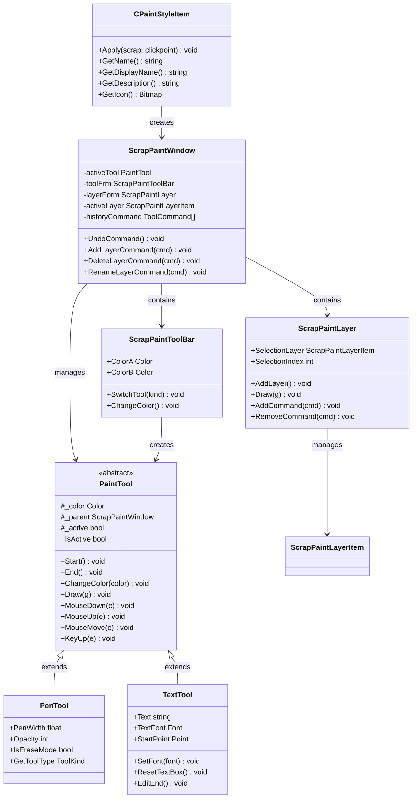
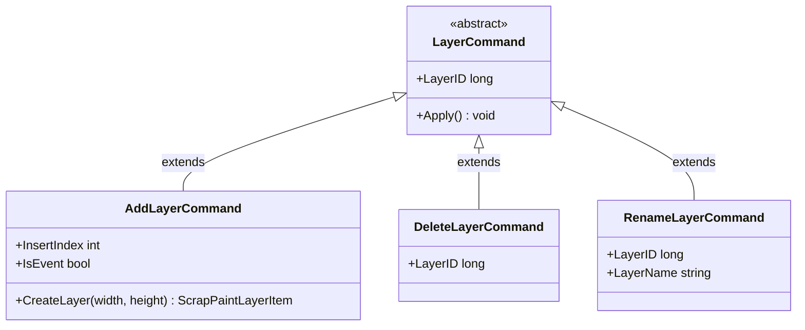
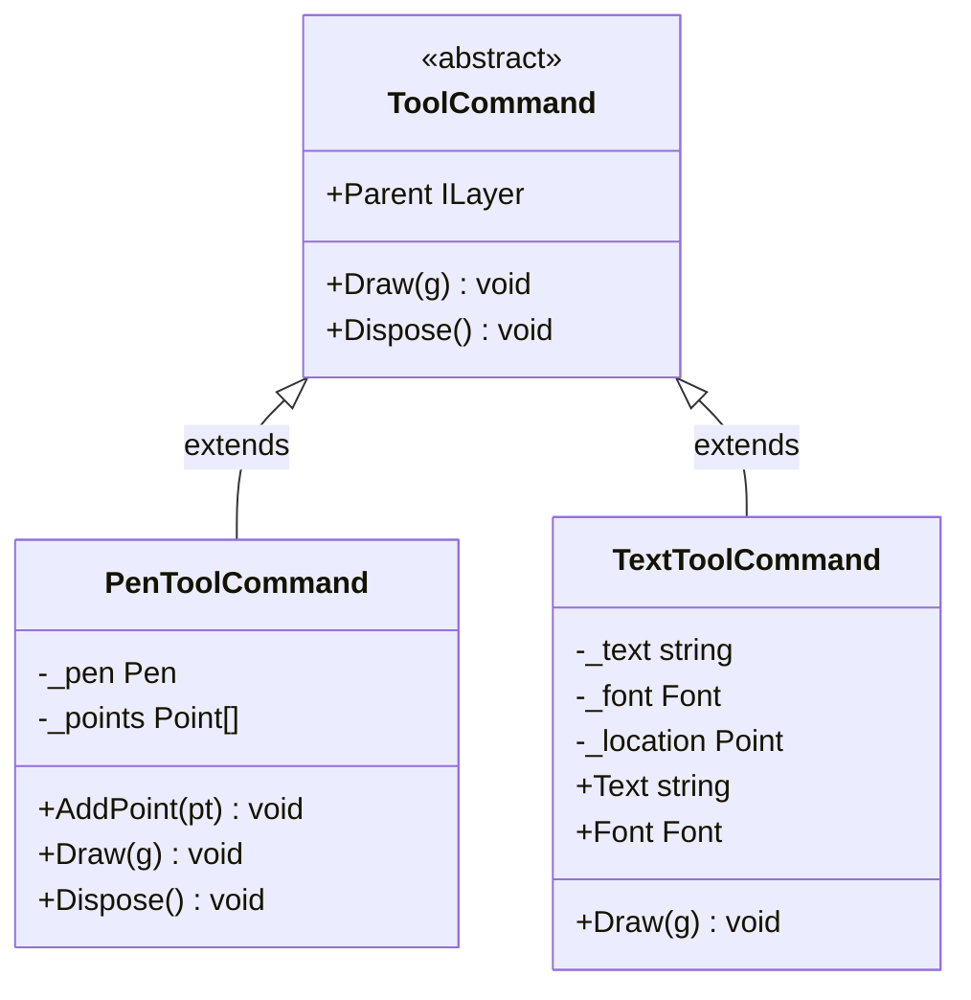

# Painting and Annotation Styles

<cite>
**Referenced Files in This Document**
- [CPaintStyleItem.cs](file://SETUNA/Main/StyleItems/CPaintStyleItem.cs)
- [ScrapPaintWindow.cs](file://SETUNA/Main/StyleItems/ScrapPaintWindow.cs)
- [PaintTool.cs](file://SETUNA/Main/StyleItems/PaintTool.cs)
- [PenTool.cs](file://SETUNA/Main/StyleItems/PenTool.cs)
- [TextTool.cs](file://SETUNA/Main/StyleItems/TextTool.cs)
- [ScrapPaintToolBar.cs](file://SETUNA/Main/StyleItems/ScrapPaintToolBar.cs)
- [ScrapPaintLayer.cs](file://SETUNA/Main/StyleItems/ScrapPaintLayer.cs)
- [ScrapPaintLayerItem.cs](file://SETUNA/Main/StyleItems/ScrapPaintLayerItem.cs)
- [ToolCommand.cs](file://SETUNA/Main/StyleItems/ToolCommand.cs)
- [PenToolCommand.cs](file://SETUNA/Main/StyleItems/PenToolCommand.cs)
- [TextToolCommand.cs](file://SETUNA/Main/StyleItems/TextToolCommand.cs)
- [AddLayerCommand.cs](file://SETUNA/Main/StyleItems/AddLayerCommand.cs)
- [DeleteLayerCommand.cs](file://SETUNA/Main/StyleItems/DeleteLayerCommand.cs)
- [RenameLayerCommand.cs](file://SETUNA/Main/StyleItems/RenameLayerCommand.cs)
- [ScrapDrawForm.cs](file://SETUNA/Main/StyleItems/ScrapDrawForm.cs)
</cite>

## Table of Contents
1. [Introduction](#introduction)
2. [System Architecture](#system-architecture)
3. [Core Components](#core-components)
4. [Tool Implementation](#tool-implementation)
5. [Layer Management](#layer-management)
6. [Command Pattern and Undo/Redo](#command-pattern-and-undoredo)
7. [Usage Scenarios](#usage-scenarios)
8. [Configuration Options](#configuration-options)
9. [Performance Considerations](#performance-considerations)
10. [Troubleshooting Guide](#troubleshooting-guide)
11. [Best Practices](#best-practices)

## Introduction

The painting and annotation system in SETUNA provides comprehensive tools for direct modification of scrap images through freehand drawing, text insertion, and shape tools. The system is built around the `CPaintStyleItem` class, which launches the `ScrapPaintWindow` modal interface enabling users to annotate screenshots with various drawing tools and text overlays.

This system supports multiple painting tools including pen/brush strokes, eraser functionality, and text annotations with customizable fonts and positioning. The architecture employs a layered approach with command pattern implementation for undo/redo functionality and sophisticated layer management for complex drawings.

## System Architecture

The painting system follows a modular architecture with clear separation of concerns:

**Diagram sources**
- [CPaintStyleItem.cs](file://SETUNA/Main/StyleItems/CPaintStyleItem.cs#L6-L54)
- [ScrapPaintWindow.cs](file://SETUNA/Main/StyleItems/ScrapPaintWindow.cs#L8-L291)
- [PaintTool.cs](file://SETUNA/Main/StyleItems/PaintTool.cs#L8-L147)
- [PenTool.cs](file://SETUNA/Main/StyleItems/PenTool.cs#L7-L136)
- [TextTool.cs](file://SETUNA/Main/StyleItems/TextTool.cs#L8-L222)
- [ScrapPaintToolBar.cs](file://SETUNA/Main/StyleItems/ScrapPaintToolBar.cs#L9-L205)
- [ScrapPaintLayer.cs](file://SETUNA/Main/StyleItems/ScrapPaintLayer.cs#L9-L319)

**Section sources**
- [CPaintStyleItem.cs](file://SETUNA/Main/StyleItems/CPaintStyleItem.cs#L6-L54)
- [ScrapPaintWindow.cs](file://SETUNA/Main/StyleItems/ScrapPaintWindow.cs#L8-L291)

## Core Components

### CPaintStyleItem

The `CPaintStyleItem` serves as the entry point for the painting functionality. It inherits from `CStyleItem` and provides the primary interface for launching the painting system.

Key responsibilities:
- Launches the `ScrapPaintWindow` modal dialog
- Provides localized display names ("绘制" for Chinese)
- Manages the painting workflow lifecycle
- Integrates with the scrap management system

The `Apply` method creates and displays the painting window, passing the target scrap as context. After painting operations complete, the scrap is refreshed to reflect changes.

**Section sources**
- [CPaintStyleItem.cs](file://SETUNA/Main/StyleItems/CPaintStyleItem.cs#L6-L54)

### ScrapPaintWindow

The `ScrapPaintWindow` is the main painting interface that extends `ScrapDrawForm`. It orchestrates the entire painting experience with tool management, layer handling, and command execution.

Core features:
- **Tool Management**: Dynamic switching between pen, eraser, and text tools
- **Layer System**: Multi-layer support with individual layer controls
- **Command History**: Comprehensive undo/redo functionality
- **Interactive Tools**: Real-time preview during drawing operations
- **Keyboard Shortcuts**: Efficient tool switching and layer management

The window maintains several critical components:
- Active painting tool (`activeTool`)
- Tool bar for tool selection (`toolFrm`)
- Layer management interface (`layerForm`)
- Command history tracking (`historyCommand`)
- Active layer reference (`activeLayer`)

**Section sources**
- [ScrapPaintWindow.cs](file://SETUNA/Main/StyleItems/ScrapPaintWindow.cs#L8-L291)

## Tool Implementation

### PaintTool Base Class

The `PaintTool` abstract class defines the interface for all painting tools, providing common functionality for tool lifecycle management and event handling.

Key capabilities:
- **Lifecycle Management**: Start/stop tracking for tool operations
- **Event System**: Tool started/finished events for command creation
- **Color Management**: Unified color change handling
- **Graphics Rendering**: Common drawing interface
- **Mouse Event Handling**: Standardized mouse interaction patterns

Each tool must implement abstract methods for getting commands and clearing state, while inheriting common functionality for tool coordination.

**Section sources**
- [PaintTool.cs](file://SETUNA/Main/StyleItems/PaintTool.cs#L8-L147)

### PenTool Implementation

The `PenTool` provides freehand drawing capabilities with configurable brush properties and erase functionality.

Features:
- **Brush Configuration**: Adjustable pen width and opacity
- **Erase Mode**: Specialized erasing with pink color detection
- **Curve Drawing**: Smooth curve rendering using GDI+ graphics
- **Real-time Preview**: Live drawing feedback during mouse movement
- **Command Generation**: Automatic creation of drawing commands

The pen tool supports both regular drawing and erasing modes, with the erase mode identified by pink color detection. Brush width and opacity are managed through dedicated properties.

**Section sources**
- [PenTool.cs](file://SETUNA/Main/StyleItems/PenTool.cs#L7-L136)

### TextTool Implementation

The `TextTool` enables text annotation with comprehensive font and positioning controls.

Advanced features:
- **Dynamic Text Box**: Embedded TextBox control for text editing
- **Font Management**: Complete font customization (size, family, style)
- **Position Control**: Precise text placement with drag-and-drop
- **Multi-line Support**: Flexible text area resizing
- **Event Integration**: Text editing lifecycle events

The text tool creates an embedded TextBox for editing, managing font changes, and handling text completion through keyboard input. Text positioning is handled through start point tracking and dynamic resizing.

**Section sources**
- [TextTool.cs](file://SETUNA/Main/StyleItems/TextTool.cs#L8-L222)

## Layer Management

### ScrapPaintLayer System

The layer management system provides sophisticated multi-layer support with individual layer controls and command history.

Architecture:
- **Layer Items**: Individual layer containers with visibility and naming
- **Command Tracking**: Layer-specific command history
- **Visibility Control**: Show/hide layer functionality
- **Naming System**: User-friendly layer renaming
- **Thumbnail Generation**: Visual layer previews

Each layer maintains its own command history and can be independently manipulated. Layers support addition, deletion, renaming, and visibility toggling.

**Section sources**
- [ScrapPaintLayer.cs](file://SETUNA/Main/StyleItems/ScrapPaintLayer.cs#L9-L319)
- [ScrapPaintLayerItem.cs](file://SETUNA/Main/StyleItems/ScrapPaintLayerItem.cs#L10-L268)

### Layer Command System

The layer command system handles layer operations with full undo/redo support:

**Diagram sources**
- [AddLayerCommand.cs](file://SETUNA/Main/StyleItems/AddLayerCommand.cs#L6-L51)
- [DeleteLayerCommand.cs](file://SETUNA/Main/StyleItems/DeleteLayerCommand.cs#L4-L31)
- [RenameLayerCommand.cs](file://SETUNA/Main/StyleItems/RenameLayerCommand.cs#L4-L31)

**Section sources**
- [AddLayerCommand.cs](file://SETUNA/Main/StyleItems/AddLayerCommand.cs#L6-L51)
- [DeleteLayerCommand.cs](file://SETUNA/Main/StyleItems/DeleteLayerCommand.cs#L4-L31)
- [RenameLayerCommand.cs](file://SETUNA/Main/StyleItems/RenameLayerCommand.cs#L4-L31)

## Command Pattern and Undo/Redo

### ToolCommand Architecture

The command pattern implementation provides comprehensive undo/redo functionality through a hierarchical command system:

**Diagram sources**
- [ToolCommand.cs](file://SETUNA/Main/StyleItems/ToolCommand.cs#L7-L27)
- [PenToolCommand.cs](file://SETUNA/Main/StyleItems/PenToolCommand.cs#L8-L48)
- [TextToolCommand.cs](file://SETUNA/Main/StyleItems/TextToolCommand.cs#L6-L55)

### Undo/Redo Implementation

The undo/redo system operates through command history management:

- **History Tracking**: Maintains list of executed commands
- **Command Reversal**: Removes last command from history
- **Parent Relationship**: Links commands to their parent layers
- **Automatic Cleanup**: Proper disposal of command resources

The `UndoCommand` method removes the most recent command from history and reverses its effects by removing it from the parent layer's command collection.

**Section sources**
- [ToolCommand.cs](file://SETUNA/Main/StyleItems/ToolCommand.cs#L7-L27)
- [PenToolCommand.cs](file://SETUNA/Main/StyleItems/PenToolCommand.cs#L8-L48)
- [TextToolCommand.cs](file://SETUNA/Main/StyleItems/TextToolCommand.cs#L6-L55)
- [ScrapPaintWindow.cs](file://SETUNA/Main/StyleItems/ScrapPaintWindow.cs#L218-L229)

## Usage Scenarios

### Highlighting Areas of Interest

Users can employ the pen tool with varying brush sizes to highlight specific areas in screenshots. The eraser tool allows precise removal of unwanted markings, while the text tool provides explanatory annotations with custom fonts and positioning.

### Adding Explanatory Notes

The text tool excels at adding contextual information to screenshots. Users can position text precisely, adjust font properties, and create multi-line annotations for comprehensive documentation.

### Creating Diagrams and Annotations

The combination of pen tools and text annotations enables users to create detailed diagrams directly on screenshots. Layer management allows organizing complex annotations into separate groups for better organization.

### Collaborative Annotation Workflows

The undo/redo system and layer management support collaborative workflows where multiple annotations can be organized and modified independently before finalizing the document.

## Configuration Options

### Brush Size and Pen Properties

The pen tool offers configurable brush properties:
- **Pen Width**: Adjustable thickness from thin to bold strokes
- **Opacity Control**: Transparency settings for subtle highlighting
- **Color Selection**: Full color palette access through toolbar
- **Erase Mode**: Specialized erasing with pink color detection

### Text Properties and Formatting

Text tool configuration includes:
- **Font Family**: Complete font selection with system fonts
- **Font Size**: Variable sizing from small annotations to headings
- **Font Style**: Bold, italic, underline, and combinations
- **Text Positioning**: Precise coordinate-based placement
- **Multi-line Support**: Flexible text area sizing

### Keyboard Shortcuts

Efficient tool navigation through keyboard shortcuts:
- **Z + Ctrl**: Undo last action
- **N + Ctrl**: Add new layer
- **B**: Switch to pen tool
- **E**: Switch to eraser tool
- **X**: Toggle color palette

**Section sources**
- [ScrapPaintToolBar.cs](file://SETUNA/Main/StyleItems/ScrapPaintToolBar.cs#L194-L204)
- [ScrapPaintWindow.cs](file://SETUNA/Main/StyleItems/ScrapPaintWindow.cs#L191-L215)

## Performance Considerations

### Memory Management

The painting system implements careful memory management:
- **Command Disposal**: Automatic cleanup of completed drawing commands
- **Bitmap Management**: Efficient bitmap handling for layer operations
- **Event Unsubscription**: Proper event handler cleanup
- **Resource Pooling**: Reuse of graphics resources where possible

### Rendering Optimization

Performance optimizations include:
- **Selective Redrawing**: Only affected areas are repainted
- **Command Batching**: Grouping related operations for efficiency
- **Layer Caching**: Thumbnail generation for layer previews
- **Graphics Context Management**: Optimized GDI+ resource usage

### Large Drawing Handling

For complex drawings:
- **Command Limiting**: Reasonable limits on command history depth
- **Layer Separation**: Isolated layer operations prevent cascading redraws
- **Memory Monitoring**: Automatic cleanup of unused resources
- **Responsive Interface**: Non-blocking UI during intensive operations

## Troubleshooting Guide

### Common Issues and Solutions

#### Rendering Artifacts

**Problem**: Inconsistent drawing appearance or missing strokes
**Causes**: 
- Graphics context conflicts
- Memory allocation issues
- GDI+ resource exhaustion

**Solutions**:
- Verify graphics context validity
- Implement proper resource disposal
- Monitor memory usage during intensive operations
- Use selective invalidation instead of full refresh

#### Undo/Redo Malfunctions

**Problem**: Undo/redo operations not working correctly
**Causes**:
- Command history corruption
- Parent-child relationship issues
- Event handler conflicts

**Solutions**:
- Validate command history integrity
- Verify parent layer assignments
- Check event handler subscriptions
- Implement command validation

#### Layer Management Issues

**Problem**: Layers not appearing or disappearing unexpectedly
**Causes**:
- Layer command synchronization issues
- Visibility state conflicts
- Command execution failures

**Solutions**:
- Verify layer command application order
- Check layer visibility state management
- Implement layer state validation
- Monitor command execution flow

### Debugging Techniques

For diagnosing painting system issues:
- **Command Logging**: Track command execution flow
- **State Validation**: Monitor layer and tool state consistency
- **Resource Monitoring**: Track graphics resource usage
- **Event Tracing**: Log event handler execution

**Section sources**
- [ScrapPaintWindow.cs](file://SETUNA/Main/StyleItems/ScrapPaintWindow.cs#L218-L229)
- [ScrapPaintLayer.cs](file://SETUNA/Main/StyleItems/ScrapPaintLayer.cs#L266-L318)

## Best Practices

### Development Guidelines

1. **Command Pattern Usage**: Always implement proper command lifecycle management
2. **Resource Management**: Ensure all graphics resources are properly disposed
3. **Event Handling**: Implement proper event subscription and unsubscription
4. **State Consistency**: Maintain consistent state across tool and layer systems
5. **Error Handling**: Implement robust error handling for graphics operations

### User Experience Recommendations

1. **Tool Feedback**: Provide immediate visual feedback during drawing operations
2. **Layer Organization**: Encourage logical layer organization for complex projects
3. **Keyboard Shortcuts**: Utilize keyboard shortcuts for efficient workflow
4. **Undo Availability**: Maintain reasonable undo history depth
5. **Performance Awareness**: Design tools with performance in mind

### Integration Patterns

1. **Event-Driven Architecture**: Leverage the event system for tool coordination
2. **Command Composition**: Combine simple commands for complex operations
3. **Layer Isolation**: Keep layer operations isolated for better performance
4. **State Persistence**: Maintain state across tool switches and layer operations

The painting and annotation system provides a comprehensive foundation for image modification tasks, combining powerful tools with sophisticated layer management and undo/redo functionality to support both simple annotations and complex document preparation workflows.