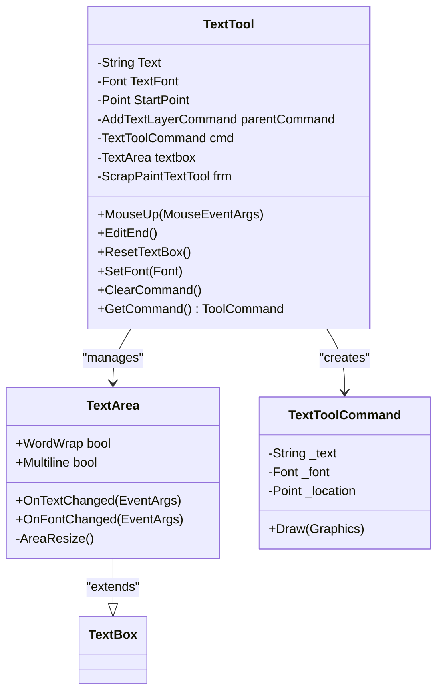

# Text Annotation System

<cite>
**Referenced Files in This Document**
- [TextTool.cs](file://SETUNA/Main/StyleItems/TextTool.cs)
- [AddTextLayerCommand.cs](file://SETUNA/Main/StyleItems/AddTextLayerCommand.cs)
- [TextToolCommand.cs](file://SETUNA/Main/StyleItems/TextToolCommand.cs)
- [ScrapPaintTextTool.cs](file://SETUNA/Main/StyleItems/ScrapPaintTextTool.cs)
- [ScrapPaintTextLayerItem.cs](file://SETUNA/Main/StyleItems/ScrapPaintTextLayerItem.cs)
- [ScrapPaintWindow.cs](file://SETUNA/Main/StyleItems/ScrapPaintWindow.cs)
- [ScrapPaintLayer.cs](file://SETUNA/Main/StyleItems/ScrapPaintLayer.cs)
- [PaintTool.cs](file://SETUNA/Main/StyleItems/PaintTool.cs)
- [ToolCommand.cs](file://SETUNA/Main/StyleItems/ToolCommand.cs)
- [ScrapPaintToolBar.cs](file://SETUNA/Main/StyleItems/ScrapPaintToolBar.cs)
</cite>

## Table of Contents
1. [Introduction](#introduction)
2. [System Architecture](#system-architecture)
3. [Core Components](#core-components)
4. [Workflow Implementation](#workflow-implementation)
5. [TextArea Auto-Resizing](#textarea-auto-resizing)
6. [Configuration Options](#configuration-options)
7. [Usage Scenarios](#usage-scenarios)
8. [Performance Considerations](#performance-considerations)
9. [Event Handling System](#event-handling-system)
10. [Troubleshooting Guide](#troubleshooting-guide)
11. [Integration with ScrapPaintWindow](#integration-with-scrappaintwindow)

## Introduction

The Text Annotation System in TextTool provides comprehensive in-place text editing capabilities within the ScrapPaintWindow environment. This system enables users to add textual annotations directly onto image scraps with dynamic text input, automatic resizing, and comprehensive font management. The implementation follows a layered architecture that separates concerns between text input, layer management, and visual rendering.

The system integrates seamlessly with the broader SETUNA painting framework, allowing text annotations to be treated as first-class citizens alongside other drawing tools. It supports real-time font selection, automatic sizing based on content, and maintains proper layer ordering for complex compositions.

## System Architecture

The Text Annotation System is built on a multi-layered architecture that promotes separation of concerns and modularity:

**Diagram sources**
- [ScrapPaintWindow.cs](file://SETUNA/Main/StyleItems/ScrapPaintWindow.cs#L8-L27)
- [TextTool.cs](file://SETUNA/Main/StyleItems/TextTool.cs#L8-L222)
- [AddTextLayerCommand.cs](file://SETUNA/Main/StyleItems/AddTextLayerCommand.cs#L4-L42)
- [ScrapPaintTextLayerItem.cs](file://SETUNA/Main/StyleItems/ScrapPaintTextLayerItem.cs#L8-L81)

## Core Components

### TextTool Class

The TextTool serves as the primary controller for text annotation functionality, inheriting from PaintTool and managing the complete text input lifecycle:

**Diagram sources**
- [TextTool.cs](file://SETUNA/Main/StyleItems/TextTool.cs#L8-L222)
- [TextToolCommand.cs](file://SETUNA/Main/StyleItems/TextToolCommand.cs#L6-L55)

### AddTextLayerCommand

This command creates specialized text layers within the layer management system, ensuring proper integration with the ScrapPaintWindow's layer architecture:

**Section sources**
- [AddTextLayerCommand.cs](file://SETUNA/Main/StyleItems/AddTextLayerCommand.cs#L4-L42)

### ScrapPaintTextLayerItem

The layer item implementation provides text-specific functionality including font retrieval and thumbnail generation:

**Section sources**
- [ScrapPaintTextLayerItem.cs](file://SETUNA/Main/StyleItems/ScrapPaintTextLayerItem.cs#L8-L81)

## Workflow Implementation

The text annotation workflow follows a structured sequence from mouse interaction to final text rendering:

**Diagram sources**
- [TextTool.cs](file://SETUNA/Main/StyleItems/TextTool.cs#L52-L94)
- [ScrapPaintWindow.cs](file://SETUNA/Main/StyleItems/ScrapPaintWindow.cs#L238-L250)

### Activation Process

The text annotation process begins when the user clicks on the canvas with the text tool selected. The system performs several initialization steps:

1. **Mouse Click Detection**: The MouseUp event triggers the activation sequence
2. **Layer Creation**: An AddTextLayerCommand is instantiated with default layer name "文字层"
3. **UI Integration**: The TextArea control is added to the parent window's control collection
4. **Focus Management**: The text box receives keyboard focus for immediate input
5. **Event Notification**: The Editing delegate is triggered to notify other components

**Section sources**
- [TextTool.cs](file://SETUNA/Main/StyleItems/TextTool.cs#L52-L70)

### Finalization Process

Text input completion occurs through multiple mechanisms:

1. **Mouse Click Outside**: Another MouseUp event triggers EditEnd()
2. **Enter Key Press**: KeyUp event handles Return key for immediate completion
3. **Manual Completion**: Using the ScrapPaintTextTool interface buttons

**Section sources**
- [TextTool.cs](file://SETUNA/Main/StyleItems/TextTool.cs#L76-L94)
- [TextTool.cs](file://SETUNA/Main/StyleItems/TextTool.cs#L97-L104)

## TextArea Auto-Resizing

The TextArea implementation provides intelligent auto-sizing based on content and font changes:

**Diagram sources**
- [TextTool.cs](file://SETUNA/Main/StyleItems/TextTool.cs#L198-L218)

### Resizing Mechanism

The TextArea automatically adjusts its size through several mechanisms:

1. **Content-Based Sizing**: The PreferredSize property determines optimal dimensions
2. **Font-Aware Resizing**: Font changes trigger immediate recalculation
3. **Layout Suspension**: Prevents flickering during size changes
4. **Multi-line Support**: Handles line breaks and word wrapping

**Section sources**
- [TextTool.cs](file://SETUNA/Main/StyleItems/TextTool.cs#L198-L218)

## Configuration Options

### Default Font Configuration

The system establishes standardized defaults for consistent user experience:

| Configuration | Value | Purpose |
|---------------|-------|---------|
| **Font Family** | Arial | Standard web-safe font |
| **Font Size** | 10pt | Optimal readability |
| **Font Style** | Regular | Clean, professional appearance |
| **Default Layer Name** | "文字层" | Chinese localization |

**Section sources**
- [TextTool.cs](file://SETUNA/Main/StyleItems/TextTool.cs#L23-L24)
- [ScrapPaintTextLayerItem.cs](file://SETUNA/Main/StyleItems/ScrapPaintTextLayerItem.cs#L61-L62)

### Text Positioning

Text positioning follows a grid-based system:

1. **Anchor Point**: Initial mouse click location serves as text origin
2. **Baseline Alignment**: Text starts at the click position
3. **Multi-line Support**: Automatic line breaking based on container width
4. **Scroll Behavior**: Content scrolls within bounds when exceeding container

### Layer Naming

The system provides flexible layer naming with automatic generation:

- **Default Pattern**: "层" + sequential number
- **Custom Names**: User-defined layer names supported
- **Unique Identification**: Layer IDs ensure proper layer management

**Section sources**
- [ScrapPaintLayer.cs](file://SETUNA/Main/StyleItems/ScrapPaintLayer.cs#L74-L77)

## Usage Scenarios

### Adding Labels and Captions

The primary use case involves adding descriptive text to image scraps:

1. **Label Creation**: Quick labeling of image regions
2. **Caption Addition**: Descriptive text for image analysis
3. **Annotation Enhancement**: Detailed explanations for screenshots

### Multi-Element Workflows

For complex compositions involving multiple text elements:

1. **Layer Organization**: Proper layer ordering for complex layouts
2. **Font Consistency**: Shared font settings across multiple texts
3. **Position Coordination**: Grid-based positioning for alignment

### Real-Time Collaboration

The event-driven architecture supports collaborative workflows:

1. **Live Updates**: Immediate visual feedback for font changes
2. **Synchronized Editing**: Coordinated editing sessions
3. **Version Control**: Command history for undo/redo operations

## Performance Considerations

### Memory Management

The system implements several memory optimization strategies:

1. **Control Disposal**: Proper cleanup of TextArea controls
2. **Event Unsubscription**: Prevention of memory leaks through event management
3. **Command Lifecycle**: Efficient command creation and disposal

### Rendering Performance

Optimizations for smooth text rendering:

1. **Selective Redraw**: Only affected areas are repainted
2. **Font Caching**: Reuse of font objects where possible
3. **Layout Optimization**: Minimal layout recalculations

### Multiple Text Elements

Performance considerations for projects with numerous text annotations:

1. **Layer Management**: Efficient layer indexing and traversal
2. **Command Batching**: Grouped operations for bulk changes
3. **Resource Pooling**: Reuse of common resources

**Section sources**
- [TextTool.cs](file://SETUNA/Main/StyleItems/TextTool.cs#L117-L126)

## Event Handling System

The Text Annotation System employs a sophisticated event handling mechanism for UI synchronization:

**Diagram sources**
- [TextTool.cs](file://SETUNA/Main/StyleItems/TextTool.cs#L11-L19)
- [ScrapPaintTextTool.cs](file://SETUNA/Main/StyleItems/ScrapPaintTextTool.cs#L17-L19)

### Editing Delegate

The Editing delegate manages UI state during text input:

1. **Activation Events**: Notify when text input begins
2. **Deactivation Events**: Signal when text input completes
3. **UI Visibility**: Control visibility of editing controls

**Section sources**
- [TextTool.cs](file://SETUNA/Main/StyleItems/TextTool.cs#L65-L67)
- [ScrapPaintTextTool.cs](file://SETUNA/Main/StyleItems/ScrapPaintTextTool.cs#L23-L26)

### ChangedFont Delegate

Font change notifications enable synchronized updates:

1. **Real-time Preview**: Immediate font changes in editing interface
2. **Consistency Maintenance**: Uniform font application across components
3. **UI Refresh**: Automatic update of font selection controls

**Section sources**
- [TextTool.cs](file://SETUNA/Main/StyleItems/TextTool.cs#L151-L154)
- [ScrapPaintTextTool.cs](file://SETUNA/Main/StyleItems/ScrapPaintTextTool.cs#L68-L72)

## Troubleshooting Guide

### Common Issues and Solutions

#### Lost Focus Problems

**Symptoms**: Text box loses focus unexpectedly
**Causes**: 
- Event handler conflicts
- Focus management issues
- Parent form activation problems

**Solutions**:
1. Verify event handler registration
2. Check focus management in MouseUp events
3. Ensure proper parent-child relationships

#### Font Rendering Problems

**Symptoms**: Incorrect font display or missing fonts
**Causes**:
- Missing font families
- Font loading failures
- DPI scaling issues

**Solutions**:
1. Verify installed font availability
2. Implement font fallback mechanisms
3. Test with different DPI settings

#### Improper Layer Ordering

**Symptoms**: Text appears behind other layers or in wrong order
**Causes**:
- Layer insertion logic errors
- Z-order management issues
- Command application timing

**Solutions**:
1. Review layer insertion indices
2. Verify command application order
3. Check layer refresh mechanisms

### Debugging Strategies

1. **Event Logging**: Track event firing sequences
2. **State Inspection**: Monitor component states during operations
3. **Memory Profiling**: Check for resource leaks
4. **Performance Monitoring**: Identify bottlenecks in rendering

**Section sources**
- [TextTool.cs](file://SETUNA/Main/StyleItems/TextTool.cs#L117-L126)
- [ScrapPaintWindow.cs](file://SETUNA/Main/StyleItems/ScrapPaintWindow.cs#L238-L250)

## Integration with ScrapPaintWindow

The Text Annotation System integrates seamlessly with the broader ScrapPaintWindow architecture:

### Tool Management

The system participates in the tool selection and activation cycle:

**Diagram sources**
- [ScrapPaintToolBar.cs](file://SETUNA/Main/StyleItems/ScrapPaintToolBar.cs#L48-L85)
- [ScrapPaintWindow.cs](file://SETUNA/Main/StyleItems/ScrapPaintWindow.cs#L43-L56)

### Layer Integration

Text layers integrate with the layer management system:

1. **Layer Creation**: AddTextLayerCommand creates appropriate layer items
2. **Command Association**: TextToolCommand instances are associated with layers
3. **Rendering Pipeline**: Layers participate in the drawing pipeline
4. **Persistence**: Text content is preserved across sessions

**Section sources**
- [AddTextLayerCommand.cs](file://SETUNA/Main/StyleItems/AddTextLayerCommand.cs#L13-L16)
- [ScrapPaintTextLayerItem.cs](file://SETUNA/Main/StyleItems/ScrapPaintTextLayerItem.cs#L22-L31)

### Event Propagation

The system participates in the event propagation network:

1. **Mouse Events**: Coordinate with window-level mouse handling
2. **Keyboard Events**: Integrate with global keyboard shortcuts
3. **Layer Events**: Respond to layer selection changes
4. **Command Events**: Participate in undo/redo operations

**Section sources**
- [ScrapPaintWindow.cs](file://SETUNA/Main/StyleItems/ScrapPaintWindow.cs#L166-L189)