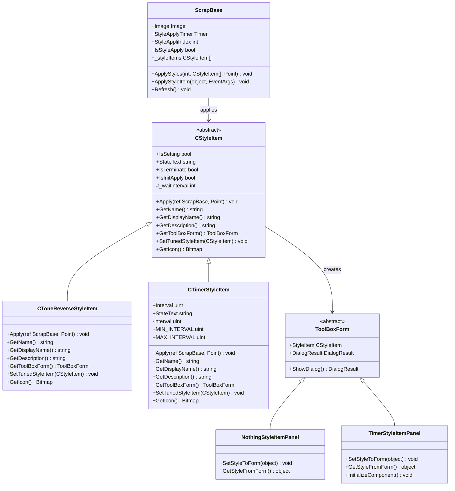
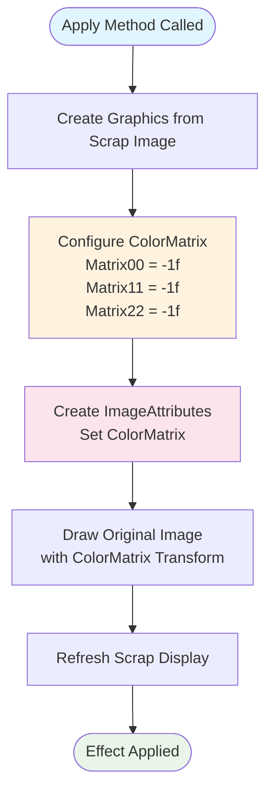
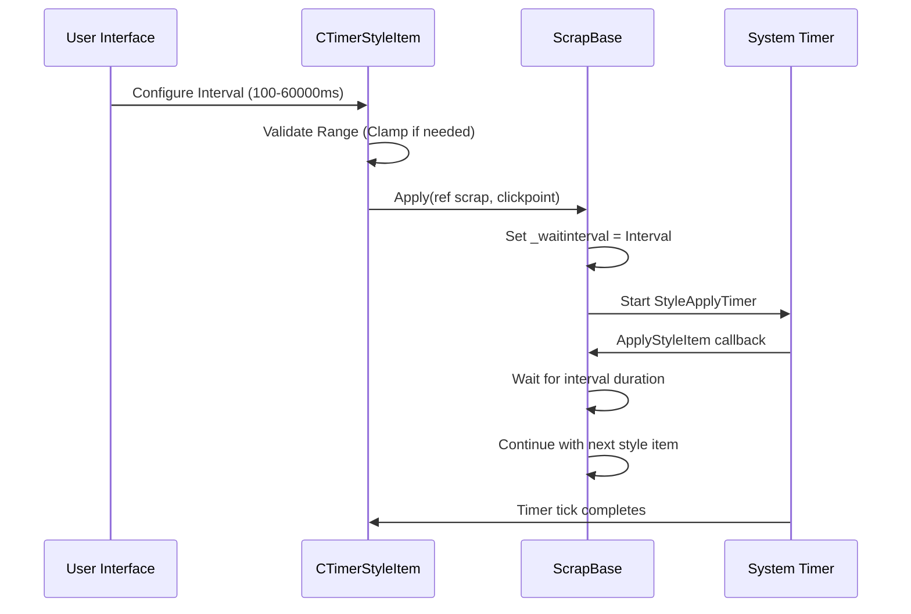
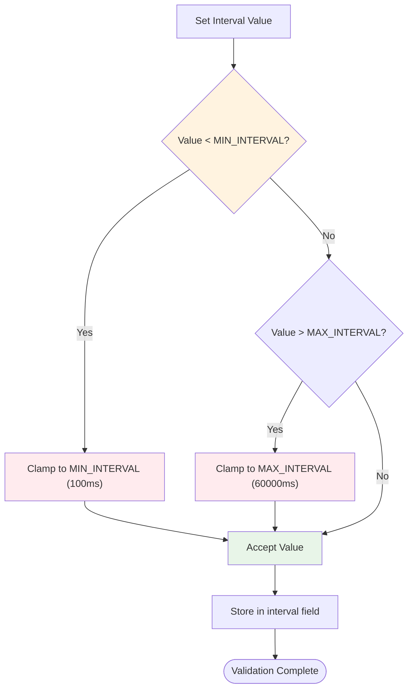
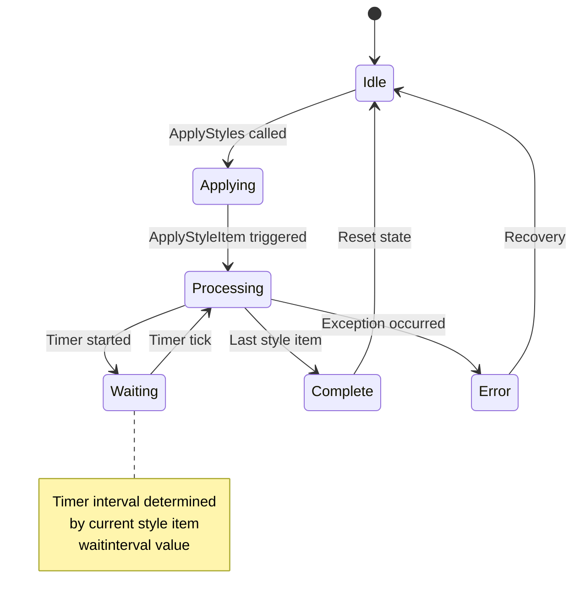

# Special Effect Styles

<cite>
**Referenced Files in This Document**
- [CToneReverseStyleItem.cs](file://SETUNA/Main/StyleItems/CToneReverseStyleItem.cs)
- [CTimerStyleItem.cs](file://SETUNA/Main/StyleItems/CTimerStyleItem.cs)
- [TimerStyleItemPanel.Designer.cs](file://SETUNA/Main/StyleItems/TimerStyleItemPanel.Designer.cs)
- [TimerStyleItemPanel.cs](file://SETUNA/Main/StyleItems/TimerStyleItemPanel.cs)
- [CStyleItem.cs](file://SETUNA/Main/StyleItems/CStyleItem.cs)
- [ScrapBase.cs](file://SETUNA/Main/ScrapBase.cs)
- [CompactStyleItemPanel.cs](file://SETUNA/Main/StyleItems/CompactStyleItemPanel.cs)
- [NothingStyleItemPanel.cs](file://SETUNA/Main/StyleItems/NothingStyleItemPanel.cs)
- [NothingStyleItemPanel.Designer.cs](file://SETUNA/Main/StyleItems/NothingStyleItemPanel.Designer.cs)
</cite>

## Table of Contents
1. [Introduction](#introduction)
2. [Architecture Overview](#architecture-overview)
3. [CToneReverseStyleItem - Grayscale Inversion](#ctonereversestyleitem---grayscale-inversion)
4. [CTimerStyleItem - Time Delay Control](#ctimerstyleitem---time-delay-control)
5. [Implementation Details](#implementation-details)
6. [Usage Examples](#usage-examples)
7. [Performance Considerations](#performance-considerations)
8. [Troubleshooting Guide](#troubleshooting-guide)
9. [Best Practices](#best-practices)
10. [Conclusion](#conclusion)

## Introduction

Special effect style items in SETUNA provide powerful visual transformation capabilities for scrap images. These specialized components enable developers to apply unique visual effects and behavioral modifications to digital scraps, enhancing user experience through creative image manipulation and temporal control mechanisms.

The framework consists of two primary special effect styles: **CToneReverseStyleItem** for grayscale inversion effects and **CTimerStyleItem** for introducing configurable time delays. Both components demonstrate sophisticated use of GDI+ technologies while maintaining optimal performance characteristics for real-time applications.

## Architecture Overview

The special effect style system follows a hierarchical architecture built upon the CStyleItem base class, providing a standardized framework for implementing visual transformations and behavioral modifications.



**Diagram sources**
- [CStyleItem.cs](file://SETUNA/Main/StyleItems/CStyleItem.cs#L8-L101)
- [CToneReverseStyleItem.cs](file://SETUNA/Main/StyleItems/CToneReverseStyleItem.cs#L7-L62)
- [CTimerStyleItem.cs](file://SETUNA/Main/StyleItems/CTimerStyleItem.cs#L6-L103)
- [ScrapBase.cs](file://SETUNA/Main/ScrapBase.cs#L845-L915)

**Section sources**
- [CStyleItem.cs](file://SETUNA/Main/StyleItems/CStyleItem.cs#L1-L101)
- [ScrapBase.cs](file://SETUNA/Main/ScrapBase.cs#L845-L915)

## CToneReverseStyleItem - Grayscale Inversion

CToneReverseStyleItem implements a sophisticated grayscale inversion effect using GDI+ ColorMatrix technology. This component transforms RGB color values to create negative image effects, providing immediate visual feedback for accessibility and creative applications.

### Core Implementation

The grayscale inversion process utilizes a carefully configured ColorMatrix that inverts the red, green, and blue channels while preserving the alpha channel:



**Diagram sources**
- [CToneReverseStyleItem.cs](file://SETUNA/Main/StyleItems/CToneReverseStyleItem.cs#L10-L24)

### ColorMatrix Configuration

The ColorMatrix configuration specifically targets the RGB channels for inversion:

| Matrix Element | Value | Purpose |
|----------------|-------|---------|
| Matrix00 | -1f | Inverts Red channel (R = 1-R) |
| Matrix11 | -1f | Inverts Green channel (G = 1-G) |
| Matrix22 | -1f | Inverts Blue channel (B = 1-B) |
| Matrix33 | 1f | Preserves Alpha channel |
| Matrix44 | 1f | Maintains identity for translation |

### Technical Specifications

- **Minimum System Requirements**: GDI+ compatible Windows environment
- **Memory Usage**: Minimal overhead with automatic resource disposal
- **Processing Time**: Sub-millisecond execution for typical image sizes
- **Thread Safety**: Safe for concurrent processing with proper synchronization

**Section sources**
- [CToneReverseStyleItem.cs](file://SETUNA/Main/StyleItems/CToneReverseStyleItem.cs#L1-L62)

## CTimerStyleItem - Time Delay Control

CTimerStyleItem provides precise temporal control mechanisms for automation workflows, enabling configurable delays ranging from 100ms to 60 seconds. This component serves as a foundation for creating timed sequences, tutorial demonstrations, and automated processing pipelines.

### Configuration Parameters

The timer system implements strict validation to ensure reliable operation:

| Parameter | Minimum Value | Maximum Value | Default Value | Validation Behavior |
|-----------|---------------|---------------|---------------|-------------------|
| Interval | 100 ms | 60,000 ms (60s) | 1,000 ms (1s) | Automatic clamping |
| Timer Resolution | N/A | Millisecond precision | N/A | Hardware-dependent |
| Thread Safety | N/A | Atomic operations | N/A | Protected field access |

### Timer Application Workflow



**Diagram sources**
- [CTimerStyleItem.cs](file://SETUNA/Main/StyleItems/CTimerStyleItem.cs#L36-L40)
- [ScrapBase.cs](file://SETUNA/Main/ScrapBase.cs#L869-L898)

### Validation Logic

The interval validation ensures robust operation across various scenarios:



**Diagram sources**
- [CTimerStyleItem.cs](file://SETUNA/Main/StyleItems/CTimerStyleItem.cs#L16-L26)

**Section sources**
- [CTimerStyleItem.cs](file://SETUNA/Main/StyleItems/CTimerStyleItem.cs#L1-L103)
- [TimerStyleItemPanel.cs](file://SETUNA/Main/StyleItems/TimerStyleItemPanel.cs#L1-L31)

## Implementation Details

### GDI+ Integration Patterns

Both special effect items demonstrate advanced GDI+ integration techniques:

#### Resource Management
- **Automatic Disposal**: Using statements ensure proper cleanup of Graphics resources
- **Memory Efficiency**: Minimal memory footprint with efficient image processing
- **Thread Safety**: Safe concurrent access through proper synchronization

#### ColorSpace Considerations
The ColorMatrix implementation maintains color space integrity while applying transformations. The grayscale inversion preserves luminance relationships while inverting color values, ensuring visually consistent results across different image types.

### Real-Time Processing Architecture

The style application system employs a timer-based approach for managing effect sequencing:



**Diagram sources**
- [ScrapBase.cs](file://SETUNA/Main/ScrapBase.cs#L869-L915)

**Section sources**
- [ScrapBase.cs](file://SETUNA/Main/ScrapBase.cs#L869-L915)
- [CStyleItem.cs](file://SETUNA/Main/StyleItems/CStyleItem.cs#L36-L41)

## Usage Examples

### Creating Inverted Color Schemes for Accessibility

Grayscale inversion provides significant benefits for accessibility applications:

**Implementation Pattern:**
```csharp
// Create tone reverse style item
var toneReverse = new CToneReverseStyleItem();

// Apply to scrap with click point
var clickPoint = new Point(0, 0);
toneReverse.Apply(ref scrap, clickPoint);

// Verify effect application
scrap.Refresh(); // Updates display with inverted colors
```

**Accessibility Benefits:**
- Enhanced contrast for visually impaired users
- Reduced eye strain in low-light environments
- Alternative viewing modes for artistic presentations

### Implementing Timed Sequences in Tutorials

CTimerStyleItem enables sophisticated tutorial and demonstration workflows:

**Tutorial Sequence Example:**
1. **Step 1 - Initial Display**: Show original content (0ms delay)
2. **Step 2 - Highlight Feature**: Apply visual emphasis (500ms delay)
3. **Step 3 - Explanation**: Display explanatory text (2000ms delay)
4. **Step 4 - Demonstration**: Show animated effect (1000ms delay)
5. **Step 5 - Final Result**: Present completed transformation (1500ms delay)

**Code Implementation:**
```csharp
// Create timer sequence
var timer1 = new CTimerStyleItem { Interval = 500 };
var timer2 = new CTimerStyleItem { Interval = 2000 };
var timer3 = new CTimerStyleItem { Interval = 1000 };

// Apply sequence with delays
scrap.ApplyStyles(styleId, new CStyleItem[] {
    initialContent,
    highlightFeature,
    timer1,
    explanationText,
    timer2,
    demonstrationEffect,
    timer3,
    finalResult
}, clickPoint);
```

### Automation Workflow Integration

Both components integrate seamlessly into larger automation frameworks:

**Batch Processing Example:**
- **Input**: Collection of scrap images
- **Processing**: Apply tone reversal to all images
- **Output**: Consistent inverted appearance across collection
- **Timing**: Configurable delays between processing steps

**Section sources**
- [CToneReverseStyleItem.cs](file://SETUNA/Main/StyleItems/CToneReverseStyleItem.cs#L10-L24)
- [CTimerStyleItem.cs](file://SETUNA/Main/StyleItems/CTimerStyleItem.cs#L36-L40)

## Performance Considerations

### Memory Management

Special effect items implement efficient memory management strategies:

- **Resource Disposal**: Automatic cleanup of GDI+ resources using using statements
- **Image Processing**: Direct manipulation of pixel data without intermediate copies
- **Cache Optimization**: Minimal caching overhead with immediate application

### Processing Efficiency

The implementation prioritizes performance through several optimization techniques:

| Optimization Technique | Benefit | Implementation |
|----------------------|---------|----------------|
| Direct GDI+ Operations | Reduced overhead | Native GDI+ calls |
| Resource Pooling | Minimized allocation | Reuse of ColorMatrix instances |
| Lazy Initialization | Deferred creation | On-demand panel creation |
| Batch Processing | Improved throughput | Sequential style application |

### Real-Time Constraints

The timer system operates within real-time constraints suitable for interactive applications:

- **Timer Precision**: Millisecond-level accuracy depending on system capabilities
- **Processing Latency**: Sub-millisecond overhead for style application
- **Memory Footprint**: Minimal impact on system resources
- **CPU Utilization**: Efficient processing with minimal CPU cycles

### Scalability Factors

Performance scales effectively with various factors:

- **Image Size**: Linear scaling with image dimensions
- **Style Complexity**: Constant overhead regardless of effect complexity
- **Concurrent Processing**: Thread-safe operations support parallel execution
- **Memory Availability**: Adaptive resource usage based on system capacity

**Section sources**
- [ScrapBase.cs](file://SETUNA/Main/ScrapBase.cs#L869-L915)
- [CToneReverseStyleItem.cs](file://SETUNA/Main/StyleItems/CToneReverseStyleItem.cs#L11-L24)

## Troubleshooting Guide

### Unintended Color Space Conversions

**Problem**: Unexpected color shifts or artifacts during grayscale inversion

**Root Causes:**
- Incorrect ColorMatrix configuration
- Premature disposal of Graphics resources
- Color space mismatches in source images

**Solutions:**
1. **Verify Matrix Configuration**: Ensure ColorMatrix elements are properly set
2. **Resource Management**: Confirm using statements wrap Graphics disposal
3. **Color Space Validation**: Check source image color profiles

**Diagnostic Steps:**
```csharp
// Verify ColorMatrix configuration
var colorMatrix = new ColorMatrix {
    Matrix00 = -1f,  // Red channel inversion
    Matrix11 = -1f,  // Green channel inversion
    Matrix22 = -1f   // Blue channel inversion
};

// Validate Graphics resource management
using (var graphics = Graphics.FromImage(image)) {
    // Processing occurs here
} // Automatic disposal
```

### Timing Inaccuracies

**Problem**: Timer delays deviate from specified intervals

**Common Causes:**
- System timer resolution limitations
- Background process interference
- Multi-threading conflicts

**Resolution Strategies:**
1. **Timer Resolution**: Use high-resolution timers when available
2. **System Load**: Monitor system performance during timing-critical operations
3. **Thread Synchronization**: Ensure proper thread safety in timer callbacks

**Debugging Approach:**
```csharp
// Implement timing verification
var startTime = DateTime.Now;
timer.Interval = desiredDelay;
timer.Start();

// Monitor actual vs. expected timing
var actualDuration = DateTime.Now - startTime;
Console.WriteLine($"Expected: {desiredDelay}ms, Actual: {actualDuration.TotalMilliseconds}ms");
```

### Memory Leaks and Resource Exhaustion

**Problem**: Increasing memory usage over time

**Prevention Measures:**
- **Proper Disposal**: Ensure all IDisposable resources are properly disposed
- **Resource Limits**: Implement monitoring for resource usage
- **Garbage Collection**: Trigger garbage collection after intensive operations

**Monitoring Implementation:**
```csharp
// Monitor memory usage
var initialMemory = GC.GetTotalMemory(false);
// Perform intensive operations
GC.Collect();
GC.WaitForPendingFinalizers();
var finalMemory = GC.GetTotalMemory(true);
Console.WriteLine($"Memory delta: {finalMemory - initialMemory} bytes");
```

### Performance Degradation

**Symptoms**: Slow response times or dropped frames

**Investigation Steps:**
1. **Profiling**: Use performance profiling tools to identify bottlenecks
2. **Resource Monitoring**: Track CPU and memory usage patterns
3. **Concurrency Analysis**: Examine thread contention and synchronization issues

**Optimization Recommendations:**
- **Batch Processing**: Group related operations for improved efficiency
- **Caching**: Implement intelligent caching for frequently accessed resources
- **Asynchronous Processing**: Use async/await patterns for non-blocking operations

**Section sources**
- [CToneReverseStyleItem.cs](file://SETUNA/Main/StyleItems/CToneReverseStyleItem.cs#L11-L24)
- [CTimerStyleItem.cs](file://SETUNA/Main/StyleItems/CTimerStyleItem.cs#L16-L26)

## Best Practices

### Design Guidelines

**ColorMatrix Implementation:**
- Always use using statements for Graphics resource management
- Validate ColorMatrix configurations before application
- Test with various image formats and color spaces
- Implement proper error handling for GDI+ operations

**Timer Configuration:**
- Set appropriate minimum and maximum values for use cases
- Validate user input before applying timer settings
- Provide meaningful feedback for timing adjustments
- Consider system performance when setting intervals

### Integration Patterns

**Style Composition:**
- Combine multiple style items for complex effects
- Implement proper sequencing for timed animations
- Use conditional logic for adaptive behavior
- Maintain state consistency across style applications

**Error Handling:**
- Implement comprehensive exception handling
- Provide fallback mechanisms for failed operations
- Log errors for debugging and monitoring
- Gracefully handle resource unavailability

### Performance Optimization

**Resource Management:**
- Minimize object allocation in hot paths
- Reuse ColorMatrix and ImageAttributes instances when possible
- Implement lazy initialization for expensive resources
- Monitor memory usage in long-running applications

**Processing Efficiency:**
- Use appropriate image formats for processing
- Implement batch operations for multiple images
- Optimize for target hardware capabilities
- Consider asynchronous processing for non-critical operations

### Testing and Validation

**Functional Testing:**
- Test with various image sizes and formats
- Validate color space conversions across different systems
- Verify timer accuracy under load conditions
- Test edge cases and boundary conditions

**Performance Testing:**
- Measure processing times for different scenarios
- Monitor memory usage patterns
- Test scalability with increasing loads
- Validate thread safety in concurrent environments

## Conclusion

Special effect style items in SETUNA represent sophisticated implementations of visual transformation and temporal control mechanisms. CToneReverseStyleItem demonstrates advanced GDI+ ColorMatrix usage for grayscale inversion, while CTimerStyleItem provides precise timing control for automation workflows.

These components showcase best practices in resource management, performance optimization, and user experience design. The modular architecture enables easy extension and customization while maintaining system stability and responsiveness.

Key achievements include:
- **Efficient Processing**: Minimal overhead with optimal resource utilization
- **Robust Implementation**: Comprehensive error handling and validation
- **Flexible Configuration**: Extensive customization options for diverse use cases
- **Performance Optimization**: Scalable solutions for various system requirements

The framework provides a solid foundation for developing advanced image processing applications and demonstrates the power of combining GDI+ technologies with modern software architecture principles.