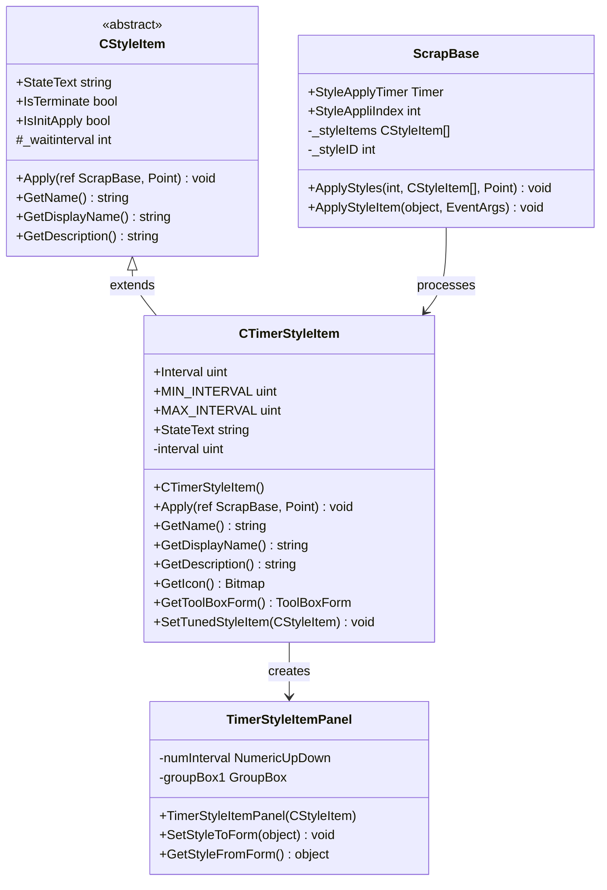
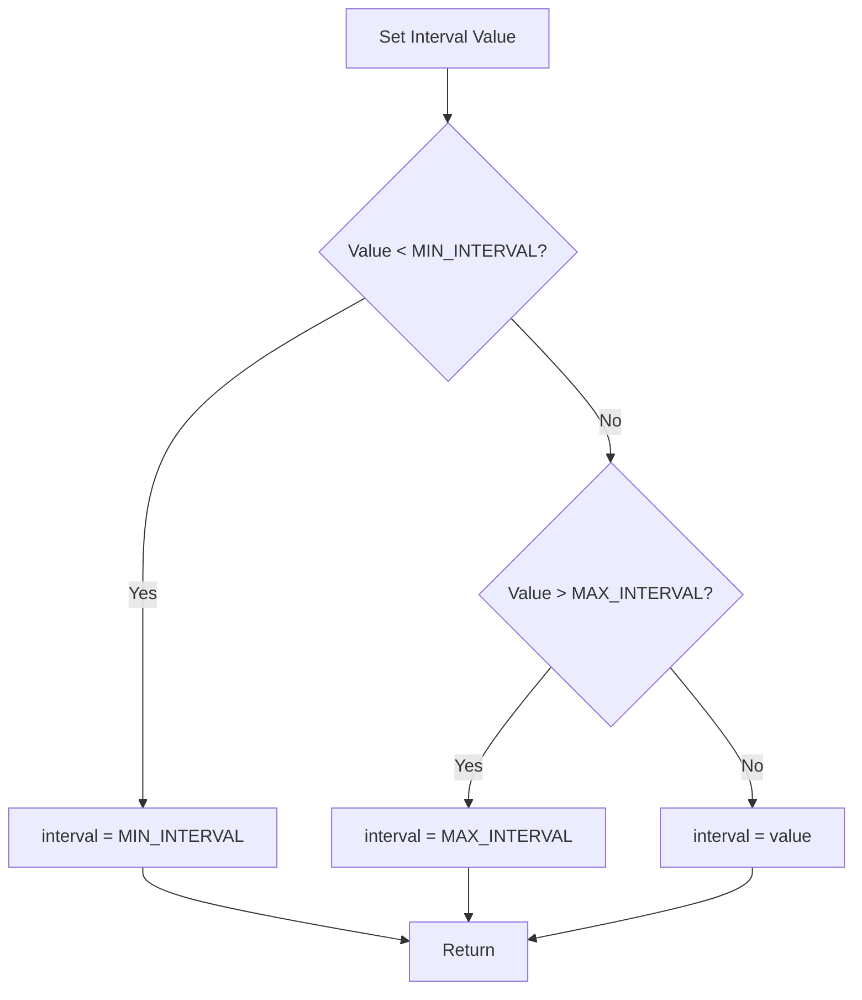
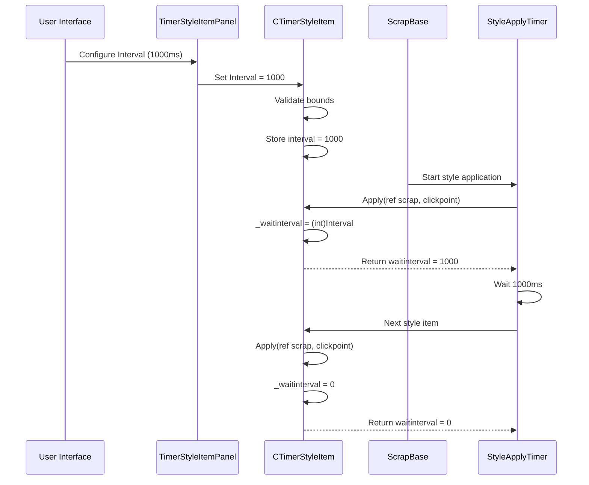
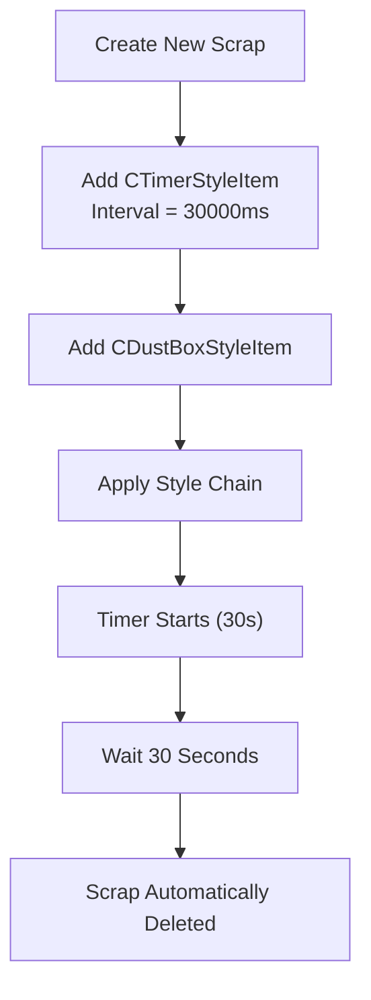
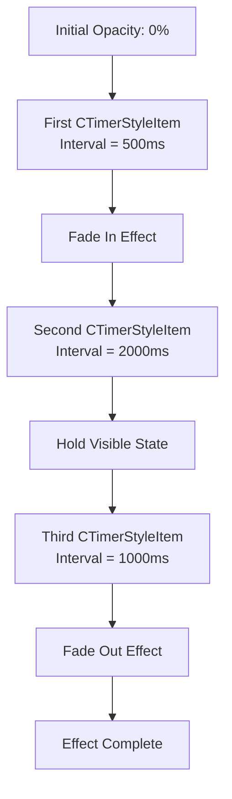
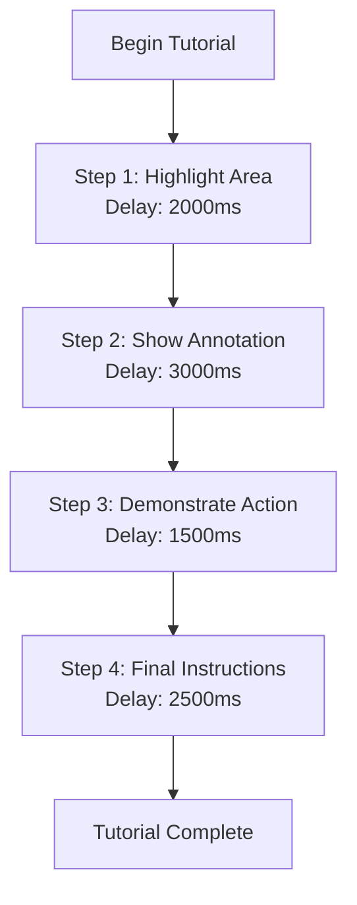
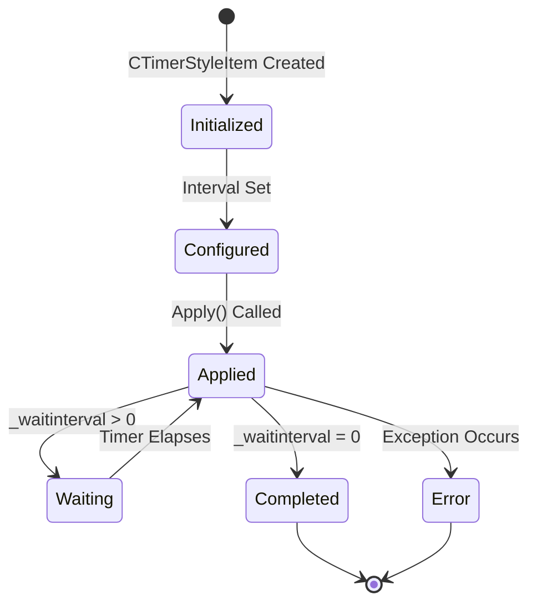

# Timer Style

<cite>
**Referenced Files in This Document**
- [CTimerStyleItem.cs](file://SETUNA/Main/StyleItems/CTimerStyleItem.cs)
- [TimerStyleItemPanel.cs](file://SETUNA/Main/StyleItems/TimerStyleItemPanel.cs)
- [TimerStyleItemPanel.Designer.cs](file://SETUNA/Main/StyleItems/TimerStyleItemPanel.Designer.cs)
- [CStyleItem.cs](file://SETUNA/Main/StyleItems/CStyleItem.cs)
- [ScrapBase.cs](file://SETUNA/Main/ScrapBase.cs)
- [CStyle.cs](file://SETUNA/Main/Style/CStyle.cs)
</cite>

## Table of Contents
1. [Introduction](#introduction)
2. [Class Architecture](#class-architecture)
3. [Configuration Parameters](#configuration-parameters)
4. [Implementation Details](#implementation-details)
5. [Usage Examples](#usage-examples)
6. [Thread Safety and Memory Management](#thread-safety-and-memory-management)
7. [Performance Considerations](#performance-considerations)
8. [Common Issues and Solutions](#common-issues-and-solutions)
9. [Best Practices](#best-practices)
10. [Conclusion](#conclusion)

## Introduction

The CTimerStyleItem class is a specialized style item in the SETUNA screenshot capture application that enables time-delayed execution of style operations through a configurable interval ranging from 100 milliseconds to 60 seconds. This functionality serves as a fundamental building block for automation workflows, allowing developers to implement delayed screen annotations, timed tutorial sequences, and visual effect animations with precise temporal control.

The timer mechanism operates by deferring subsequent style processing through the application's style pipeline, utilizing a sophisticated timer system that integrates seamlessly with the ScrapBase's style application framework. This approach enables complex temporal workflows while maintaining the responsive nature of the user interface.

## Class Architecture

The CTimerStyleItem class follows a hierarchical inheritance structure that places it within the broader style item ecosystem:

**Diagram sources**
- [CTimerStyleItem.cs](file://SETUNA/Main/StyleItems/CTimerStyleItem.cs#L6-L101)
- [CStyleItem.cs](file://SETUNA/Main/StyleItems/CStyleItem.cs#L8-L101)
- [TimerStyleItemPanel.cs](file://SETUNA/Main/StyleItems/TimerStyleItemPanel.cs#L4-L30)
- [ScrapBase.cs](file://SETUNA/Main/ScrapBase.cs#L845-L903)

**Section sources**
- [CTimerStyleItem.cs](file://SETUNA/Main/StyleItems/CTimerStyleItem.cs#L6-L101)
- [CStyleItem.cs](file://SETUNA/Main/StyleItems/CStyleItem.cs#L8-L101)

## Configuration Parameters

### Interval Property

The core configuration parameter of CTimerStyleItem is the Interval property, which controls the delay duration in milliseconds:

| Parameter | Type | Range | Default | Description |
|-----------|------|-------|---------|-------------|
| Interval | uint | 100-60000 ms | 1000 ms | Delay duration before proceeding to next style operation |
| MIN_INTERVAL | uint | Constant | 100 ms | Minimum allowable delay interval |
| MAX_INTERVAL | uint | Constant | 60000 ms | Maximum allowable delay interval |

### Validation and Bounds Checking

The Interval property implements robust validation logic to ensure proper bounds enforcement:

**Diagram sources**
- [CTimerStyleItem.cs](file://SETUNA/Main/StyleItems/CTimerStyleItem.cs#L15-L27)

### Default Configuration

The class initializes with a default interval of 1000 milliseconds (1 second), providing a balanced starting point for most automation scenarios. This default value ensures reasonable responsiveness while allowing sufficient time for visual effects and user interactions.

**Section sources**
- [CTimerStyleItem.cs](file://SETUNA/Main/StyleItems/CTimerStyleItem.cs#L11-L28)
- [CTimerStyleItem.cs](file://SETUNA/Main/StyleItems/CTimerStyleItem.cs#L94-L98)

## Implementation Details

### Timer Integration Architecture

The CTimerStyleItem integrates with the application's timer system through a multi-layered approach:

**Diagram sources**
- [CTimerStyleItem.cs](file://SETUNA/Main/StyleItems/CTimerStyleItem.cs#L37-L40)
- [ScrapBase.cs](file://SETUNA/Main/ScrapBase.cs#L869-L890)

### Event Subscription Mechanism

The timer functionality relies on the StyleApplyTimer's Tick event subscription, which is managed through the ScrapBase's ApplyStyles method. This event-driven architecture ensures that timer delays integrate seamlessly with the overall style application pipeline.

### State Management

The CTimerStyleItem maintains its state through several key mechanisms:

- **Interval Storage**: The configured delay duration is stored in the protected `interval` field
- **Wait Interval Calculation**: During Apply operations, the `_waitinterval` field is populated with the calculated delay
- **State Text Generation**: The StateText property dynamically generates display text based on the current interval setting

**Section sources**
- [CTimerStyleItem.cs](file://SETUNA/Main/StyleItems/CTimerStyleItem.cs#L37-L40)
- [CTimerStyleItem.cs](file://SETUNA/Main/StyleItems/CTimerStyleItem.cs#L75-L85)
- [ScrapBase.cs](file://SETUNA/Main/ScrapBase.cs#L845-L903)

## Usage Examples

### Scheduling Scrap Deletion After 30 Seconds

A common use case involves automatically deleting scraps after a specified timeout period:

**Diagram sources**
- [CTimerStyleItem.cs](file://SETUNA/Main/StyleItems/CTimerStyleItem.cs#L37-L40)

### Delaying Opacity Changes for Visual Effects

Visual effects often benefit from staggered opacity transitions:

### Timed Tutorial Sequences

Educational applications can leverage timer delays for step-by-step tutorials:

**Section sources**
- [CTimerStyleItem.cs](file://SETUNA/Main/StyleItems/CTimerStyleItem.cs#L37-L40)

## Thread Safety and Memory Management

### Thread Safety Considerations

The CTimerStyleItem operates within the application's UI thread context, inheriting thread safety characteristics from the Windows Forms timer infrastructure. However, several considerations ensure safe operation:

- **Property Access**: The Interval property uses atomic assignment for thread-safe value updates
- **State Consistency**: The protected `interval` field is accessed consistently during Apply operations
- **Timer Lifecycle**: The StyleApplyTimer manages its own thread context, preventing cross-thread violations

### Proper Disposal and Resource Management

While CTimerStyleItem itself doesn't implement IDisposable, proper resource management occurs through:

- **Automatic Timer Cleanup**: The StyleApplyTimer is managed by ScrapBase and cleaned up during application shutdown
- **Memory Leak Prevention**: The timer event subscriptions are properly maintained and removed
- **Reference Management**: Style item references are handled through the application's collection management system

### Timer Lifecycle Management

The timer lifecycle is tightly integrated with the ScrapBase's style application process:

**Diagram sources**
- [CTimerStyleItem.cs](file://SETUNA/Main/StyleItems/CTimerStyleItem.cs#L37-L40)
- [ScrapBase.cs](file://SETUNA/Main/ScrapBase.cs#L869-L890)

**Section sources**
- [CTimerStyleItem.cs](file://SETUNA/Main/StyleItems/CTimerStyleItem.cs#L11-L28)
- [ScrapBase.cs](file://SETUNA/Main/ScrapBase.cs#L845-L903)

## Performance Considerations

### Multiple Concurrent Timers

When multiple CTimerStyleItem instances are used concurrently, several performance factors come into play:

| Factor | Impact | Mitigation Strategy |
|--------|--------|-------------------|
| Timer Overhead | Increased CPU usage from multiple timer ticks | Use shared timer resources where possible |
| Memory Consumption | Additional object allocation for each timer instance | Reuse timer configurations when appropriate |
| UI Responsiveness | Potential blocking during long delays | Implement asynchronous processing patterns |
| Style Pipeline Bottlenecks | Queue buildup with excessive delays | Optimize timer intervals for workflow efficiency |

### Timer Resolution and Accuracy

The underlying System.Windows.Forms.Timer provides millisecond resolution but may experience inaccuracies due to:

- **UI Thread Congestion**: Heavy UI operations can delay timer callbacks
- **System Load**: Operating system scheduling affects timer precision
- **Background Processes**: Other applications can impact timing accuracy

### Long-Running Session Management

For applications requiring extended timer usage:

- **Memory Pressure**: Monitor timer object accumulation in long sessions
- **Resource Leaks**: Ensure proper cleanup of abandoned timer references
- **Performance Degradation**: Implement periodic timer optimization checks

**Section sources**
- [CTimerStyleItem.cs](file://SETUNA/Main/StyleItems/CTimerStyleItem.cs#L94-L98)

## Common Issues and Solutions

### Inaccurate Timing Due to UI Thread Congestion

**Problem**: Timer delays become inconsistent when the UI thread is heavily loaded with other operations.

**Solution**: 
- Implement high-resolution timer alternatives for critical timing requirements
- Offload heavy processing to background threads before applying timer delays
- Use asynchronous processing patterns to maintain UI responsiveness

### Memory Leaks from Abandoned Timers

**Problem**: Timer references persist after style application completion, causing memory accumulation.

**Solution**:
- Ensure proper disposal of style item collections
- Implement weak reference patterns for timer event handlers
- Monitor timer object lifecycle through application logging

### Timer Precision Issues

**Problem**: Timer delays exhibit significant variance from specified intervals.

**Solution**:
- Use System.Diagnostics.Stopwatch for high-precision timing measurements
- Implement jitter compensation algorithms for critical timing scenarios
- Consider using Task.Delay with proper synchronization contexts for background operations

### Concurrency Conflicts

**Problem**: Multiple timer operations interfere with each other in complex style chains.

**Solution**:
- Implement proper synchronization mechanisms for shared timer resources
- Design timer-independent style operations where possible
- Use queue-based processing to ensure ordered execution

**Section sources**
- [ScrapBase.cs](file://SETUNA/Main/ScrapBase.cs#L869-L890)

## Best Practices

### Timer Configuration Guidelines

1. **Range Validation**: Always validate timer intervals against MIN_INTERVAL and MAX_INTERVAL bounds
2. **Default Values**: Use sensible defaults (1000ms) for new timer configurations
3. **User Experience**: Consider human reaction times when setting timer intervals
4. **Accessibility**: Provide adjustable timer settings for users with different needs

### Integration Patterns

1. **Style Composition**: Combine CTimerStyleItem with other style items for complex workflows
2. **Conditional Timing**: Use timer delays conditionally based on application state
3. **Fallback Mechanisms**: Implement timeout recovery for critical timer-dependent operations
4. **Testing Strategies**: Validate timer behavior under various load conditions

### Performance Optimization

1. **Batch Processing**: Group related timer operations to minimize overhead
2. **Resource Pooling**: Reuse timer configurations when identical delays are required
3. **Monitoring**: Implement timer accuracy monitoring for production deployments
4. **Profiling**: Regularly profile timer-related code for performance bottlenecks

### Error Handling

1. **Graceful Degradation**: Provide alternative behaviors when timer operations fail
2. **Logging**: Implement comprehensive logging for timer-related events
3. **Recovery Mechanisms**: Design systems that can recover from timer failures
4. **User Feedback**: Provide clear indications when timer operations encounter issues

**Section sources**
- [CTimerStyleItem.cs](file://SETUNA/Main/StyleItems/CTimerStyleItem.cs#L11-L28)
- [TimerStyleItemPanel.cs](file://SETUNA/Main/StyleItems/TimerStyleItemPanel.cs#L12-L28)

## Conclusion

The CTimerStyleItem class represents a sophisticated yet accessible approach to implementing time-delayed operations within the SETUNA application's style system. Its carefully designed architecture balances simplicity with powerful functionality, enabling developers to create complex automation workflows while maintaining system stability and performance.

Through its integration with the ScrapBase's timer infrastructure, the CTimerStyleItem demonstrates how well-designed abstractions can simplify complex temporal programming challenges. The class's emphasis on validation, bounds checking, and proper resource management sets a standard for reliable timer-based functionality in desktop applications.

The practical applications of this class extend far beyond simple delays, encompassing sophisticated visual effects, automated workflows, and educational demonstrations. As the foundation for temporal style operations, CTimerStyleItem exemplifies the importance of thoughtful design in creating flexible, maintainable, and performant software components.

Future enhancements could include support for high-resolution timers, improved accuracy mechanisms, and expanded integration with modern asynchronous programming patterns. However, the current implementation provides a solid foundation that meets the diverse timing requirements of screenshot capture and annotation applications.