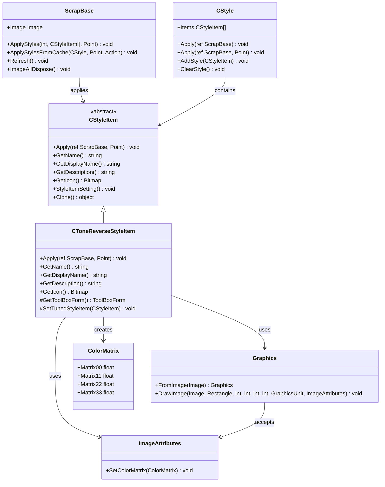
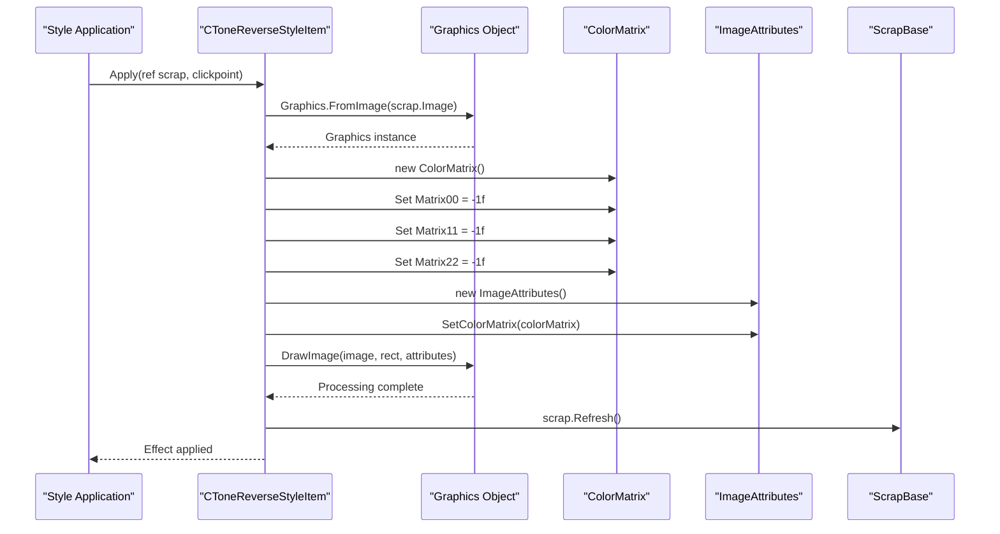
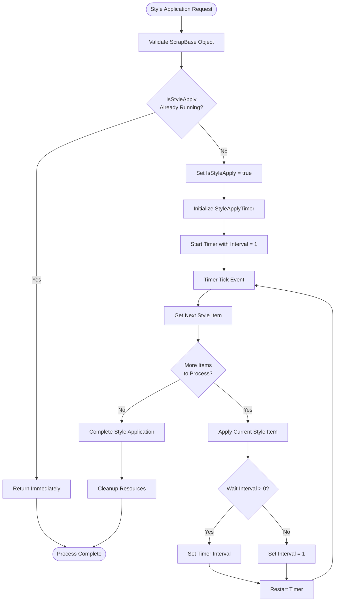

# Tone Reverse Style

<cite>
**Referenced Files in This Document**
- [CToneReverseStyleItem.cs](file://SETUNA/Main/StyleItems/CToneReverseStyleItem.cs)
- [CStyleItem.cs](file://SETUNA/Main/StyleItems/CStyleItem.cs)
- [ScrapBase.cs](file://SETUNA/Main/ScrapBase.cs)
- [CStyle.cs](file://SETUNA/Main/Style/CStyle.cs)
- [NothingStyleItemPanel.cs](file://SETUNA/Main/StyleItems/NothingStyleItemPanel.cs)
- [ScrapSourceImage.cs](file://SETUNA/Main/ScrapSourceImage.cs)
</cite>

## Table of Contents
1. [Introduction](#introduction)
2. [Architecture Overview](#architecture-overview)
3. [Core Implementation](#core-implementation)
4. [ColorMatrix Configuration](#colormatrix-configuration)
5. [Integration with Style System](#integration-with-style-system)
6. [Practical Applications](#practical-applications)
7. [Performance Considerations](#performance-considerations)
8. [Troubleshooting Guide](#troubleshooting-guide)
9. [Optimization Strategies](#optimization-strategies)
10. [Conclusion](#conclusion)

## Introduction

The CToneReverseStyleItem class implements a sophisticated negative image effect by inverting RGB color values using GDI+ ColorMatrix transformations. This style item provides a powerful tool for creating photographic negatives, enhancing contrast for visually impaired users, and achieving artistic effects through tone reversal. The implementation leverages Microsoft's GDI+ framework to perform pixel-level color manipulation efficiently while maintaining compatibility with various image formats.

The tone reversal effect works by applying a mathematical transformation that inverts each RGB channel value, effectively creating a photographic negative where light areas become dark and vice versa. This transformation is achieved through careful configuration of the ColorMatrix with specific scaling factors and offset values.

## Architecture Overview

The CToneReverseStyleItem integrates seamlessly into SETUNA's style system architecture, following a hierarchical design pattern that promotes modularity and extensibility.



**Diagram sources**
- [CToneReverseStyleItem.cs](file://SETUNA/Main/StyleItems/CToneReverseStyleItem.cs#L7-L60)
- [CStyleItem.cs](file://SETUNA/Main/StyleItems/CStyleItem.cs#L8-L101)
- [ScrapBase.cs](file://SETUNA/Main/ScrapBase.cs#L16-L200)
- [CStyle.cs](file://SETUNA/Main/Style/CStyle.cs#L11-L200)

**Section sources**
- [CToneReverseStyleItem.cs](file://SETUNA/Main/StyleItems/CToneReverseStyleItem.cs#L1-L63)
- [CStyleItem.cs](file://SETUNA/Main/StyleItems/CStyleItem.cs#L1-L101)

## Core Implementation

The CToneReverseStyleItem class inherits from CStyleItem and implements the Apply method to perform tone reversal on images. The core implementation follows a streamlined approach that ensures efficient processing while maintaining image quality.

### Apply Method Implementation

The Apply method serves as the primary entry point for the tone reversal effect, orchestrating the entire image processing pipeline:



**Diagram sources**
- [CToneReverseStyleItem.cs](file://SETUNA/Main/StyleItems/CToneReverseStyleItem.cs#L10-L24)

The implementation utilizes several key techniques:

1. **Resource Management**: The Graphics object is wrapped in a using statement to ensure proper disposal of GDI+ resources
2. **Direct Pixel Manipulation**: The ColorMatrix provides direct control over RGB channel transformations
3. **Efficient Rendering**: The DrawImage method performs the actual transformation with minimal overhead

**Section sources**
- [CToneReverseStyleItem.cs](file://SETUNA/Main/StyleItems/CToneReverseStyleItem.cs#L10-L24)

## ColorMatrix Configuration

The heart of the tone reversal effect lies in the precise configuration of the ColorMatrix. The ColorMatrix is a 5x5 transformation matrix that defines how color channels are processed during image rendering.

### Mathematical Foundation

The ColorMatrix configuration for tone reversal implements the following mathematical transformation:

| Matrix Element | Value | Purpose |
|----------------|-------|---------|
| Matrix00 | -1.0f | Inverts Red channel (R' = -R + 255) |
| Matrix11 | -1.0f | Inverts Green channel (G' = -G + 255) |
| Matrix22 | -1.0f | Inverts Blue channel (B' = -B + 255) |
| Matrix33 | 1.0f | Preserves Alpha channel |
| Matrix44 | 1.0f | Maintains identity for translation |

### Transformation Details

The ColorMatrix transformation effectively applies the formula:
- R' = -R + 255
- G' = -G + 255  
- B' = -B + 255

Where:
- R, G, B represent original red, green, and blue channel values (0-255)
- R', G', B' represent the transformed channel values
- The "+ 255" term compensates for the negative scaling, ensuring the result remains within the valid color range

### Color Space Considerations

The implementation assumes the input image uses the standard sRGB color space with linear gamma correction. This assumption enables predictable results across different image types and prevents unexpected color shifts that could occur with non-standard color spaces.

**Section sources**
- [CToneReverseStyleItem.cs](file://SETUNA/Main/StyleItems/CToneReverseStyleItem.cs#L14-L19)

## Integration with Style System

The CToneReverseStyleItem integrates seamlessly with SETUNA's style system through a well-defined interface that supports dynamic application and removal of effects.

### Style Application Workflow



**Diagram sources**
- [ScrapBase.cs](file://SETUNA/Main/ScrapBase.cs#L845-L903)

### Style System Integration Points

The CToneReverseStyleItem participates in the style system through several key mechanisms:

1. **Interface Compliance**: Implements IScrapStyle and ICloneable interfaces
2. **Event Integration**: Responds to image change events and style application events
3. **Thread Safety**: Designed to work safely within the style application timer framework
4. **Resource Management**: Properly disposes of GDI+ resources through the using statement pattern

**Section sources**
- [CStyle.cs](file://SETUNA/Main/Style/CStyle.cs#L94-L117)
- [ScrapBase.cs](file://SETUNA/Main/ScrapBase.cs#L835-L903)

## Practical Applications

The CToneReverseStyleItem enables various practical applications that demonstrate its versatility and effectiveness in real-world scenarios.

### Visual Accessibility Enhancement

For users with visual impairments, tone reversal can significantly enhance readability by increasing contrast between text and background elements. This effect is particularly valuable for:

- **Low Vision Users**: Converting light backgrounds to dark backgrounds improves text visibility
- **Reading Assistance**: Enhancing contrast helps users with dyslexia or other reading challenges
- **Night Mode Alternatives**: Providing an alternative to traditional dark mode interfaces

### Photographic Negative Effects

The tone reversal effect naturally creates photographic negatives, enabling creative applications:

- **Artistic Photography**: Converting positive images to negative for artistic purposes
- **Film Emulation**: Simulating the look of traditional film photography
- **Creative Editing**: Providing a starting point for further image manipulation

### Debugging and Analysis

The inverted color scheme proves useful for various analytical purposes:

- **Pattern Recognition**: Making subtle differences more visible through increased contrast
- **Quality Assessment**: Identifying artifacts or inconsistencies in image processing
- **Technical Analysis**: Revealing hidden details that are obscured in normal color representation

### Example Use Cases

| Application Area | Specific Use Case | Expected Outcome |
|------------------|-------------------|------------------|
| Education | Highlighting text in presentations | Increased readability for students |
| Accessibility | Creating high-contrast study materials | Better visual separation of content |
| Photography | Experimental photo effects | Unique artistic results |
| Analysis | Revealing hidden image details | Enhanced pattern recognition |
| Testing | Quality assurance verification | Improved artifact detection |

## Performance Considerations

Understanding the performance characteristics of the CToneReverseStyleItem is crucial for optimizing its use in production environments, especially when processing multiple images or high-resolution content.

### Computational Complexity

The tone reversal operation has O(n) computational complexity, where n represents the total number of pixels in the image. This linear complexity ensures predictable performance scaling across different image sizes.

### Memory Usage Patterns

The implementation exhibits specific memory usage patterns that impact overall system performance:

1. **Temporary Graphics Objects**: Short-lived Graphics instances created during processing
2. **ColorMatrix Allocation**: Minimal memory allocation for the 5x5 transformation matrix
3. **Image Attributes**: Additional memory for ImageAttributes container
4. **GDI+ Resources**: Managed by the .NET runtime through proper disposal patterns

### Performance Optimization Guidelines

For optimal performance when applying the tone reversal effect:

#### Single Image Processing
- **Recommended Approach**: Direct application using the Apply method
- **Memory Impact**: Low - temporary objects are disposed immediately
- **Processing Time**: Linear to image resolution

#### Batch Processing
- **Optimization Strategy**: Process images sequentially rather than concurrently
- **Memory Management**: Monitor GDI+ resource usage across multiple operations
- **Progressive Updates**: Consider implementing progress indicators for large batches

#### High-Resolution Images
- **Resolution Threshold**: Consider alternative approaches for images exceeding 4K resolution
- **Memory Pressure**: Monitor system memory availability during processing
- **Alternative Methods**: Explore GPU-accelerated alternatives for extremely large images

### Performance Monitoring Metrics

| Metric | Typical Range | Performance Impact |
|--------|---------------|-------------------|
| Processing Time | 1-10 ms (small images) | Minimal for most applications |
| Memory Usage | 1-5 MB additional | Generally negligible |
| GDI+ Resource Count | 1-3 active objects | Managed automatically |
| CPU Utilization | 5-20% (single-threaded) | Linear with image size |

## Troubleshooting Guide

Common issues encountered when using the CToneReverseStyleItem, along with their solutions and preventive measures.

### Unexpected Output Issues

#### Washed-Out Colors
**Symptoms**: Images appear overly bright or lack contrast after processing
**Causes**: Incorrect color space interpretation or gamma correction issues
**Solutions**:
- Verify input image color space compatibility
- Check for embedded color profiles that may interfere
- Ensure proper gamma correction settings

#### Incorrect Color Inversion
**Symptoms**: Colors are not properly inverted or appear distorted
**Causes**: Pixel format incompatibility or alpha channel interference
**Solutions**:
- Confirm image uses supported pixel formats (24-bit RGB or 32-bit ARGB)
- Verify alpha channel handling is appropriate for the use case
- Test with simple test images to isolate the issue

#### Performance Degradation
**Symptoms**: Slow processing times or high memory usage
**Causes**: Large image resolution or improper resource cleanup
**Solutions**:
- Implement image resizing for very large inputs
- Ensure proper disposal of Graphics objects
- Monitor system resources during batch processing

### Common Configuration Issues

#### Color Space Interpretation Problems
**Issue**: Colors appear incorrect or inconsistent across different systems
**Solution**: Implement explicit color space conversion before applying the effect

#### Alpha Channel Handling
**Issue**: Transparency appears incorrectly in the inverted image
**Solution**: Consider whether alpha channel preservation is desired or if it should be ignored

#### Multi-threading Conflicts
**Issue**: Concurrent access to shared resources causes instability
**Solution**: Ensure thread-safe access patterns and proper synchronization

### Diagnostic Procedures

#### Validation Steps
1. **Input Verification**: Confirm image format and color space compatibility
2. **Output Comparison**: Compare against known good results
3. **Resource Monitoring**: Track GDI+ resource usage and disposal
4. **Performance Profiling**: Measure processing time and memory consumption

#### Testing Recommendations
- Test with various image formats (JPEG, PNG, BMP)
- Verify behavior with different color depths
- Check performance with varying image resolutions
- Validate thread safety in multi-user environments

## Optimization Strategies

Advanced optimization techniques for maximizing the performance and reliability of the CToneReverseStyleItem in production environments.

### Bitmap Disposal Strategies

Proper resource management is critical for preventing memory leaks and ensuring optimal performance:

#### Automatic Disposal Pattern
```csharp
// Recommended pattern for resource management
using (var graphics = Graphics.FromImage(scrap.Image))
{
    // Perform image processing operations
    // Resources automatically disposed
}
```

#### Manual Disposal Considerations
For scenarios requiring manual resource management:
- Dispose Graphics objects immediately after use
- Monitor GDI+ resource counts
- Implement cleanup callbacks for long-running operations

### Thread-Safe Rendering

Ensuring safe concurrent access to the style item:

#### Synchronization Approaches
- **Lock-based Synchronization**: Use mutexes for exclusive access
- **Immutable State Design**: Design style items with immutable configuration
- **Thread-Local Storage**: Maintain separate instances per thread

#### Concurrent Processing Patterns
- **Producer-Consumer**: Separate image loading from processing
- **Pipeline Architecture**: Stage processing operations for better throughput
- **Batch Operations**: Group multiple operations for improved efficiency

### Memory Management Optimization

#### Resource Pooling
- **Graphics Object Pooling**: Reuse Graphics instances when possible
- **ColorMatrix Caching**: Cache frequently used ColorMatrix configurations
- **ImageAttributes Reuse**: Share ImageAttributes objects across operations

#### Memory Monitoring
- **Resource Tracking**: Monitor GDI+ resource usage patterns
- **Garbage Collection**: Understand .NET garbage collection impact
- **Memory Profiling**: Use profiling tools to identify optimization opportunities

### Scalability Considerations

#### Horizontal Scaling
- **Distributed Processing**: Distribute workload across multiple processors
- **Load Balancing**: Implement fair distribution of processing tasks
- **Resource Allocation**: Optimize resource allocation for peak loads

#### Vertical Scaling
- **Memory Optimization**: Reduce memory footprint through efficient algorithms
- **CPU Optimization**: Leverage SIMD instructions where available
- **I/O Optimization**: Minimize disk and network access during processing

## Conclusion

The CToneReverseStyleItem represents a sophisticated yet elegant implementation of the tone reversal effect, leveraging GDI+ ColorMatrix transformations to achieve professional-grade image processing capabilities. Its integration with SETUNA's style system demonstrates thoughtful architectural design that balances functionality, performance, and maintainability.

The implementation's strength lies in its simplicity combined with powerful capabilities. By focusing on a single, well-defined transformation, the class achieves both reliability and efficiency while remaining extensible for future enhancements. The careful attention to resource management ensures that the effect can be applied consistently across different image types and sizes without compromising system stability.

Key advantages of this implementation include:
- **Mathematical Precision**: Accurate color inversion through carefully configured ColorMatrix
- **Performance Efficiency**: Linear complexity with minimal memory overhead
- **Integration Flexibility**: Seamless integration with the broader style system architecture
- **Resource Safety**: Comprehensive resource management through proper disposal patterns

The practical applications of this style item extend far beyond simple photographic negatives, encompassing accessibility enhancements, artistic effects, and analytical tools. Its versatility makes it a valuable component in any image processing toolkit, particularly for applications focused on visual accessibility and creative image manipulation.

Future enhancements could explore GPU acceleration for improved performance with high-resolution images, expanded color space support for specialized applications, and additional post-processing effects that build upon the foundation established by this implementation.