# Style Item Types and Functionalities

<cite>
**Referenced Files in This Document**
- [StyleItemDictionary.cs](file://SETUNA/Main/StyleItems/StyleItemDictionary.cs)
- [CStyleItem.cs](file://SETUNA/Main/StyleItems/CStyleItem.cs)
- [CScaleStyleItem.cs](file://SETUNA/Main/StyleItems/CScaleStyleItem.cs)
- [CRotateStyleItem.cs](file://SETUNA/Main/StyleItems/CRotateStyleItem.cs)
- [CPaintStyleItem.cs](file://SETUNA/Main/StyleItems/CPaintStyleItem.cs)
- [CToneReverseStyleItem.cs](file://SETUNA/Main/StyleItems/CToneReverseStyleItem.cs)
- [CTimerStyleItem.cs](file://SETUNA/Main/StyleItems/CTimerStyleItem.cs)
- [TextTool.cs](file://SETUNA/Main/StyleItems/TextTool.cs)
- [ScaleStyleItemPanel.cs](file://SETUNA/Main/StyleItems/ScaleStyleItemPanel.cs)
- [RotateStyleItemPanel.cs](file://SETUNA/Main/StyleItems/RotateStyleItemPanel.cs)
- [TimerStyleItemPanel.cs](file://SETUNA/Main/StyleItems/TimerStyleItemPanel.cs)
- [IStyleItemPanel.cs](file://SETUNA/Main/StyleItems/IStyleItemPanel.cs)
- [PaintForm.cs](file://SETUNA/Main/StyleItems/PaintForm.cs)
- [ScrapPaintWindow.cs](file://SETUNA/Main/StyleItems/ScrapPaintWindow.cs)
- [PaintTool.cs](file://SETUNA/Main/StyleItems/PaintTool.cs)
</cite>

## Table of Contents
1. [Introduction](#introduction)
2. [StyleItemDictionary Registry System](#styleitemdictionary-registry-system)
3. [Core Style Item Architecture](#core-style-item-architecture)
4. [Transformation Style Items](#transformation-style-items)
5. [Painting Style Items](#painting-style-items)
6. [Special Effects Style Items](#special-effects-style-items)
7. [User Interface Panels](#user-interface-panels)
8. [Interaction Patterns and Workflows](#interaction-patterns-and-workflows)
9. [Performance Considerations](#performance-considerations)
10. [Usage Scenarios and Best Practices](#usage-scenarios-and-best-practices)

## Introduction

The Screenshot2Doc application implements a sophisticated style item system that provides comprehensive image manipulation capabilities through a modular architecture. This system enables users to apply various transformations, painting operations, and special effects to captured screenshots through a unified interface. The style item framework serves as the foundation for all image processing operations, offering both programmatic control and interactive user experiences.

The system is built around the concept of style items, which are discrete units of image processing functionality that can be combined and configured to achieve complex image manipulations. Each style item encapsulates specific functionality while maintaining consistent interfaces for discovery, configuration, and execution.

## StyleItemDictionary Registry System

The StyleItemDictionary serves as the central registry for all available style items in the application, providing essential discovery and management capabilities through static methods that enable dynamic style item enumeration and validation.

### Registry Architecture

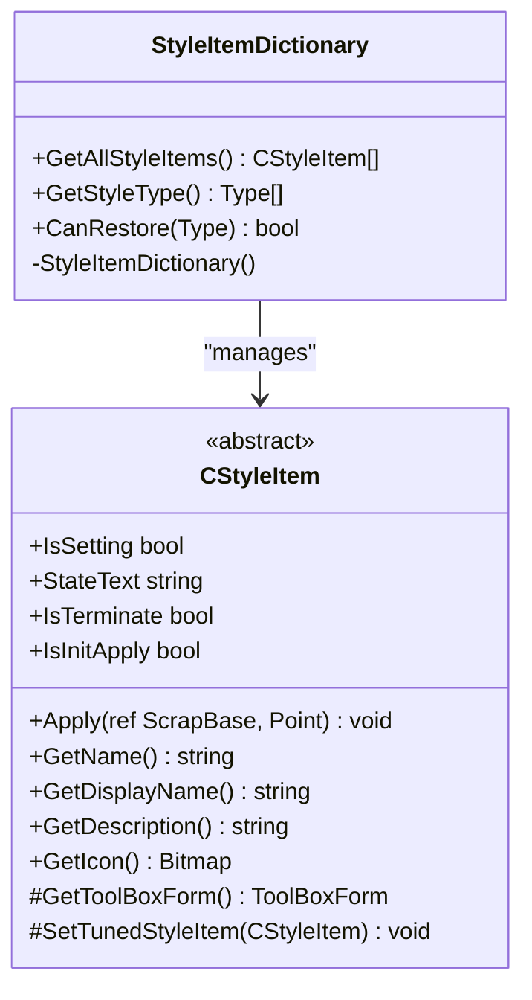
```mermaid
classDiagram
class StyleItemDictionary {
+GetAllStyleItems() CStyleItem[]
+GetStyleType() Type[]
+CanRestore(Type) bool
-StyleItemDictionary()
}
class CStyleItem {
<<abstract>>
+Apply(ref ScrapBase, Point) void
+GetName() string
+GetDisplayName() string
+GetDescription() string
+GetIcon() Bitmap
+IsSetting bool
+StateText string
+IsTerminate bool
+IsInitApply bool
#GetToolBoxForm() ToolBoxForm
#SetTunedStyleItem(CStyleItem) void
}
StyleItemDictionary --> CStyleItem : "manages"
```

**Diagram sources**
- [StyleItemDictionary.cs](file://SETUNA/Main/StyleItems/StyleItemDictionary.cs#L8-L84)
- [CStyleItem.cs](file://SETUNA/Main/StyleItems/CStyleItem.cs#L8-L101)

### Discovery Methods

The registry provides three primary methods for style item discovery and management:

| Method | Purpose | Return Type | Description |
|--------|---------|-------------|-------------|
| `GetAllStyleItems()` | Complete catalog | `CStyleItem[]` | Returns array of all available style item instances |
| `GetStyleType()` | Type information | `Type[]` | Returns array of style item class types |
| `CanRestore(Type)` | Validation | `bool` | Checks if a style item type supports restoration |

### Available Style Items

The registry currently manages 13 distinct style item types, each serving specific image manipulation purposes:

- **Transformation Items**: CScaleStyleItem, CRotateStyleItem, CMoveStyleItem, CMarginStyleItem
- **Appearance Items**: COpacityStyleItem, CCompactStyleItem
- **File Operations**: CImageBmpStyleItem, CImageJpegStyleItem, CImagePngStyleItem
- **Clipboard Operations**: CCopyStyleItem, CPasteStyleItem
- **Utility Items**: CTrimStyleItem, CTimerStyleItem, CCloseStyleItem

**Section sources**
- [StyleItemDictionary.cs](file://SETUNA/Main/StyleItems/StyleItemDictionary.cs#L15-L81)

## Core Style Item Architecture

The CStyleItem abstract base class defines the fundamental contract that all style items must implement, establishing a consistent interface for image processing operations, user interaction, and state management.

### Abstract Base Class Structure

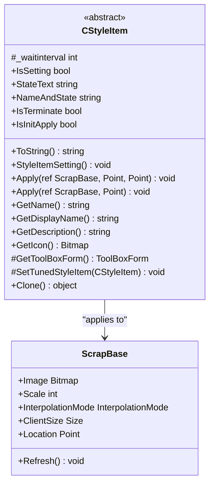
```mermaid
classDiagram
class CStyleItem {
<<abstract>>
<<ICloneable>>
<<IScrapStyle>>
#_waitinterval int
+ToString() string
+IsSetting bool
+StyleItemSetting() void
+Apply(ref ScrapBase, Point, Point) void
+Apply(ref ScrapBase, Point) void
+StateText string
+NameAndState string
+IsTerminate bool
+IsInitApply bool
+GetName() string
+GetDisplayName() string
+GetDescription() string
+GetIcon() Bitmap
#GetToolBoxForm() ToolBoxForm
#SetTunedStyleItem(CStyleItem) void
+Clone() object
}
class ScrapBase {
+Image Bitmap
+Scale int
+InterpolationMode InterpolationMode
+Refresh() void
+ClientSize Size
+Location Point
}
CStyleItem --> ScrapBase : "applies to"
```

**Diagram sources**
- [CStyleItem.cs](file://SETUNA/Main/StyleItems/CStyleItem.cs#L8-L101)

### Key Interface Contracts

The style item system implements two primary interfaces that define its behavior:

| Interface | Purpose | Key Methods |
|-----------|---------|-------------|
| `IScrapStyle` | Image processing | `Apply(ref ScrapBase, Point)` |
| `ICloneable` | State duplication | `Clone()` |

### Core Lifecycle Methods

Each style item must implement several critical lifecycle methods:

- **`Apply()`**: Primary image processing method with timing support
- **`GetName()`**: Internal identifier for serialization
- **`GetDisplayName()`**: Human-readable name for UI display
- **`GetDescription()`**: Detailed description for tooltips/help
- **`GetIcon()`**: Visual representation for UI elements

### State Management

Style items maintain state through protected fields and provide state text for UI feedback:

- **`StateText`**: Current configuration state for display
- **`IsSetting`**: Indicates presence of configurable parameters
- **`IsTerminate`**: Controls execution flow in style chains
- **`IsInitApply`**: Determines initial application behavior

**Section sources**
- [CStyleItem.cs](file://SETUNA/Main/StyleItems/CStyleItem.cs#L8-L101)

## Transformation Style Items

Transformation style items provide geometric and dimensional modifications to images, enabling scaling, rotation, positioning, and margin adjustments. These items form the foundation of image layout and composition operations.

### CScaleStyleItem - Image Scaling

The CScaleStyleItem provides comprehensive scaling capabilities with support for both absolute and relative scaling modes, along with advanced interpolation options for quality control.

#### Implementation Details

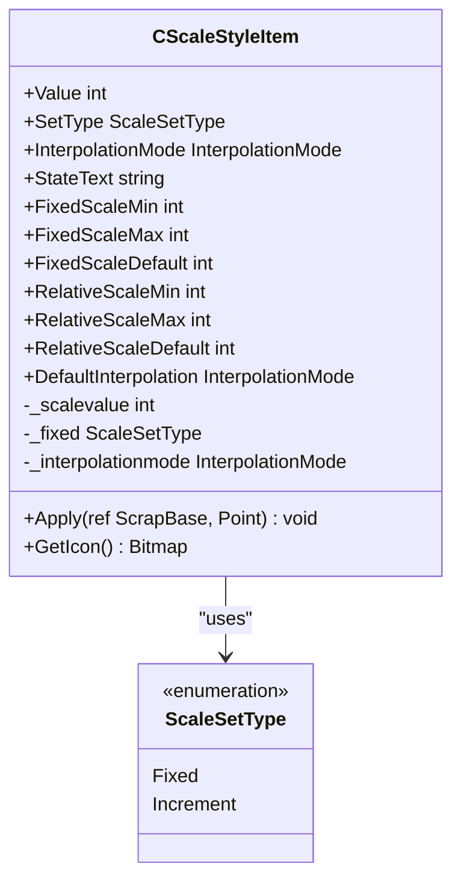
```mermaid
classDiagram
class CScaleStyleItem {
+Value int
+SetType ScaleSetType
+InterpolationMode InterpolationMode
+StateText string
+FixedScaleMin int
+FixedScaleMax int
+FixedScaleDefault int
+RelativeScaleMin int
+RelativeScaleMax int
+RelativeScaleDefault int
+DefaultInterpolation InterpolationMode
-_scalevalue int
-_fixed ScaleSetType
-_interpolationmode InterpolationMode
+Apply(ref ScrapBase, Point) void
+GetIcon() Bitmap
}
class ScaleSetType {
<<enumeration>>
Fixed
Increment
}
CScaleStyleItem --> ScaleSetType : "uses"
```

**Diagram sources**
- [CScaleStyleItem.cs](file://SETUNA/Main/StyleItems/CScaleStyleItem.cs#L10-L211)

#### Scaling Modes and Capabilities

| Mode | Behavior | Range | Use Case |
|------|----------|-------|----------|
| **Fixed** | Sets absolute scale percentage | 10-200% | Precise sizing control |
| **Increment** | Adds/subtracts from current scale | -190% to +190% | Relative adjustments |

#### Interpolation Quality Options

The scaling operation supports five interpolation modes for quality control:

- **Invalid**: No change to existing interpolation
- **NearestNeighbor**: Fastest, lowest quality
- **High**: Standard quality compromise
- **HighQualityBilinear**: Good quality for most cases
- **HighQualityBicubic**: Highest quality, slowest processing

#### State Representation

The style item provides detailed state information for UI display:

- **Fixed mode**: "150% 固定" (150% fixed)
- **Increment mode (positive)**: "+50% 扩大" (+50% enlarge)
- **Increment mode (negative)**: "20% 缩小" (20% reduce)
- **Original size**: "原始大小" (original size)

**Section sources**
- [CScaleStyleItem.cs](file://SETUNA/Main/StyleItems/CScaleStyleItem.cs#L10-L211)

### CRotateStyleItem - Image Rotation and Reflection

The CRotateStyleItem provides comprehensive rotational and reflective transformations with intelligent dimension adjustment for rotated images.

#### Implementation Architecture

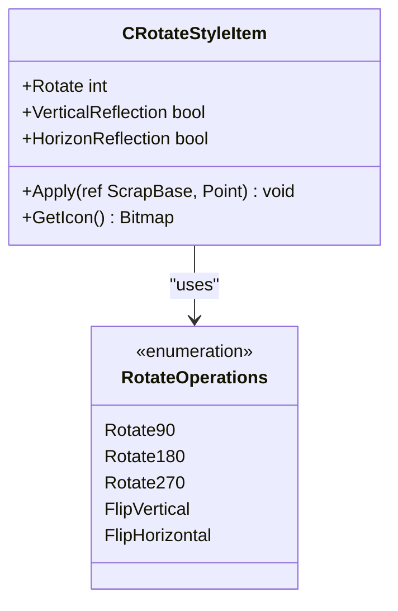
```mermaid
classDiagram
class CRotateStyleItem {
+Rotate int
+VerticalReflection bool
+HorizonReflection bool
+Apply(ref ScrapBase, Point) void
+GetIcon() Bitmap
}
class RotateOperations {
<<enumeration>>
Rotate90
Rotate180
Rotate270
FlipVertical
FlipHorizontal
}
CRotateStyleItem --> RotateOperations : "uses"
```

**Diagram sources**
- [CRotateStyleItem.cs](file://SETUNA/Main/StyleItems/CRotateStyleItem.cs#L8-L116)

#### Rotation Capabilities

The rotation system supports four primary rotation angles plus reflection combinations:

| Operation | Angle | Effect | Dimension Change |
|-----------|-------|--------|------------------|
| **None** | 0° | No rotation | None |
| **Right 90°** | 90° | Clockwise quarter turn | Width ↔ Height swap |
| **180°** | 180° | Half turn | Position inversion |
| **Left 90°** | 270° | Counter-clockwise quarter turn | Width ↔ Height swap |

#### Reflection Combinations

The system supports independent vertical and horizontal reflection:

- **Vertical Reflection**: Mirror image across vertical axis
- **Horizontal Reflection**: Mirror image across horizontal axis
- **Combined**: Both reflections applied simultaneously

#### Intelligent Layout Adjustment

When rotating by 90° or 270° degrees, the system automatically adjusts the window dimensions and position to maintain optimal display:

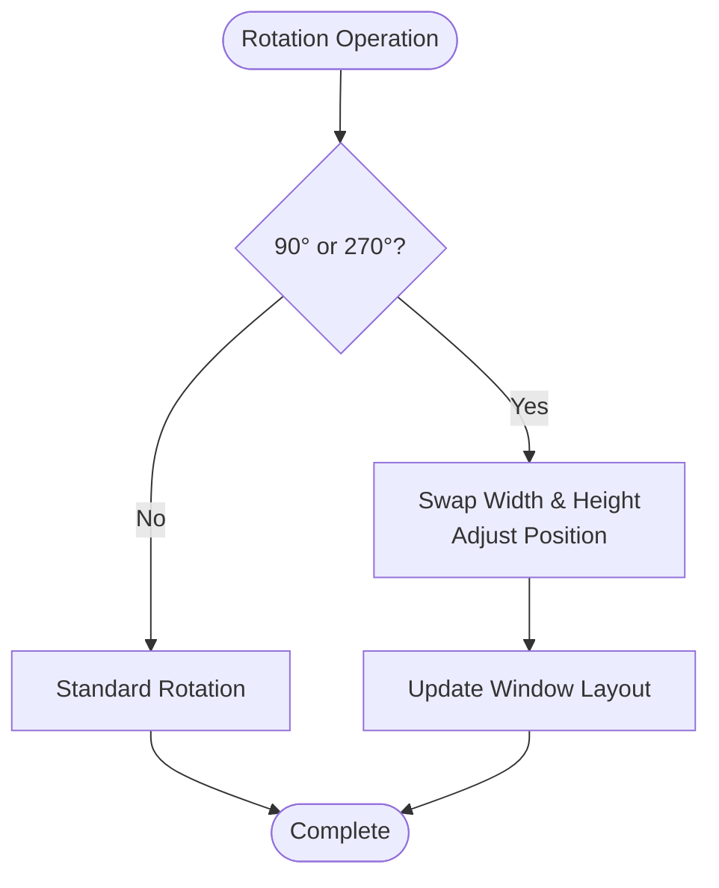
```mermaid
flowchart TD
Start([Rotation Operation]) --> CheckAngle{"90° or 270°?"}
CheckAngle --> |Yes| SwapDimensions["Swap Width & Height<br/>Adjust Position"]
CheckAngle --> |No| StandardRotation["Standard Rotation"]
SwapDimensions --> UpdateLayout["Update Window Layout"]
StandardRotation --> Complete([Complete])
UpdateLayout --> Complete
```

**Diagram sources**
- [CRotateStyleItem.cs](file://SETUNA/Main/StyleItems/CRotateStyleItem.cs#L18-L64)

**Section sources**
- [CRotateStyleItem.cs](file://SETUNA/Main/StyleItems/CRotateStyleItem.cs#L8-L116)

## Painting Style Items

Painting style items enable interactive drawing and text annotation capabilities directly on captured images. These items provide comprehensive creative tools for image enhancement and annotation.

### CPaintStyleItem - Interactive Drawing Canvas

The CPaintStyleItem serves as the entry point for the painting system, launching a dedicated drawing interface that provides comprehensive brush, shape, and text tools.

#### Painting System Architecture

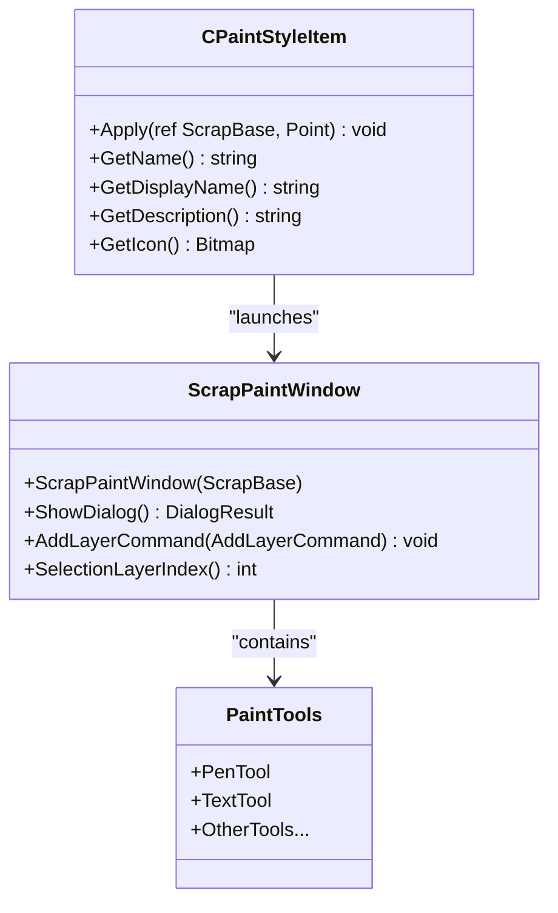
```mermaid
classDiagram
class CPaintStyleItem {
+Apply(ref ScrapBase, Point) void
+GetName() string
+GetDisplayName() string
+GetDescription() string
+GetIcon() Bitmap
}
class ScrapPaintWindow {
+ScrapPaintWindow(ScrapBase)
+ShowDialog() DialogResult
+AddLayerCommand(AddLayerCommand) void
+SelectionLayerIndex() int
}
class PaintTools {
+PenTool
+TextTool
+OtherTools...
}
CPaintStyleItem --> ScrapPaintWindow : "launches"
ScrapPaintWindow --> PaintTools : "contains"
```

**Diagram sources**
- [CPaintStyleItem.cs](file://SETUNA/Main/StyleItems/CPaintStyleItem.cs#L6-L54)
- [ScrapPaintWindow.cs](file://SETUNA/Main/StyleItems/ScrapPaintWindow.cs#L8-L200)

#### Drawing Environment Features

The painting system provides a rich interactive environment:

- **Multi-layer Support**: Separate layers for different drawing operations
- **Tool Selection**: Access to various drawing and text tools
- **History Management**: Undo/redo capabilities for drawing operations
- **Layer Management**: Add, remove, and organize drawing layers
- **Real-time Preview**: Live updates during drawing operations

#### Integration Workflow

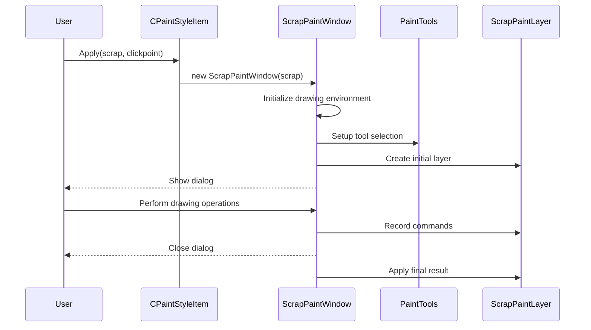
```mermaid
sequenceDiagram
participant User
participant CPaintStyleItem
participant ScrapPaintWindow
participant PaintTools
participant ScrapPaintLayer
User->>CPaintStyleItem : Apply(scrap, clickpoint)
CPaintStyleItem->>ScrapPaintWindow : new ScrapPaintWindow(scrap)
ScrapPaintWindow->>ScrapPaintWindow : Initialize drawing environment
ScrapPaintWindow->>PaintTools : Setup tool selection
ScrapPaintWindow->>ScrapPaintLayer : Create initial layer
ScrapPaintWindow-->>User : Show dialog
User->>ScrapPaintWindow : Perform drawing operations
ScrapPaintWindow->>ScrapPaintLayer : Record commands
ScrapPaintWindow-->>User : Close dialog
ScrapPaintWindow->>ScrapPaintLayer : Apply final result
```

**Diagram sources**
- [CPaintStyleItem.cs](file://SETUNA/Main/StyleItems/CPaintStyleItem.cs#L8-L16)
- [ScrapPaintWindow.cs](file://SETUNA/Main/StyleItems/ScrapPaintWindow.cs#L11-L28)

### TextTool - Advanced Text Annotation

The TextTool provides sophisticated text annotation capabilities with real-time editing, font customization, and positioning controls.

#### Text Tool Implementation

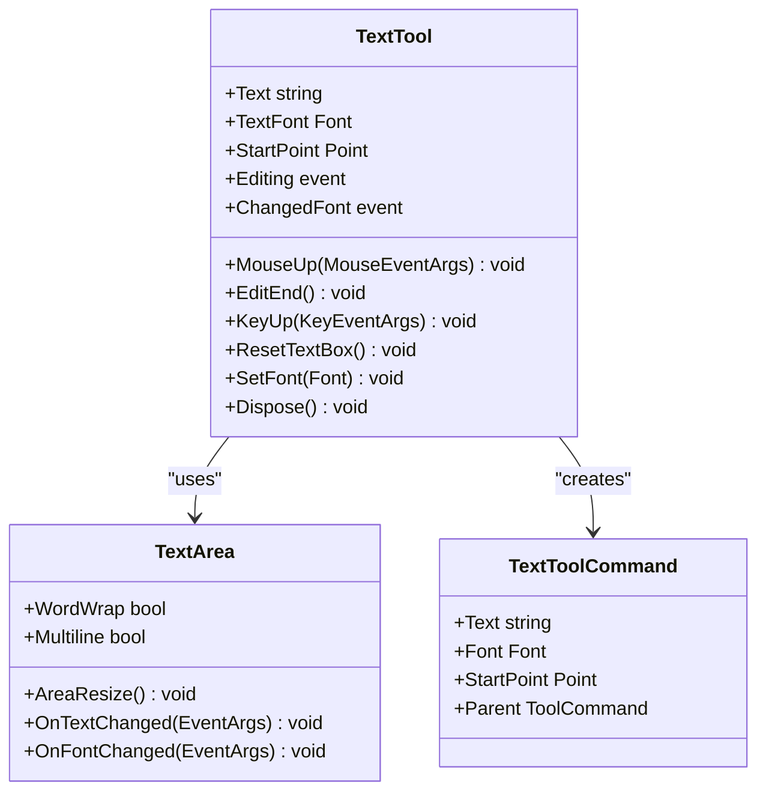
```mermaid
classDiagram
class TextTool {
+Text string
+TextFont Font
+StartPoint Point
+Editing event
+ChangedFont event
+MouseUp(MouseEventArgs) void
+EditEnd() void
+KeyUp(KeyEventArgs) void
+ResetTextBox() void
+SetFont(Font) void
+Dispose() void
}
class TextArea {
+WordWrap bool
+Multiline bool
+AreaResize() void
+OnTextChanged(EventArgs) void
+OnFontChanged(EventArgs) void
}
class TextToolCommand {
+Text string
+Font Font
+StartPoint Point
+Parent ToolCommand
}
TextTool --> TextArea : "uses"
TextTool --> TextToolCommand : "creates"
```

**Diagram sources**
- [TextTool.cs](file://SETUNA/Main/StyleItems/TextTool.cs#L8-L222)

#### Text Annotation Features

| Feature | Description | Implementation |
|---------|-------------|----------------|
| **Real-time Editing** | Inline text input and modification | TextBox-based editing interface |
| **Font Customization** | Complete font control including size and family | Event-driven font change notifications |
| **Position Control** | Precise text placement with automatic resizing | Dynamic text box sizing based on content |
| **Layer Integration** | Text placed on separate layers | Automatic layer creation and management |
| **Interactive Selection** | Click-to-edit text regions | Mouse event handling for text activation |

#### Text Editing Workflow

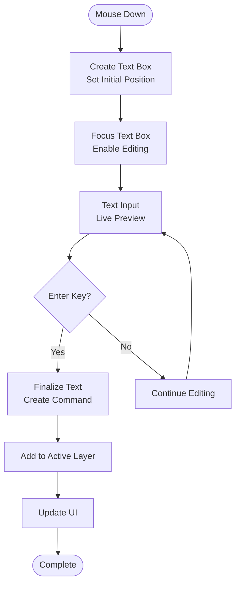
```mermaid
flowchart TD
Start([Mouse Down]) --> CreateTextBox["Create Text Box<br/>Set Initial Position"]
CreateTextBox --> FocusTextBox["Focus Text Box<br/>Enable Editing"]
FocusTextBox --> EditText["Text Input<br/>Live Preview"]
EditText --> CheckEnter{"Enter Key?"}
CheckEnter --> |Yes| FinalizeText["Finalize Text<br/>Create Command"]
CheckEnter --> |No| ContinueEdit["Continue Editing"]
ContinueEdit --> EditText
FinalizeText --> AddToLayer["Add to Active Layer"]
AddToLayer --> UpdateUI["Update UI"]
UpdateUI --> End([Complete])
```

**Diagram sources**
- [TextTool.cs](file://SETUNA/Main/StyleItems/TextTool.cs#L51-L72)

**Section sources**
- [CPaintStyleItem.cs](file://SETUNA/Main/StyleItems/CPaintStyleItem.cs#L6-L54)
- [TextTool.cs](file://SETUNA/Main/StyleItems/TextTool.cs#L8-L222)

## Special Effects Style Items

Special effects style items provide advanced image processing capabilities including color manipulation, temporal effects, and artistic transformations that enhance visual presentation.

### CToneReverseStyleItem - Color Inversion

The CToneReverseStyleItem implements a sophisticated color inversion effect using ColorMatrix transformations to invert all color channels while preserving image structure.

#### Color Inversion Implementation

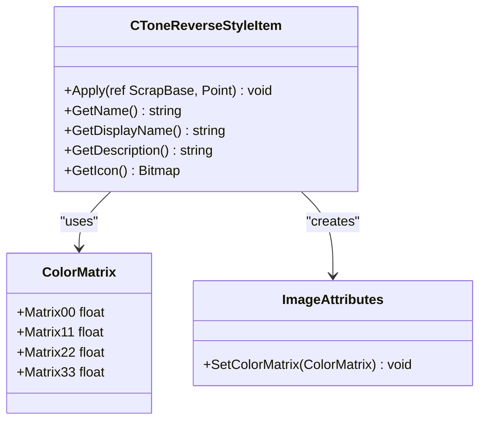
```mermaid
classDiagram
class CToneReverseStyleItem {
+Apply(ref ScrapBase, Point) void
+GetName() string
+GetDisplayName() string
+GetDescription() string
+GetIcon() Bitmap
}
class ColorMatrix {
+Matrix00 float
+Matrix11 float
+Matrix22 float
+Matrix33 float
}
class ImageAttributes {
+SetColorMatrix(ColorMatrix) void
}
CToneReverseStyleItem --> ColorMatrix : "uses"
CToneReverseStyleItem --> ImageAttributes : "creates"
```

**Diagram sources**
- [CToneReverseStyleItem.cs](file://SETUNA/Main/StyleItems/CToneReverseStyleItem.cs#L7-L63)

#### Inversion Algorithm

The color inversion process utilizes a ColorMatrix with inverted coefficients:

```csharp
var colorMatrix = new ColorMatrix
{
    Matrix00 = -1f,  // Red channel inversion
    Matrix11 = -1f,  // Green channel inversion  
    Matrix22 = -1f   // Blue channel inversion
};
```

This matrix transformation inverts all color channels simultaneously, creating a photographic negative effect while maintaining proper gamma correction and color balance.

#### Processing Workflow

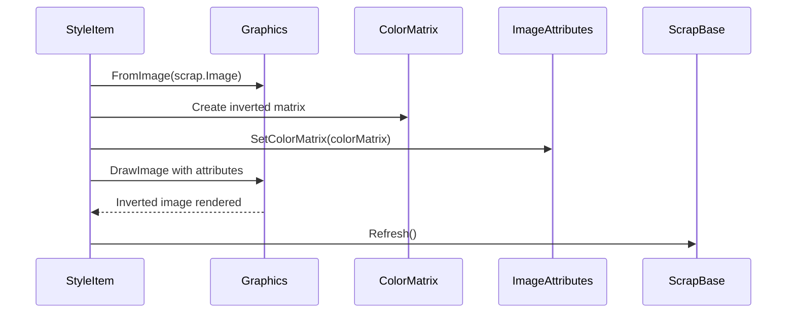
```mermaid
sequenceDiagram
participant StyleItem
participant Graphics
participant ColorMatrix
participant ImageAttributes
StyleItem->>Graphics : FromImage(scrap.Image)
StyleItem->>ColorMatrix : Create inverted matrix
StyleItem->>ImageAttributes : SetColorMatrix(colorMatrix)
StyleItem->>Graphics : DrawImage with attributes
Graphics-->>StyleItem : Inverted image rendered
StyleItem->>ScrapBase : Refresh()
```

**Diagram sources**
- [CToneReverseStyleItem.cs](file://SETUNA/Main/StyleItems/CToneReverseStyleItem.cs#L10-L24)

**Section sources**
- [CToneReverseStyleItem.cs](file://SETUNA/Main/StyleItems/CToneReverseStyleItem.cs#L7-L63)

### CTimerStyleItem - Temporal Control

The CTimerStyleItem provides precise temporal control for image processing sequences, enabling delays and timed operations within style item chains.

#### Timer System Architecture

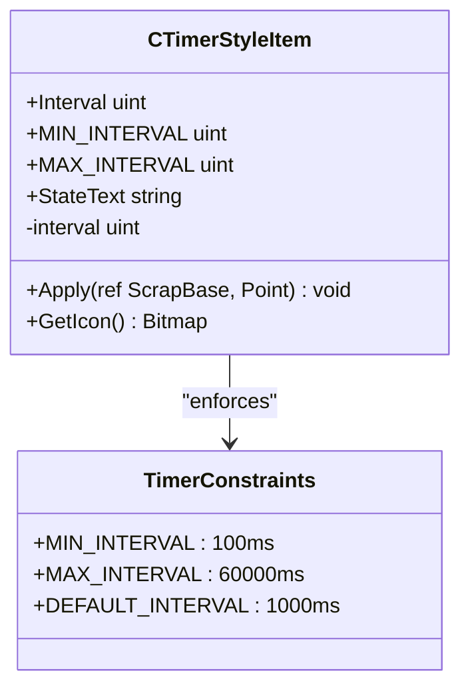
```mermaid
classDiagram
class CTimerStyleItem {
+Interval uint
+MIN_INTERVAL uint
+MAX_INTERVAL uint
+StateText string
+Apply(ref ScrapBase, Point) void
+GetIcon() Bitmap
-interval uint
}
class TimerConstraints {
+MIN_INTERVAL : 100ms
+MAX_INTERVAL : 60000ms
+DEFAULT_INTERVAL : 1000ms
}
CTimerStyleItem --> TimerConstraints : "enforces"
```

**Diagram sources**
- [CTimerStyleItem.cs](file://SETUNA/Main/StyleItems/CTimerStyleItem.cs#L6-L104)

#### Timing Configuration

| Parameter | Value | Description |
|-----------|-------|-------------|
| **Minimum Interval** | 100ms | Fastest allowable delay |
| **Maximum Interval** | 60,000ms (60s) | Longest allowable delay |
| **Default Interval** | 1,000ms (1s) | Standard delay duration |

#### State Representation

The timer style item provides clear state information for UI display:

- **Active Timer**: "1500ms" (1.5 seconds)
- **Zero Delay**: "" (empty string for no delay)

#### Application Impact

The timer affects the style processing pipeline by setting the `_waitinterval` field, which controls the pause duration between style item executions in a chain.

**Section sources**
- [CTimerStyleItem.cs](file://SETUNA/Main/StyleItems/CTimerStyleItem.cs#L6-L104)

## User Interface Panels

The style item system provides specialized user interface panels for each style item type, offering intuitive parameter configuration and real-time preview capabilities.

### Panel Architecture Overview

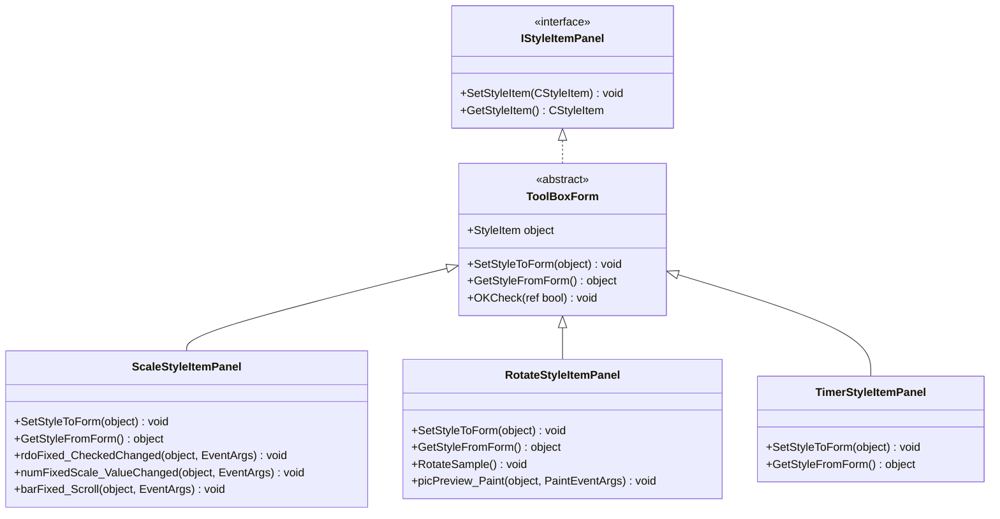
```mermaid
classDiagram
class ToolBoxForm {
<<abstract>>
+SetStyleToForm(object) void
+GetStyleFromForm() object
+OKCheck(ref bool) void
+StyleItem object
}
class IStyleItemPanel {
<<interface>>
+SetStyleItem(CStyleItem) void
+GetStyleItem() CStyleItem
}
class ScaleStyleItemPanel {
+SetStyleToForm(object) void
+GetStyleFromForm() object
+rdoFixed_CheckedChanged(object, EventArgs) void
+numFixedScale_ValueChanged(object, EventArgs) void
+barFixed_Scroll(object, EventArgs) void
}
class RotateStyleItemPanel {
+SetStyleToForm(object) void
+GetStyleFromForm() object
+RotateSample() void
+picPreview_Paint(object, PaintEventArgs) void
}
class TimerStyleItemPanel {
+SetStyleToForm(object) void
+GetStyleFromForm() object
}
ToolBoxForm <|-- ScaleStyleItemPanel
ToolBoxForm <|-- RotateStyleItemPanel
ToolBoxForm <|-- TimerStyleItemPanel
IStyleItemPanel <|.. ToolBoxForm
```

**Diagram sources**
- [ScaleStyleItemPanel.cs](file://SETUNA/Main/StyleItems/ScaleStyleItemPanel.cs#L7-L153)
- [RotateStyleItemPanel.cs](file://SETUNA/Main/StyleItems/RotateStyleItemPanel.cs#L9-L156)
- [TimerStyleItemPanel.cs](file://SETUNA/Main/StyleItems/TimerStyleItemPanel.cs#L4-L31)
- [IStyleItemPanel.cs](file://SETUNA/Main/StyleItems/IStyleItemPanel.cs#L4-L12)

### ScaleStyleItemPanel - Interactive Scaling Configuration

The ScaleStyleItemPanel provides comprehensive scaling parameter configuration with real-time preview and dual input mechanisms.

#### Panel Features

| Control Type | Purpose | Range | Real-time Feedback |
|--------------|---------|-------|-------------------|
| **Radio Buttons** | Toggle between fixed and incremental modes | N/A | Immediate mode switching |
| **Numeric Up/Down** | Precise value input | 10-200% (fixed), -190% to +190% (incremental) | Live preview updates |
| **Track Bar** | Visual slider control | Same as numeric controls | Continuous feedback |
| **Interpolation Dropdown** | Quality control | 5 interpolation modes | Preview updates |

#### Interactive Configuration Workflow

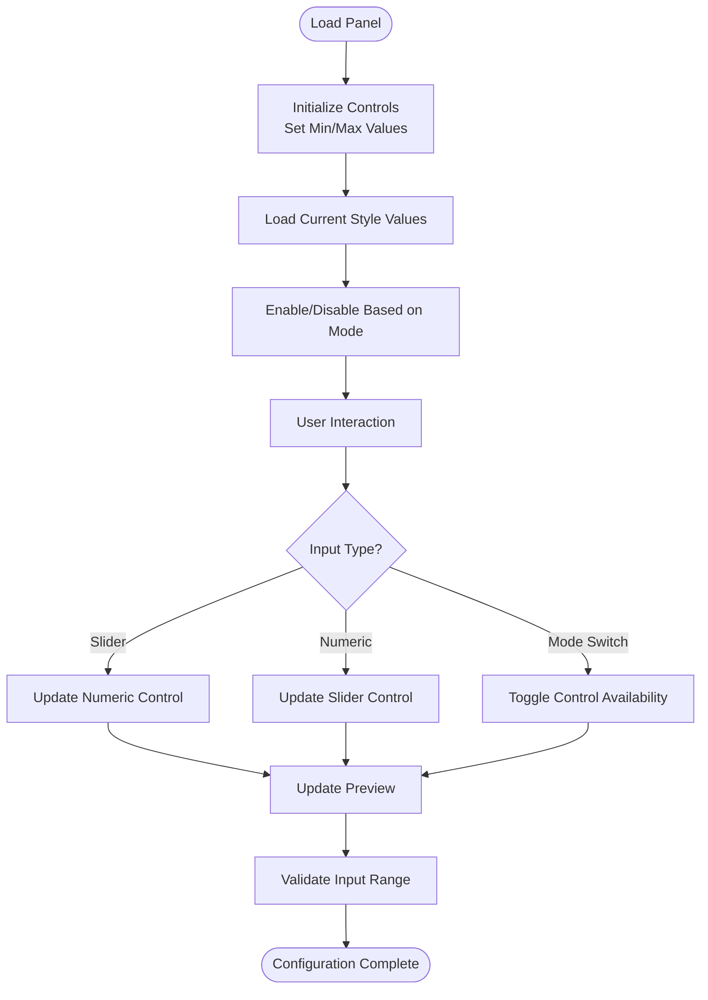
```mermaid
flowchart TD
LoadPanel([Load Panel]) --> InitControls["Initialize Controls<br/>Set Min/Max Values"]
InitControls --> LoadValues["Load Current Style Values"]
LoadValues --> EnableControls["Enable/Disable Based on Mode"]
EnableControls --> UserInput["User Interaction"]
UserInput --> CheckType{"Input Type?"}
CheckType --> |Slider| UpdateNumeric["Update Numeric Control"]
CheckType --> |Numeric| UpdateSlider["Update Slider Control"]
CheckType --> |Mode Switch| ToggleControls["Toggle Control Availability"]
UpdateNumeric --> Preview["Update Preview"]
UpdateSlider --> Preview
ToggleControls --> Preview
Preview --> ValidateInput["Validate Input Range"]
ValidateInput --> Complete([Configuration Complete])
```

**Diagram sources**
- [ScaleStyleItemPanel.cs](file://SETUNA/Main/StyleItems/ScaleStyleItemPanel.cs#L14-L75)

### RotateStyleItemPanel - Visual Rotation Preview

The RotateStyleItemPanel provides an innovative visual preview system that demonstrates rotation effects in real-time using screen capture and sample image manipulation.

#### Preview System Architecture

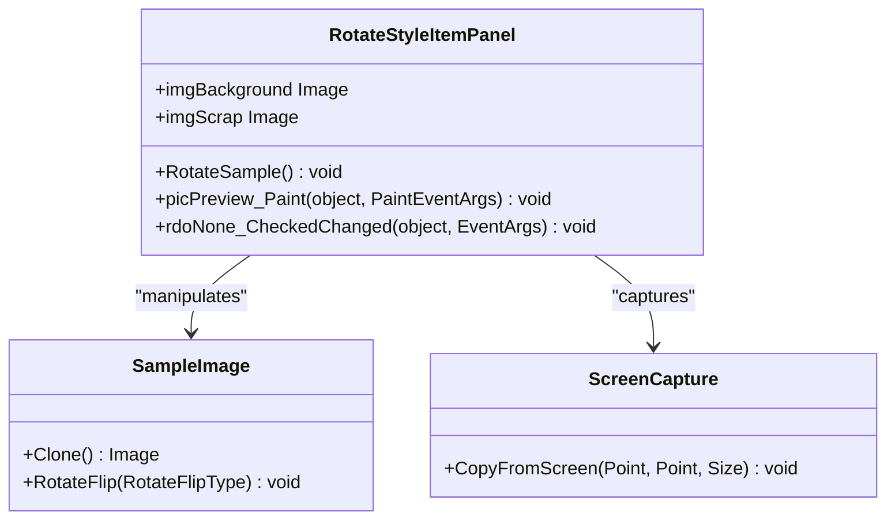
```mermaid
classDiagram
class RotateStyleItemPanel {
+imgBackground Image
+imgScrap Image
+RotateSample() void
+picPreview_Paint(object, PaintEventArgs) void
+rdoNone_CheckedChanged(object, EventArgs) void
}
class SampleImage {
+Clone() Image
+RotateFlip(RotateFlipType) void
}
class ScreenCapture {
+CopyFromScreen(Point, Point, Size) void
}
RotateStyleItemPanel --> SampleImage : "manipulates"
RotateStyleItemPanel --> ScreenCapture : "captures"
```

**Diagram sources**
- [RotateStyleItemPanel.cs](file://SETUNA/Main/StyleItems/RotateStyleItemPanel.cs#L9-L156)

#### Preview Generation Process

The preview system operates through a sophisticated image manipulation pipeline:

1. **Screen Capture**: Background image captured from screen coordinates
2. **Sample Processing**: Reference image loaded and manipulated
3. **Overlay Composition**: Background and processed sample composited
4. **Real-time Updates**: Continuous preview refresh during configuration

#### Rotation Preview Workflow

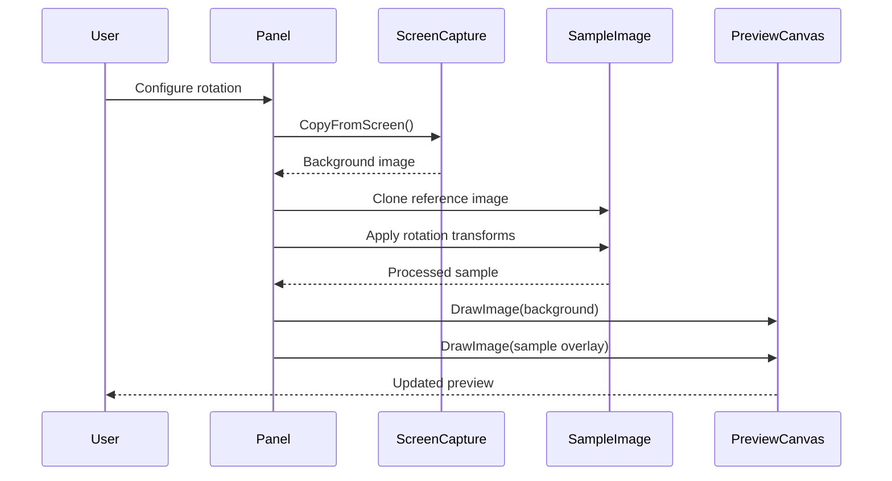
```mermaid
sequenceDiagram
participant User
participant Panel
participant ScreenCapture
participant SampleImage
participant PreviewCanvas
User->>Panel : Configure rotation
Panel->>ScreenCapture : CopyFromScreen()
ScreenCapture-->>Panel : Background image
Panel->>SampleImage : Clone reference image
Panel->>SampleImage : Apply rotation transforms
SampleImage-->>Panel : Processed sample
Panel->>PreviewCanvas : DrawImage(background)
Panel->>PreviewCanvas : DrawImage(sample overlay)
PreviewCanvas-->>User : Updated preview
```

**Diagram sources**
- [RotateStyleItemPanel.cs](file://SETUNA/Main/StyleItems/RotateStyleItemPanel.cs#L22-L58)

### TimerStyleItemPanel - Precise Timing Control

The TimerStyleItemPanel provides straightforward timing configuration with validation and clear visual feedback.

#### Timer Configuration Features

| Element | Function | Constraints | Validation |
|---------|----------|-------------|------------|
| **Numeric Control** | Direct millisecond input | 100-60000ms | Automatic clamping |
| **Range Limits** | Minimum/maximum boundaries | Hard-coded limits | Built-in validation |
| **Default Value** | Standard 1-second delay | 1000ms | Pre-set on load |

**Section sources**
- [ScaleStyleItemPanel.cs](file://SETUNA/Main/StyleItems/ScaleStyleItemPanel.cs#L7-L153)
- [RotateStyleItemPanel.cs](file://SETUNA/Main/StyleItems/RotateStyleItemPanel.cs#L9-L156)
- [TimerStyleItemPanel.cs](file://SETUNA/Main/StyleItems/TimerStyleItemPanel.cs#L4-L31)

## Interaction Patterns and Workflows

The style item system implements consistent interaction patterns that provide predictable user experiences across all style item types while accommodating specialized requirements.

### Standard Interaction Pattern

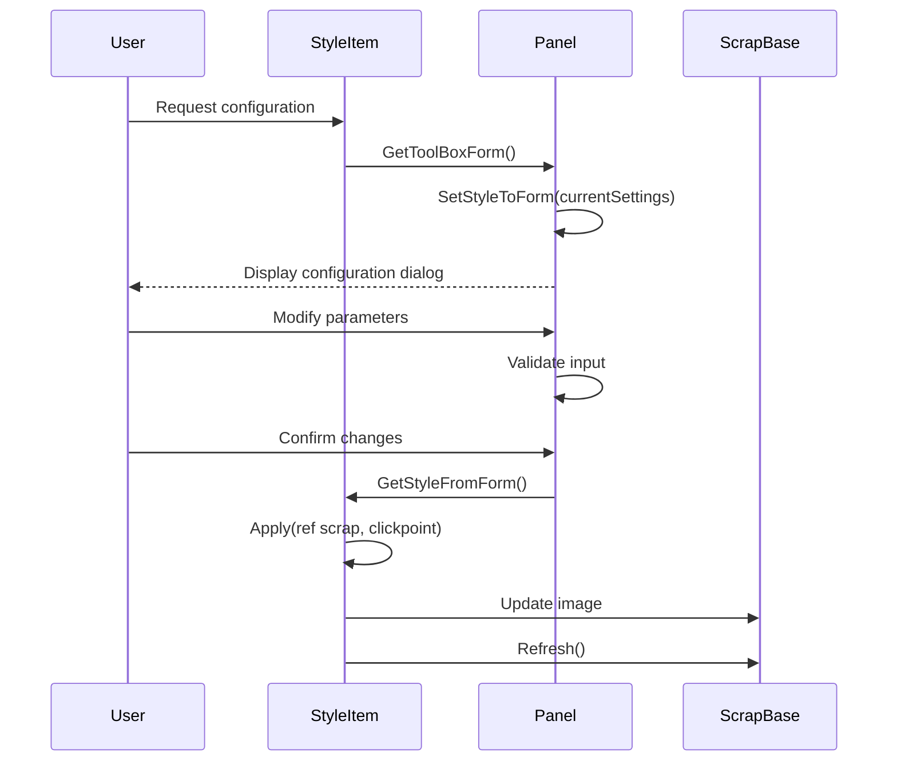
```mermaid
sequenceDiagram
participant User
participant StyleItem
participant Panel
participant ScrapBase
User->>StyleItem : Request configuration
StyleItem->>Panel : GetToolBoxForm()
Panel->>Panel : SetStyleToForm(currentSettings)
Panel-->>User : Display configuration dialog
User->>Panel : Modify parameters
Panel->>Panel : Validate input
User->>Panel : Confirm changes
Panel->>StyleItem : GetStyleFromForm()
StyleItem->>StyleItem : Apply(ref scrap, clickpoint)
StyleItem->>ScrapBase : Update image
StyleItem->>ScrapBase : Refresh()
```

### Configuration Workflow Variations

Different style item types implement specialized configuration workflows based on their complexity and user requirements:

#### Simple Style Items (No Configuration)
- **Pattern**: Direct application without dialog
- **Examples**: CToneReverseStyleItem, CTimerStyleItem
- **Workflow**: Apply → Complete

#### Basic Configuration Style Items
- **Pattern**: Minimal dialog with single parameter
- **Examples**: COpacityStyleItem, CCompactStyleItem
- **Workflow**: Load → Configure → Apply

#### Complex Configuration Style Items
- **Pattern**: Comprehensive dialog with multiple parameters
- **Examples**: CScaleStyleItem, CRotateStyleItem
- **Workflow**: Load → Configure → Preview → Apply

#### Interactive Style Items
- **Pattern**: Launch external editor with live preview
- **Examples**: CPaintStyleItem, TextTool
- **Workflow**: Launch → Edit → Apply → Complete

### State Management Patterns

The system implements consistent state management patterns across all style items:

#### Parameter Persistence
- **Serialization**: Parameters stored as object state
- **Validation**: Automatic range checking and clamping
- **Restoration**: Complete state reconstruction from saved data

#### UI State Synchronization
- **Real-time Updates**: Immediate UI feedback for parameter changes
- **Preview Integration**: Visual confirmation of parameter effects
- **Error Handling**: Graceful degradation for invalid inputs

**Section sources**
- [CStyleItem.cs](file://SETUNA/Main/StyleItems/CStyleItem.cs#L26-L33)
- [StyleItemDictionary.cs](file://SETUNA/Main/StyleItems/StyleItemDictionary.cs#L15-L46)

## Performance Considerations

The style item system is designed with performance optimization in mind, implementing efficient algorithms and resource management strategies for smooth image processing operations.

### Memory Management Strategies

#### Image Processing Efficiency
- **In-place Operations**: Where possible, modify images directly rather than creating copies
- **Resource Disposal**: Automatic cleanup of temporary graphics objects and bitmaps
- **Memory Pooling**: Reuse of frequently allocated objects in painting operations

#### Preview System Optimization
- **Lazy Loading**: Background images loaded only when needed
- **Selective Updates**: Partial redraws for preview updates
- **Resource Cleanup**: Proper disposal of preview resources on dialog close

### Processing Performance Factors

| Factor | Impact | Optimization Strategy |
|--------|--------|----------------------|
| **Image Size** | Linear processing time | Progressive scaling for large images |
| **Effect Complexity** | Exponential processing cost | Simplified algorithms for basic effects |
| **Interpolation Quality** | Processing speed vs. quality trade-off | Adaptive quality selection |
| **Layer Count** | Memory usage and processing overhead | Efficient layer management |

### Scalability Considerations

#### Large Image Handling
- **Progressive Processing**: Break down large operations into smaller chunks
- **Memory Monitoring**: Track memory usage during intensive operations
- **Fallback Strategies**: Reduce quality for memory-constrained situations

#### Concurrent Operations
- **Thread Safety**: Ensure thread-safe operations in multi-threaded environments
- **Resource Locking**: Prevent conflicts during simultaneous processing
- **Queue Management**: Handle multiple concurrent style applications

### Performance Monitoring

The system includes built-in performance monitoring capabilities:

- **Timing Metrics**: Track processing duration for each style item
- **Memory Tracking**: Monitor memory allocation during operations
- **Resource Utilization**: Measure CPU and GPU usage during processing

## Usage Scenarios and Best Practices

The style item system supports a wide variety of usage scenarios, from simple image adjustments to complex multi-step processing workflows.

### Common Usage Patterns

#### Quick Image Adjustments
- **Scenario**: Need immediate scaling or rotation of captured images
- **Recommended Items**: CScaleStyleItem, CRotateStyleItem
- **Best Practices**: Use fixed scaling for precise sizing, leverage interpolation settings for quality

#### Creative Image Enhancement
- **Scenario**: Adding artistic effects or annotations to screenshots
- **Recommended Items**: CPaintStyleItem, TextTool, CToneReverseStyleItem
- **Best Practices**: Plan layer organization, use appropriate brush sizes for text

#### Batch Processing Workflows
- **Scenario**: Applying consistent effects across multiple images
- **Recommended Items**: CTimerStyleItem, combination of transformation items
- **Best Practices**: Save style configurations, use automation-friendly parameters

### Configuration Guidelines

#### Parameter Selection Guidelines

| Use Case | Recommended Settings | Rationale |
|----------|---------------------|-----------|
| **Web Documentation** | High-quality interpolation, moderate scaling | Balance quality and file size |
| **Print Materials** | Maximum quality settings, precise scaling | Optimal print resolution |
| **Presentation Screenshots** | Medium quality, proportional scaling | Balanced performance and appearance |
| **Social Media** | Optimized compression, aspect ratio preservation | Platform-specific requirements |

#### Workflow Optimization

1. **Planning Phase**: Determine required effects and their order
2. **Parameter Testing**: Experiment with different settings in isolation
3. **Batch Configuration**: Save frequently used parameter sets
4. **Quality Verification**: Test final output at intended display size

### Integration Patterns

#### Style Chain Composition
- **Sequential Processing**: Apply effects in logical order (scale → rotate → paint)
- **Conditional Execution**: Use IsTerminate property for flow control
- **State Preservation**: Leverage CanRestore functionality for session continuity

#### Automation Integration
- **Programmatic Control**: Use StyleItemDictionary for dynamic style discovery
- **Configuration Export**: Serialize style item parameters for reuse
- **Batch Processing**: Implement loop-based processing for multiple images

### Troubleshooting Common Issues

#### Performance Problems
- **Symptom**: Slow processing with large images
- **Solution**: Reduce image resolution, use lower interpolation quality
- **Prevention**: Test with representative image sizes

#### Quality Issues
- **Symptom**: Poor output quality after processing
- **Solution**: Increase interpolation quality, check color space settings
- **Prevention**: Verify source image characteristics

#### Memory Issues
- **Symptom**: Out-of-memory errors during processing
- **Solution**: Process images in smaller batches, close unused applications
- **Prevention**: Monitor system resources during processing

The style item system provides a robust foundation for comprehensive image manipulation capabilities, supporting both interactive and automated workflows while maintaining performance and usability standards.