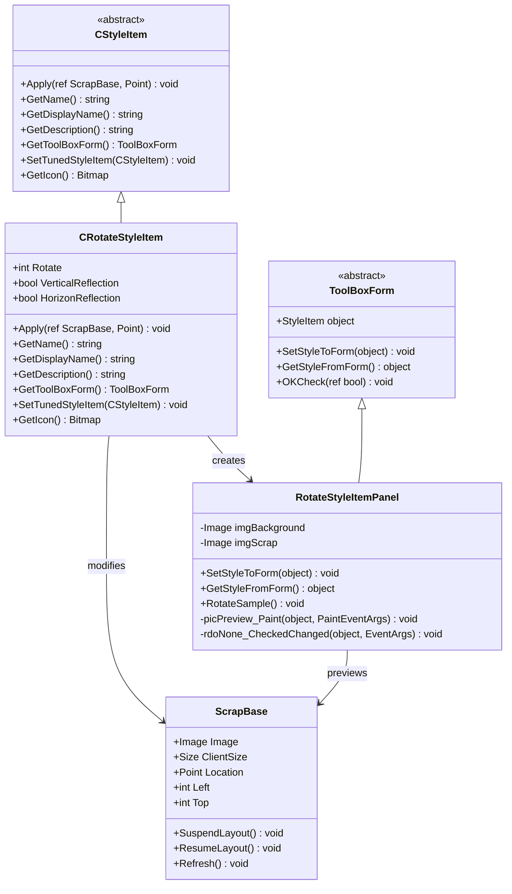
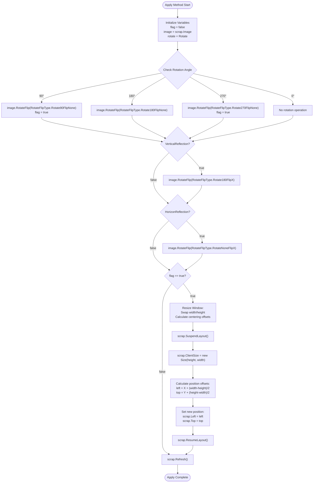
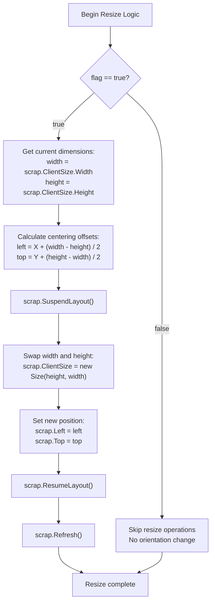
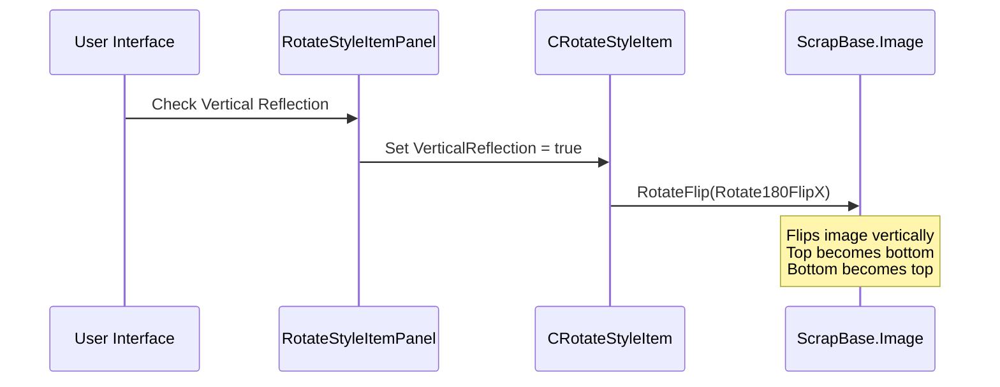
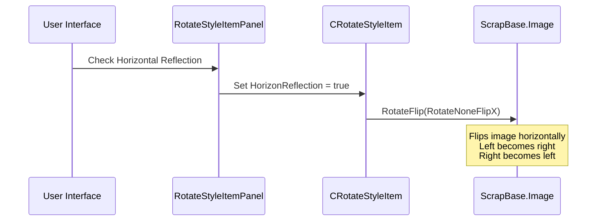
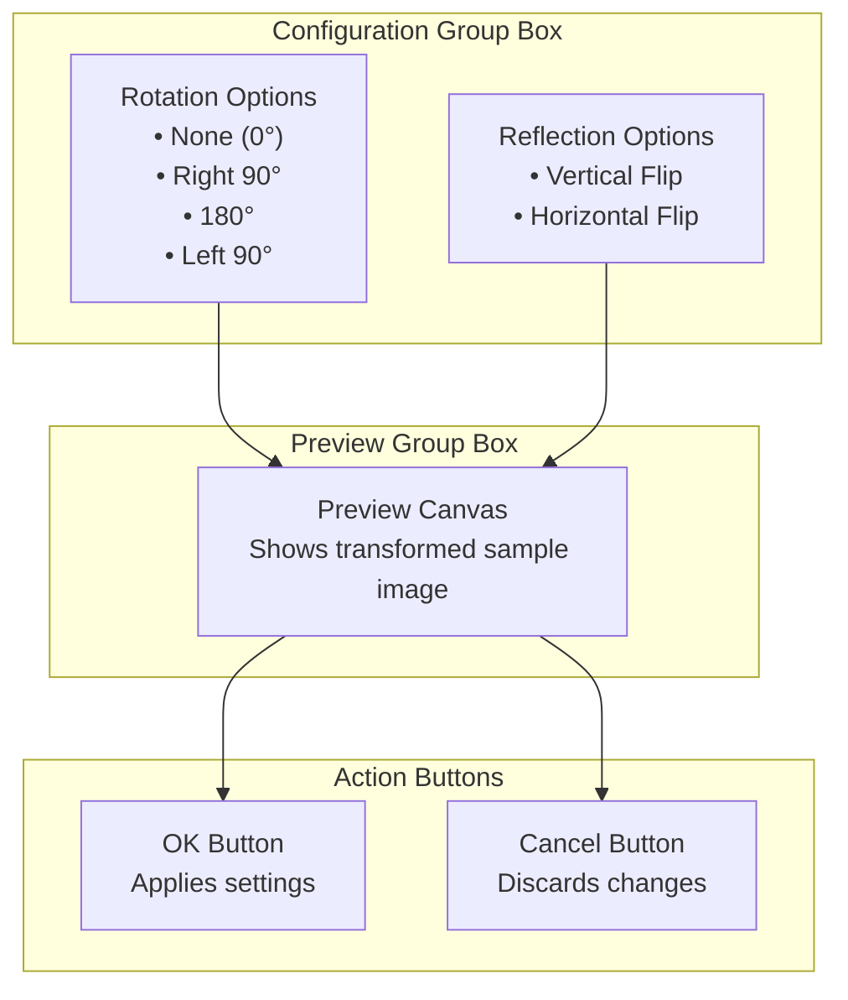

# Rotation and Reflection

<cite>
**Referenced Files in This Document**
- [CRotateStyleItem.cs](file://SETUNA/Main/StyleItems/CRotateStyleItem.cs)
- [RotateStyleItemPanel.cs](file://SETUNA/Main/StyleItems/RotateStyleItemPanel.cs)
- [RotateStyleItemPanel.Designer.cs](file://SETUNA/Main/StyleItems/RotateStyleItemPanel.Designer.cs)
- [CStyleItem.cs](file://SETUNA/Main/StyleItems/CStyleItem.cs)
- [ScrapBase.cs](file://SETUNA/Main/ScrapBase.cs)
- [BaseForm.cs](file://SETUNA/Main/Common/BaseForm.cs)
- [ToolBoxForm.cs](file://SETUNA/Main/StyleItems/ToolBoxForm.cs)
- [SetunaOption.cs](file://SETUNA/Main/Option/SetunaOption.cs)
</cite>

## Table of Contents
1. [Introduction](#introduction)
2. [Architecture Overview](#architecture-overview)
3. [Core Implementation](#core-implementation)
4. [GDI+ RotateFlip Method](#gdip-rotateflip-method)
5. [Automatic Window Resizing Logic](#automatic-window-resizing-logic)
6. [Reflection Operations](#reflection-operations)
7. [User Interface Integration](#user-interface-integration)
8. [Usage Examples](#usage-examples)
9. [Common Issues and Troubleshooting](#common-issues-and-troubleshooting)
10. [Best Practices](#best-practices)

## Introduction

The CRotateStyleItem component provides comprehensive image rotation and reflection capabilities using GDI+'s RotateFlip method with RotateFlipType enums. This implementation enables users to perform precise 90°, 180°, and 270° rotations while maintaining proper window sizing and positioning. The system supports independent vertical and horizontal reflection operations, allowing for creative image manipulations and layout corrections.

The component integrates seamlessly with the SETUNA screenshot application's style system, providing both programmatic rotation capabilities and a user-friendly configuration interface through the RotateStyleItemPanel. It automatically handles window resizing when rotation changes orientation, ensuring optimal display regardless of the rotation angle.

## Architecture Overview

The rotation and reflection system follows a layered architecture with clear separation of concerns:



**Diagram sources**
- [CStyleItem.cs](file://SETUNA/Main/StyleItems/CStyleItem.cs#L8-L101)
- [CRotateStyleItem.cs](file://SETUNA/Main/StyleItems/CRotateStyleItem.cs#L8-L115)
- [RotateStyleItemPanel.cs](file://SETUNA/Main/StyleItems/RotateStyleItemPanel.cs#L9-L156)
- [ScrapBase.cs](file://SETUNA/Main/ScrapBase.cs#L16-L200)

## Core Implementation

The CRotateStyleItem class serves as the central component for rotation and reflection operations. It maintains three primary properties that define the transformation behavior:

### Property Definitions

| Property | Type | Description | Default Value |
|----------|------|-------------|---------------|
| Rotate | int | Rotation angle in degrees (0, 90, 180, 270) | 0 |
| VerticalReflection | bool | Enable vertical reflection (up-down flip) | false |
| HorizonReflection | bool | Enable horizontal reflection (left-right flip) | false |

### Apply Method Implementation

The Apply method orchestrates the rotation and reflection operations in a specific sequence to ensure predictable results:



**Diagram sources**
- [CRotateStyleItem.cs](file://SETUNA/Main/StyleItems/CRotateStyleItem.cs#L19-L65)

**Section sources**
- [CRotateStyleItem.cs](file://SETUNA/Main/StyleItems/CRotateStyleItem.cs#L8-L115)

## GDI+ RotateFlip Method

The implementation leverages GDI+'s RotateFlip method with carefully selected RotateFlipType enums to achieve precise transformations. The method signature demonstrates the power of this approach:

### Supported Rotation Types

The system supports four primary rotation angles through specific RotateFlipType combinations:

| Rotation Angle | RotateFlipType | Description |
|----------------|----------------|-------------|
| 0° (no rotation) | N/A | No rotation applied |
| 90° clockwise | Rotate90FlipNone | 90-degree clockwise rotation |
| 180° | Rotate180FlipNone | 180-degree rotation |
| 270° clockwise | Rotate270FlipNone | 270-degree clockwise rotation |

### Reflection Combinations

The reflection operations utilize specific combinations of rotation and flipping:

| Operation | RotateFlipType | Effect |
|-----------|----------------|--------|
| Vertical Reflection | Rotate180FlipX | Flips image vertically (up-down) |
| Horizontal Reflection | RotateNoneFlipX | Flips image horizontally (left-right) |

### Method Call Sequence

The implementation follows a specific sequence to ensure predictable results:

1. **Primary Rotation**: Apply the main rotation using the appropriate RotateFlipType
2. **Vertical Reflection**: If enabled, apply vertical flip after rotation
3. **Horizontal Reflection**: If enabled, apply horizontal flip last

This sequence ensures that reflections occur in the rotated coordinate system, producing the expected visual results.

**Section sources**
- [CRotateStyleItem.cs](file://SETUNA/Main/StyleItems/CRotateStyleItem.cs#L21-L51)

## Automatic Window Resizing Logic

One of the most sophisticated aspects of the CRotateStyleItem implementation is its automatic window resizing logic that maintains proper display proportions during rotation changes.

### Orientation Change Detection

The system identifies when a rotation change affects the image orientation:



**Diagram sources**
- [CRotateStyleItem.cs](file://SETUNA/Main/StyleItems/CRotateStyleItem.cs#L52-L63)

### Centering Calculation Formula

The centering calculation ensures that the rotated image remains properly positioned within the window:

- **Width-to-Height Swap**: When rotating 90° or 270°, the image dimensions swap
- **Offset Calculation**: The centering offsets are calculated using the formula `(width - height) / 2`
- **Preservation of Aspect**: The original aspect ratio is maintained through careful dimension swapping

### Implementation Details

The resizing logic operates within a suspended layout state to prevent flickering and ensure smooth transitions:

1. **Layout Suspension**: `scrap.SuspendLayout()` prevents intermediate rendering updates
2. **Dimension Swap**: Width and height values are exchanged to reflect the new orientation
3. **Position Adjustment**: The window position is recalculated to maintain visual centering
4. **Layout Resumption**: `scrap.ResumeLayout()` applies all changes simultaneously

**Section sources**
- [CRotateStyleItem.cs](file://SETUNA/Main/StyleItems/CRotateStyleItem.cs#L52-L63)

## Reflection Operations

The reflection system provides independent control over vertical and horizontal flips, enabling complex image manipulations.

### Vertical Reflection (Up-Down Flip)

Vertical reflection flips the image along its horizontal axis:



**Diagram sources**
- [RotateStyleItemPanel.cs](file://SETUNA/Main/StyleItems/RotateStyleItemPanel.cs#L136-L139)
- [CRotateStyleItem.cs](file://SETUNA/Main/StyleItems/CRotateStyleItem.cs#L44-L47)

### Horizontal Reflection (Left-Right Flip)

Horizontal reflection flips the image along its vertical axis:



**Diagram sources**
- [RotateStyleItemPanel.cs](file://SETUNA/Main/StyleItems/RotateStyleItemPanel.cs#L132-L135)
- [CRotateStyleItem.cs](file://SETUNA/Main/StyleItems/CRotateStyleItem.cs#L48-L51)

### Independent Toggle Behavior

Both reflection operations can be independently toggled, allowing for:

- **Vertical Only**: Up-down flipping without rotation
- **Horizontal Only**: Left-right flipping without rotation  
- **Both**: Combined vertical and horizontal flipping
- **None**: No reflection effects

### Preview System

The RotateStyleItemPanel provides real-time preview of reflection effects:

- **Live Updates**: Changes to reflection settings immediately update the preview
- **Sample Image**: Uses a sample image to demonstrate effects without affecting the actual image
- **Interactive Demonstration**: Users can experiment with different combinations

**Section sources**
- [CRotateStyleItem.cs](file://SETUNA/Main/StyleItems/CRotateStyleItem.cs#L44-L51)
- [RotateStyleItemPanel.cs](file://SETUNA/Main/StyleItems/RotateStyleItemPanel.cs#L120-L139)

## User Interface Integration

The RotateStyleItemPanel provides a comprehensive user interface for configuring rotation and reflection settings.

### Control Layout

The interface is organized into logical groups:



**Diagram sources**
- [RotateStyleItemPanel.Designer.cs](file://SETUNA/Main/StyleItems/RotateStyleItemPanel.Designer.cs#L37-L166)

### Event Handling

The interface responds to user interactions through carefully coordinated event handlers:

| Event Handler | Purpose | Trigger Condition |
|---------------|---------|-------------------|
| `rdoNone_CheckedChanged` | Updates preview | Radio button selection changed |
| `picPreview_Paint` | Renders preview | Canvas needs repainting |
| `GetStyleFromForm` | Captures settings | OK button clicked |
| `SetStyleToForm` | Loads settings | Panel initialized |

### Sample Image Management

The preview system maintains two key images:

- **Background Image**: Captures the current screen content for context
- **Sample Image**: Transformed version showing the effect of current settings

The sample image is cloned from a resource and transformed in real-time as settings change.

**Section sources**
- [RotateStyleItemPanel.cs](file://SETUNA/Main/StyleItems/RotateStyleItemPanel.cs#L22-L59)
- [RotateStyleItemPanel.Designer.cs](file://SETUNA/Main/StyleItems/RotateStyleItemPanel.Designer.cs#L1-L200)

## Usage Examples

### Correcting Portrait Screenshots

Common scenarios where rotation and reflection prove invaluable:

#### Example 1: Portrait to Landscape Correction
- **Problem**: A portrait-mode screenshot appears sideways
- **Solution**: Apply 90° clockwise rotation
- **Code**: `item.Rotate = 90`

#### Example 2: Mirror Image Correction
- **Problem**: Camera screenshot appears mirrored
- **Solution**: Apply horizontal reflection
- **Code**: `item.HorizonReflection = true`

#### Example 3: Complete Image Reorientation
- **Problem**: Image needs both rotation and reflection
- **Solution**: Combine rotation and reflection
- **Code**: `item.Rotate = 180; item.VerticalReflection = true`

### UI Element Mirroring

#### Example 4: Symmetric Design Elements
- **Scenario**: Creating mirrored UI elements
- **Implementation**: Use horizontal reflection for symmetry
- **Benefit**: Maintains visual consistency while saving design effort

#### Example 5: Accessibility Features
- **Scenario**: Providing alternative orientations for accessibility
- **Implementation**: Offer both rotated and reflected versions
- **Benefit**: Improves usability for diverse user needs

### Creative Image Manipulation

#### Example 6: Artistic Effects
- **Technique**: Combine multiple transformations
- **Result**: Unique artistic compositions
- **Example**: 90° rotation + vertical reflection creates a diagonal mirror effect

#### Example 7: Layout Optimization
- **Scenario**: Optimizing image placement in constrained spaces
- **Approach**: Rotate to fit available space
- **Benefit**: Maximizes content visibility

**Section sources**
- [SetunaOption.cs](file://SETUNA/Main/Option/SetunaOption.cs#L142-L170)

## Common Issues and Troubleshooting

### Unintended Double-Flips

**Problem**: Images appear flipped twice unexpectedly.

**Cause**: Multiple reflection operations being applied simultaneously.

**Solution**: Carefully manage reflection state and avoid redundant operations.

**Prevention**: Use the independent toggle mechanism to control each reflection type separately.

### Layout Misalignment After Rotation

**Problem**: Window positioning becomes incorrect after rotation.

**Symptoms**: 
- Image appears off-center
- Window borders become misaligned
- Content extends beyond visible area

**Diagnosis Steps**:
1. Check if the `flag` variable is properly set during rotation
2. Verify that dimension swapping occurs correctly
3. Confirm offset calculations are accurate

**Resolution**:
```csharp
// Ensure proper flag setting
if (rotate == 90 || rotate == 270)
{
    flag = true;
}

// Verify offset calculations
var left = scrap.Location.X + (width - height) / 2;
var top = scrap.Location.Y + (height - width) / 2;
```

### Memory Management Issues

**Problem**: Memory leaks or performance degradation during repeated operations.

**Causes**:
- Failure to dispose of temporary images
- Excessive cloning of large images
- Inefficient preview updates

**Solutions**:
- Properly dispose of preview images in form cleanup
- Limit preview resolution for performance
- Batch multiple operations when possible

### Preview Synchronization Issues

**Problem**: Preview doesn't match actual transformation results.

**Common Causes**:
- Asynchronous updates between UI and processing
- Incorrect sample image handling
- Event handler timing issues

**Fixes**:
- Ensure preview updates occur immediately after setting properties
- Use consistent image sources for preview and actual processing
- Implement proper event ordering

**Section sources**
- [RotateStyleItemPanel.cs](file://SETUNA/Main/StyleItems/RotateStyleItemPanel.cs#L86-L96)

## Best Practices

### Performance Optimization

1. **Batch Operations**: Group multiple transformations when possible
2. **Memory Management**: Dispose of temporary images promptly
3. **Preview Efficiency**: Use appropriate resolution for preview displays
4. **Event Handling**: Minimize unnecessary preview updates

### User Experience Guidelines

1. **Immediate Feedback**: Provide real-time preview updates
2. **Clear Indicators**: Show current settings clearly in the interface
3. **Undo Capability**: Allow users to easily revert changes
4. **Help Documentation**: Provide tooltips and help text for complex operations

### Code Quality Standards

1. **Error Handling**: Implement robust error checking for edge cases
2. **State Management**: Maintain consistent internal state
3. **Documentation**: Document complex transformation logic
4. **Testing**: Verify all rotation and reflection combinations

### Integration Considerations

1. **Compatibility**: Ensure compatibility with various image formats
2. **Accessibility**: Support keyboard navigation and screen readers
3. **Localization**: Provide translated text for international users
4. **Extensibility**: Design for future enhancement possibilities

The CRotateStyleItem implementation demonstrates sophisticated image manipulation capabilities built on solid architectural foundations. Its combination of precise GDI+ operations, intelligent window management, and user-friendly interface makes it a powerful tool for image transformation tasks while maintaining excellent performance and reliability.