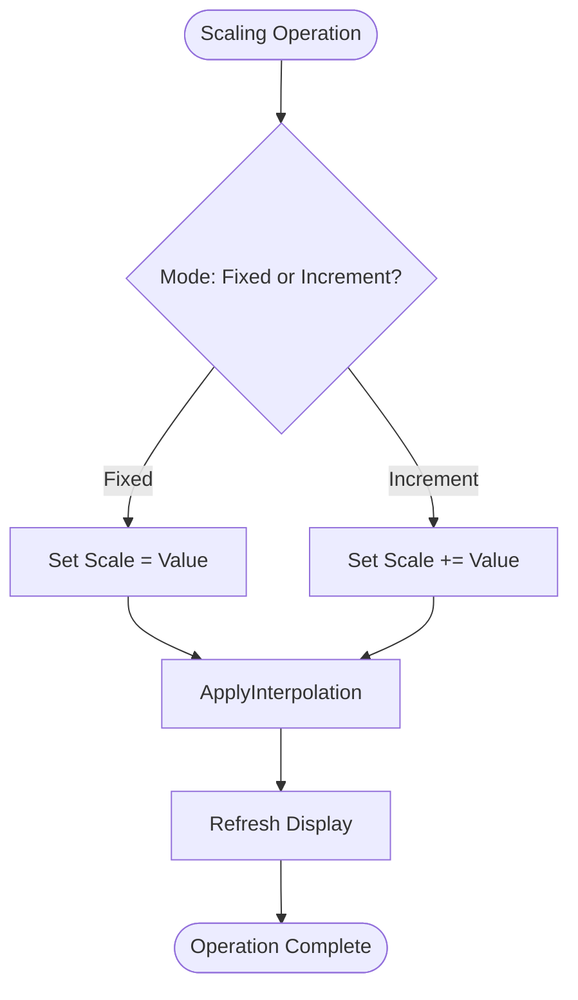
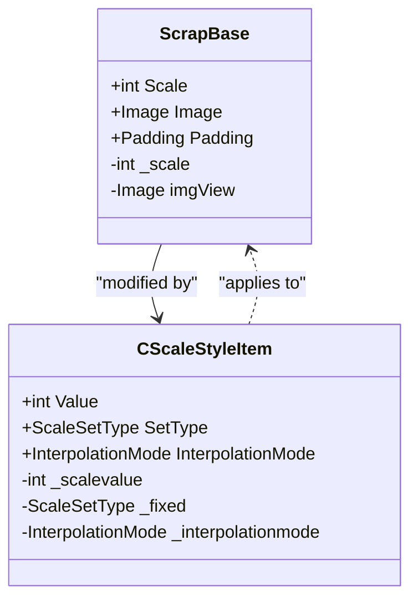
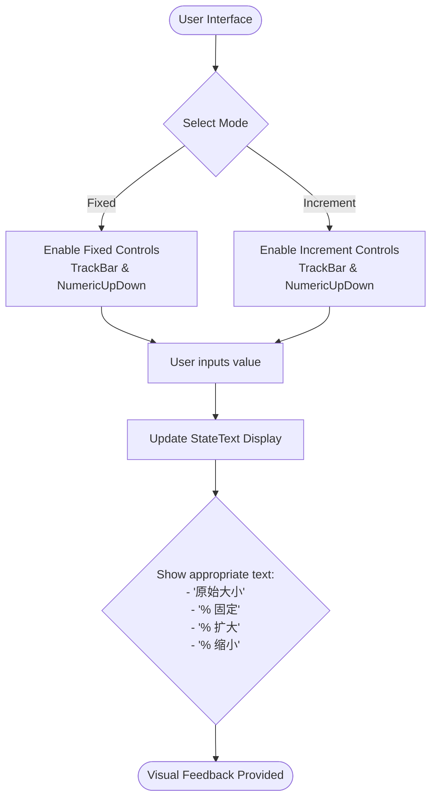
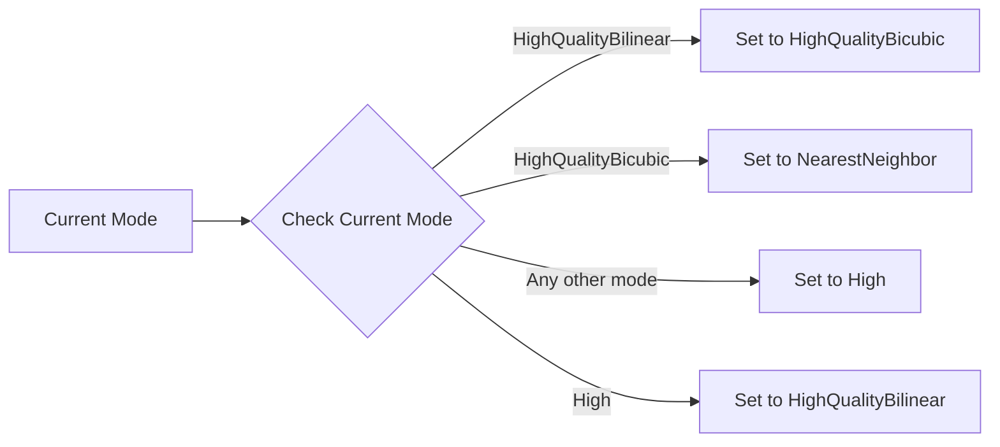
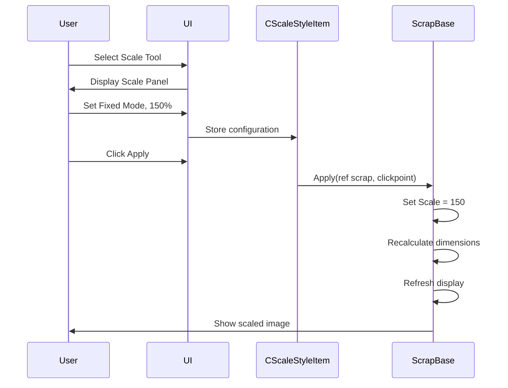

# Scaling Operations

<cite>
**Referenced Files in This Document**   
- [CScaleStyleItem.cs](file://SETUNA/Main/StyleItems/CScaleStyleItem.cs)
- [ScaleStyleItemPanel.cs](file://SETUNA/Main/StyleItems/ScaleStyleItemPanel.cs)
- [ScaleStyleItemPanel.Designer.cs](file://SETUNA/Main/StyleItems/ScaleStyleItemPanel.Designer.cs)
- [ScrapBase.cs](file://SETUNA/Main/ScrapBase.cs)
- [CStyleItem.cs](file://SETUNA/Main/StyleItems/CStyleItem.cs)
</cite>

## Table of Contents
1. [Introduction](#introduction)
2. [Scaling Modes](#scaling-modes)
3. [Scale Property Implementation](#scale-property-implementation)
4. [UI Feedback and StateText](#ui-feedback-and-statetext)
5. [Interpolation Quality Settings](#interpolation-quality-settings)
6. [Practical Examples](#practical-examples)
7. [Performance Implications](#performance-implications)
8. [Troubleshooting Guide](#troubleshooting-guide)

## Introduction
The CScaleStyleItem class provides image scaling functionality for reference images in the SETUNA application. This document details the implementation of scaling operations, including the two distinct scaling modes (Fixed and Increment), how the Scale property on ScrapBase is modified, UI feedback mechanisms, interpolation quality settings, and practical usage scenarios. The scaling functionality allows users to resize reference images either to an absolute percentage or by a relative adjustment, with various interpolation methods to control image quality during scaling operations.

**Section sources**
- [CScaleStyleItem.cs](file://SETUNA/Main/StyleItems/CScaleStyleItem.cs#L9-L208)
- [ScrapBase.cs](file://SETUNA/Main/ScrapBase.cs#L604-L623)

## Scaling Modes
The CScaleStyleItem implementation provides two distinct scaling modes for image resizing operations:

### Fixed Mode
In Fixed mode, the image is scaled to an absolute percentage value between 10% and 200% of its original size. This mode sets the Scale property to the specified value, effectively replacing the current scale rather than adjusting it. When a user selects a value in Fixed mode, the image will be resized to exactly that percentage of its original dimensions, regardless of its current scale state.

### Increment Mode
In Increment mode, the image scale is adjusted relative to its current size by a percentage value ranging from -190% to +190%. This mode adds the specified value to the current Scale property, allowing for incremental resizing. For example, if an image is currently at 150% scale and an increment of +20% is applied, the resulting scale will be 170%.

The scaling modes are implemented through the ScaleSetType enum with Fixed and Increment values, and the current mode is stored in the _fixed field of the CScaleStyleItem class. The Apply method checks the current SetType to determine whether to set the scale absolutely or incrementally.

**Diagram sources**
- [CScaleStyleItem.cs](file://SETUNA/Main/StyleItems/CScaleStyleItem.cs#L75-L83)
- [CScaleStyleItem.cs](file://SETUNA/Main/StyleItems/CScaleStyleItem.cs#L201-L207)

**Section sources**
- [CScaleStyleItem.cs](file://SETUNA/Main/StyleItems/CScaleStyleItem.cs#L201-L207)
- [CScaleStyleItem.cs](file://SETUNA/Main/StyleItems/CScaleStyleItem.cs#L75-L83)

## Scale Property Implementation
The Scale property is implemented on the ScrapBase class and controls the display size of reference images. When the Scale property is modified, the image dimensions are recalculated as a percentage of the original image size.

### Property Definition
The Scale property is defined as a new int property in the ScrapBase class with a getter and setter. The backing field _scale is initialized to 100 (representing 100% scale) in the constructor. The property includes validation to ensure the scale value remains within reasonable bounds (-200 to 200).

### Size Calculation
When the Scale property is set, the width and height of the ScrapBase form are recalculated based on the original image dimensions multiplied by the scale percentage. The formula used is:
- Width = (Original Image Width × Scale / 100) + Padding
- Height = (Original Image Height × Scale / 100) + Padding

After updating the dimensions, the Refresh method is called to redraw the image at the new size. The scaling operation is applied in the OnPaint method, where the graphics.DrawImage method uses the scaled dimensions to render the image.

**Diagram sources**
- [ScrapBase.cs](file://SETUNA/Main/ScrapBase.cs#L604-L623)
- [CScaleStyleItem.cs](file://SETUNA/Main/StyleItems/CScaleStyleItem.cs#L21-L34)

**Section sources**
- [ScrapBase.cs](file://SETUNA/Main/ScrapBase.cs#L604-L623)
- [CScaleStyleItem.cs](file://SETUNA/Main/StyleItems/CScaleStyleItem.cs#L75-L83)

## UI Feedback and StateText
The CScaleStyleItem provides visual feedback to users through the StateText property, which displays different text based on the current scaling configuration and mode.

### StateText Implementation
The StateText property returns different strings depending on the current scaling mode and value:
- When in Fixed mode with a value of 100: "原始大小" (Original Size)
- When in Fixed mode with any other value: "[value]% 固定" (e.g., "150% 固定" for 150% fixed)
- When in Increment mode with a positive value: "[value]% 扩大" (e.g., "20% 扩大" for 20% enlargement)
- When in Increment mode with a negative value: "[absolute value]% 缩小" (e.g., "30% 缩小" for 30% reduction)

The StateText is used in the user interface to provide immediate feedback about the current scaling operation, helping users understand the effect of their settings before applying them.

### UI Controls
The ScaleStyleItemPanel provides a graphical interface for configuring scaling operations with:
- Radio buttons to select between Fixed ("绝对值") and Increment ("相对值") modes
- Track bars and numeric up-down controls for adjusting the scale value
- A combo box for selecting interpolation mode

The UI synchronizes the track bar and numeric controls so that changing one automatically updates the other, providing multiple ways to input the same value.

**Diagram sources**
- [CScaleStyleItem.cs](file://SETUNA/Main/StyleItems/CScaleStyleItem.cs#L134-L162)
- [ScaleStyleItemPanel.Designer.cs](file://SETUNA/Main/StyleItems/ScaleStyleItemPanel.Designer.cs#L17-L154)

**Section sources**
- [CScaleStyleItem.cs](file://SETUNA/Main/StyleItems/CScaleStyleItem.cs#L134-L162)
- [ScaleStyleItemPanel.cs](file://SETUNA/Main/StyleItems/ScaleStyleItemPanel.cs#L14-L57)

## Interpolation Quality Settings
The CScaleStyleItem implementation includes interpolation quality settings that control how pixels are calculated when scaling images, affecting the visual quality of the resized image.

### Interpolation Modes
The following interpolation modes are available:
- **HighQualityBicubic**: Highest quality, smoothest results, but most computationally expensive
- **HighQualityBilinear**: Good quality with moderate performance impact
- **NearestNeighbor**: Fastest but lowest quality, preserves hard edges
- **High**: Standard quality interpolation
- **Invalid**: Special value indicating no change to current interpolation mode

### Automatic Cycling Behavior
When the 'Low' mode is selected in the UI (represented by "不要更改" - "Do not change"), the system implements an automatic cycling behavior that rotates through different interpolation modes based on the current setting:

This cycling behavior is implemented in the Apply method of CScaleStyleItem. When the InterpolationMode is set to Low, the code checks the current interpolation mode of the scrap and cycles to the next appropriate mode in the sequence. This allows users to quickly cycle through different quality settings without manually selecting each one.

The interpolation mode is applied to the Graphics object during rendering in the OnPaint method of ScrapBase, where it sets the InterpolationMode property before drawing the image.

**Diagram sources**
- [CScaleStyleItem.cs](file://SETUNA/Main/StyleItems/CScaleStyleItem.cs#L84-L112)
- [ScrapBase.cs](file://SETUNA/Main/ScrapBase.cs#L461)

**Section sources**
- [CScaleStyleItem.cs](file://SETUNA/Main/StyleItems/CScaleStyleItem.cs#L84-L112)
- [ScaleStyleItemPanel.cs](file://SETUNA/Main/StyleItems/ScaleStyleItemPanel.cs#L19-L24)

## Practical Examples
The scaling functionality in CScaleStyleItem supports various practical use cases for working with reference images.

### Creating Zoomed Reference Images
To create a zoomed reference image for detailed work:
1. Select the reference image to scale
2. Choose the "缩放参考图" (Scale Reference Image) option
3. Select Fixed mode and set the scale to desired percentage (e.g., 150%)
4. Choose HighQualityBicubic interpolation for best quality
5. Apply the scaling operation

This creates a permanently zoomed version of the reference image that maintains the specified scale until changed.

### Incrementally Resizing Scraps
For iterative resizing during design work:
1. Start with the reference image at 100% scale
2. Apply Increment mode with +20% to enlarge the image
3. Assess the result and apply another +10% increment if needed
4. Use the StateText feedback to track cumulative scaling
5. If the image becomes too large, apply a negative increment (e.g., -15%) to reduce it

This incremental approach allows for fine-tuning the image size without needing to calculate absolute percentages.

### Cycling Through Quality Settings
To quickly compare different interpolation qualities:
1. Apply a scaling operation with the interpolation mode set to "不要更改" (Do not change)
2. Observe the image quality
3. Apply the same scaling operation again
4. The interpolation mode will cycle to the next setting
5. Repeat to cycle through all quality options

This allows rapid comparison of how different interpolation methods affect the appearance of the scaled image.

**Diagram sources**
- [CScaleStyleItem.cs](file://SETUNA/Main/StyleItems/CScaleStyleItem.cs#L75-L83)
- [ScrapBase.cs](file://SETUNA/Main/ScrapBase.cs#L604-L623)

**Section sources**
- [CScaleStyleItem.cs](file://SETUNA/Main/StyleItems/CScaleStyleItem.cs#L75-L83)
- [ScrapBase.cs](file://SETUNA/Main/ScrapBase.cs#L604-L623)

## Performance Implications
The choice of interpolation mode has significant performance implications for scaling operations.

### Performance Comparison
- **NearestNeighbor**: Fastest performance, minimal processing overhead, but produces pixelated results especially when enlarging images
- **HighQualityBilinear**: Moderate performance impact, provides smooth results for moderate scaling
- **HighQualityBicubic**: Highest quality but most computationally expensive, can cause noticeable lag when scaling large images
- **High**: Balanced performance and quality, suitable for most use cases

### Optimization Considerations
When working with large reference images or applying frequent scaling operations, consider the following performance optimizations:
- Use NearestNeighbor during interactive scaling operations for smoother responsiveness
- Switch to higher quality modes only for final output
- Avoid excessive scaling beyond 200% as it significantly increases memory usage and processing time
- Consider the original image resolution when choosing interpolation mode

The automatic cycling feature for the 'Low' mode provides a convenient way to test different quality settings without manually configuring each one, allowing users to find the optimal balance between visual quality and performance for their specific use case.

**Section sources**
- [CScaleStyleItem.cs](file://SETUNA/Main/StyleItems/CScaleStyleItem.cs#L39-L52)
- [ScrapBase.cs](file://SETUNA/Main/ScrapBase.cs#L461)

## Troubleshooting Guide
This section addresses common issues encountered when using the scaling functionality and provides solutions.

### Blurry Output
**Symptoms**: Scaled images appear blurry or lack detail
**Causes and Solutions**:
- Using low-quality interpolation modes like NearestNeighbor or High
- Solution: Use HighQualityBicubic or HighQualityBilinear for better results
- Excessive scaling beyond 200%
- Solution: Limit scaling to reasonable percentages to maintain image quality
- Original image has low resolution
- Solution: Use higher resolution source images when possible

### Unexpected Scale Resets
**Symptoms**: Image scale unexpectedly returns to 100% or other values
**Causes and Solutions**:
- The Scale property has bounds checking that limits values to -200 to 200
- Solution: Ensure scale values are within valid range
- Other style operations may reset scale
- Solution: Check if other applied styles affect scaling
- Application state issues
- Solution: Restart the application if scaling behavior becomes inconsistent

### UI Feedback Issues
**Symptoms**: StateText does not update correctly or shows incorrect values
**Causes and Solutions**:
- UI controls not properly synchronized
- Solution: Ensure both track bar and numeric controls are updated
- Caching issues
- Solution: Refresh the display or reapply the scaling operation
- Localization issues
- Solution: Verify language settings if text appears incorrect

### Performance Problems
**Symptoms**: Application becomes slow or unresponsive during scaling
**Causes and Solutions**:
- Using HighQualityBicubic on large images
- Solution: Use lower quality modes during interactive work
- Memory constraints
- Solution: Close other reference images or reduce their size
- Excessive scaling operations
- Solution: Apply scaling in larger increments rather than small repeated adjustments

**Section sources**
- [CScaleStyleItem.cs](file://SETUNA/Main/StyleItems/CScaleStyleItem.cs#L604-L623)
- [CScaleStyleItem.cs](file://SETUNA/Main/StyleItems/CScaleStyleItem.cs#L134-L162)
- [ScrapBase.cs](file://SETUNA/Main/ScrapBase.cs#L610-L618)