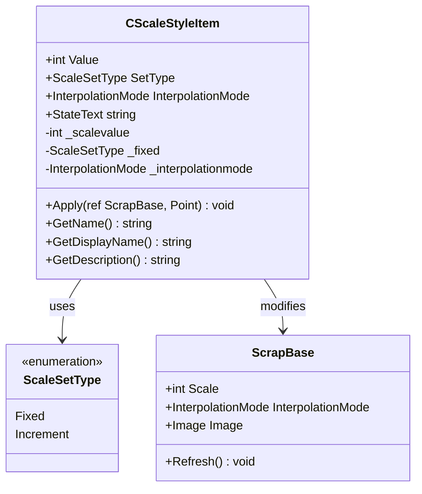
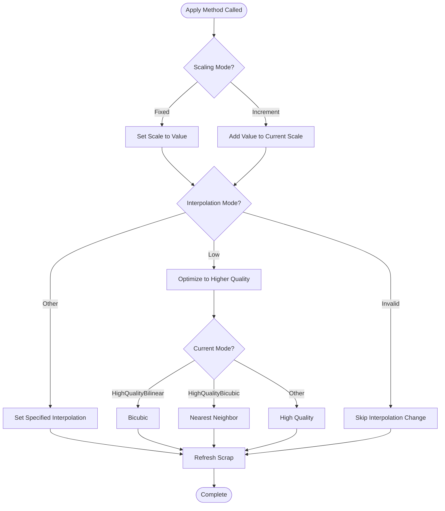
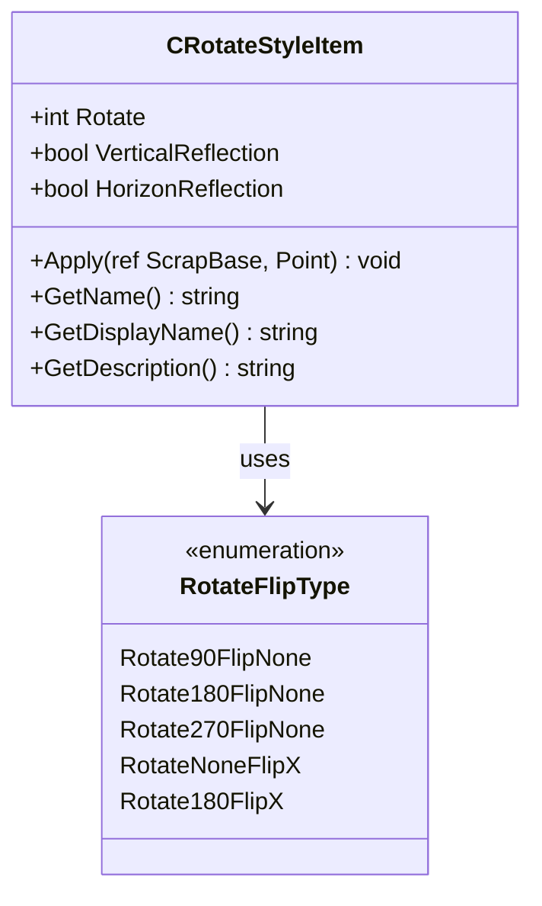
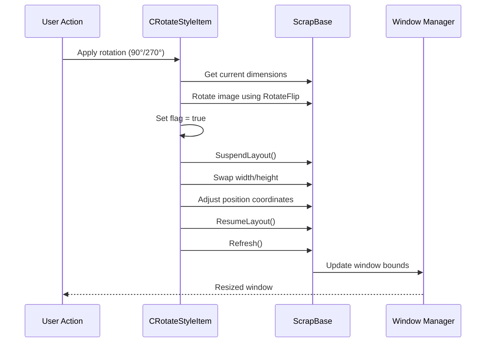
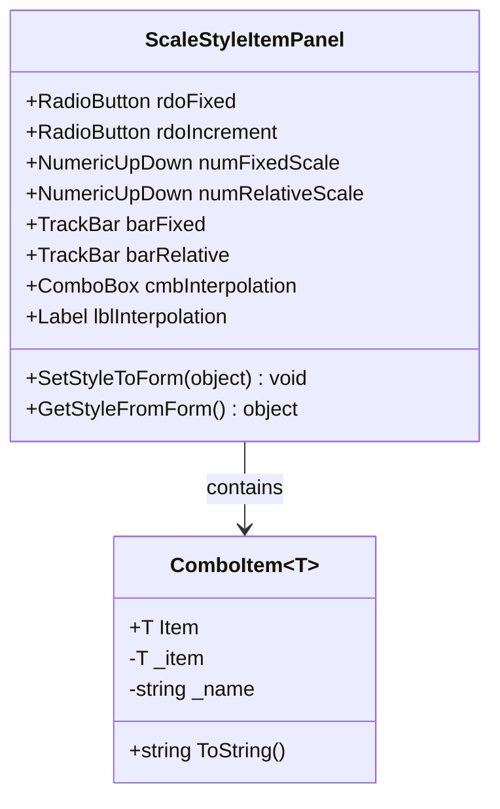
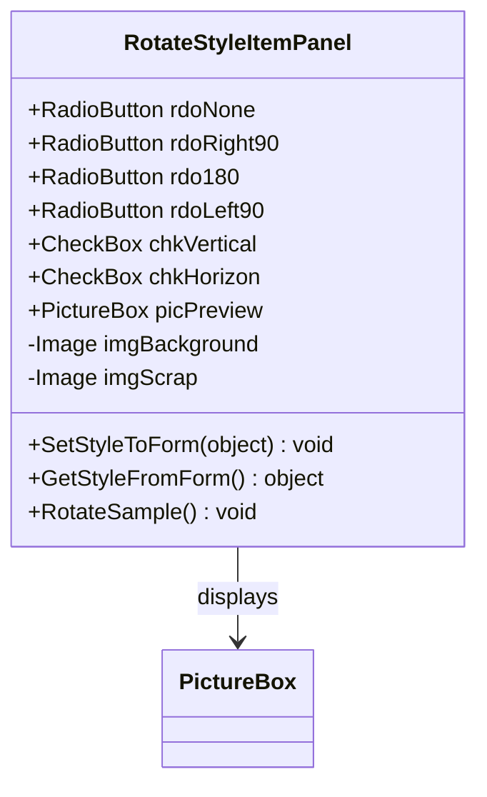
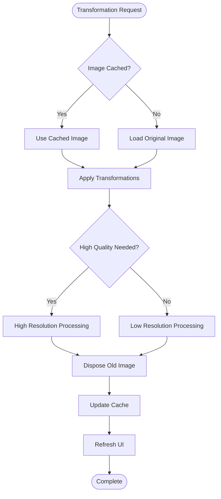
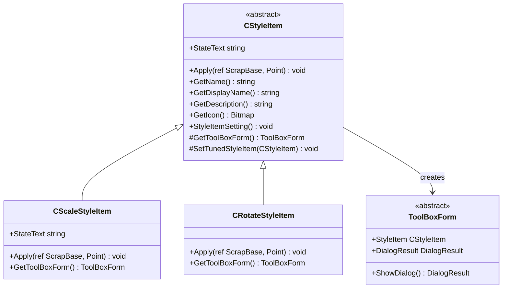
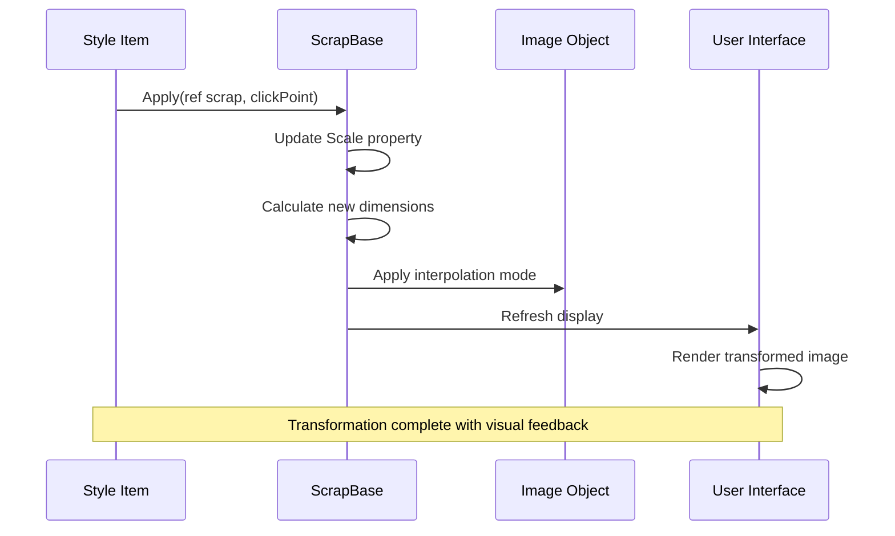

# Transformation Styles

<cite>
**Referenced Files in This Document**
- [CScaleStyleItem.cs](file://SETUNA/Main/StyleItems/CScaleStyleItem.cs)
- [CRotateStyleItem.cs](file://SETUNA/Main/StyleItems/CRotateStyleItem.cs)
- [ScaleStyleItemPanel.Designer.cs](file://SETUNA/Main/StyleItems/ScaleStyleItemPanel.Designer.cs)
- [RotateStyleItemPanel.Designer.cs](file://SETUNA/Main/StyleItems/RotateStyleItemPanel.Designer.cs)
- [ScaleStyleItemPanel.cs](file://SETUNA/Main/StyleItems/ScaleStyleItemPanel.cs)
- [RotateStyleItemPanel.cs](file://SETUNA/Main/StyleItems/RotateStyleItemPanel.cs)
- [CStyleItem.cs](file://SETUNA/Main/StyleItems/CStyleItem.cs)
- [ScrapBase.cs](file://SETUNA/Main/ScrapBase.cs)
</cite>

## Table of Contents
1. [Introduction](#introduction)
2. [CScaleStyleItem - Zoom Transformation](#cScaleStyleItem---zoom-transformation)
3. [CRotateStyleItem - Rotation and Reflection](#crotateStyleItem---rotation-and-reflection)
4. [UI Panel Integration](#ui-panel-integration)
5. [Configuration Parameters](#configuration-parameters)
6. [Performance Considerations](#performance-considerations)
7. [Usage Examples](#usage-examples)
8. [Common Issues and Troubleshooting](#common-issues-and-troubleshooting)
9. [Implementation Architecture](#implementation-architecture)

## Introduction

The transformation style items in SETUNA provide powerful geometric manipulation capabilities for captured scraps. These styles enable users to modify the visual properties of images through scaling (zooming) and rotation/reflection operations. The system consists of two primary transformation styles: CScaleStyleItem for zoom operations and CRotateStyleItem for rotational transformations.

Both transformation styles integrate seamlessly with the SETUNA framework, offering configurable interpolation quality settings, intuitive UI panels, and automatic window resizing capabilities. They leverage GDI+ for efficient image processing while maintaining high-quality output through various interpolation algorithms.

## CScaleStyleItem - Zoom Transformation

The CScaleStyleItem class implements zoom functionality with support for both fixed and incremental scaling modes. It provides comprehensive control over image magnification and minification operations.

### Core Architecture



**Diagram sources**
- [CScaleStyleItem.cs](file://SETUNA/Main/StyleItems/CScaleStyleItem.cs#L10-L210)
- [ScrapBase.cs](file://SETUNA/Main/ScrapBase.cs#L605-L622)

### Scaling Modes

The CScaleStyleItem supports two distinct scaling approaches:

#### Fixed Scaling Mode
- **Operation**: Sets the image scale to an absolute percentage value
- **Range**: 10% to 200%
- **Behavior**: Overrides current scale regardless of previous settings
- **Use Case**: Precise control over image size for consistent output

#### Incremental Scaling Mode  
- **Operation**: Adds/subtracts percentage from current scale
- **Range**: -190% to +190%
- **Behavior**: Accumulates scale changes relative to existing scale
- **Use Case**: Fine-tuning and iterative adjustments

### Interpolation Quality Settings

The style item provides five interpolation quality levels to balance performance and output quality:

| Interpolation Mode | Quality Level | Performance | Use Case |
|-------------------|---------------|-------------|----------|
| Invalid | No Change | N/A | Preserve current setting |
| NearestNeighbor | Low | Fastest | Pixel art, sharp edges |
| High | Standard | Fast | General purpose |
| HighQualityBilinear | Medium | Moderate | Smooth scaling |
| HighQualityBicubic | High | Slower | Professional output |

### Implementation Details

The Apply method implements sophisticated scaling logic with automatic interpolation mode optimization:



**Diagram sources**
- [CScaleStyleItem.cs](file://SETUNA/Main/StyleItems/CScaleStyleItem.cs#L74-L114)

**Section sources**
- [CScaleStyleItem.cs](file://SETUNA/Main/StyleItems/CScaleStyleItem.cs#L10-L210)

## CRotateStyleItem - Rotation and Reflection

The CRotateStyleItem class provides comprehensive rotational and reflective transformations using GDI+'s RotateFlip method. It supports 90°, 180°, and 270° rotations along with vertical and horizontal reflections.

### Rotation Operations

The rotation implementation uses GDI+ RotateFlipType enumeration for efficient image transformations:



**Diagram sources**
- [CRotateStyleItem.cs](file://SETUNA/Main/StyleItems/CRotateStyleItem.cs#L8-L115)

### Supported Transformations

#### Rotation Angles
- **0° (None)**: No rotation applied
- **90°**: Clockwise rotation 90 degrees
- **180°**: Half rotation (upside down)
- **270°**: Counter-clockwise rotation 90 degrees

#### Reflection Operations
- **Vertical Reflection**: Mirror image across vertical axis
- **Horizontal Reflection**: Mirror image across horizontal axis

### Automatic Window Resizing

When rotating 90° or 270°, the system automatically adjusts the window dimensions to prevent content clipping:



**Diagram sources**
- [CRotateStyleItem.cs](file://SETUNA/Main/StyleItems/CRotateStyleItem.cs#L52-L63)

**Section sources**
- [CRotateStyleItem.cs](file://SETUNA/Main/StyleItems/CRotateStyleItem.cs#L8-L115)

## UI Panel Integration

Both transformation styles integrate with dedicated UI panels that provide intuitive configuration interfaces.

### CScaleStyleItem UI Panel

The ScaleStyleItemPanel offers comprehensive scaling configuration through interactive controls:



**Diagram sources**
- [ScaleStyleItemPanel.Designer.cs](file://SETUNA/Main/StyleItems/ScaleStyleItemPanel.Designer.cs#L4-L235)
- [ScaleStyleItemPanel.cs](file://SETUNA/Main/StyleItems/ScaleStyleItemPanel.cs#L120-L152)

### CRotateStyleItem UI Panel

The RotateStyleItemPanel provides visual preview and intuitive rotation controls:



**Diagram sources**
- [RotateStyleItemPanel.Designer.cs](file://SETUNA/Main/StyleItems/RotateStyleItemPanel.Designer.cs#L4-L225)

### Panel Features

#### Interactive Controls
- **Radio Buttons**: Toggle between fixed and incremental scaling modes
- **Sliders**: Real-time adjustment of scale values
- **Spin Controls**: Precise numeric input for scale percentages
- **Dropdown Lists**: Selection of interpolation quality levels

#### Visual Feedback
- **Live Preview**: Real-time rendering of transformation effects
- **Progress Indicators**: Visual representation of current settings
- **State Indicators**: Clear display of active transformation modes

**Section sources**
- [ScaleStyleItemPanel.Designer.cs](file://SETUNA/Main/StyleItems/ScaleStyleItemPanel.Designer.cs#L7-L235)
- [RotateStyleItemPanel.Designer.cs](file://SETUNA/Main/StyleItems/RotateStyleItemPanel.Designer.cs#L7-L225)

## Configuration Parameters

### CScaleStyleItem Parameters

| Parameter | Type | Range | Default | Description |
|-----------|------|-------|---------|-------------|
| Value | int | 10-200 (-190 to +190) | 100 | Scale percentage or increment value |
| SetType | ScaleSetType | Fixed/Increment | Fixed | Scaling operation mode |
| InterpolationMode | InterpolationMode | Various | HighQualityBicubic | Image resampling quality |

### CRotateStyleItem Parameters

| Parameter | Type | Values | Description |
|-----------|------|--------|-------------|
| Rotate | int | 0, 90, 180, 270 | Rotation angle in degrees |
| VerticalReflection | bool | true/false | Enable vertical mirroring |
| HorizonReflection | bool | true/false | Enable horizontal mirroring |

### Constants and Limits

The CScaleStyleItem defines several important constants for parameter validation:

- **FixedScaleMin**: 10% (minimum fixed scale)
- **FixedScaleMax**: 200% (maximum fixed scale)  
- **FixedScaleDefault**: 100% (default fixed scale)
- **RelativeScaleMin**: -190% (minimum relative scale)
- **RelativeScaleMax**: +190% (maximum relative scale)
- **RelativeScaleDefault**: 0% (default relative scale)
- **DefaultInterpolation**: HighQualityBicubic (default interpolation)

**Section sources**
- [CScaleStyleItem.cs](file://SETUNA/Main/StyleItems/CScaleStyleItem.cs#L171-L190)

## Performance Considerations

### Image Resampling Performance

The transformation styles implement several optimization strategies to maintain performance during intensive image processing:

#### Interpolation Mode Optimization
- **Automatic Quality Adjustment**: Low-quality interpolation modes automatically upgrade to higher quality when possible
- **Memory Management**: Proper disposal of temporary image resources prevents memory leaks
- **Batch Processing**: Multiple transformations applied sequentially minimize redundant operations

#### GDI+ Efficiency
- **Direct Memory Access**: Uses GDI+ RotateFlip for hardware-accelerated transformations
- **Minimal Copy Operations**: Direct modification of image data when possible
- **Cached Calculations**: Pre-computed coordinate transformations reduce runtime overhead

### Memory Management



### Best Practices for Performance

1. **Use Appropriate Interpolation**: Select interpolation mode based on quality requirements
2. **Batch Operations**: Group multiple transformations to minimize refresh cycles
3. **Monitor Memory Usage**: Regular garbage collection for large image processing
4. **Optimize Preview Updates**: Reduce preview update frequency during rapid adjustments

## Usage Examples

### Creating Scaled References

Example scenario: Creating a smaller reference copy of a screenshot for annotation purposes:

```csharp
// Create fixed-scale style item
var scaleItem = new CScaleStyleItem();
scaleItem.Value = 50;           // 50% scale
scaleItem.SetType = CScaleStyleItem.ScaleSetType.Fixed;
scaleItem.InterpolationMode = InterpolationMode.HighQualityBicubic;

// Apply to scrap
scaleItem.Apply(ref targetScrap, clickPoint);
```

### Rotating Screenshots

Example scenario: Rotating landscape screenshots to portrait orientation:

```csharp
// Create rotation style item
var rotateItem = new CRotateStyleItem();
rotateItem.Rotate = 90;              // 90-degree clockwise rotation
rotateItem.VerticalReflection = false;
rotateItem.HorizonReflection = false;

// Apply rotation
rotateItem.Apply(ref landscapeScrap, clickPoint);
```

### Combined Transformations

Example scenario: Applying both rotation and scaling to optimize screen capture layout:

```csharp
// Step 1: Scale down for thumbnail
var scaleFirst = new CScaleStyleItem();
scaleFirst.Value = 25;
scaleFirst.SetType = CScaleStyleItem.ScaleSetType.Fixed;

// Step 2: Rotate for optimal viewing
var rotateSecond = new CRotateStyleItem();
rotateSecond.Rotate = 270;           // 270-degree counter-clockwise
rotateSecond.VerticalReflection = true;

// Apply sequentially
scaleFirst.Apply(ref scrap, clickPoint);
rotateSecond.Apply(ref scrap, clickPoint);
```

### Configuration Through UI Panels

Users can configure transformations through the integrated panels:

1. **Access Style Settings**: Right-click on scrap → Style → Configure
2. **Select Transformation Type**: Choose between Zoom and Rotate operations
3. **Adjust Parameters**: Use sliders, spin controls, and dropdown menus
4. **Preview Changes**: Real-time visual feedback during adjustments
5. **Apply Configuration**: Confirm changes through OK button

## Common Issues and Troubleshooting

### Aspect Ratio Distortion

**Problem**: Images appear stretched or compressed after rotation
**Solution**: 
- Verify automatic window resizing is enabled for 90°/270° rotations
- Check padding and margin settings are appropriate
- Ensure interpolation mode is set to HighQualityBicubic for best results

### Unexpected Layout Changes

**Problem**: Window positioning becomes incorrect after transformations
**Solution**:
- Review coordinate calculation logic in rotation handler
- Verify SuspendedLayout/ResumeLayout calls are properly paired
- Check client size calculations match rotated dimensions

### Performance Degradation

**Problem**: Slow response during image transformations
**Solution**:
- Reduce interpolation quality for real-time previews
- Limit simultaneous transformation operations
- Monitor memory usage during batch processing
- Implement progressive loading for large images

### Interpolation Quality Issues

**Problem**: Poor image quality after scaling operations
**Solution**:
- Increase interpolation quality setting
- Use HighQualityBicubic for professional output
- Consider image resolution requirements before scaling
- Test different interpolation modes for specific use cases

### Memory Leaks

**Problem**: Increasing memory usage during prolonged use
**Solution**:
- Ensure proper disposal of temporary image objects
- Implement periodic garbage collection
- Monitor image cache sizes
- Use weak references for cached images when appropriate

### UI Panel Synchronization

**Problem**: UI controls not reflecting current transformation state
**Solution**:
- Verify event handlers are properly connected
- Check form initialization sequence
- Ensure property binding is maintained
- Test panel refresh mechanisms

**Section sources**
- [CRotateStyleItem.cs](file://SETUNA/Main/StyleItems/CRotateStyleItem.cs#L52-L63)
- [CScaleStyleItem.cs](file://SETUNA/Main/StyleItems/CScaleStyleItem.cs#L42-L52)

## Implementation Architecture

### Style Item Framework Integration

The transformation styles integrate with the broader SETUNA style system through the CStyleItem base class:



**Diagram sources**
- [CStyleItem.cs](file://SETUNA/Main/StyleItems/CStyleItem.cs#L8-L100)
- [CScaleStyleItem.cs](file://SETUNA/Main/StyleItems/CScaleStyleItem.cs#L10-L210)
- [CRotateStyleItem.cs](file://SETUNA/Main/StyleItems/CRotateStyleItem.cs#L8-L115)

### ScrapBase Integration

The transformation styles modify the ScrapBase properties to achieve visual effects:



**Diagram sources**
- [ScrapBase.cs](file://SETUNA/Main/ScrapBase.cs#L605-L622)
- [CScaleStyleItem.cs](file://SETUNA/Main/StyleItems/CScaleStyleItem.cs#L74-L114)

### Event Handling Architecture

The system implements comprehensive event handling for state management and user interaction:

- **Style Applied Events**: Notify when transformations are applied
- **Image Changed Events**: Trigger updates when image content changes  
- **Location Changed Events**: Handle window positioning after transformations
- **Menu Events**: Integrate with context menus and toolbar buttons

**Section sources**
- [CStyleItem.cs](file://SETUNA/Main/StyleItems/CStyleItem.cs#L8-L100)
- [ScrapBase.cs](file://SETUNA/Main/ScrapBase.cs#L605-L622)