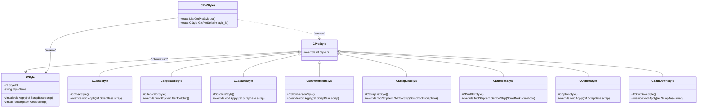
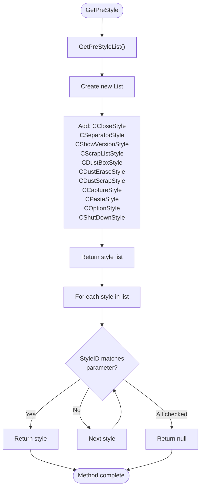
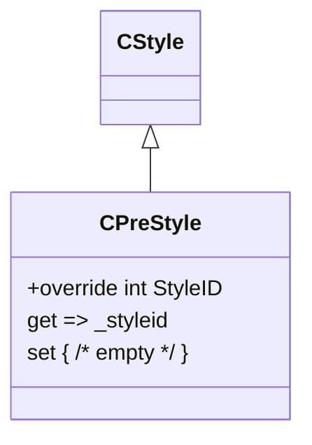
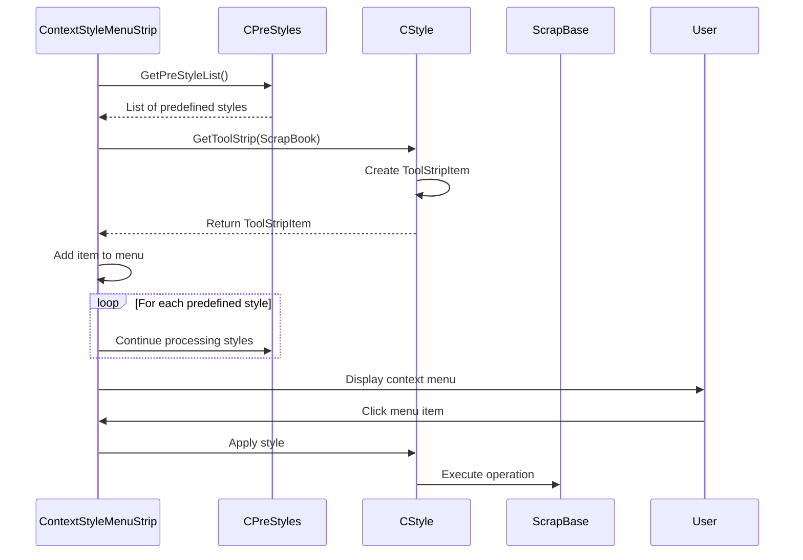

# Predefined Styles

<cite>
**Referenced Files in This Document**   
- [CPreStyles.cs](file://SETUNA/Main/Style/CPreStyles.cs)
- [CPreStyle.cs](file://SETUNA/Main/Style/CPreStyle.cs)
- [CStyle.cs](file://SETUNA/Main/Style/CStyle.cs)
- [CCloseStyle.cs](file://SETUNA/Main/Style/CCloseStyle.cs)
- [CSeparatorStyle.cs](file://SETUNA/Main/Style/CSeparatorStyle.cs)
- [CCaptureStyle.cs](file://SETUNA/Main/Style/CCaptureStyle.cs)
- [CShowVersionStyle.cs](file://SETUNA/Main/Style/CShowVersionStyle.cs)
- [CScrapListStyle.cs](file://SETUNA/Main/Style/CScrapListStyle.cs)
- [CDustBoxStyle.cs](file://SETUNA/Main/Style/CDustBoxStyle.cs)
- [COptionStyle.cs](file://SETUNA/Main/Style/COptionStyle.cs)
- [CShutDownStyle.cs](file://SETUNA/Main/Style/CShutDownStyle.cs)
- [ContextStyleMenuStrip.cs](file://SETUNA/Main/ContextStyleMenuStrip.cs)
</cite>

## Table of Contents
1. [Introduction](#introduction)
2. [Core Components](#core-components)
3. [Architecture Overview](#architecture-overview)
4. [Detailed Component Analysis](#detailed-component-analysis)
5. [Integration with Context Menu System](#integration-with-context-menu-system)
6. [Design Rationale](#design-rationale)
7. [Extensibility and Maintenance](#extensibility-and-maintenance)

## Introduction
The predefined styles system in SETUNA provides a collection of built-in functionality that enables core application operations through a consistent style interface. These predefined styles are implemented as singleton-like objects that offer essential features such as scrap management, application shutdown, version display, and capture operations. The system is designed around static instantiation and centralized access patterns to ensure consistent behavior across all application instances.

## Core Components

The predefined styles architecture is built around three key components: the `CPreStyles` class that manages the collection of predefined styles, the `CPreStyle` base class that defines the contract for all predefined styles, and individual style implementations that provide specific functionality. The `GetPreStyleList` method returns a static collection of predefined style objects, while the `GetPreStyle` method enables lookup by StyleID.

**Section sources**
- [CPreStyles.cs](file://SETUNA/Main/Style/CPreStyles.cs#L9-L24)
- [CPreStyle.cs](file://SETUNA/Main/Style/CPreStyle.cs#L4-L15)
- [CStyle.cs](file://SETUNA/Main/Style/CStyle.cs#L73-L83)

## Architecture Overview

**Diagram sources**
- [CPreStyles.cs](file://SETUNA/Main/Style/CPreStyles.cs#L9-L24)
- [CPreStyle.cs](file://SETUNA/Main/Style/CPreStyle.cs#L4-L15)
- [CStyle.cs](file://SETUNA/Main/Style/CStyle.cs#L73-L83)

## Detailed Component Analysis

### CPreStyles Class Implementation
The `CPreStyles` class serves as the central registry for all predefined styles in the application. Its `GetPreStyleList` method instantiates and returns a collection of predefined style objects that provide core application functionality. Each style is instantiated as a singleton instance with a negative StyleID, distinguishing them from user-defined styles which have positive IDs.

The `GetPreStyle` method provides a lookup mechanism that searches through the predefined style collection to find a style with the matching StyleID. This enables consistent access to predefined functionality throughout the application.

**Diagram sources**
- [CPreStyles.cs](file://SETUNA/Main/Style/CPreStyles.cs#L9-L38)

**Section sources**
- [CPreStyles.cs](file://SETUNA/Main/Style/CPreStyles.cs#L9-L38)

### Predefined Style Base Class
The `CPreStyle` class inherits from `CStyle` and overrides the `StyleID` property to prevent modification of the style ID after initialization. This ensures that predefined styles maintain their designated negative IDs throughout their lifecycle, which is critical for proper identification and lookup.

**Diagram sources**
- [CPreStyle.cs](file://SETUNA/Main/Style/CPreStyle.cs#L4-L15)

**Section sources**
- [CPreStyle.cs](file://SETUNA/Main/Style/CPreStyle.cs#L4-L15)

### Individual Predefined Style Implementations

#### CCloseStyle
The `CCloseStyle` class implements the functionality to close scrap windows. When applied, it creates a `CCloseStyleItem` that executes the close operation on the target scrap.

**Section sources**
- [CCloseStyle.cs](file://SETUNA/Main/Style/CCloseStyle.cs#L7-L22)
- [CCloseStyleItem.cs](file://SETUNA/Main/StyleItems/CCloseStyleItem.cs#L8-L55)

#### CSeparatorStyle
The `CSeparatorStyle` class creates visual separators in menus. Unlike other styles, it overrides `GetToolStrip` to return a `ToolStripSeparator` instead of a regular button, providing visual grouping in context menus.

**Section sources**
- [CSeparatorStyle.cs](file://SETUNA/Main/Style/CSeparatorStyle.cs#L6-L21)

#### CCaptureStyle
The `CCaptureStyle` class initiates the screen capture process. When applied, it accesses the bound form through the scrap manager and starts the capture operation.

**Section sources**
- [CCaptureStyle.cs](file://SETUNA/Main/Style/CCaptureStyle.cs#L4-L20)

#### CShowVersionStyle
The `CShowVersionStyle` class displays application version information by showing the splash form as a dialog.

**Section sources**
- [CShowVersionStyle.cs](file://SETUNA/Main/Style/CShowVersionStyle.cs#L4-L20)

#### COptionStyle
The `COptionStyle` class provides access to application settings by invoking the option method on the bound form.

**Section sources**
- [COptionStyle.cs](file://SETUNA/Main/Style/COptionStyle.cs#L4-L20)

#### CShutDownStyle
The `CShutDownStyle` class implements application shutdown by closing the main bind form.

**Section sources**
- [CShutDownStyle.cs](file://SETUNA/Main/Style/CShutDownStyle.cs#L4-L20)

## Integration with Context Menu System

The predefined styles are integrated into the application's context menu system through the `ContextStyleMenuStrip` and related ToolStrip components. Styles like `CScrapListStyle` and `CDustBoxStyle` are specifically designed to work with scrap management functionality, providing access to the scrap collection and recycle bin features.

**Diagram sources**
- [CPreStyles.cs](file://SETUNA/Main/Style/CPreStyles.cs#L9-L24)
- [CScrapListStyle.cs](file://SETUNA/Main/Style/CScrapListStyle.cs#L6-L21)
- [CDustBoxStyle.cs](file://SETUNA/Main/Style/CDustBoxStyle.cs#L6-L21)
- [ContextStyleMenuStrip.cs](file://SETUNA/Main/ContextStyleMenuStrip.cs#L4-L42)

**Section sources**
- [CScrapListStyle.cs](file://SETUNA/Main/Style/CScrapListStyle.cs#L6-L21)
- [CDustBoxStyle.cs](file://SETUNA/Main/Style/CDustBoxStyle.cs#L6-L21)
- [ContextStyleMenuStrip.cs](file://SETUNA/Main/ContextStyleMenuStrip.cs#L4-L42)

## Design Rationale

The static instantiation model for predefined styles ensures several key benefits:

1. **Consistent Behavior**: All instances of the application use the same predefined style objects, guaranteeing uniform behavior.
2. **Memory Efficiency**: Since predefined styles are shared across the application, memory usage is optimized.
3. **Centralized Management**: The `CPreStyles` class provides a single point of access and management for all built-in functionality.
4. **Type Safety**: The use of negative StyleIDs for predefined styles creates a clear separation from user-defined styles.

The architecture follows a pattern where predefined styles are distinguished by their negative StyleIDs, with each style serving a specific purpose in the application's functionality:

| Style ID | Style Name | Functionality |
|----------|------------|---------------|
| -1 | Close | Closes the current scrap window |
| -4 | Separator | Creates visual separation in menus |
| -5 | Version Information | Displays application version |
| -6 | Scrap List | Shows the collection of saved scraps |
| -7 | Dust Box | Accesses the scrap recycle bin |
| -9 | Capture | Initiates screen capture |
| -10 | Option | Opens application settings |
| -11 | Shut Down | Exits the application |

**Section sources**
- [CPreStyles.cs](file://SETUNA/Main/Style/CPreStyles.cs#L13-L23)
- [CPreStyle.cs](file://SETUNA/Main/Style/CPreStyle.cs#L11-L12)
- [CStyle.cs](file://SETUNA/Main/Style/CStyle.cs#L73-L83)

## Extensibility and Maintenance

New predefined styles can be added to the system by:
1. Creating a new class that inherits from `CPreStyle`
2. Assigning a unique negative StyleID in the constructor
3. Implementing the appropriate functionality in the `Apply` or `GetToolStrip` methods
4. Adding the style to the `GetPreStyleList` method in `CPreStyles`

The system is designed to be extensible while maintaining backward compatibility. The static nature of the predefined style collection ensures that new styles are automatically available throughout the application once added to the registry.

When adding new predefined styles, developers should follow the established pattern of using negative StyleIDs and ensure that the style integrates properly with the existing context menu system and scrap management functionality.

**Section sources**
- [CPreStyles.cs](file://SETUNA/Main/Style/CPreStyles.cs#L9-L24)
- [CPreStyle.cs](file://SETUNA/Main/Style/CPreStyle.cs#L4-L15)