# Style Persistence and Management

<cite>
**Referenced Files in This Document**
- [CPreStyles.cs](file://SETUNA/Main/Style/CPreStyles.cs)
- [CPreStyle.cs](file://SETUNA/Main/Style/CPreStyle.cs)
- [SetunaOption.cs](file://SETUNA/Main/Option/SetunaOption.cs)
- [StyleEditForm.cs](file://SETUNA/Main/Option/StyleEditForm.cs)
- [CStyle.cs](file://SETUNA/Main/Style/CStyle.cs)
- [CAllHideStyle.cs](file://SETUNA/Main/Style/CAllHideStyle.cs)
- [CCloseStyle.cs](file://SETUNA/Main/Style/CCloseStyle.cs)
- [CSeparatorStyle.cs](file://SETUNA/Main/Style/CSeparatorStyle.cs)
- [CStyleItem.cs](file://SETUNA/Main/StyleItems/CStyleItem.cs)
- [StyleItemDictionary.cs](file://SETUNA/Main/StyleItems/StyleItemDictionary.cs)
- [Mainform.cs](file://SETUNA/Mainform.cs)
</cite>

## Table of Contents
1. [Introduction](#introduction)
2. [Style Architecture Overview](#style-architecture-overview)
3. [Predefined Styles System](#predefined-styles-system)
4. [User-Defined Styles Management](#user-defined-styles-management)
5. [StyleEditForm and Custom Style Creation](#styleeditform-and-custom-style-creation)
6. [XML Serialization and Configuration Persistence](#xml-serialization-and-configuration-persistence)
7. [Temporary vs Permanent Style Application](#temporary-vs-permanent-style-application)
8. [Built-in Style Registration and Access](#built-in-style-registration-and-access)
9. [Versioning and Backward Compatibility](#versioning-and-backward-compatibility)
10. [Performance Considerations](#performance-considerations)
11. [Troubleshooting Guide](#troubleshooting-guide)
12. [Conclusion](#conclusion)

## Introduction

The SETUNA screenshot application implements a sophisticated style persistence and management system that enables users to define, customize, and persist visual effects and behaviors for captured screenshots. The system distinguishes between predefined system styles and user-defined custom styles, providing both temporary application capabilities and permanent storage mechanisms through XML serialization.

This documentation explores the comprehensive architecture that manages style configurations, from the low-level CStyle objects to the high-level user interface components that enable style creation and modification. The system ensures seamless persistence of user preferences across application sessions while maintaining backward compatibility for future updates.

## Style Architecture Overview

The style system is built around several core abstractions that work together to provide flexible and extensible style management:

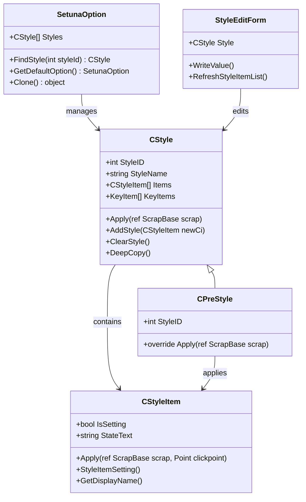

**Diagram sources**
- [CStyle.cs](file://SETUNA/Main/Style/CStyle.cs#L11-L277)
- [CPreStyle.cs](file://SETUNA/Main/Style/CPreStyle.cs#L4-L18)
- [CStyleItem.cs](file://SETUNA/Main/StyleItems/CStyleItem.cs#L8-L101)
- [SetunaOption.cs](file://SETUNA/Main/Option/SetunaOption.cs#L15-L1156)
- [StyleEditForm.cs](file://SETUNA/Main/Option/StyleEditForm.cs#L11-L293)

The architecture follows a hierarchical design where CStyle serves as the base container for style definitions, containing collections of CStyleItem objects that represent individual style operations. Predefined styles inherit from CPreStyle and provide specialized behavior for system-level operations.

**Section sources**
- [CStyle.cs](file://SETUNA/Main/Style/CStyle.cs#L11-L277)
- [CPreStyle.cs](file://SETUNA/Main/Style/CPreStyle.cs#L4-L18)
- [CStyleItem.cs](file://SETUNA/Main/StyleItems/CStyleItem.cs#L8-L101)

## Predefined Styles System

The predefined styles system provides essential system functionality through the CPreStyles class, which maintains a static collection of built-in styles that cannot be modified by users. These styles serve core application functions and are automatically registered during system initialization.

### CPreStyles Implementation

The CPreStyles class implements a centralized registry for predefined styles through two primary methods:

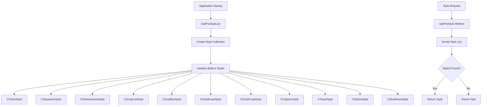

**Diagram sources**
- [CPreStyles.cs](file://SETUNA/Main/Style/CPreStyles.cs#L9-L42)

### Built-in Style Types

The system includes several categories of predefined styles:

| Style Category | Purpose | Example Styles |
|----------------|---------|----------------|
| **System Control** | Core application operations | CCloseStyle, CShutDownStyle, COptionStyle |
| **Interface Elements** | Menu and UI separators | CSeparatorStyle |
| **Management Operations** | Scrapbook functionality | CScrapListStyle, CDustBoxStyle, CDustEraseStyle |
| **Capture Operations** | Screen capture actions | CCaptureStyle, CPasteStyle |

### CAllHideStyle Registration

The CAllHideStyle demonstrates the typical pattern for registering predefined styles:

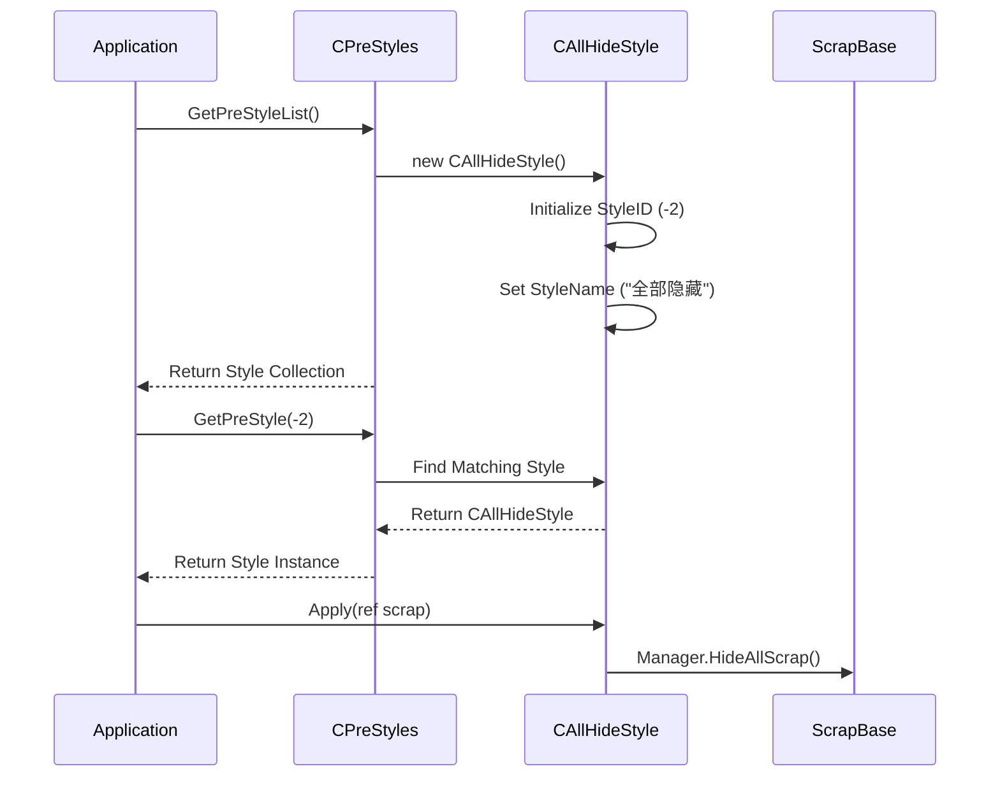

**Diagram sources**
- [CAllHideStyle.cs](file://SETUNA/Main/Style/CAllHideStyle.cs#L4-L23)
- [CPreStyles.cs](file://SETUNA/Main/Style/CPreStyles.cs#L28-L42)

**Section sources**
- [CPreStyles.cs](file://SETUNA/Main/Style/CPreStyles.cs#L9-L42)
- [CAllHideStyle.cs](file://SETUNA/Main/Style/CAllHideStyle.cs#L4-L23)

## User-Defined Styles Management

User-defined styles are managed through the SetunaOption class, which serves as the central configuration container. These styles are fully customizable and persist across application sessions through XML serialization.

### Styles Collection Architecture

The SetunaOption class maintains a List<CStyle> collection that stores all user-defined styles:

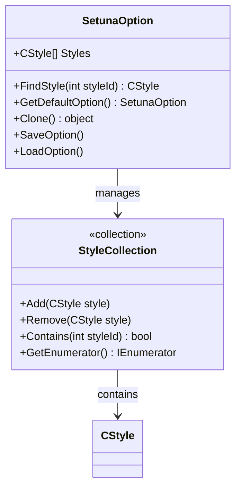

**Diagram sources**
- [SetunaOption.cs](file://SETUNA/Main/Option/SetunaOption.cs#L15-L1156)

### Style Finding and Retrieval

The FindStyle method provides efficient lookup of user-defined styles by their unique identifiers:

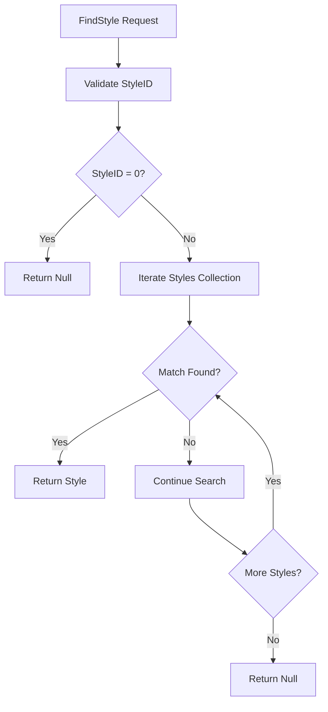

**Diagram sources**
- [SetunaOption.cs](file://SETUNA/Main/Option/SetunaOption.cs#L688-L704)

### Default Style Initialization

The GetDefaultOption method initializes the system with a comprehensive set of predefined user styles:

| Style Category | Number of Styles | Examples |
|----------------|------------------|----------|
| **Basic Operations** | 3 | 复制, 剪切, 粘贴 |
| **Image Operations** | 2 | 保存, 保存（有边框） |
| **Transformations** | 6 | 旋转90度, 水平翻转, 缩放为50% |
| **Adjustments** | 8 | 增加透明度, 向上移动, 立体边框 |
| **Navigation** | 1 | 关闭 |

**Section sources**
- [SetunaOption.cs](file://SETUNA/Main/Option/SetunaOption.cs#L18-L704)

## StyleEditForm and Custom Style Creation

The StyleEditForm provides the user interface for creating and modifying custom styles, integrating seamlessly with CStyle objects through its Style property.

### StyleEditForm Architecture

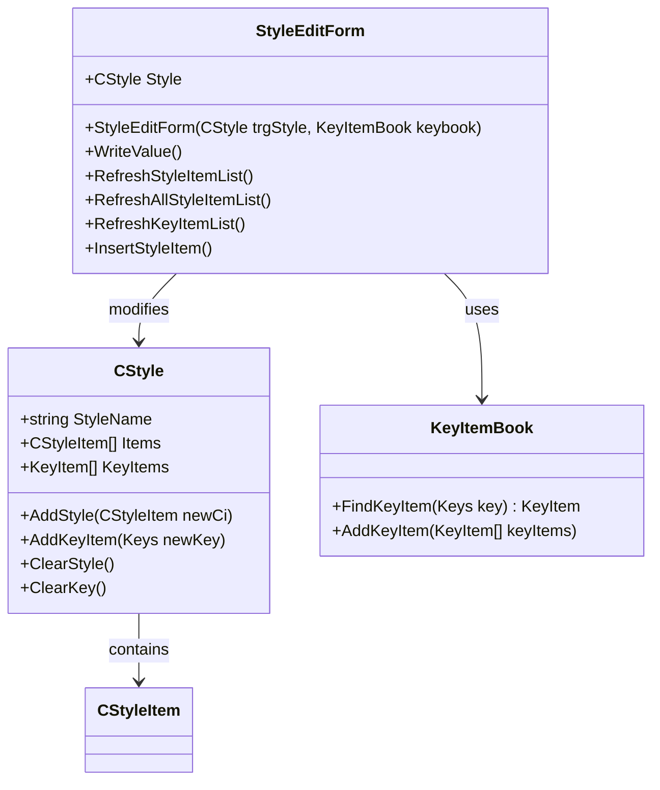

**Diagram sources**
- [StyleEditForm.cs](file://SETUNA/Main/Option/StyleEditForm.cs#L11-L293)
- [CStyle.cs](file://SETUNA/Main/Style/CStyle.cs#L11-L277)

### Style Modification Workflow

The WriteValue method implements the core logic for persisting style modifications:

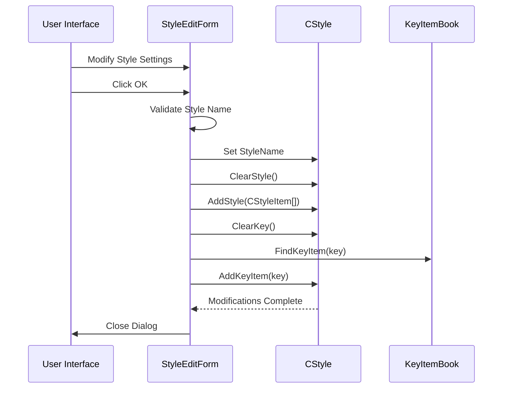

**Diagram sources**
- [StyleEditForm.cs](file://SETUNA/Main/Option/StyleEditForm.cs#L125-L144)

### Style Item Management

The form provides comprehensive management of style items through dynamic insertion and removal:

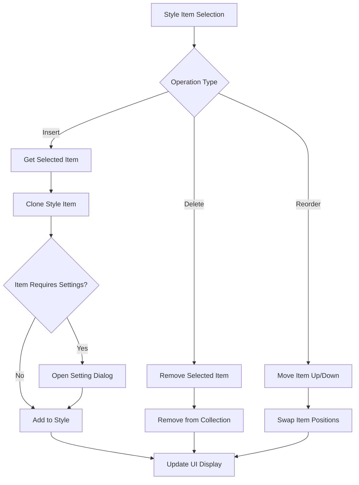

**Diagram sources**
- [StyleEditForm.cs](file://SETUNA/Main/Option/StyleEditForm.cs#L147-L200)

**Section sources**
- [StyleEditForm.cs](file://SETUNA/Main/Option/StyleEditForm.cs#L11-L293)

## XML Serialization and Configuration Persistence

The system implements robust XML serialization to persist style configurations between sessions, ensuring that user customizations survive application restarts.

### Serialization Architecture

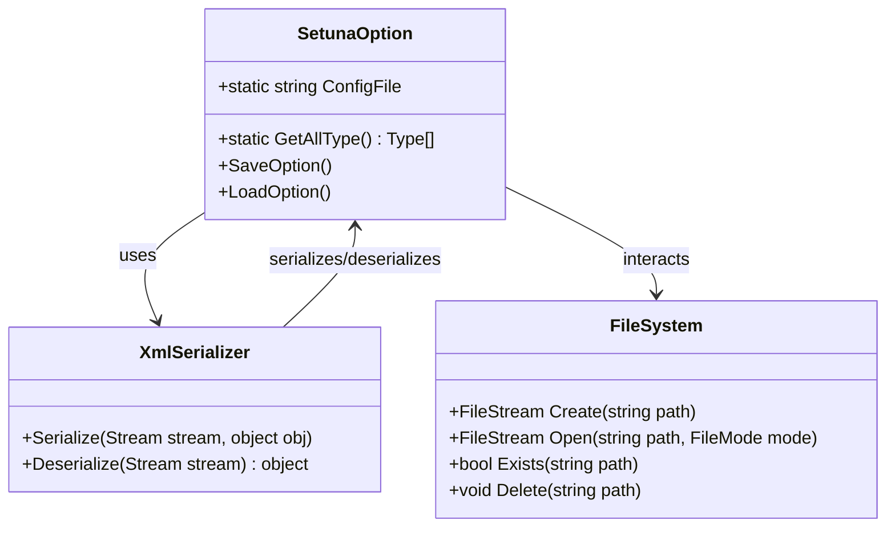

**Diagram sources**
- [SetunaOption.cs](file://SETUNA/Main/Option/SetunaOption.cs#L574-L585)
- [Mainform.cs](file://SETUNA/Mainform.cs#L410-L449)

### Configuration File Management

The system manages configuration files through a centralized approach:

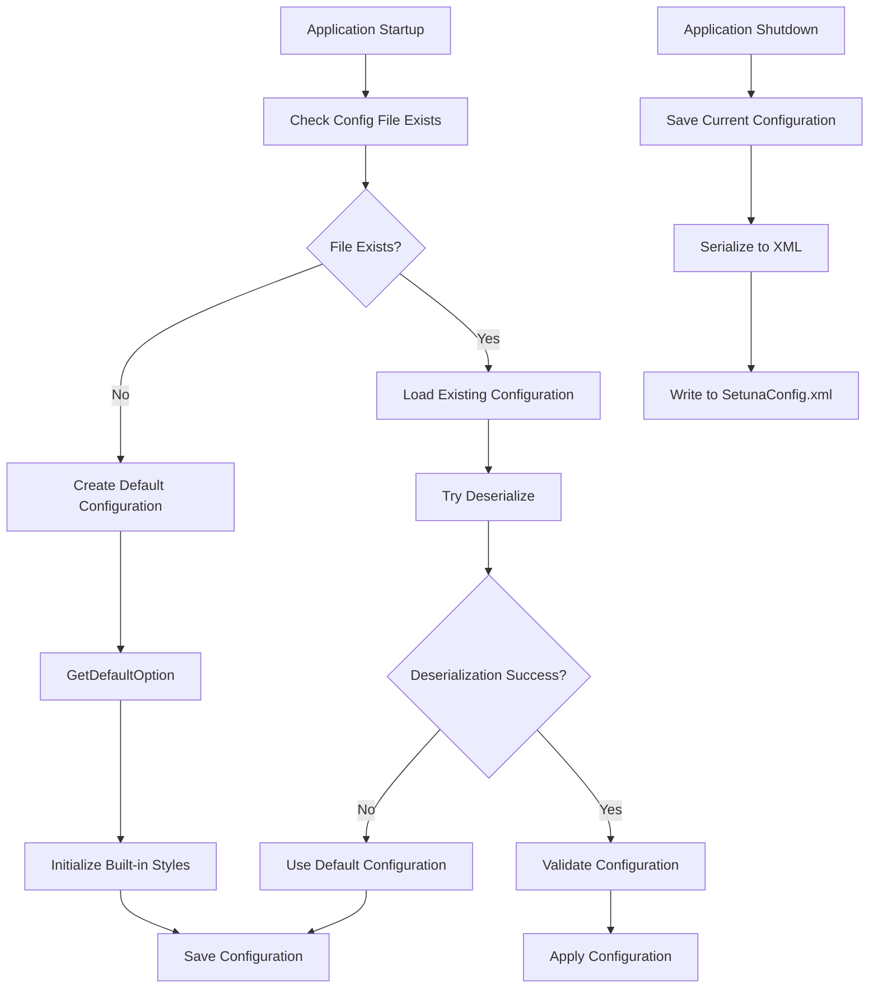

**Diagram sources**
- [Mainform.cs](file://SETUNA/Mainform.cs#L421-L448)

### Serialization Process

The XML serialization process handles complex object graphs including style collections and nested style items:

| Component | Serialization Approach | Error Handling |
|-----------|----------------------|----------------|
| **SetunaOption Root** | Full object graph serialization | Graceful fallback to defaults |
| **Style Collections** | Recursive serialization of CStyle objects | Individual style validation |
| **Style Items** | Type-aware serialization with polymorphic support | Runtime type resolution |
| **Key Bindings** | Primitive type serialization with validation | Conflict detection and resolution |

**Section sources**
- [Mainform.cs](file://SETUNA/Mainform.cs#L410-L449)
- [SetunaOption.cs](file://SETUNA/Main/Option/SetunaOption.cs#L574-L585)

## Temporary vs Permanent Style Application

The style system distinguishes between temporary application of styles for immediate effects and permanent saving to configuration for persistent behavior.

### Temporary Application Mechanism

Temporary style application occurs through direct method calls on CStyle objects:

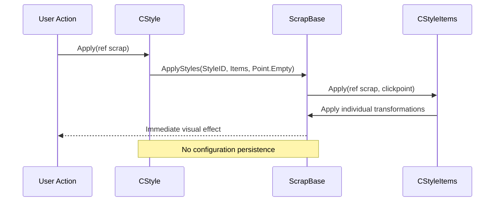

**Diagram sources**
- [CStyle.cs](file://SETUNA/Main/Style/CStyle.cs#L94-L117)

### Permanent Application Storage

Permanent style storage involves saving modifications to the SetunaOption configuration:

```mermaid
sequenceDiagram
participant User as User Interface
participant Form as StyleEditForm
participant Option as SetunaOption
participant Config as Configuration File
User->>Form : Modify Style
Form->>Option : WriteValue()
Option->>Option : Update Style Collection
Option->>Config : SaveOption()
Config->>Config : Serialize to XML
Config-->>User : Configuration Saved
Note over Option,Config : Changes persist across sessions
```

**Diagram sources**
- [StyleEditForm.cs](file://SETUNA/Main/Option/StyleEditForm.cs#L125-L144)
- [SetunaOption.cs](file://SETUNA/Main/Option/SetunaOption.cs#L751-L766)

### Application Lifecycle Integration

The system integrates style application throughout the application lifecycle:

| Lifecycle Phase | Style Application Type | Persistence Level |
|----------------|------------------------|-------------------|
| **Initialization** | Load saved styles from configuration | Permanent |
| **Runtime Editing** | Temporary application for preview | Not persisted |
| **User Modification** | Save changes to configuration | Permanent |
| **Session Termination** | Persist all changes | Permanent |

**Section sources**
- [CStyle.cs](file://SETUNA/Main/Style/CStyle.cs#L94-L117)
- [StyleEditForm.cs](file://SETUNA/Main/Option/StyleEditForm.cs#L125-L144)

## Built-in Style Registration and Access

Built-in styles are automatically registered during system initialization and provide essential functionality without requiring user customization.

### Registration Process

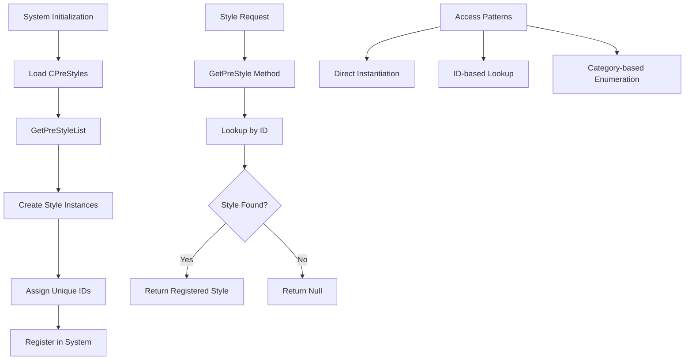

**Diagram sources**
- [CPreStyles.cs](file://SETUNA/Main/Style/CPreStyles.cs#L9-L42)

### Style Access Patterns

The system provides multiple access patterns for built-in styles:

| Access Pattern | Use Case | Implementation |
|----------------|----------|----------------|
| **Direct Instantiation** | Creating new instances | `new CCloseStyle()` |
| **ID-based Lookup** | Finding existing styles | `CPreStyles.GetPreStyle(styleID)` |
| **Category Enumeration** | Listing available styles | `CPreStyles.GetPreStyleList()` |

### Style Inheritance Hierarchy

Built-in styles follow a specific inheritance pattern:

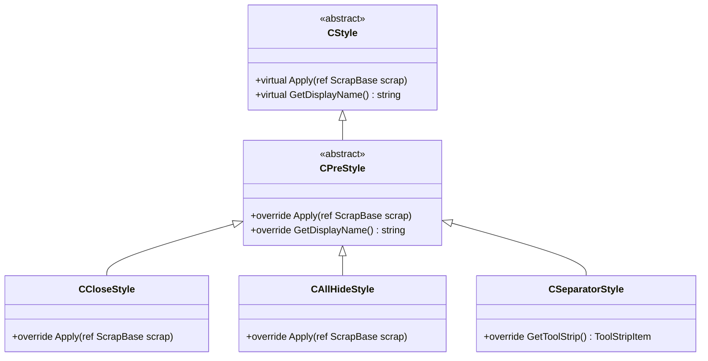

**Diagram sources**
- [CStyle.cs](file://SETUNA/Main/Style/CStyle.cs#L11-L277)
- [CPreStyle.cs](file://SETUNA/Main/Style/CPreStyle.cs#L4-L18)
- [CCloseStyle.cs](file://SETUNA/Main/Style/CCloseStyle.cs#L7-L24)
- [CAllHideStyle.cs](file://SETUNA/Main/Style/CAllHideStyle.cs#L4-L23)
- [CSeparatorStyle.cs](file://SETUNA/Main/Style/CSeparatorStyle.cs#L6-L22)

**Section sources**
- [CPreStyles.cs](file://SETUNA/Main/Style/CPreStyles.cs#L9-L42)
- [CPreStyle.cs](file://SETUNA/Main/Style/CPreStyle.cs#L4-L18)
- [CCloseStyle.cs](file://SETUNA/Main/Style/CCloseStyle.cs#L7-L24)

## Versioning and Backward Compatibility

The style system implements careful versioning and backward compatibility mechanisms to ensure that configuration files remain functional across different application versions.

### Type Resolution Strategy

The system uses a comprehensive type resolution mechanism to handle version changes:

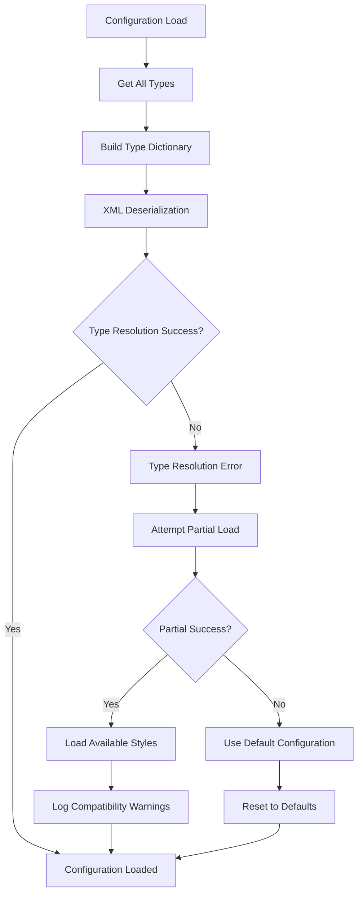

**Diagram sources**
- [SetunaOption.cs](file://SETUNA/Main/Option/SetunaOption.cs#L627-L646)

### Compatibility Validation

The StyleItemDictionary provides compatibility validation for style restoration:

| Style Type | Compatibility Status | Validation Method |
|------------|---------------------|-------------------|
| **CScaleStyleItem** | Fully Compatible | Direct restoration |
| **CMarginStyleItem** | Fully Compatible | Direct restoration |
| **COpacityStyleItem** | Fully Compatible | Direct restoration |
| **CRotateStyleItem** | Fully Compatible | Direct restoration |
| **CCompactStyleItem** | Fully Compatible | Direct restoration |
| **Other Types** | Limited Compatibility | Validation check |

### Error Recovery Mechanisms

The system implements multiple layers of error recovery:

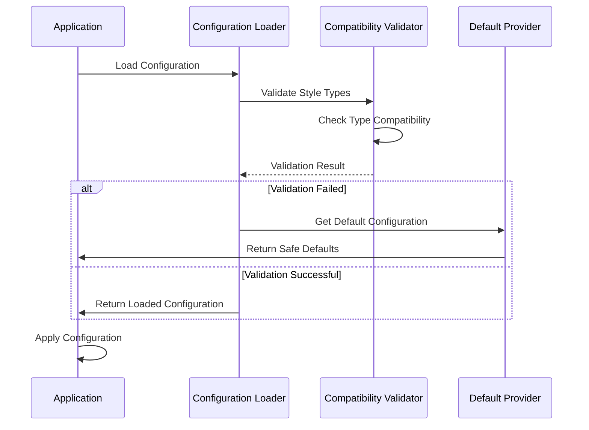

**Diagram sources**
- [Mainform.cs](file://SETUNA/Mainform.cs#L421-L448)
- [StyleItemDictionary.cs](file://SETUNA/Main/StyleItems/StyleItemDictionary.cs#L48-L81)

**Section sources**
- [SetunaOption.cs](file://SETUNA/Main/Option/SetunaOption.cs#L627-L646)
- [StyleItemDictionary.cs](file://SETUNA/Main/StyleItems/StyleItemDictionary.cs#L48-L81)
- [Mainform.cs](file://SETUNA/Mainform.cs#L421-L448)

## Performance Considerations

The style persistence and management system incorporates several performance optimization strategies to ensure responsive user experience and efficient resource utilization.

### Memory Management

The system employs careful memory management through deep copying and object lifecycle management:

| Optimization Technique | Implementation | Benefit |
|----------------------|----------------|---------|
| **Deep Copy Operations** | `CStyle.DeepCopy()` method | Prevents unintended modifications |
| **Object Pooling** | Reuse of style item instances | Reduces garbage collection pressure |
| **Lazy Loading** | Deferred initialization of style collections | Improves startup performance |
| **Weak References** | Event handler cleanup | Prevents memory leaks |

### Serialization Performance

XML serialization performance is optimized through several techniques:

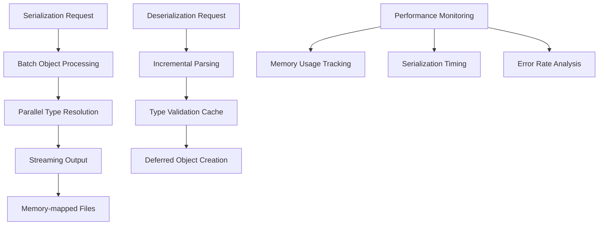

### Caching Strategies

The system implements intelligent caching for frequently accessed styles:

| Cache Level | Scope | Duration | Benefits |
|-------------|-------|----------|----------|
| **Static Cache** | Application-wide | Session lifetime | Fast access to built-in styles |
| **Instance Cache** | Style-specific | Style usage lifetime | Reduced instantiation overhead |
| **Configuration Cache** | File-based | Until modification | Minimized disk I/O |

## Troubleshooting Guide

Common issues and their solutions for style persistence and management:

### Configuration Loading Issues

**Problem**: Configuration fails to load with XML deserialization errors.

**Solution**: 
1. Verify XML file integrity
2. Check for encoding issues
3. Validate against schema
4. Reset to default configuration if necessary

### Style Corruption

**Problem**: Styles appear corrupted or behave unexpectedly.

**Solution**:
1. Run configuration validation
2. Check style item compatibility
3. Rebuild style collection
4. Restore from backup if available

### Performance Degradation

**Problem**: Slow style application or configuration loading.

**Solution**:
1. Monitor memory usage
2. Check for excessive style item nesting
3. Optimize style collection size
4. Review serialization performance

### Version Compatibility

**Problem**: Styles fail to load in newer application versions.

**Solution**:
1. Check style item compatibility
2. Update deprecated style types
3. Validate configuration schema
4. Apply migration scripts if available

**Section sources**
- [Mainform.cs](file://SETUNA/Mainform.cs#L421-L448)
- [SetunaOption.cs](file://SETUNA/Main/Option/SetunaOption.cs#L627-L646)

## Conclusion

The SETUNA style persistence and management system provides a comprehensive framework for handling both predefined and user-defined styles with robust persistence mechanisms. The architecture successfully balances flexibility with performance, offering users extensive customization capabilities while maintaining system stability and backward compatibility.

Key strengths of the system include:

- **Flexible Architecture**: Clean separation between predefined and user-defined styles
- **Robust Persistence**: Reliable XML serialization with comprehensive error handling
- **Performance Optimization**: Efficient caching and lazy loading strategies
- **Backward Compatibility**: Careful versioning and migration support
- **Extensibility**: Well-defined extension points for new style types

The system's design demonstrates best practices in software architecture, providing a solid foundation for future enhancements while maintaining the reliability and usability that users expect from professional screenshot applications.