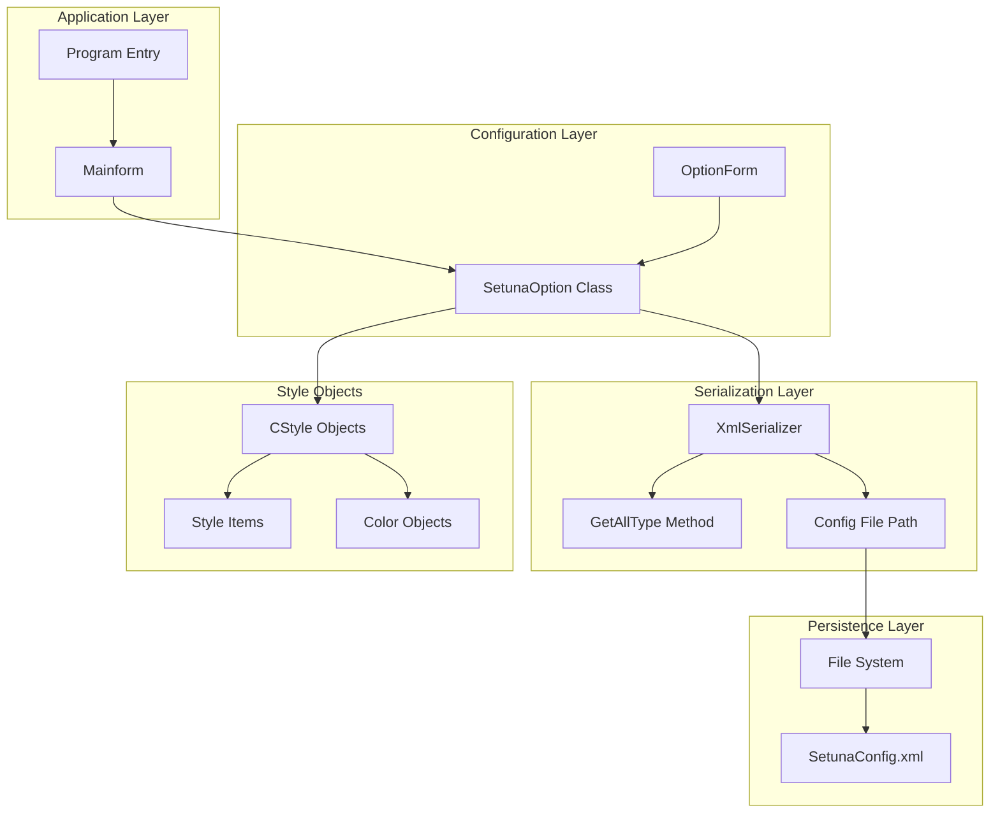
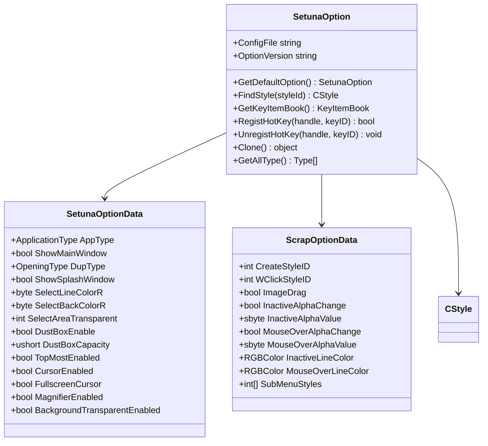
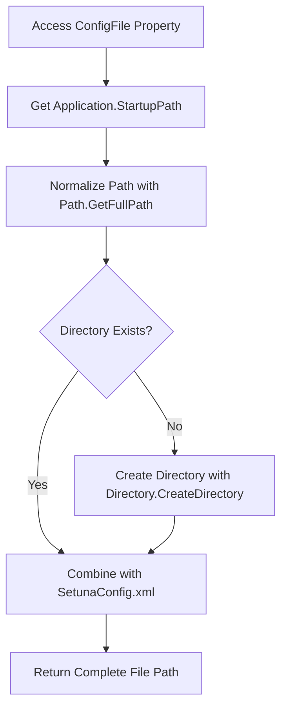
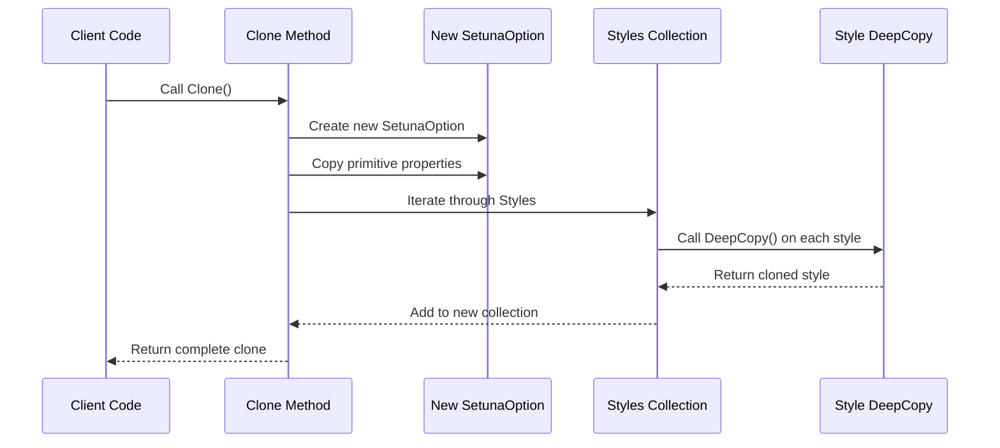
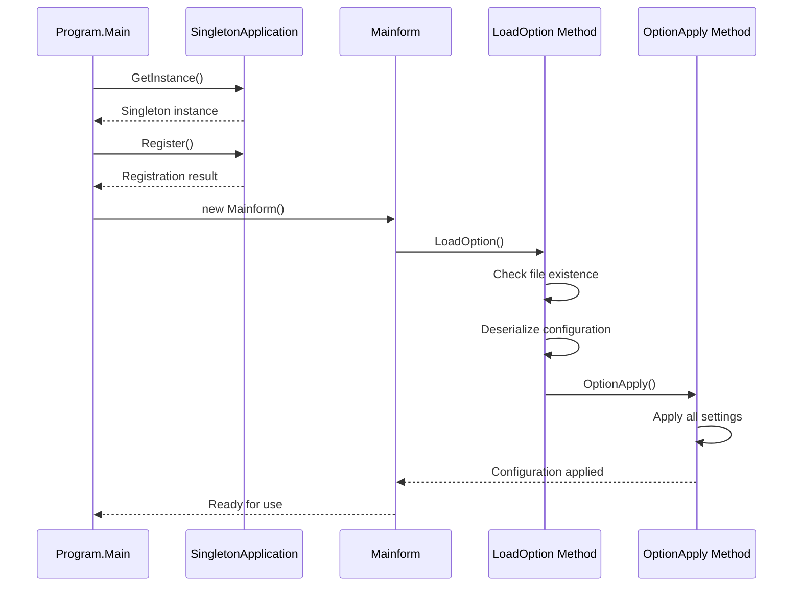

# Style Serialization and Configuration Persistence

<cite>
**Referenced Files in This Document**
- [SetunaOption.cs](file://SETUNA/Main/Option/SetunaOption.cs)
- [Mainform.cs](file://SETUNA/Mainform.cs)
- [CStyle.cs](file://SETUNA/Main/Style/CStyle.cs)
- [StyleItemDictionary.cs](file://SETUNA/Main/StyleItems/StyleItemDictionary.cs)
- [Program.cs](file://SETUNA/Program.cs)
- [OptionForm.cs](file://SETUNA/Main/Option/OptionForm.cs)
</cite>

## Table of Contents
1. [Introduction](#introduction)
2. [System Architecture Overview](#system-architecture-overview)
3. [SetunaOption Class Implementation](#setunaoption-class-implementation)
4. [XML Serialization Mechanism](#xml-serialization-mechanism)
5. [Configuration File Management](#configuration-file-management)
6. [Style Cloning and Deep Copying](#style-cloning-and-deep-copying)
7. [Application Startup Process](#application-startup-process)
8. [Versioning and Compatibility](#versioning-and-compatibility)
9. [XML Structure Examples](#xml-structure-examples)
10. [Troubleshooting Serialization Issues](#troubleshooting-serialization-issues)
11. [Best Practices](#best-practices)

## Introduction

The SETUNA application implements a sophisticated style serialization and configuration persistence system that enables users to customize and maintain their preferred visual and functional settings across application sessions. At the core of this system lies the `SetunaOption` class, which serves as the central configuration container and provides XML serialization capabilities to persist both predefined and user-defined style configurations.

This system ensures that users' customizations, including hotkey assignments, scrap appearance settings, and style preferences, are automatically saved and restored when the application starts. The serialization mechanism handles complex object hierarchies involving style definitions, color configurations, and behavioral settings through a robust XML-based persistence layer.

## System Architecture Overview

The style serialization system follows a layered architecture that separates concerns between configuration management, serialization, and application integration:



**Diagram sources**
- [SetunaOption.cs](file://SETUNA/Main/Option/SetunaOption.cs#L15-L1156)
- [Mainform.cs](file://SETUNA/Mainform.cs#L18-L992)

## SetunaOption Class Implementation

The `SetunaOption` class serves as the primary configuration container and implements the `ICloneable` interface to support deep copying of configuration data. It maintains several key configuration categories:

### Core Properties and Structure

The class contains multiple nested data structures that organize different aspects of the application configuration:

- **SetunaOptionData**: Contains general application settings like startup mode, splash screen visibility, and cursor options
- **ScrapOptionData**: Manages scrap-related settings including opacity, line appearance, and menu configurations  
- **Styles Collection**: Maintains a list of custom style definitions created by users
- **Hotkey Configuration**: Stores keyboard shortcut assignments for various functions

### Static Factory Methods

The class provides factory methods for creating default configurations and managing style collections:



**Diagram sources**
- [SetunaOption.cs](file://SETUNA/Main/Option/SetunaOption.cs#L15-L1156)

**Section sources**
- [SetunaOption.cs](file://SETUNA/Main/Option/SetunaOption.cs#L15-L1156)

## XML Serialization Mechanism

The serialization system leverages the .NET `XmlSerializer` class to convert complex object graphs into XML format and vice versa. The system handles several challenges inherent in serializing rich object hierarchies:

### Type Discovery and Registration

The `GetAllType()` method plays a crucial role in enabling the XmlSerializer to properly handle polymorphic objects within the style system:

```mermaid
flowchart TD
Start([GetAllType Called]) --> GetStyleTypes[Get Style Item Types]
GetStyleTypes --> AddBaseTypes[Add Base Types<br/>SetunaOption, CStyle, Color]
AddBaseTypes --> BuildArray[Build Type Array]
BuildArray --> ReturnTypes[Return Complete Type Array]
GetStyleTypes --> StyleDict[StyleItemDictionary.GetAllStyleItems]
StyleDict --> GetType[GetType() for Each Style Item]
GetType --> AddToArrayList[Add to ArrayList]
AddToArrayList --> BuildArray
```

**Diagram sources**
- [SetunaOption.cs](file://SETUNA/Main/Option/SetunaOption.cs#L626-L646)
- [StyleItemDictionary.cs](file://SETUNA/Main/StyleItems/StyleItemDictionary.cs#L35-L45)

### Serialization Process

The serialization process involves two main operations: saving and loading configuration data:

#### Save Operation
The save operation creates a complete XML representation of the current configuration state:

1. **File Preparation**: Opens or creates the configuration file using the `ConfigFile` property
2. **Type Registration**: Calls `GetAllType()` to register all necessary types with the serializer
3. **Serialization**: Uses XmlSerializer to convert the SetunaOption object to XML format
4. **Error Handling**: Provides user feedback for file access errors

#### Load Operation  
The load operation reconstructs the configuration from persistent storage:

1. **File Existence Check**: Verifies the presence of the configuration file
2. **Default Fallback**: Creates default configuration if file doesn't exist
3. **Deserialization**: Converts XML back to strongly-typed objects
4. **Error Recovery**: Falls back to defaults on deserialization failures

**Section sources**
- [SetunaOption.cs](file://SETUNA/Main/Option/SetunaOption.cs#L626-L646)
- [Mainform.cs](file://SETUNA/Mainform.cs#L402-L448)

## Configuration File Management

The configuration file management system ensures reliable access to the SetunaConfig.xml file through a centralized property and intelligent directory handling:

### ConfigFile Property Implementation

The `ConfigFile` property implements a robust file path resolution strategy:



**Diagram sources**
- [SetunaOption.cs](file://SETUNA/Main/Option/SetunaOption.cs#L574-L585)

### Directory Creation Strategy

The system automatically creates the configuration directory if it doesn't exist, ensuring that the application can write configuration data regardless of the initial installation state. This approach provides robustness against missing directory structures while maintaining predictable file placement.

### File Naming Convention

The configuration file follows a consistent naming convention (`SetunaConfig.xml`) that makes it easy for users to locate and backup their settings. The file is placed in the application's startup directory, ensuring that configuration is portable with the application.

**Section sources**
- [SetunaOption.cs](file://SETUNA/Main/Option/SetunaOption.cs#L574-L585)

## Style Cloning and Deep Copying

The cloning mechanism ensures that configuration changes can be made safely without affecting the original configuration until explicitly committed:

### Clone Method Implementation

The `Clone()` method performs a deep copy of the SetunaOption object, including all nested style configurations:



**Diagram sources**
- [SetunaOption.cs](file://SETUNA/Main/Option/SetunaOption.cs#L751-L766)
- [CStyle.cs](file://SETUNA/Main/Style/CStyle.cs#L148-L163)

### Deep Copy Strategy

The deep copy implementation ensures that modifications to cloned configurations don't affect the original:

1. **Primitive Property Copying**: Copies all scalar values and simple objects
2. **Collection Cloning**: Creates new collections with cloned elements
3. **Style Deep Copy**: Each CStyle object uses its own `DeepCopy()` method
4. **Style Item Cloning**: Individual style items are cloned recursively

This approach prevents accidental modifications to the original configuration while allowing safe experimentation with new settings.

**Section sources**
- [SetunaOption.cs](file://SETUNA/Main/Option/SetunaOption.cs#L751-L766)
- [CStyle.cs](file://SETUNA/Main/Style/CStyle.cs#L148-L163)

## Application Startup Process

The application startup process integrates configuration loading seamlessly with the main application lifecycle:

### Startup Sequence



**Diagram sources**
- [Program.cs](file://SETUNA/Program.cs#L11-L30)
- [Mainform.cs](file://SETUNA/Mainform.cs#L421-L448)

### Configuration Loading Timing

The configuration loading occurs early in the application lifecycle, ensuring that all components have access to user preferences from the moment they initialize. The `LoadOption()` method is called during the main form construction, guaranteeing that settings are available for all subsequent operations.

### Error Recovery Strategy

The startup process includes robust error recovery mechanisms:

1. **Missing File Handling**: Creates default configuration when file doesn't exist
2. **Corruption Recovery**: Falls back to defaults on deserialization failures
3. **User Notification**: Provides clear error messages for file access issues
4. **Graceful Degradation**: Continues operation with safe defaults when problems occur

**Section sources**
- [Program.cs](file://SETUNA/Program.cs#L11-L30)
- [Mainform.cs](file://SETUNA/Mainform.cs#L421-L448)

## Versioning and Compatibility

The system implements basic versioning through the `OptionVersion` property and provides fallback mechanisms for backward compatibility:

### Version Management

The `OptionVersion` property currently returns a constant value ("1.0"), indicating the current version of the configuration format. While this provides a foundation for future versioning, the system relies on the XmlSerializer's ability to handle changes in the object model gracefully.

### Backward Compatibility Strategies

Several mechanisms ensure backward compatibility:

1. **Default Value Fallback**: Missing properties receive sensible defaults
2. **Type Evolution**: The `GetAllType()` method adapts to new style types
3. **Error Recovery**: Corrupted configurations trigger automatic fallback to defaults
4. **Incremental Updates**: New features can be added without breaking existing configurations

### Future Enhancement Opportunities

The versioning system could be enhanced to support:
- **Schema Migration**: Automatic conversion of older configuration formats
- **Feature Flags**: Conditional loading based on version compatibility
- **Migration Tools**: User-friendly upgrade processes for major version changes

**Section sources**
- [SetunaOption.cs](file://SETUNA/Main/Option/SetunaOption.cs#L620-L624)

## XML Structure Examples

The serialized configuration produces XML that represents the complete state of the application's style system:

### Basic Configuration Structure

```xml
<?xml version="1.0"?>
<SetunaOption xmlns:xsi="http://www.w3.org/2001/XMLSchema-instance" xmlns:xsd="http://www.w3.org/2001/XMLSchema">
  <Setuna>
    <AppType>ApplicationMode</AppType>
    <ShowMainWindow>true</ShowMainWindow>
    <DupType>Normal</DupType>
    <ShowSplashWindow>true</ShowSplashWindow>
    <SelectLineSolid>true</SelectLineSolid>
    <SelectLineColorR>0</SelectLineColorR>
    <SelectLineColorG>0</SelectLineColorG>
    <SelectLineColorB>255</SelectLineColorB>
    <SelectBackColorR>0</SelectBackColorR>
    <SelectBackColorG>0</SelectBackColorR>
    <SelectBackColorB>255</SelectBackColorB>
    <SelectAreaTransparent>80</SelectAreaTransparent>
    <DustBoxEnable>true</DustBoxEnable>
    <DustBoxCapacity>5</DustBoxCapacity>
    <!-- Additional Setuna settings -->
  </Setuna>
  <Scrap>
    <CreateStyleID>1</CreateStyleID>
    <WClickStyleID>2</WClickStyleID>
    <ImageDrag>true</ImageDrag>
    <InactiveAlphaChange>true</InactiveAlphaChange>
    <InactiveAlphaValue>90</InactiveAlphaValue>
    <MouseOverAlphaChange>true</MouseOverAlphaChange>
    <MouseOverAlphaValue>10</MouseOverAlphaValue>
    <InactiveLineColor>
      <Red>0</Red>
      <Green>0</Green>
      <Blue>0</Blue>
    </InactiveLineColor>
    <MouseOverLineColor>
      <Red>0</Red>
      <Green>0</Green>
      <Blue>0</Blue>
    </MouseOverLineColor>
    <SubMenuStyles>
      <int>1</int>
      <int>2</int>
      <!-- Style IDs for menu items -->
    </SubMenuStyles>
  </Scrap>
  <Styles>
    <CStyle>
      <StyleID>1</StyleID>
      <StyleName>复制</StyleName>
      <Items>
        <CStyleItem xsi:type="CCopyStyleItem">
          <CopyFromSource>true</CopyFromSource>
        </CStyleItem>
      </Items>
      <KeyItems>
        <Keys>Return</Keys>
      </KeyItems>
    </CStyle>
    <!-- Additional style definitions -->
  </Styles>
</SetunaOption>
```

### Style Item Serialization

Individual style items are serialized with their specific properties:

```xml
<CStyleItem xsi:type="CMarginStyleItem">
  <BorderStyle>0</BorderStyle>
  <MarginSize>1</MarginSize>
  <MarginColorRed>255</MarginColorRed>
  <MarginColorGreen>128</MarginColorGreen>
  <MarginColorBlue>64</MarginColorBlue>
</CStyleItem>
```

The `xsi:type` attribute enables the XmlSerializer to correctly instantiate the appropriate derived class during deserialization.

## Troubleshooting Serialization Issues

Common serialization problems and their solutions:

### File Access Problems

**Symptoms**: Configuration not saving or loading
**Causes**: Insufficient permissions, locked files, or invalid paths
**Solutions**:
- Verify application has write permissions to the startup directory
- Ensure no other instances are accessing the configuration file
- Check antivirus software for file access restrictions

### XML Corruption Issues

**Symptoms**: Configuration loads with default values
**Causes**: Interrupted save operations or manual file editing
**Solutions**:
- Delete corrupted configuration file to trigger default recreation
- Implement backup strategies for critical configurations
- Add checksum validation for configuration integrity

### Type Registration Failures

**Symptoms**: Styles not loading correctly or throwing exceptions
**Causes**: Missing type information in serialization
**Solutions**:
- Verify `GetAllType()` includes all custom style types
- Check for assembly loading issues
- Ensure all referenced types are publicly accessible

### Memory and Performance Issues

**Symptoms**: Slow startup or excessive memory usage
**Causes**: Large configuration files or inefficient cloning
**Solutions**:
- Optimize style collection sizes
- Implement lazy loading for unused configurations
- Monitor memory usage during serialization operations

**Section sources**
- [Mainform.cs](file://SETUNA/Mainform.cs#L421-L448)

## Best Practices

### Configuration Management

1. **Separation of Concerns**: Keep configuration data separate from business logic
2. **Validation**: Implement validation for configuration values
3. **Backup Strategy**: Regularly backup configuration files
4. **Testing**: Test serialization with various configuration combinations

### Performance Optimization

1. **Lazy Loading**: Load configuration only when needed
2. **Caching**: Cache frequently accessed configuration values
3. **Efficient Serialization**: Minimize the amount of data serialized
4. **Async Operations**: Perform serialization operations asynchronously

### Error Handling

1. **Graceful Degradation**: Always provide sensible defaults
2. **User Feedback**: Inform users of configuration issues
3. **Logging**: Log serialization errors for debugging
4. **Recovery Mechanisms**: Implement automatic recovery from corruption

### Extensibility

1. **Plugin Architecture**: Design for adding new style types
2. **Version Compatibility**: Plan for future configuration format changes
3. **Documentation**: Maintain clear documentation of configuration structure
4. **Testing**: Test with various configuration scenarios

The style serialization and configuration persistence system in SETUNA demonstrates a robust approach to maintaining user preferences across application sessions. Through careful design of the SetunaOption class, intelligent XML serialization, and comprehensive error handling, the system provides reliable configuration management while remaining extensible for future enhancements.