# User-Defined Styles

<cite>
**Referenced Files in This Document**
- [SetunaOption.cs](file://SETUNA/Main/Option/SetunaOption.cs)
- [StyleEditForm.cs](file://SETUNA/Main/Option/StyleEditForm.cs)
- [CStyle.cs](file://SETUNA/Main/Style/CStyle.cs)
- [CStyleItem.cs](file://SETUNA/Main/StyleItems/CStyleItem.cs)
- [KeyItem.cs](file://SETUNA/Main/KeyItems/KeyItem.cs)
- [COpacityStyleItem.cs](file://SETUNA/Main/StyleItems/COpacityStyleItem.cs)
- [CScaleStyleItem.cs](file://SETUNA/Main/StyleItems/CScaleStyleItem.cs)
- [CMarginStyleItem.cs](file://SETUNA/Main/StyleItems/CMarginStyleItem.cs)
- [CRotateStyleItem.cs](file://SETUNA/Main/StyleItems/CRotateStyleItem.cs)
- [OptionForm.cs](file://SETUNA/Main/Option/OptionForm.cs)
</cite>

## Table of Contents
1. [Introduction](#introduction)
2. [System Architecture](#system-architecture)
3. [Core Components](#core-components)
4. [Styles Collection Management](#styles-collection-management)
5. [Style Creation and Editing](#style-creation-and-editing)
6. [Style Item Operations](#style-item-operations)
7. [Hotkey Assignment System](#hotkey-assignment-system)
8. [Persistence and Configuration](#persistence-and-configuration)
9. [Validation and Error Handling](#validation-and-error-handling)
10. [Advanced Style Examples](#advanced-style-examples)
11. [Troubleshooting Guide](#troubleshooting-guide)
12. [Conclusion](#conclusion)

## Introduction

The Setuna application provides a sophisticated user-defined style management system that allows users to create, modify, and organize custom automation operations. This system enables users to define complex sequences of image manipulation operations with associated keyboard shortcuts, creating powerful productivity workflows for screenshot capture and editing tasks.

The style management system is built around three primary components: the `SetunaOption` class that manages the overall configuration, the `StyleEditForm` that provides the user interface for creating and modifying styles, and the `CStyle` class that represents individual user-defined automation operations.

## System Architecture

The user-defined style management system follows a layered architecture with clear separation of concerns:

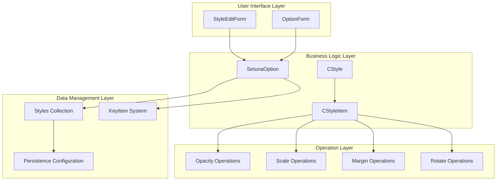

**Diagram sources**
- [SetunaOption.cs](file://SETUNA/Main/Option/SetunaOption.cs#L14-L1156)
- [StyleEditForm.cs](file://SETUNA/Main/Option/StyleEditForm.cs#L11-L293)
- [CStyle.cs](file://SETUNA/Main/Style/CStyle.cs#L10-L277)

## Core Components

### SetunaOption Class

The `SetunaOption` class serves as the central configuration manager for the entire application, including the styles collection. It implements the `ICloneable` interface to support configuration copying and restoration.

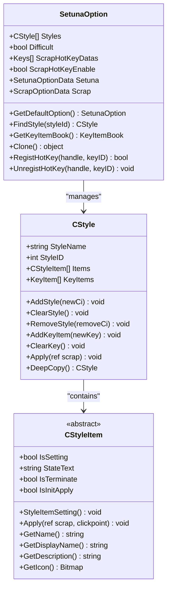

**Diagram sources**
- [SetunaOption.cs](file://SETUNA/Main/Option/SetunaOption.cs#L14-L1156)
- [CStyle.cs](file://SETUNA/Main/Style/CStyle.cs#L10-L277)
- [CStyleItem.cs](file://SETUNA/Main/StyleItems/CStyleItem.cs#L8-L101)

**Section sources**
- [SetunaOption.cs](file://SETUNA/Main/Option/SetunaOption.cs#L14-L1156)
- [CStyle.cs](file://SETUNA/Main/Style/CStyle.cs#L10-L277)

### StyleEditForm Class

The `StyleEditForm` provides the graphical interface for creating and modifying user-defined styles. It integrates with the `SetunaOption` system to manage style collections and handles the binding between UI controls and underlying style objects.

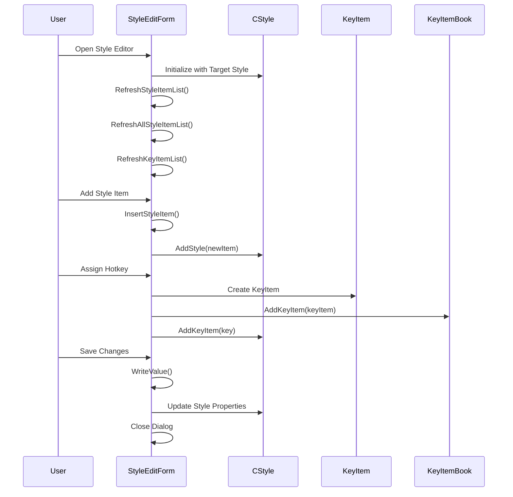

**Diagram sources**
- [StyleEditForm.cs](file://SETUNA/Main/Option/StyleEditForm.cs#L13-L293)

**Section sources**
- [StyleEditForm.cs](file://SETUNA/Main/Option/StyleEditForm.cs#L11-L293)

## Styles Collection Management

### Styles Collection Structure

The `Styles` collection in `SetunaOption` is a `List<CStyle>` that stores all user-defined styles. Each style contains multiple operations (`CStyleItem` instances) and associated hotkeys.

### FindStyle Method

The `FindStyle` method provides efficient retrieval of user-defined styles by their unique identifier:

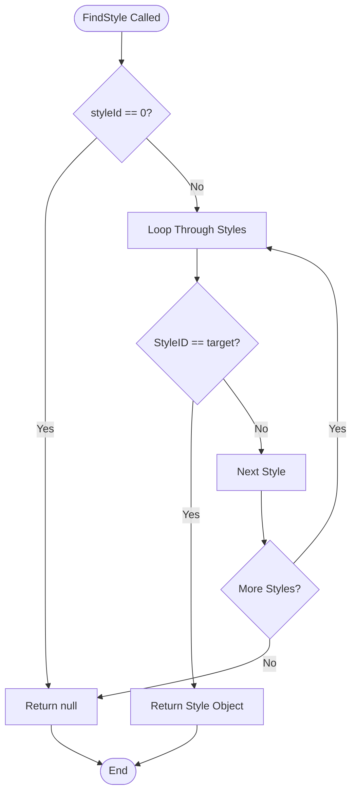

**Diagram sources**
- [SetunaOption.cs](file://SETUNA/Main/Option/SetunaOption.cs#L687-L703)

**Section sources**
- [SetunaOption.cs](file://SETUNA/Main/Option/SetunaOption.cs#L687-L703)

## Style Creation and Editing

### Creating New Styles

New styles are created through the `StyleEditForm` constructor, which initializes with either a new empty style or an existing style object:

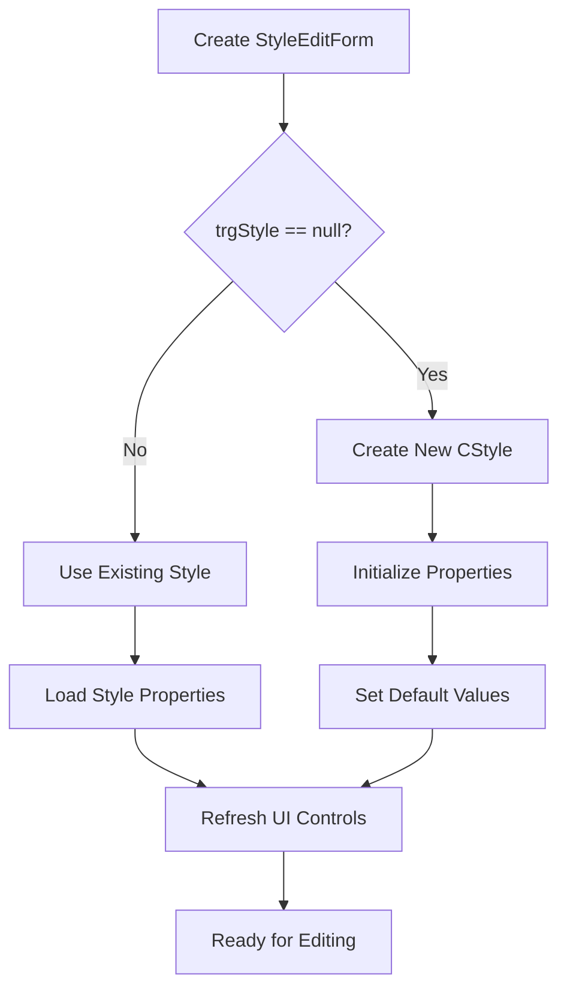

**Diagram sources**
- [StyleEditForm.cs](file://SETUNA/Main/Option/StyleEditForm.cs#L14-L30)

### Style Property Binding

The `Style` property in `StyleEditForm` provides read-only access to the underlying `CStyle` object, enabling seamless integration between the form and the style data model.

**Section sources**
- [StyleEditForm.cs](file://SETUNA/Main/Option/StyleEditForm.cs#L33-L35)

## Style Item Operations

### CStyleItem Architecture

The `CStyleItem` abstract class defines the interface for all style operations. Each style item represents a specific image manipulation operation with configurable parameters.

### Available Style Item Types

The system supports various types of style items:

| Style Item Type | Purpose | Key Operations |
|----------------|---------|----------------|
| `COpacityStyleItem` | Adjust transparency | Absolute/Relative opacity values |
| `CScaleStyleItem` | Resize images | Fixed percentage/Incremental scaling |
| `CMarginStyleItem` | Border styling | Border types, colors, sizes |
| `CRotateStyleItem` | Rotation/flipping | Rotation angles, reflection modes |
| `CMoveStyleItem` | Position adjustment | Movement coordinates |

### Adding Style Items

The `InsertStyleItem` method handles the creation and insertion of new style items:

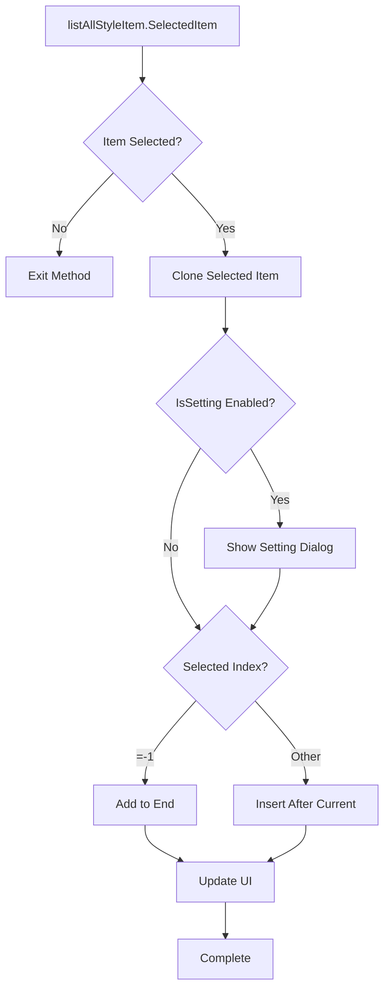

**Diagram sources**
- [StyleEditForm.cs](file://SETUNA/Main/Option/StyleEditForm.cs#L147-L164)

**Section sources**
- [StyleEditForm.cs](file://SETUNA/Main/Option/StyleEditForm.cs#L147-L164)
- [CStyleItem.cs](file://SETUNA/Main/StyleItems/CStyleItem.cs#L8-L101)

## Hotkey Assignment System

### KeyItem Integration

The hotkey assignment system uses the `KeyItem` class to manage keyboard shortcuts for styles. Each `KeyItem` is associated with a specific style and can be managed through the `KeyItemBook` system.

### Hotkey Validation

The system provides real-time validation of hotkey conflicts and displays user-friendly warnings:

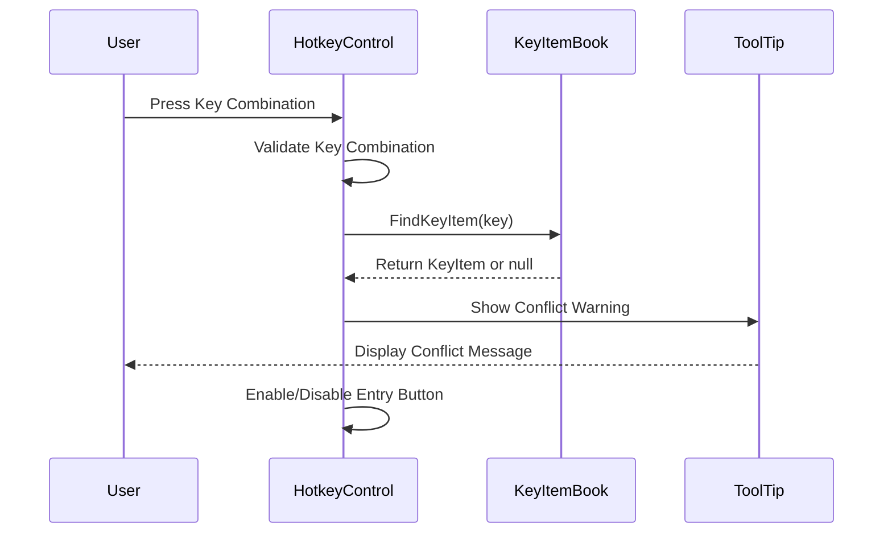

**Diagram sources**
- [StyleEditForm.cs](file://SETUNA/Main/Option/StyleEditForm.cs#L255-L274)

**Section sources**
- [KeyItem.cs](file://SETUNA/Main/KeyItems/KeyItem.cs#L8-L99)

## Persistence and Configuration

### WriteValue Method

The `WriteValue` method in `StyleEditForm` handles the persistence of style configuration changes:

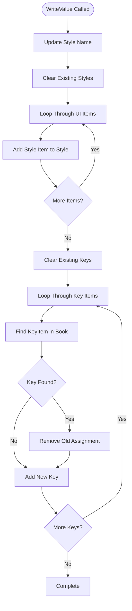

**Diagram sources**
- [StyleEditForm.cs](file://SETUNA/Main/Option/StyleEditForm.cs#L125-L144)

### Configuration Storage

Style configurations are persisted through the `SetunaOption` class, which manages the XML serialization of the entire configuration including styles, hotkeys, and application settings.

**Section sources**
- [StyleEditForm.cs](file://SETUNA/Main/Option/StyleEditForm.cs#L125-L144)

## Validation and Error Handling

### Style Name Validation

The system enforces basic validation rules for style names:

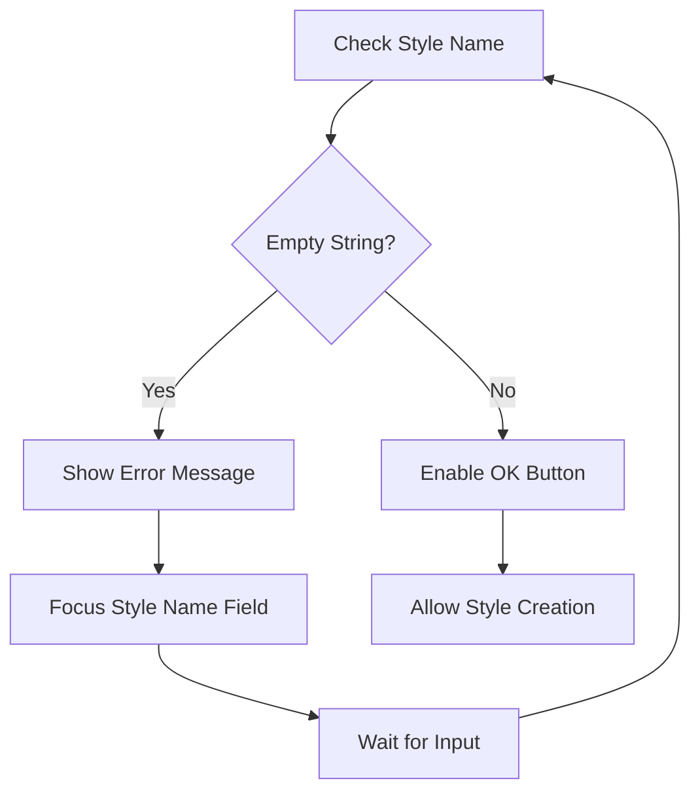

**Diagram sources**
- [StyleEditForm.cs](file://SETUNA/Main/Option/StyleEditForm.cs#L106-L111)

### Hotkey Conflict Detection

The system automatically detects and warns users about hotkey conflicts:

| Conflict Type | Behavior | User Action Required |
|--------------|----------|---------------------|
| Duplicate Assignment | Warning displayed | Choose different key combination |
| Reserved Keys | Automatic prevention | System prevents assignment |
| Modifier Conflicts | Real-time validation | Immediate feedback |

**Section sources**
- [StyleEditForm.cs](file://SETUNA/Main/Option/StyleEditForm.cs#L106-L111)
- [StyleEditForm.cs](file://SETUNA/Main/Option/StyleEditForm.cs#L255-L274)

## Advanced Style Examples

### Complex Multi-Operation Style

A sophisticated style combining multiple operations demonstrates the power of the system:

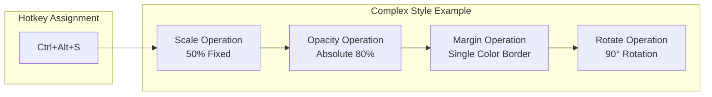

**Diagram sources**
- [SetunaOption.cs](file://SETUNA/Main/Option/SetunaOption.cs#L509-L522)

### Basic Automation Style

A simple style for basic automation showcases fundamental concepts:

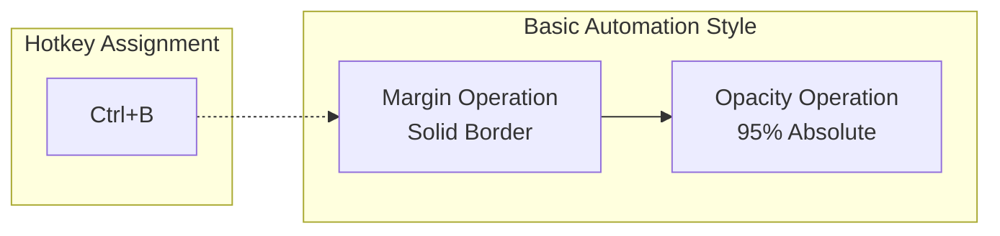

**Diagram sources**
- [SetunaOption.cs](file://SETUNA/Main/Option/SetunaOption.cs#L509-L522)

**Section sources**
- [SetunaOption.cs](file://SETUNA/Main/Option/SetunaOption.cs#L509-L522)

## Troubleshooting Guide

### Common Issues and Solutions

| Issue | Symptoms | Solution |
|-------|----------|----------|
| Style Not Saving | Changes lost on restart | Verify XML file permissions |
| Hotkey Conflicts | Keys not responding | Check for conflicting assignments |
| Style Items Missing | Operations not applied | Re-add missing style items |
| Memory Issues | Slow performance | Reduce number of style items |

### Debugging Style Problems

1. **Validate Style Names**: Ensure all styles have non-empty names
2. **Check Hotkey Assignments**: Verify no duplicate key combinations
3. **Review Style Item Order**: Confirm logical operation sequence
4. **Test Individual Operations**: Isolate problematic style items

**Section sources**
- [StyleEditForm.cs](file://SETUNA/Main/Option/StyleEditForm.cs#L106-L111)

## Conclusion

The user-defined style management system in Setuna provides a comprehensive framework for creating sophisticated automation workflows. Through the integration of the `SetunaOption`, `StyleEditForm`, and `CStyle` classes, users can build complex sequences of image manipulation operations with intuitive hotkey assignments.

The system's modular architecture, robust validation mechanisms, and flexible configuration options make it suitable for both casual users and power users who need advanced automation capabilities. The persistent storage system ensures that user configurations are reliably maintained across application sessions.

Future enhancements could include style templates, batch operations, and more sophisticated conflict resolution mechanisms to further improve the user experience while maintaining the system's extensible architecture.