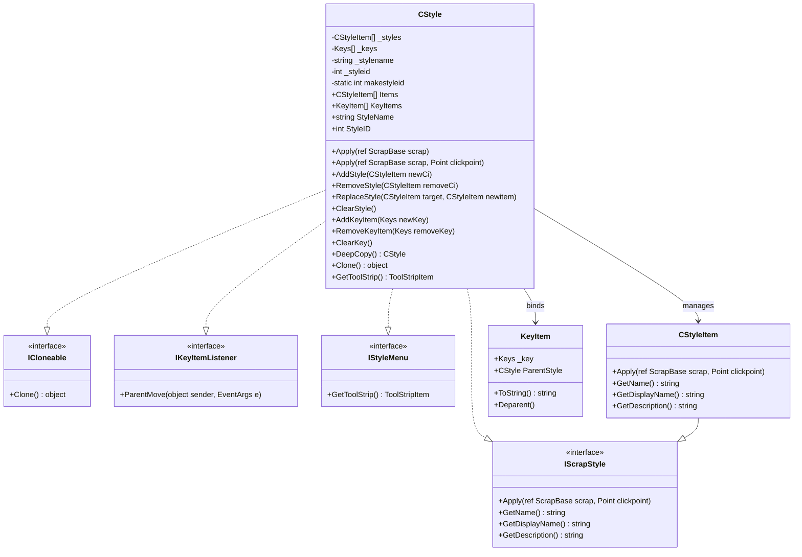
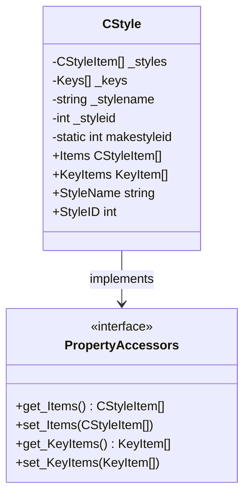
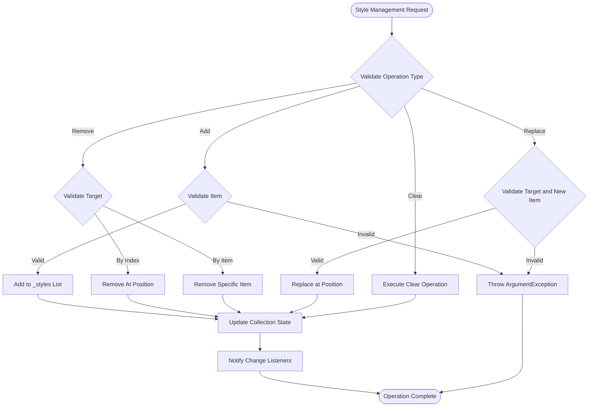
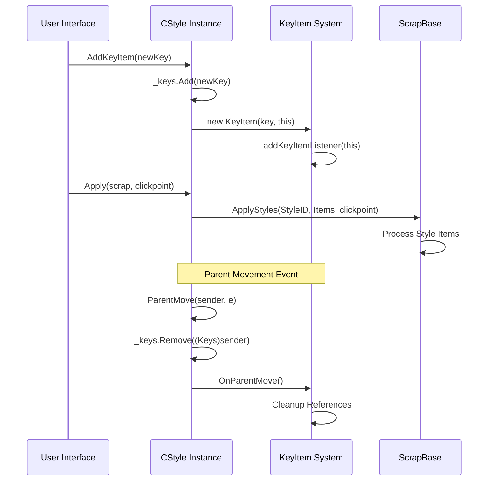
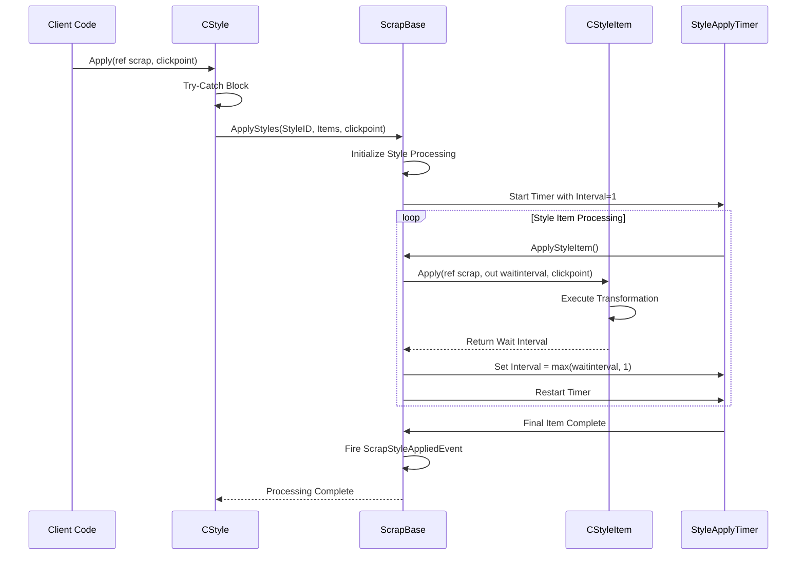
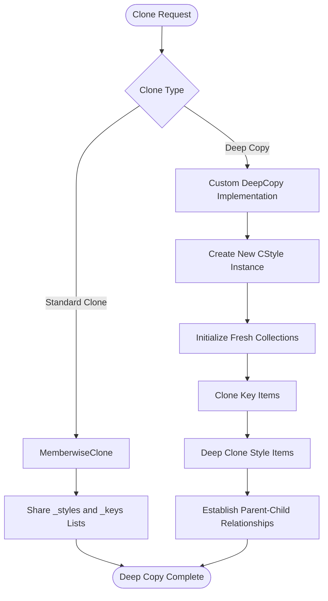
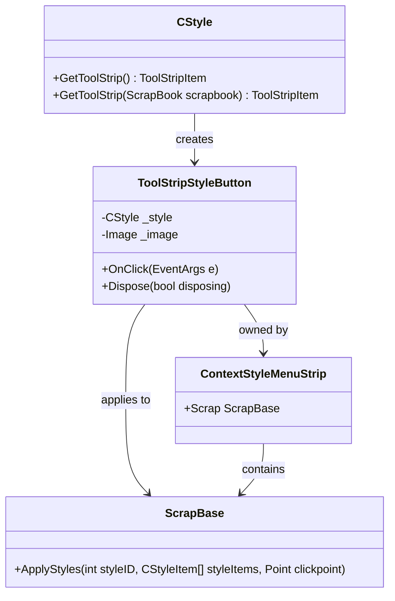

# CStyle Container Pattern

<cite>
**Referenced Files in This Document**
- [CStyle.cs](file://SETUNA/Main/Style/CStyle.cs)
- [IScrapStyle.cs](file://SETUNA/Main/StyleItems/IScrapStyle.cs)
- [IStyleMenu.cs](file://SETUNA/Main/Style/IStyleMenu.cs)
- [IKeyItemListener.cs](file://SETUNA/Main/KeyItems/IKeyItemListener.cs)
- [CStyleItem.cs](file://SETUNA/Main/StyleItems/CStyleItem.cs)
- [KeyItem.cs](file://SETUNA/Main/KeyItems/KeyItem.cs)
- [ScrapBase.cs](file://SETUNA/Main/ScrapBase.cs)
- [ToolStripStyleButton.cs](file://SETUNA/Main/ToolStripStyleButton.cs)
</cite>

## Table of Contents
1. [Introduction](#introduction)
2. [Architecture Overview](#architecture-overview)
3. [Interface Implementation](#interface-implementation)
4. [Core Data Structures](#core-data-structures)
5. [Style Management Operations](#style-management-operations)
6. [Hotkey Integration](#hotkey-integration)
7. [Style Application Pipeline](#style-application-pipeline)
8. [Cloning and Deep Copying](#cloning-and-deep-copying)
9. [UI Integration](#ui-integration)
10. [Exception Handling](#exception-handling)
11. [Architectural Decisions](#architectural-decisions)
12. [Performance Considerations](#performance-considerations)
13. [Best Practices](#best-practices)

## Introduction

The CStyle class serves as a sophisticated container pattern implementation within the SETUNA screenshot application, specifically designed to manage and orchestrate multiple CStyleItem transformations. As a central orchestrator in the style system, CStyle implements multiple interfaces to seamlessly integrate with the scrap lifecycle, configuration management, hotkey binding, and UI menu rendering systems.

This container pattern encapsulates a collection of style items while providing unified access to their combined functionality through standardized interfaces. The implementation demonstrates advanced object-oriented design principles, including composition over inheritance, polymorphic behavior through interface segregation, and robust lifecycle management through event-driven architecture.

## Architecture Overview

The CStyle class implements a comprehensive container pattern that manages two distinct collections: style items and associated hotkeys. This dual-collection approach enables sophisticated style orchestration while maintaining clean separation of concerns between visual transformations and user interaction bindings.

**Diagram sources**
- [CStyle.cs](file://SETUNA/Main/Style/CStyle.cs#L11-L277)
- [IScrapStyle.cs](file://SETUNA/Main/StyleItems/IScrapStyle.cs#L6-L20)
- [IStyleMenu.cs](file://SETUNA/Main/Style/IStyleMenu.cs#L6-L11)
- [IKeyItemListener.cs](file://SETUNA/Main/KeyItems/IKeyItemListener.cs#L6-L11)

**Section sources**
- [CStyle.cs](file://SETUNA/Main/Style/CStyle.cs#L11-L277)

## Interface Implementation

### IScrapStyle Integration

The CStyle class implements the IScrapStyle interface to provide unified style application capabilities. This integration enables CStyle to participate seamlessly in the scrap processing pipeline while maintaining the polymorphic behavior expected of style components.

The implementation delegates core functionality to individual style items while providing centralized coordination. The Apply methods serve as entry points that trigger the orchestrated execution of all contained style items through the ScrapBase.ApplyStyles mechanism.

### ICloneable Pattern

CStyle implements the ICloneable interface with two distinct cloning strategies: shallow cloning through the standard Clone method and deep cloning through the specialized DeepCopy method. This dual approach accommodates different use cases within the application lifecycle.

### IKeyItemListener Integration

As an IKeyItemListener, CStyle participates in the hotkey management system by responding to parent movement events. This integration ensures that when parent containers move, associated hotkeys are properly managed and cleaned up, preventing memory leaks and maintaining system integrity.

### IStyleMenu Interface

The IStyleMenu implementation provides UI integration by generating ToolStripItem instances that represent the style in graphical interfaces. This enables seamless integration with menu systems and toolbar controls while maintaining the abstraction layer between presentation and functionality.

**Section sources**
- [CStyle.cs](file://SETUNA/Main/Style/CStyle.cs#L11-L147)
- [IScrapStyle.cs](file://SETUNA/Main/StyleItems/IScrapStyle.cs#L6-L20)
- [IStyleMenu.cs](file://SETUNA/Main/Style/IStyleMenu.cs#L6-L11)
- [IKeyItemListener.cs](file://SETUNA/Main/KeyItems/IKeyItemListener.cs#L6-L11)

## Core Data Structures

### Internal Collections Management

CStyle maintains two primary collections through protected List<T> fields: `_styles` for style item management and `_keys` for hotkey associations. These collections provide efficient access and modification capabilities while maintaining encapsulation through property-based accessors.

The array-based property accessors (`Items` and `KeyItems`) implement conversion patterns that enable seamless interoperability between the internal list-based storage and external array-based APIs. This design choice facilitates integration with various subsystems while maintaining internal consistency.

### Static ID Management

The class maintains a static `makestyleid` field that ensures globally unique style identifiers. This centralized approach prevents conflicts and simplifies style management across the application lifecycle.

**Diagram sources**
- [CStyle.cs](file://SETUNA/Main/Style/CStyle.cs#L16-L58)

**Section sources**
- [CStyle.cs](file://SETUNA/Main/Style/CStyle.cs#L252-L265)

## Style Management Operations

### Collection Manipulation Methods

CStyle provides comprehensive collection manipulation capabilities through dedicated methods for adding, removing, replacing, and clearing style items. Each operation maintains collection integrity while providing appropriate feedback mechanisms.

#### AddStyle Operation
The AddStyle method provides a straightforward interface for appending new style items to the collection. This operation maintains the order of insertion and ensures immediate availability of the new item within the style orchestration pipeline.

#### RemoveStyle Variants
Multiple removal strategies accommodate different use cases: index-based removal for positional operations and item-based removal for content-focused modifications. Both approaches ensure proper cleanup and collection integrity.

#### ReplaceStyle Operation
The ReplaceStyle method enables atomic replacement of existing style items with new instances. This operation preserves collection position while ensuring thread-safe replacement semantics.

#### ClearStyle Method
The ClearStyle method provides bulk removal capabilities while maintaining collection capacity for future additions. This approach optimizes memory allocation patterns for dynamic style management scenarios.

### Iteration and Enumeration

The NextStyle method implements an iterator pattern that enables enumeration of contained style items. This lazy evaluation approach minimizes memory overhead while providing flexible iteration capabilities for various processing scenarios.

**Diagram sources**
- [CStyle.cs](file://SETUNA/Main/Style/CStyle.cs#L173-L214)

**Section sources**
- [CStyle.cs](file://SETUNA/Main/Style/CStyle.cs#L173-L214)

## Hotkey Integration

### KeyItem Association Management

CStyle integrates with the KeyItem system to provide hotkey binding capabilities. The KeyItems property accessor creates new KeyItem instances with proper parent-child relationships, ensuring that hotkey assignments remain synchronized with style lifecycle events.

### Hotkey Lifecycle Management

The integration with IKeyItemListener enables automatic cleanup when parent containers move or are disposed. The ParentMove method removes associated keys from the collection, preventing orphaned references and maintaining system stability.

### Key Addition and Removal

The AddKeyItem and RemoveKeyItem methods provide direct manipulation of hotkey associations. These operations support dynamic hotkey management scenarios while maintaining collection integrity and preventing duplicate entries.

**Diagram sources**
- [CStyle.cs](file://SETUNA/Main/Style/CStyle.cs#L217-L238)
- [KeyItem.cs](file://SETUNA/Main/KeyItems/KeyItem.cs#L68-L86)

**Section sources**
- [CStyle.cs](file://SETUNA/Main/Style/CStyle.cs#L40-L58)
- [CStyle.cs](file://SETUNA/Main/Style/CStyle.cs#L217-L238)
- [KeyItem.cs](file://SETUNA/Main/KeyItems/KeyItem.cs#L37-L46)

## Style Application Pipeline

### Delegation to ScrapBase

The Apply methods delegate style execution to the ScrapBase.ApplyStyles method, which orchestrates the sequential application of all contained style items. This delegation pattern enables centralized processing while maintaining flexibility in execution strategies.

### Exception Handling Strategy

Both Apply methods implement comprehensive exception handling to prevent style application failures from disrupting the broader application workflow. The exception handling captures and logs errors while allowing subsequent style items to process normally.

### Execution Coordination

The application pipeline coordinates style execution through the ScrapBase timer-based system, which processes style items asynchronously with configurable delays. This approach prevents UI blocking while ensuring proper sequencing of visual transformations.

**Diagram sources**
- [CStyle.cs](file://SETUNA/Main/Style/CStyle.cs#L94-L117)
- [ScrapBase.cs](file://SETUNA/Main/ScrapBase.cs#L845-L866)
- [ScrapBase.cs](file://SETUNA/Main/ScrapBase.cs#L869-L915)

**Section sources**
- [CStyle.cs](file://SETUNA/Main/Style/CStyle.cs#L94-L117)
- [ScrapBase.cs](file://SETUNA/Main/ScrapBase.cs#L845-L866)
- [ScrapBase.cs](file://SETUNA/Main/ScrapBase.cs#L869-L915)

## Cloning and Deep Copying

### Shallow Cloning Implementation

The standard Clone method utilizes MemberwiseClone to provide shallow copying capabilities. This approach efficiently duplicates the container while sharing underlying collections, which is appropriate for scenarios requiring lightweight duplication without deep content replication.

### Deep Copying Strategy

The DeepCopy method implements a comprehensive deep cloning strategy that creates independent copies of both the container and all contained style items. This method ensures complete isolation between original and cloned instances while preserving all configuration and state information.

The deep copy process involves:
1. Creating a new CStyle instance using MemberwiseClone
2. Initializing fresh collections for both styles and keys
3. Performing deep cloning of each style item through its Clone method
4. Establishing new KeyItem instances with proper parent relationships

### Object Lifecycle Implications

The dual cloning approach accommodates different lifecycle management scenarios:
- Shallow cloning for temporary duplications or reference sharing
- Deep cloning for persistent copies with independent state management

**Diagram sources**
- [CStyle.cs](file://SETUNA/Main/Style/CStyle.cs#L138-L164)

**Section sources**
- [CStyle.cs](file://SETUNA/Main/Style/CStyle.cs#L138-L164)

## UI Integration

### ToolStrip Integration

The GetToolStrip methods provide seamless integration with Windows Forms ToolStrip controls. The implementation generates ToolStripStyleButton instances that encapsulate the style functionality within familiar UI paradigms.

### Menu Rendering Strategy

The UI integration follows the factory pattern to create appropriate ToolStripItem instances based on the requested interface. This approach enables flexible UI composition while maintaining consistent behavior across different presentation contexts.

### Event Handling Integration

The ToolStripStyleButton implementation establishes event handlers that connect UI interactions with style application logic. This integration ensures that user actions directly trigger the appropriate style processing pipeline.

**Diagram sources**
- [CStyle.cs](file://SETUNA/Main/Style/CStyle.cs#L241-L249)
- [ToolStripStyleButton.cs](file://SETUNA/Main/ToolStripStyleButton.cs#L9-L54)

**Section sources**
- [CStyle.cs](file://SETUNA/Main/Style/CStyle.cs#L241-L249)
- [ToolStripStyleButton.cs](file://SETUNA/Main/ToolStripStyleButton.cs#L9-L54)

## Exception Handling

### Graceful Degradation Strategy

CStyle implements comprehensive exception handling in its Apply methods to ensure graceful degradation when individual style items encounter errors. This approach prevents cascading failures and maintains system stability during style application.

### Error Logging and Reporting

The exception handling captures detailed error information and logs it to the console, enabling diagnostic capabilities while maintaining user experience continuity. The logging includes exception messages to facilitate troubleshooting and debugging efforts.

### Recovery Mechanisms

The exception handling includes recovery mechanisms that reset the application state when errors occur. This ensures that subsequent style applications can proceed normally without residual effects from previous failures.

**Section sources**
- [CStyle.cs](file://SETUNA/Main/Style/CStyle.cs#L96-L103)
- [CStyle.cs](file://SETUNA/Main/Style/CStyle.cs#L110-L116)

## Architectural Decisions

### Container Pattern Rationale

The CStyle class exemplifies the container pattern by encapsulating multiple style items within a unified interface. This design enables:
- Simplified management of complex style compositions
- Consistent access patterns across different style types
- Flexible composition and decomposition of style behaviors
- Centralized coordination of style application sequences

### Interface Segregation Principle

The implementation demonstrates interface segregation by implementing multiple focused interfaces rather than a monolithic style interface. This approach enables selective functionality exposure and promotes loose coupling between components.

### Composition vs. Inheritance

The choice to use composition (containing style items) rather than inheritance (extending style items) provides greater flexibility and avoids the rigidity of inheritance hierarchies. This design supports dynamic style composition and runtime behavior modification.

### Event-Driven Architecture

The integration with IKeyItemListener and event systems demonstrates an event-driven architecture that promotes loose coupling and enables reactive style management. This approach supports complex interaction patterns while maintaining system responsiveness.

**Section sources**
- [CStyle.cs](file://SETUNA/Main/Style/CStyle.cs#L11-L147)

## Performance Considerations

### Memory Management Strategies

CStyle employs several memory management strategies to optimize performance:
- Lazy initialization of collections to reduce startup overhead
- Efficient collection resizing through List<T> capacity management
- Proper disposal patterns for UI resources and timers
- Minimal object allocation during style application cycles

### Collection Access Patterns

The property-based accessors implement optimized collection access patterns that minimize memory allocation during read operations. Array creation occurs only when necessary, reducing garbage collection pressure.

### Threading Considerations

The implementation assumes single-threaded access patterns for collection modifications, which simplifies synchronization requirements while maintaining performance. Concurrent access scenarios would require additional synchronization mechanisms.

### Caching Strategies

The static ID management and memberwise cloning provide caching benefits by reducing object creation overhead for frequently duplicated instances.

## Best Practices

### Style Composition Guidelines

When composing styles, developers should consider:
- Logical grouping of related style transformations
- Appropriate ordering of style items for desired visual effects
- Resource utilization patterns and potential conflicts
- User experience implications of style application sequences

### Hotkey Management Best Practices

For hotkey integration:
- Ensure proper cleanup when styles are removed or disposed
- Avoid duplicate key assignments within the same context
- Implement meaningful key combinations that align with user expectations
- Provide clear visual feedback for hotkey-enabled styles

### Error Handling Recommendations

The exception handling patterns demonstrate best practices for robust style application:
- Comprehensive try-catch blocks around critical operations
- Detailed error logging for diagnostic purposes
- Graceful degradation to maintain system stability
- Clear separation between error handling and business logic

### UI Integration Standards

For UI integration:
- Implement proper disposal patterns for UI resources
- Ensure responsive user interfaces during style application
- Provide appropriate visual feedback for style operations
- Maintain consistent behavior across different UI contexts