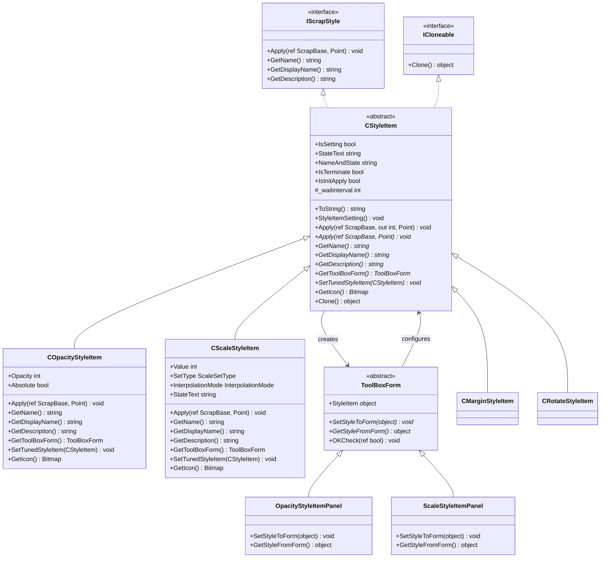
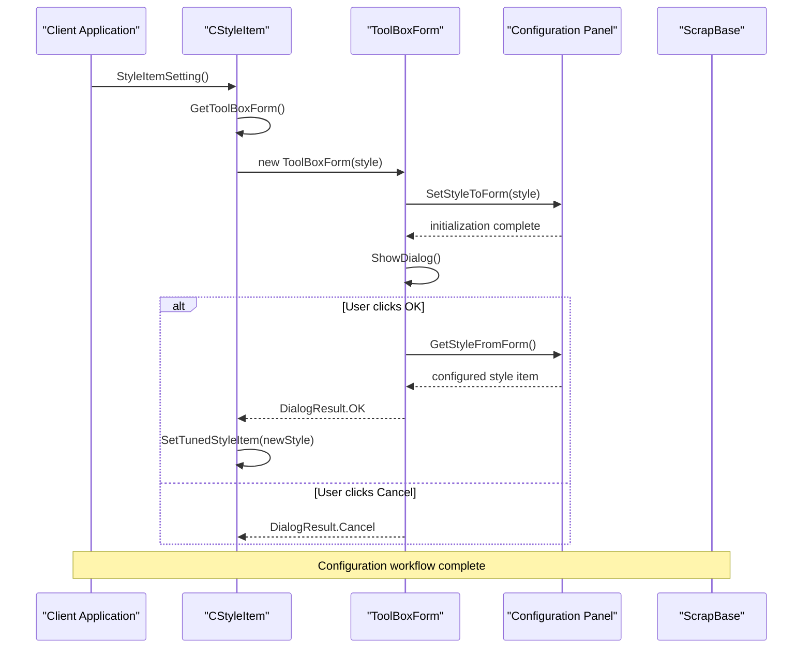
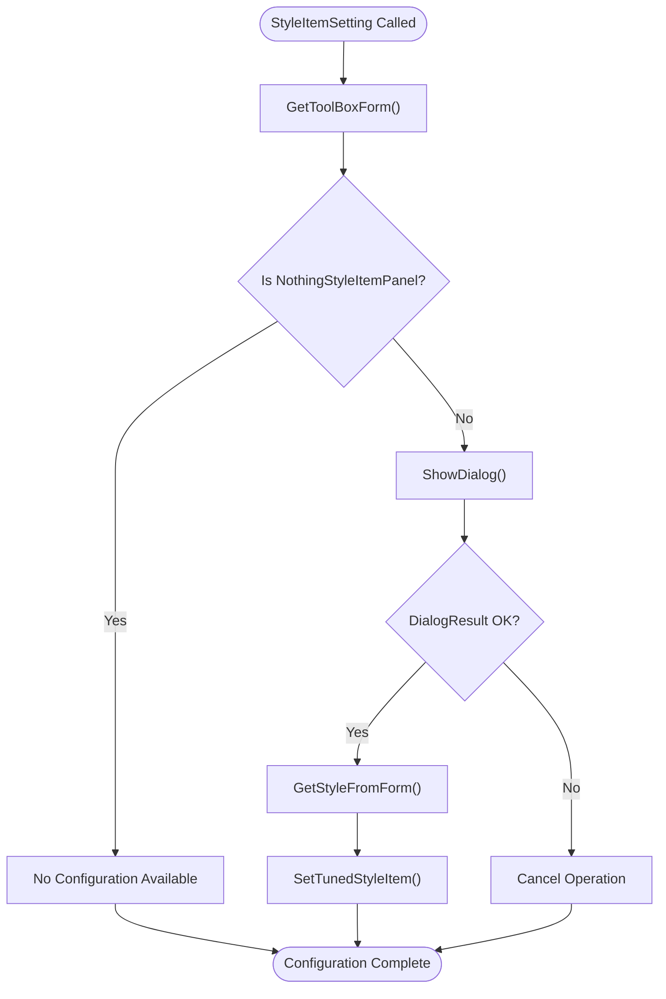

# CStyleItem Extensibility Mechanism

<cite>
**Referenced Files in This Document**
- [CStyleItem.cs](file://SETUNA/Main/StyleItems/CStyleItem.cs)
- [COpacityStyleItem.cs](file://SETUNA/Main/StyleItems/COpacityStyleItem.cs)
- [CScaleStyleItem.cs](file://SETUNA/Main/StyleItems/CScaleStyleItem.cs)
- [CMarginStyleItem.cs](file://SETUNA/Main/StyleItems/CMarginStyleItem.cs)
- [CRotateStyleItem.cs](file://SETUNA/Main/StyleItems/CRotateStyleItem.cs)
- [ToolBoxForm.cs](file://SETUNA/Main/StyleItems/ToolBoxForm.cs)
- [OpacityStyleItemPanel.cs](file://SETUNA/Main/StyleItems/OpacityStyleItemPanel.cs)
- [ScaleStyleItemPanel.cs](file://SETUNA/Main/StyleItems/ScaleStyleItemPanel.cs)
- [NothingStyleItemPanel.cs](file://SETUNA/Main/StyleItems/NothingStyleItemPanel.cs)
- [IScrapStyle.cs](file://SETUNA/Main/StyleItems/IScrapStyle.cs)
- [ScrapBase.cs](file://SETUNA/Main/ScrapBase.cs)
</cite>

## Table of Contents
1. [Introduction](#introduction)
2. [Architecture Overview](#architecture-overview)
3. [Core Contract Definition](#core-contract-definition)
4. [UI Integration Mechanism](#ui-integration-mechanism)
5. [Configuration Workflow](#configuration-workflow)
6. [Asynchronous Operations](#asynchronous-operations)
7. [Metadata and Lifecycle Management](#metadata-and-lifecycle-management)
8. [Cloning and State Management](#cloning-and-state-management)
9. [Concrete Implementation Examples](#concrete-implementation-examples)
10. [Extension Patterns](#extension-patterns)
11. [Best Practices](#best-practices)
12. [Conclusion](#conclusion)

## Introduction

The CStyleItem abstract base class serves as the cornerstone of an extensible image manipulation framework within the SETUNA screenshot application. This sophisticated design pattern enables developers to create custom image processing operations while maintaining a consistent interface and UI integration mechanism. The class enforces a strict contract through abstract methods that must be implemented by concrete style items, ensuring predictable behavior across all image manipulation operations.

The extensibility mechanism is built around several key principles: strong typing through interface contracts, flexible UI integration via dedicated form panels, asynchronous operation support, comprehensive metadata provision, and robust state management through cloning mechanisms. This architecture allows for seamless addition of new image manipulation capabilities without disrupting existing functionality.

## Architecture Overview

The CStyleItem extensibility mechanism follows a hierarchical design pattern where the abstract base class defines the core contract, and concrete implementations provide specific functionality. The architecture integrates tightly with the ScrapBase system to enable real-time image manipulation operations.

**Diagram sources**
- [CStyleItem.cs](file://SETUNA/Main/StyleItems/CStyleItem.cs#L8-L98)
- [IScrapStyle.cs](file://SETUNA/Main/StyleItems/IScrapStyle.cs#L5-L18)
- [ToolBoxForm.cs](file://SETUNA/Main/StyleItems/ToolBoxForm.cs#L7-L64)
- [OpacityStyleItemPanel.cs](file://SETUNA/Main/StyleItems/OpacityStyleItemPanel.cs#L9-L218)
- [ScaleStyleItemPanel.cs](file://SETUNA/Main/StyleItems/ScaleStyleItemPanel.cs#L7-L153)

**Section sources**
- [CStyleItem.cs](file://SETUNA/Main/StyleItems/CStyleItem.cs#L1-L101)
- [IScrapStyle.cs](file://SETUNA/Main/StyleItems/IScrapStyle.cs#L1-L18)

## Core Contract Definition

The CStyleItem abstract class establishes a comprehensive contract that all concrete style items must fulfill. This contract ensures consistent behavior across different image manipulation operations while providing flexibility for specialized implementations.

### Essential Abstract Methods

The core contract consists of seven essential abstract methods that define the fundamental behavior of style items:

#### Apply Method Overloads
The primary Apply method serves as the entry point for image manipulation operations. The base class provides an overload that handles asynchronous operations through the waitinterval parameter.

#### Metadata Methods
Three metadata methods provide essential information about the style item:
- **GetName()**: Returns the internal identifier for the style item
- **GetDisplayName()**: Provides the localized display name for UI presentation
- **GetDescription()**: Offers a detailed description of the style item's functionality

#### Icon Method
**GetIcon()**: Returns a bitmap representation of the style item for visual identification in UI components.

### Protected Abstract Methods

Two protected abstract methods enable UI integration and configuration persistence:

#### GetToolBoxForm Method
**GetToolBoxForm()**: Creates and returns a ToolBoxForm instance that provides the configuration interface for the style item. This method enables the separation of business logic from UI presentation.

#### SetTunedStyleItem Method
**SetTunedStyleItem(CStyleItem)**: Handles the persistence of user-configured settings from the configuration form back to the style item instance.

**Section sources**
- [CStyleItem.cs](file://SETUNA/Main/StyleItems/CStyleItem.cs#L70-L90)

## UI Integration Mechanism

The CStyleItem framework provides a sophisticated UI integration mechanism through the ToolBoxForm abstraction. This design enables seamless integration of custom configuration panels while maintaining consistent behavior across all style items.

### ToolBoxForm Architecture

The ToolBoxForm serves as the foundation for all style item configuration interfaces. It provides a standardized dialog framework with built-in OK/Cancel functionality and validation capabilities.

**Diagram sources**
- [CStyleItem.cs](file://SETUNA/Main/StyleItems/CStyleItem.cs#L25-L34)
- [ToolBoxForm.cs](file://SETUNA/Main/StyleItems/ToolBoxForm.cs#L7-L64)

### Configuration Panel Implementation Pattern

Each concrete style item implements its own configuration panel by inheriting from ToolBoxForm. These panels provide specialized UI controls tailored to the specific configuration needs of the style item.

The configuration panels follow a consistent pattern:
- **SetStyleToForm**: Initializes the panel with current style item settings
- **GetStyleFromForm**: Extracts user-configured settings and creates a new style item instance
- **Validation**: Implements custom validation logic through OKCheck method override

**Section sources**
- [ToolBoxForm.cs](file://SETUNA/Main/StyleItems/ToolBoxForm.cs#L1-L64)
- [OpacityStyleItemPanel.cs](file://SETUNA/Main/StyleItems/OpacityStyleItemPanel.cs#L22-L86)
- [ScaleStyleItemPanel.cs](file://SETUNA/Main/StyleItems/ScaleStyleItemPanel.cs#L15-L75)

## Configuration Workflow

The StyleItemSetting method orchestrates the complete configuration workflow, providing a unified interface for configuring all style items regardless of their complexity.

### Workflow Orchestration

The configuration process follows a structured sequence:

1. **Form Creation**: GetToolBoxForm() creates the appropriate configuration panel
2. **Initialization**: SetStyleToForm populates the panel with current settings
3. **User Interaction**: The modal dialog presents configuration options
4. **Validation**: OKCheck performs any necessary validation
5. **Persistence**: SetTunedStyleItem applies validated settings to the style item

### Conditional UI Availability

The IsSetting property determines whether a style item provides a configuration interface. This property evaluates whether the GetToolBoxForm() returns a NothingStyleItemPanel, indicating that the style item has no configurable parameters.

**Diagram sources**
- [CStyleItem.cs](file://SETUNA/Main/StyleItems/CStyleItem.cs#L25-L34)
- [NothingStyleItemPanel.cs](file://SETUNA/Main/StyleItems/NothingStyleItemPanel.cs#L1-L25)

**Section sources**
- [CStyleItem.cs](file://SETUNA/Main/StyleItems/CStyleItem.cs#L25-L34)

## Asynchronous Operations

The CStyleItem framework supports asynchronous operations through a sophisticated wait interval mechanism that enables long-running image processing tasks without blocking the UI thread.

### Wait Interval Mechanism

The Apply method overload accepts an out parameter for waitinterval, allowing style items to specify delays between operations. This mechanism is particularly useful for effects that require gradual transitions or multi-stage processing.

### Internal Implementation

The base Apply method initializes the _waitinterval field to zero and delegates to the abstract Apply method. After the operation completes, it returns the accumulated wait interval to the caller.

### Usage Patterns

Style items can implement asynchronous behavior by setting the _waitinterval field during their Apply method execution. This approach enables smooth animations and progressive image transformations while maintaining responsive UI interaction.

**Section sources**
- [CStyleItem.cs](file://SETUNA/Main/StyleItems/CStyleItem.cs#L36-L41)

## Metadata and Lifecycle Management

CStyleItem provides comprehensive metadata and lifecycle management capabilities through several virtual properties and methods that enhance the user experience and enable sophisticated workflow management.

### Runtime Status Display

The framework provides two key properties for runtime status display:

#### StateText Property
The virtual StateText property allows style items to provide contextual information about their current state. This information appears in UI displays to help users understand the effect's current configuration.

#### NameAndState Property
The NameAndState property combines the display name with state information, providing a complete representation for UI labeling. It automatically handles empty state text scenarios by falling back to the display name.

### Lifecycle Flags

Several virtual properties manage the lifecycle behavior of style items:

#### IsTerminate Flag
The IsTerminate property indicates whether a style item should be considered a terminal operation in processing chains. Terminal items prevent subsequent operations from executing.

#### IsInitApply Flag
The IsInitApply property determines whether a style item should be applied during initial processing. This flag enables lazy evaluation of expensive operations.

### String Representation

The ToString method provides a convenient way to represent style items as strings, delegating to GetDisplayName() for consistency with UI presentation requirements.

**Section sources**
- [CStyleItem.cs](file://SETUNA/Main/StyleItems/CStyleItem.cs#L45-L68)

## Cloning and State Management

The CStyleItem framework implements a robust cloning mechanism that enables safe state management and copy operations across style item instances.

### MemberwiseClone Implementation

The Clone method uses the base MemberwiseClone implementation, which performs a shallow copy of the object. This approach is suitable for style items that primarily contain value-type fields and simple references.

### State Management Implications

The cloning mechanism has important implications for state management:

1. **Independent Instances**: Cloned style items operate independently, preventing unintended side effects
2. **Configuration Preservation**: Settings are preserved across clone operations
3. **Memory Efficiency**: Shallow copying reduces memory overhead for simple style items

### Best Practices for Derived Classes

Derived classes should carefully consider their state management needs:
- **Immutable Fields**: Prefer immutable fields when possible
- **Complex Objects**: Override Clone for deep copying of complex objects
- **Resource Management**: Ensure proper resource cleanup in derived implementations

**Section sources**
- [CStyleItem.cs](file://SETUNA/Main/StyleItems/CStyleItem.cs#L91-L95)

## Concrete Implementation Examples

The framework includes several concrete implementations that demonstrate the extensibility mechanism in action. These examples showcase different approaches to implementing the CStyleItem contract.

### COpacityStyleItem Example

The COpacityStyleItem demonstrates a straightforward implementation with two operational modes:

#### Operational Modes
- **Absolute Mode**: Sets opacity to a specific value (1-100%)
- **Relative Mode**: Adjusts opacity by a relative amount (-99% to +99%)

#### Configuration Features
- Slider controls for opacity adjustment
- Radio button selection for mode switching
- Preview functionality with live updates

### CScaleStyleItem Example

The CScaleStyleItem showcases a more complex implementation with multiple configuration parameters:

#### Configuration Parameters
- **Scale Value**: Numeric input for scale percentage
- **Scale Type**: Fixed or incremental scaling mode
- **Interpolation Mode**: Quality settings for image scaling

#### Advanced Features
- Dropdown selection for interpolation algorithms
- State text generation based on current settings
- Validation of scale boundaries

### CMarginStyleItem Example

The CMarginStyleItem demonstrates a specialized implementation focused on visual appearance:

#### Configuration Options
- **Border Style**: Three preset border types (bevel, solid, window)
- **Margin Size**: Numeric adjustment for margin thickness
- **Color Settings**: RGB color picker for margin color
- **Window Behavior**: Top-most and taskbar visibility controls

### CRotateStyleItem Example

The CRotateStyleItem provides geometric transformation capabilities:

#### Transformation Options
- **Rotation Angles**: 90°, 180°, and 270° rotation
- **Reflection**: Horizontal and vertical reflection options
- **Automatic Resizing**: Dynamic window resizing for rotated content

**Section sources**
- [COpacityStyleItem.cs](file://SETUNA/Main/StyleItems/COpacityStyleItem.cs#L1-L124)
- [CScaleStyleItem.cs](file://SETUNA/Main/StyleItems/CScaleStyleItem.cs#L1-L211)
- [CMarginStyleItem.cs](file://SETUNA/Main/StyleItems/CMarginStyleItem.cs#L1-L169)
- [CRotateStyleItem.cs](file://SETUNA/Main/StyleItems/CRotateStyleItem.cs#L1-L116)

## Extension Patterns

The CStyleItem framework supports several extension patterns that enable developers to create specialized functionality while maintaining compatibility with the existing architecture.

### Custom Style Item Creation

Creating a new style item involves implementing the abstract methods and providing appropriate configuration panels:

1. **Inherit from CStyleItem**: Establish the base contract
2. **Implement Abstract Methods**: Define core functionality
3. **Create Configuration Panel**: Extend ToolBoxForm for UI integration
4. **Add Icon Resources**: Provide visual representation
5. **Register in StyleItemDictionary**: Enable discovery and usage

### Specialized Configuration Panels

Advanced configuration panels can implement custom validation, preview functionality, and dynamic UI generation. The framework supports complex controls like color pickers, dropdown lists with custom objects, and real-time preview systems.

### Multi-Stage Operations

Style items can implement multi-stage operations by utilizing the wait interval mechanism. This pattern enables smooth animations, progressive image processing, and complex transformation sequences.

### Plugin Architecture

The framework's design supports plugin-style extensions through factory patterns and registration mechanisms. New style items can be discovered and loaded dynamically without modifying core framework code.

## Best Practices

Effective use of the CStyleItem extensibility mechanism requires adherence to established patterns and architectural principles.

### Design Principles

1. **Single Responsibility**: Each style item should focus on a specific image manipulation operation
2. **Consistent UI**: Configuration panels should follow established UI patterns
3. **Error Handling**: Implement robust error handling and validation
4. **Performance**: Optimize Apply methods for efficient image processing
5. **Resource Management**: Properly dispose of resources and handle memory efficiently

### Implementation Guidelines

1. **State Management**: Use appropriate data structures for storing configuration state
2. **Thread Safety**: Ensure thread-safe operations for concurrent access
3. **Documentation**: Provide comprehensive documentation for custom implementations
4. **Testing**: Implement thorough testing for configuration workflows
5. **Backward Compatibility**: Maintain compatibility with existing style item consumers

### Performance Considerations

1. **Lazy Loading**: Defer expensive operations until necessary
2. **Caching**: Cache computed values when appropriate
3. **Batch Processing**: Group related operations for efficiency
4. **Memory Management**: Monitor memory usage in long-running operations

## Conclusion

The CStyleItem extensibility mechanism represents a sophisticated and well-designed framework for building extensible image manipulation capabilities. Through its comprehensive contract definition, flexible UI integration, robust configuration workflow, and support for asynchronous operations, it enables developers to create powerful image processing functionality while maintaining consistency and reliability.

The framework's strength lies in its balance between simplicity and power. The abstract base class provides a minimal yet complete contract that ensures predictable behavior across all implementations, while the flexible UI integration mechanism allows for rich, specialized configuration experiences. The cloning mechanism enables safe state management, and the lifecycle properties provide fine-grained control over operation behavior.

This design pattern serves as an excellent example of how to build extensible systems that can grow and evolve over time while maintaining backward compatibility and developer productivity. The concrete implementations demonstrate various approaches to solving common problems in image manipulation, providing valuable reference material for future development efforts.