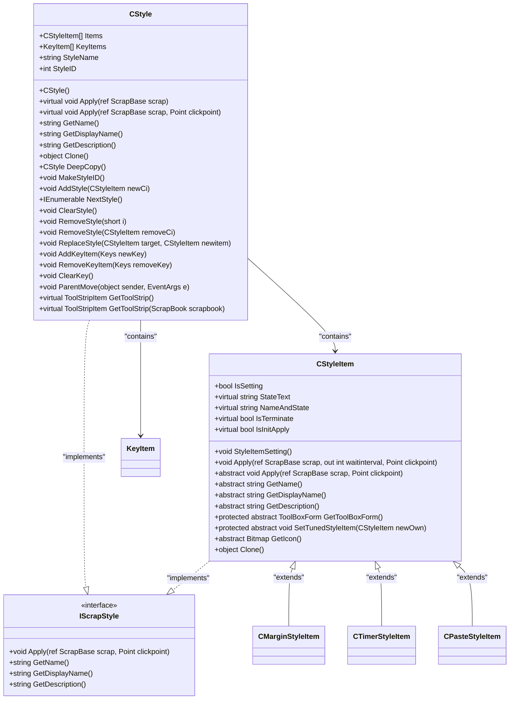
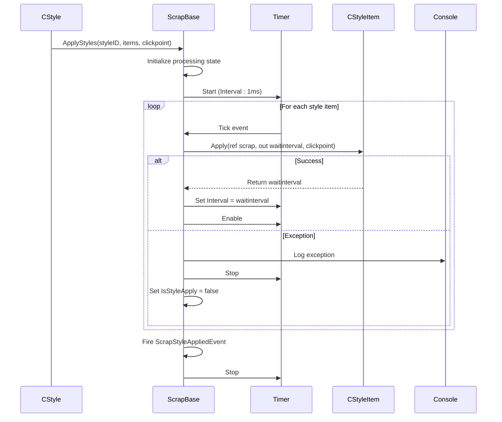

# Style System Architecture

<cite>
**Referenced Files in This Document**   
- [CStyle.cs](file://SETUNA/Main/Style/CStyle.cs)
- [CStyleItem.cs](file://SETUNA/Main/StyleItems/CStyleItem.cs)
- [IScrapStyle.cs](file://SETUNA/Main/StyleItems/IScrapStyle.cs)
- [ScrapBase.cs](file://SETUNA/Main/ScrapBase.cs)
- [CMarginStyleItem.cs](file://SETUNA/Main/StyleItems/CMarginStyleItem.cs)
- [CTimerStyleItem.cs](file://SETUNA/Main/StyleItems/CTimerStyleItem.cs)
- [CPasteStyleItem.cs](file://SETUNA/Main/StyleItems/CPasteStyleItem.cs)
- [ToolBoxForm.cs](file://SETUNA/Main/StyleItems/ToolBoxForm.cs)
</cite>

## Table of Contents
1. [Introduction](#introduction)
2. [Core Components](#core-components)
3. [CStyle Architecture](#cstyle-architecture)
4. [CStyleItem Base Class](#cstyleitem-base-class)
5. [Execution Flow](#execution-flow)
6. [Style Application Process](#style-application-process)
7. [Concrete Style Item Implementations](#concrete-style-item-implementations)
8. [UI Integration](#ui-integration)
9. [Architectural Decisions](#architectural-decisions)
10. [Conclusion](#conclusion)

## Introduction
The style system architecture in the Screenshot2Doc application provides a modular framework for applying image manipulation operations to scraps (reference images). This document details the core components of this system, focusing on the CStyle container class and the CStyleItem base class that defines the contract for all style operations. The architecture enables flexible composition of image transformations through a plugin-like system where each style operation is encapsulated as a reusable component.

**Section sources**
- [CStyle.cs](file://SETUNA/Main/Style/CStyle.cs#L1-L277)
- [CStyleItem.cs](file://SETUNA/Main/StyleItems/CStyleItem.cs#L1-L101)

## Core Components
The style system consists of several key components that work together to enable modular image manipulation. At the core is the CStyle class, which acts as a container for organizing multiple CStyleItem transformations. Each CStyleItem represents a specific image manipulation operation that can be applied to a scrap. The IScrapStyle interface defines the contract that both CStyle and CStyleItem implement, ensuring consistent behavior across the system.

The architecture follows a composite pattern where CStyle can contain multiple CStyleItem instances, allowing complex operations to be built from simpler ones. This design enables users to create custom style sequences that can be applied to scraps through the application's UI or via hotkeys.

**Section sources**
- [CStyle.cs](file://SETUNA/Main/Style/CStyle.cs#L1-L277)
- [CStyleItem.cs](file://SETUNA/Main/StyleItems/CStyleItem.cs#L1-L101)
- [IScrapStyle.cs](file://SETUNA/Main/StyleItems/IScrapStyle.cs#L1-L20)

## CStyle Architecture
The CStyle class serves as a container for organizing multiple CStyleItem transformations and implements the IScrapStyle interface for integration with the scrap lifecycle. It maintains collections of CStyleItem instances and KeyItems for hotkey binding, providing a comprehensive style definition that can be applied to scraps.

**Diagram sources**
- [CStyle.cs](file://SETUNA/Main/Style/CStyle.cs#L1-L277)
- [CStyleItem.cs](file://SETUNA/Main/StyleItems/CStyleItem.cs#L1-L101)

**Section sources**
- [CStyle.cs](file://SETUNA/Main/Style/CStyle.cs#L1-L277)

## CStyleItem Base Class
The abstract CStyleItem base class defines the contract for all style operations in the system. It inherits from IScrapStyle and ICloneable, establishing a consistent interface for all style implementations. The class provides several key methods and properties that concrete implementations must override:

- **Apply methods**: The primary method for executing style operations, with overloads that handle different parameter requirements
- **UI integration**: The GetToolBoxForm method returns a configuration form for user customization, while IsSetting indicates whether configuration is available
- **Cloning capabilities**: The Clone method uses MemberwiseClone to create deep copies of style items, preserving their state
- **Metadata accessors**: GetName, GetDisplayName, and GetDescription provide human-readable information about the style
- **State tracking**: StateText and NameAndState properties display the current configuration state

The base class also includes utility methods like StyleItemSetting, which orchestrates the configuration workflow by showing the appropriate ToolBoxForm and updating the style item with user changes.

**Section sources**
- [CStyleItem.cs](file://SETUNA/Main/StyleItems/CStyleItem.cs#L1-L101)

## Execution Flow
When a style is applied via Apply(ref ScrapBase, Point), the execution flow follows a well-defined sequence. The CStyle.Apply method delegates to ScrapBase.ApplyStyles, passing the style ID, array of style items, and click point. This initiates a timer-based processing loop in ScrapBase that applies each style item sequentially.

**Diagram sources**
- [CStyle.cs](file://SETUNA/Main/Style/CStyle.cs#L94-L117)
- [ScrapBase.cs](file://SETUNA/Main/ScrapBase.cs#L844-L915)

**Section sources**
- [CStyle.cs](file://SETUNA/Main/Style/CStyle.cs#L94-L117)
- [ScrapBase.cs](file://SETUNA/Main/ScrapBase.cs#L844-L915)

## Style Application Process
The style application process begins when CStyle.Apply is called, which delegates to ScrapBase.ApplyStyles. This method initializes the processing state, including setting up a timer that will execute each style item in sequence. The timer-based approach allows for asynchronous processing with configurable delays between operations.

Exception handling is implemented at multiple levels. The CStyle.Apply method wraps the call to ApplyStyles in a try-catch block, logging any exceptions that occur. Similarly, the ApplyStyleItem method in ScrapBase includes exception handling that stops the processing sequence if an error occurs, ensuring that partial style application doesn't leave scraps in an inconsistent state.

The process also includes lifecycle events that notify listeners when styles are applied or removed. These events enable other parts of the application to respond appropriately, such as updating the UI or logging activity.

**Section sources**
- [CStyle.cs](file://SETUNA/Main/Style/CStyle.cs#L94-L117)
- [ScrapBase.cs](file://SETUNA/Main/ScrapBase.cs#L844-L915)

## Concrete Style Item Implementations
The architecture supports various concrete implementations of CStyleItem, each providing specific image manipulation functionality. These implementations demonstrate the extensibility of the system:

- **CMarginStyleItem**: Modifies the scrap's appearance by changing its border style, margin size, and background color. It provides a configuration UI through MarginStyleItemPanel.
- **CTimerStyleItem**: Introduces delays in style sequences, with configurable intervals. It demonstrates how style items can control the timing of subsequent operations.
- **CPasteStyleItem**: Enables pasting images from the clipboard or file paths, creating new scraps. This implementation shows how style items can interact with external systems.

Each concrete implementation follows the same pattern: overriding the abstract methods from CStyleItem, providing specific behavior in the Apply method, and implementing the configuration workflow through GetToolBoxForm and SetTunedStyleItem.

**Section sources**
- [CMarginStyleItem.cs](file://SETUNA/Main/StyleItems/CMarginStyleItem.cs#L1-L169)
- [CTimerStyleItem.cs](file://SETUNA/Main/StyleItems/CTimerStyleItem.cs#L1-L104)
- [CPasteStyleItem.cs](file://SETUNA/Main/StyleItems/CPasteStyleItem.cs#L1-L91)

## UI Integration
The style system integrates with the application's UI through several mechanisms. The GetToolStrip method in CStyle creates ToolStripStyleButton instances that appear in menus and toolbars, providing visual access to styles. The ToolBoxForm base class and its implementations (like MarginStyleItemPanel) provide configuration interfaces for style items.

The IStyleItemPanel interface defines a contract for UI components that configure style items, ensuring consistent behavior across different style types. When a user configures a style item, the StyleItemSetting method orchestrates the process by showing the appropriate ToolBoxForm and updating the style item with the user's choices.

Hotkey support is implemented through the KeyItems property in CStyle, which binds specific keyboard shortcuts to style execution. This allows users to apply styles quickly without navigating through menus.

**Section sources**
- [CStyle.cs](file://SETUNA/Main/Style/CStyle.cs#L241-L250)
- [ToolBoxForm.cs](file://SETUNA/Main/StyleItems/ToolBoxForm.cs#L1-L64)
- [IStyleItemPanel.cs](file://SETUNA/Main/StyleItems/IStyleItemPanel.cs#L1-L13)

## Architectural Decisions
The style system architecture reflects several key design decisions that impact its extensibility and maintainability:

- **Inheritance over composition**: The system uses inheritance (CStyleItem as an abstract base class) rather than composition, making it easier to add new style types while ensuring consistent behavior through enforced method overrides.
- **Deep copying via MemberwiseClone**: The cloning mechanism uses MemberwiseClone to create shallow copies, with CStyle.DeepCopy providing a true deep copy by manually cloning contained objects. This approach balances performance with the need for independent style instances.
- **Timer-based execution**: Using a timer for style application allows for asynchronous processing with configurable delays, enabling complex sequences that include waiting periods.
- **Event-driven architecture**: The system uses events to notify about style application and removal, promoting loose coupling between components.

These decisions create a flexible and extensible system that can accommodate new style types without modifying core infrastructure.

**Section sources**
- [CStyle.cs](file://SETUNA/Main/Style/CStyle.cs#L138-L164)
- [CStyleItem.cs](file://SETUNA/Main/StyleItems/CStyleItem.cs#L92-L95)

## Conclusion
The style system architecture in Screenshot2Doc provides a robust framework for modular image manipulation on scraps. By using the CStyle container to organize CStyleItem transformations and implementing IScrapStyle for integration with the scrap lifecycle, the system enables flexible composition of image operations. The abstract CStyleItem base class defines a clear contract for all style operations, including Apply methods, UI integration through GetToolBoxForm, and cloning capabilities. The execution flow, which delegates from CStyle.Apply to ScrapBase.ApplyStyles, ensures reliable processing with proper exception handling. The architecture's use of inheritance over composition and deep copying via MemberwiseClone reflects thoughtful design decisions that prioritize extensibility and maintainability.