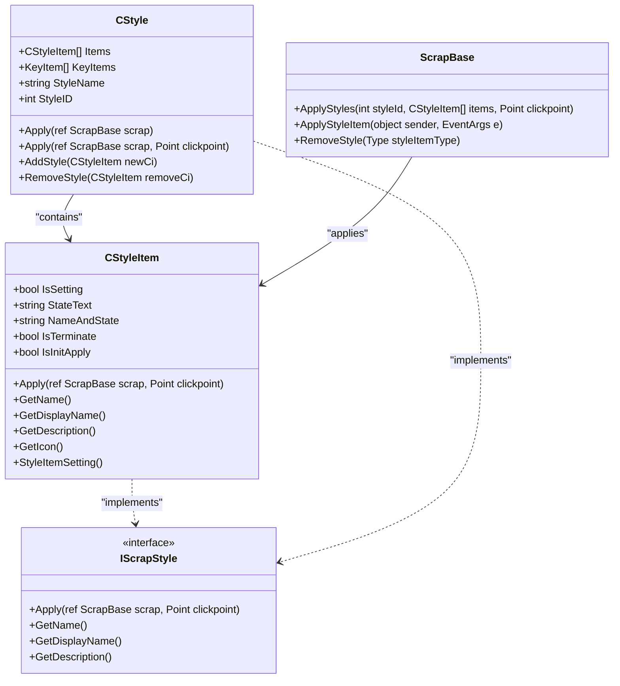
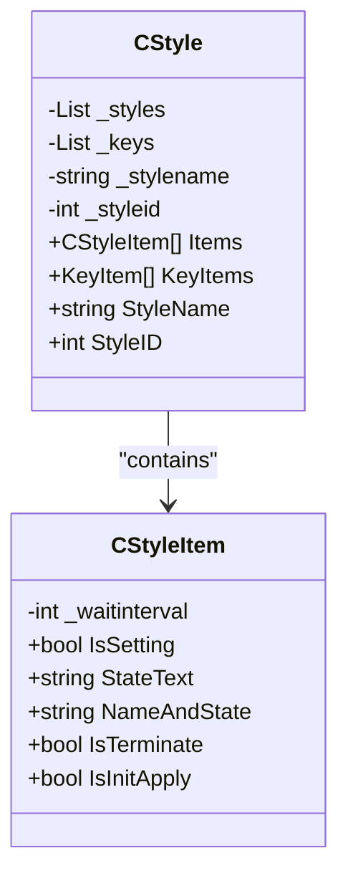
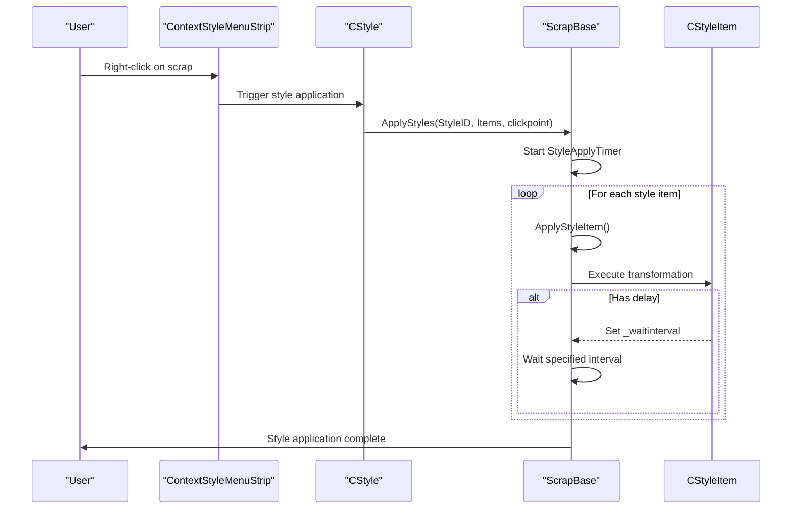
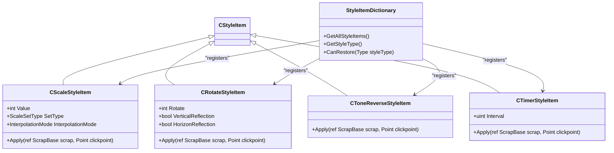
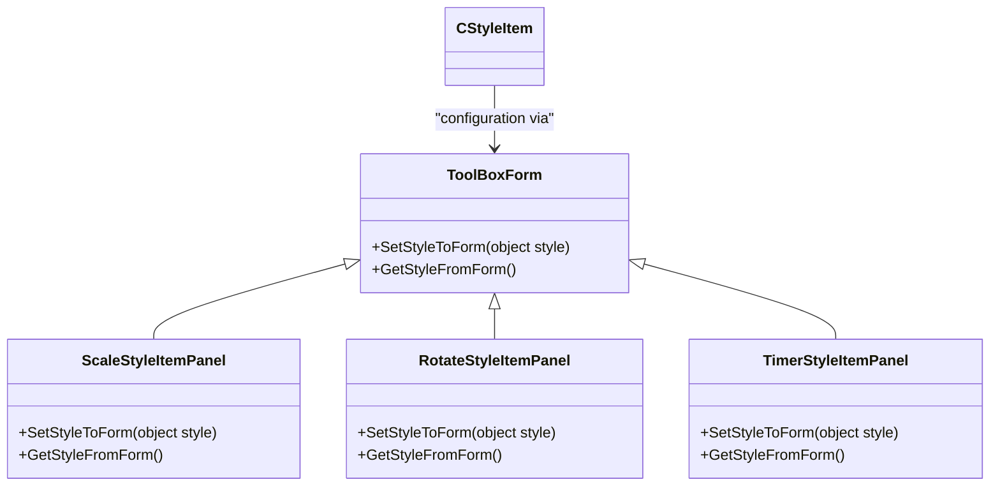
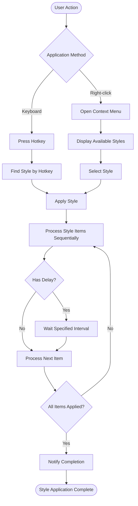

# Style System

<cite>
**Referenced Files in This Document**   
- [CStyle.cs](file://SETUNA/Main/Style/CStyle.cs)
- [CStyleItem.cs](file://SETUNA/Main/StyleItems/CStyleItem.cs)
- [StyleItemDictionary.cs](file://SETUNA/Main/StyleItems/StyleItemDictionary.cs)
- [CScaleStyleItem.cs](file://SETUNA/Main/StyleItems/CScaleStyleItem.cs)
- [CRotateStyleItem.cs](file://SETUNA/Main/StyleItems/CRotateStyleItem.cs)
- [CToneReverseStyleItem.cs](file://SETUNA/Main/StyleItems/CToneReverseStyleItem.cs)
- [CTimerStyleItem.cs](file://SETUNA/Main/StyleItems/CTimerStyleItem.cs)
- [CPaintStyleItem.cs](file://SETUNA/Main/StyleItems/CPaintStyleItem.cs)
- [ScaleStyleItemPanel.cs](file://SETUNA/Main/StyleItems/ScaleStyleItemPanel.cs)
- [RotateStyleItemPanel.cs](file://SETUNA/Main/StyleItems/RotateStyleItemPanel.cs)
- [TimerStyleItemPanel.cs](file://SETUNA/Main/StyleItems/TimerStyleItemPanel.cs)
- [ContextStyleMenuStrip.cs](file://SETUNA/Main/ContextStyleMenuStrip.cs)
- [ScrapBase.cs](file://SETUNA/Main/ScrapBase.cs)
- [SetunaOption.cs](file://SETUNA/Main/Option/SetunaOption.cs)
- [IScrapStyle.cs](file://SETUNA/Main/StyleItems/IScrapStyle.cs)
- [IScrapStyleAppliedListener.cs](file://SETUNA/Main/IScrapStyleAppliedListener.cs)
</cite>

## Table of Contents
1. [Architecture Overview](#architecture-overview)
2. [Core Components](#core-components)
3. [Style Application Process](#style-application-process)
4. [Plugin-Style Extensibility](#plugin-style-extensibility)
5. [UI Integration and Panels](#ui-integration-and-panels)
6. [Usage Patterns](#usage-patterns)
7. [Common Issues and Performance](#common-issues-and-performance)
8. [Conclusion](#conclusion)

## Architecture Overview

The style system in SETUNA is designed as a modular, extensible framework for applying image manipulations to scraps (captured screenshots or images). The architecture follows a container-item pattern where CStyle acts as a container for multiple CStyleItem transformations. This design enables users to create complex style sequences that can be applied to scraps through various interaction methods including context menus and hotkeys.

**Diagram sources**
- [CStyle.cs](file://SETUNA/Main/Style/CStyle.cs#L11-L276)
- [CStyleItem.cs](file://SETUNA/Main/StyleItems/CStyleItem.cs#L8-L100)
- [IScrapStyle.cs](file://SETUNA/Main/StyleItems/IScrapStyle.cs#L6-L19)
- [ScrapBase.cs](file://SETUNA/Main/ScrapBase.cs#L865-L943)

**Section sources**
- [CStyle.cs](file://SETUNA/Main/Style/CStyle.cs#L11-L276)
- [CStyleItem.cs](file://SETUNA/Main/StyleItems/CStyleItem.cs#L8-L100)

## Core Components

The style system is built around two core components: CStyle as the container for style items and CStyleItem as the base class for individual transformations. CStyle manages a collection of CStyleItem objects and provides methods to add, remove, and apply these items to scraps. Each CStyle instance has a unique StyleID and can be associated with hotkeys through KeyItem objects.

CStyleItem is an abstract base class that defines the contract for all style transformations. It provides essential properties like IsSetting (indicating whether the style has a configuration panel), StateText (describing the current configuration), and methods like Apply() for executing the transformation. The class also handles the configuration workflow through GetToolBoxForm() and SetTunedStyleItem() methods, enabling a consistent user experience across different style types.

**Diagram sources**
- [CStyle.cs](file://SETUNA/Main/Style/CStyle.cs#L253-L265)
- [CStyleItem.cs](file://SETUNA/Main/StyleItems/CStyleItem.cs#L97-L98)

**Section sources**
- [CStyle.cs](file://SETUNA/Main/Style/CStyle.cs#L11-L276)
- [CStyleItem.cs](file://SETUNA/Main/StyleItems/CStyleItem.cs#L8-L100)

## Style Application Process

The style application process begins when a user triggers a style through a context menu or hotkey. The system retrieves the corresponding CStyle object and invokes its Apply() method, which in turn calls ScrapBase.ApplyStyles() with the style's items and click point. The ScrapBase class then processes each CStyleItem sequentially through a timer-driven mechanism in ApplyStyleItem().

Each style item is applied in order, with the system handling potential delays through the _waitinterval field. This allows for timed operations like CTimerStyleItem to pause execution for a specified duration. The process continues until all items are applied, at which point the ScrapStyleAppliedEvent is triggered to notify listeners of completion. This event-driven architecture ensures that complex style sequences can be executed reliably while maintaining responsiveness.

**Diagram sources**
- [CStyle.cs](file://SETUNA/Main/Style/CStyle.cs#L94-L117)
- [ScrapBase.cs](file://SETUNA/Main/ScrapBase.cs#L865-L943)
- [ContextStyleMenuStrip.cs](file://SETUNA/Main/ContextStyleMenuStrip.cs#L7-L42)

**Section sources**
- [CStyle.cs](file://SETUNA/Main/Style/CStyle.cs#L94-L117)
- [ScrapBase.cs](file://SETUNA/Main/ScrapBase.cs#L865-L943)

## Plugin-Style Extensibility

The style system implements a plugin-style extensibility model through the StyleItemDictionary class, which serves as a registry for all available style item types. This design allows new transformations to be added without modifying the core system. The GetAllStyleItems() method returns instances of all registered style items, while GetStyleType() provides their type information for reflection-based instantiation.

Concrete implementations like CScaleStyleItem, CRotateStyleItem, and CPaintStyleItem demonstrate this extensibility pattern. Each subclass overrides the abstract methods from CStyleItem to provide specific functionality. For example, CScaleStyleItem manages scaling operations with configurable interpolation modes, while CRotateStyleItem handles rotation and reflection transformations. This inheritance hierarchy ensures consistent behavior across all style types while allowing specialized functionality.

**Diagram sources**
- [StyleItemDictionary.cs](file://SETUNA/Main/StyleItems/StyleItemDictionary.cs#L9-L83)
- [CScaleStyleItem.cs](file://SETUNA/Main/StyleItems/CScaleStyleItem.cs#L10-L210)
- [CRotateStyleItem.cs](file://SETUNA/Main/StyleItems/CRotateStyleItem.cs#L8-L115)
- [CToneReverseStyleItem.cs](file://SETUNA/Main/StyleItems/CToneReverseStyleItem.cs#L7-L62)
- [CTimerStyleItem.cs](file://SETUNA/Main/StyleItems/CTimerStyleItem.cs#L6-L103)

**Section sources**
- [StyleItemDictionary.cs](file://SETUNA/Main/StyleItems/StyleItemDictionary.cs#L9-L83)
- [CScaleStyleItem.cs](file://SETUNA/Main/StyleItems/CScaleStyleItem.cs#L10-L210)
- [CRotateStyleItem.cs](file://SETUNA/Main/StyleItems/CRotateStyleItem.cs#L8-L115)

## UI Integration and Panels

The style system integrates with the UI through dedicated panel classes that inherit from ToolBoxForm. These panels provide configuration interfaces for style items that require user input. The relationship between style items and their panels is established through the GetToolBoxForm() method, which returns the appropriate panel instance for configuration.

For example, CScaleStyleItem uses ScaleStyleItemPanel to allow users to configure scaling parameters including fixed or incremental scaling, scale percentage, and interpolation mode. Similarly, CRotateStyleItem uses RotateStyleItemPanel to configure rotation angles and reflection options. The panel classes follow a consistent pattern with SetStyleToForm() to initialize the UI with current settings and GetStyleFromForm() to retrieve user-configured values.

**Diagram sources**
- [ScaleStyleItemPanel.cs](file://SETUNA/Main/StyleItems/ScaleStyleItemPanel.cs#L7-L152)
- [RotateStyleItemPanel.cs](file://SETUNA/Main/StyleItems/RotateStyleItemPanel.cs#L9-L155)
- [TimerStyleItemPanel.cs](file://SETUNA/Main/StyleItems/TimerStyleItemPanel.cs#L4-L30)

**Section sources**
- [ScaleStyleItemPanel.cs](file://SETUNA/Main/StyleItems/ScaleStyleItemPanel.cs#L7-L152)
- [RotateStyleItemPanel.cs](file://SETUNA/Main/StyleItems/RotateStyleItemPanel.cs#L9-L155)

## Usage Patterns

Styles can be applied through multiple interaction patterns, primarily context menus and hotkeys. The ContextStyleMenuStrip class handles right-click interactions on scraps, displaying available styles and triggering their application. Hotkey support is implemented through the KeyItem system, where each CStyle can be associated with specific key combinations.

The system also supports predefined styles configured in SetunaOption, such as the "Zoom Out" style that uses CScaleStyleItem with a -10% incremental scale. These predefined styles demonstrate common usage patterns and provide immediate functionality to users. Custom styles can be created and edited through the StyleEditForm, allowing users to combine multiple style items into complex sequences.

**Diagram sources**
- [ContextStyleMenuStrip.cs](file://SETUNA/Main/ContextStyleMenuStrip.cs#L7-L42)
- [SetunaOption.cs](file://SETUNA/Main/Option/SetunaOption.cs#L202-L695)
- [CStyle.cs](file://SETUNA/Main/Style/CStyle.cs#L217-L226)

**Section sources**
- [ContextStyleMenuStrip.cs](file://SETUNA/Main/ContextStyleMenuStrip.cs#L7-L42)
- [SetunaOption.cs](file://SETUNA/Main/Option/SetunaOption.cs#L202-L695)

## Common Issues and Performance

The style system addresses several common issues related to style application order and performance impact. Since styles are applied sequentially, the order of CStyleItem objects in a CStyle container directly affects the final result. For example, applying a rotation before scaling produces different results than scaling before rotation.

Performance considerations are particularly important for complex operations like image transformations. The system mitigates performance impact by using efficient GDI+ operations and minimizing unnecessary redraws through the Refresh() method. The CTimerStyleItem demonstrates how the system handles time-based operations without blocking the UI thread, using a timer-based approach to implement delays.

One potential issue is the accumulation of style items on scraps, which can lead to performance degradation with complex style sequences. The system provides the RemoveStyle() method to clean up specific style types, but users must be aware of the cumulative effect of applying multiple styles. Additionally, some style items like CPaintStyleItem that open modal dialogs can interrupt the style application sequence, requiring careful consideration in style design.

**Section sources**
- [ScrapBase.cs](file://SETUNA/Main/ScrapBase.cs#L917-L934)
- [CTimerStyleItem.cs](file://SETUNA/Main/StyleItems/CTimerStyleItem.cs#L37-L40)
- [CPaintStyleItem.cs](file://SETUNA/Main/StyleItems/CPaintStyleItem.cs#L9-L15)

## Conclusion

The style system in SETUNA provides a robust, extensible framework for image manipulation on scraps. Through the CStyle and CStyleItem architecture, it enables both simple transformations and complex style sequences. The plugin-style extensibility model allows for easy addition of new transformations, while the UI integration through dedicated panels provides a consistent user experience. With support for multiple application methods including context menus and hotkeys, the system offers flexible interaction patterns. Understanding the sequential nature of style application and potential performance implications is crucial for creating effective and efficient styles.