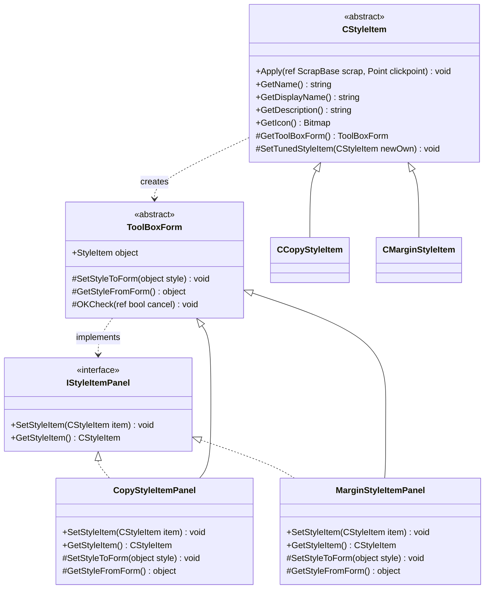
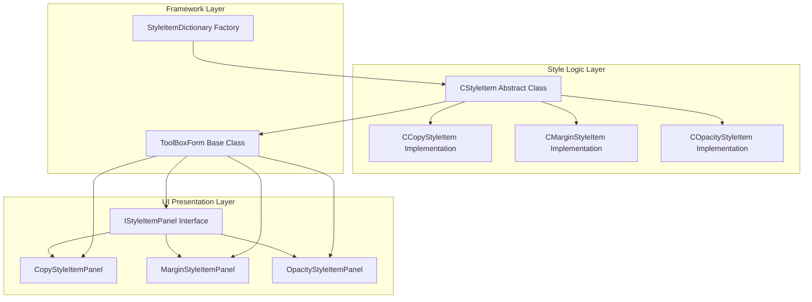
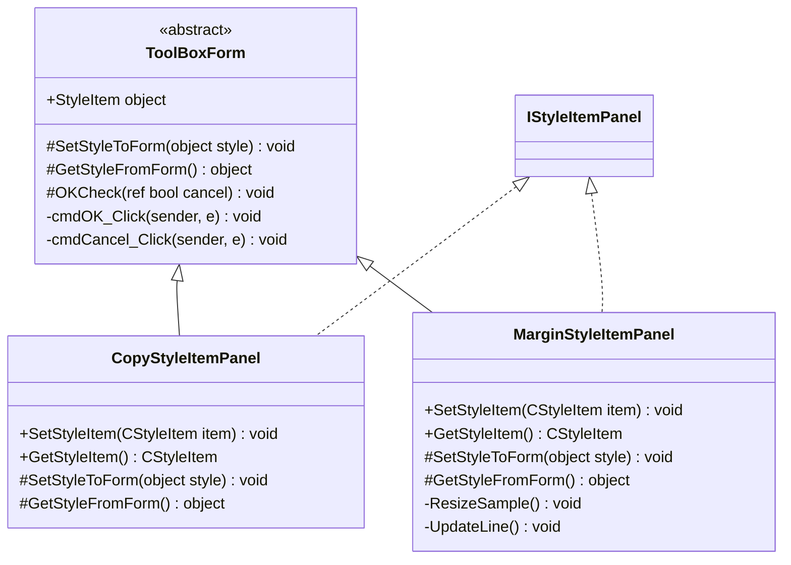
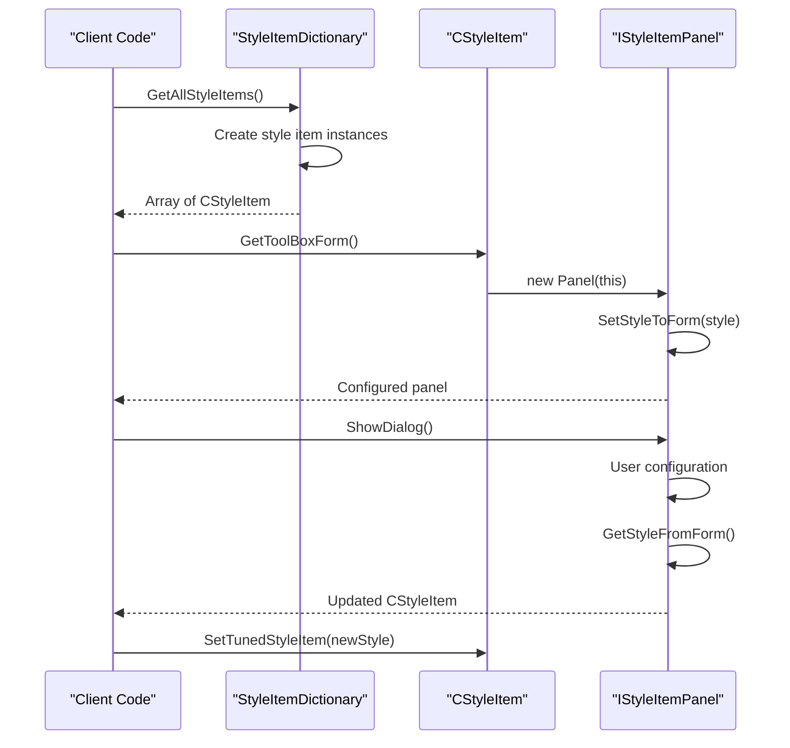
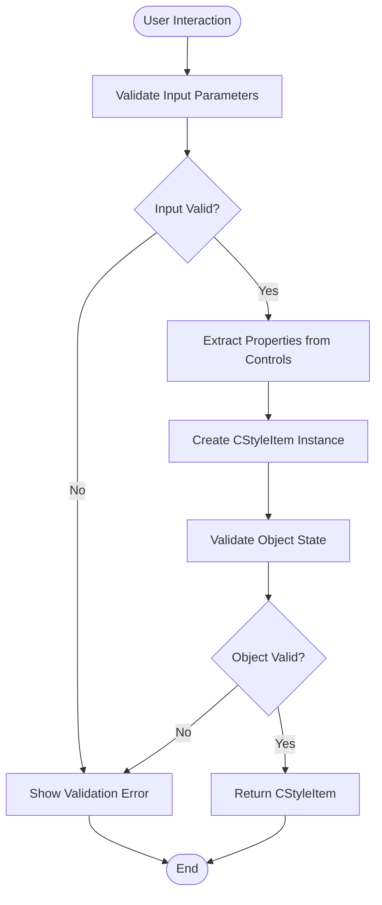

# IStyleItemPanel Interface Contract

<cite>
**Referenced Files in This Document**
- [IStyleItemPanel.cs](file://SETUNA/Main/StyleItems/IStyleItemPanel.cs)
- [ToolBoxForm.cs](file://SETUNA/Main/StyleItems/ToolBoxForm.cs)
- [CStyleItem.cs](file://SETUNA/Main/StyleItems/CStyleItem.cs)
- [StyleItemDictionary.cs](file://SETUNA/Main/StyleItems/StyleItemDictionary.cs)
- [CopyStyleItemPanel.cs](file://SETUNA/Main/StyleItems/CopyStyleItemPanel.cs)
- [MarginStyleItemPanel.cs](file://SETUNA/Main/StyleItems/MarginStyleItemPanel.cs)
- [OpacityStyleItemPanel.cs](file://SETUNA/Main/StyleItems/OpacityStyleItemPanel.cs)
- [CompactStyleItemPanel.cs](file://SETUNA/Main/StyleItems/CompactStyleItemPanel.cs)
- [ImageBmpStyleItemPanel.cs](file://SETUNA/Main/StyleItems/ImageBmpStyleItemPanel.cs)
- [CCopyStyleItem.cs](file://SETUNA/Main/StyleItems/CCopyStyleItem.cs)
- [CMarginStyleItem.cs](file://SETUNA/Main/StyleItems/CMarginStyleItem.cs)
</cite>

## Table of Contents
1. [Introduction](#introduction)
2. [Interface Definition](#interface-definition)
3. [Core Methods](#core-methods)
4. [Architectural Role](#architectural-role)
5. [Implementation Patterns](#implementation-patterns)
6. [Dynamic Loading Mechanisms](#dynamic-loading-mechanisms)
7. [Thread Safety and Error Handling](#thread-safety-and-error-handling)
8. [Developer Guidelines](#developer-guidelines)
9. [Best Practices](#best-practices)
10. [Troubleshooting Guide](#troubleshooting-guide)

## Introduction

The IStyleItemPanel interface serves as the foundational contract for the style configuration UI system in the Screenshot2Doc application. This interface enables a clean separation between style logic (CStyleItem implementations) and their corresponding user interface panels, creating a modular and extensible architecture for style configuration.

The interface embodies the principle of decoupling by providing a standardized contract that allows style items to be dynamically loaded and configured through reflection or factory patterns. This design enables the system to support a wide variety of style configurations while maintaining code organization and extensibility.

## Interface Definition

The IStyleItemPanel interface is a simple yet powerful contract consisting of two essential methods that define the bidirectional communication channel between style items and their UI panels.



**Diagram sources**
- [IStyleItemPanel.cs](file://SETUNA/Main/StyleItems/IStyleItemPanel.cs#L4-L10)
- [ToolBoxForm.cs](file://SETUNA/Main/StyleItems/ToolBoxForm.cs#L7-L63)
- [CStyleItem.cs](file://SETUNA/Main/StyleItems/CStyleItem.cs#L8-L99)

**Section sources**
- [IStyleItemPanel.cs](file://SETUNA/Main/StyleItems/IStyleItemPanel.cs#L1-L13)

## Core Methods

### SetStyleItem Method

The `SetStyleItem` method serves as the initialization mechanism for style item panels, transferring the current configuration state from a CStyleItem instance to the UI panel's controls.

**Method Signature:**
```csharp
void SetStyleItem(CStyleItem item);
```

**Purpose and Implementation Pattern:**
- **Parameter Transfer**: Receives a CStyleItem instance containing the current configuration state
- **UI Population**: Populates form controls with the style item's properties
- **Validation**: Performs initial validation and sets up control states
- **Event Binding**: Establishes event handlers for real-time updates

**Implementation Example:**
The MarginStyleItemPanel demonstrates the typical pattern where the method extracts properties from the style item and assigns them to corresponding UI controls, setting up the panel's initial state.

### GetStyleItem Method

The `GetStyleItem` method acts as the extraction mechanism, converting the current UI state back into a CStyleItem instance that can be used by the application.

**Method Signature:**
```csharp
CStyleItem GetStyleItem();
```

**Purpose and Implementation Pattern:**
- **State Capture**: Reads current values from form controls
- **Validation**: Performs input validation and error checking
- **Object Creation**: Constructs a new CStyleItem with the captured configuration
- **Return Value**: Provides the configured style item for persistence or application

**Implementation Example:**
The CopyStyleItemPanel shows how this method creates a new CCopyStyleItem instance populated with values from checkboxes, text fields, and other controls.

**Section sources**
- [IStyleItemPanel.cs](file://SETUNA/Main/StyleItems/IStyleItemPanel.cs#L7-L10)
- [CopyStyleItemPanel.cs](file://SETUNA/Main/StyleItems/CopyStyleItemPanel.cs#L17-L32)
- [MarginStyleItemPanel.cs](file://SETUNA/Main/StyleItems/MarginStyleItemPanel.cs#L63-L84)

## Architectural Role

### Decoupling Strategy

The IStyleItemPanel interface enables a clean separation of concerns by decoupling style logic from presentation:



**Diagram sources**
- [CStyleItem.cs](file://SETUNA/Main/StyleItems/CStyleItem.cs#L8-L99)
- [ToolBoxForm.cs](file://SETUNA/Main/StyleItems/ToolBoxForm.cs#L7-L63)
- [StyleItemDictionary.cs](file://SETUNA/Main/StyleItems/StyleItemDictionary.cs#L7-L84)

### Modular Design Benefits

1. **Extensibility**: New style items can be added without modifying existing UI infrastructure
2. **Maintainability**: Changes to UI presentation don't affect style logic and vice versa
3. **Testability**: Style logic can be tested independently of UI implementation
4. **Reusability**: UI panels can be reused across different style item types

**Section sources**
- [CStyleItem.cs](file://SETUNA/Main/StyleItems/CStyleItem.cs#L21-L33)
- [ToolBoxForm.cs](file://SETUNA/Main/StyleItems/ToolBoxForm.cs#L43-L45)

## Implementation Patterns

### Base Class Inheritance Pattern

Most IStyleItemPanel implementations inherit from ToolBoxForm, which provides common functionality for modal dialog behavior:



**Diagram sources**
- [ToolBoxForm.cs](file://SETUNA/Main/StyleItems/ToolBoxForm.cs#L7-L63)
- [CopyStyleItemPanel.cs](file://SETUNA/Main/StyleItems/CopyStyleItemPanel.cs#L4-L34)
- [MarginStyleItemPanel.cs](file://SETUNA/Main/StyleItems/MarginStyleItemPanel.cs#L9-L198)

### Property Mapping Patterns

Different panels implement property mapping according to their specific requirements:

| Panel Type | Property Mapping Strategy | Validation Approach |
|------------|---------------------------|---------------------|
| CopyStyleItemPanel | Direct checkbox binding | Minimal validation |
| MarginStyleItemPanel | Complex UI with preview | Real-time validation with visual feedback |
| OpacityStyleItemPanel | Dual-mode opacity control | Range validation with preview |
| CompactStyleItemPanel | Multi-property aggregation | Comprehensive validation |

**Section sources**
- [CopyStyleItemPanel.cs](file://SETUNA/Main/StyleItems/CopyStyleItemPanel.cs#L17-L32)
- [MarginStyleItemPanel.cs](file://SETUNA/Main/StyleItems/MarginStyleItemPanel.cs#L63-L84)
- [OpacityStyleItemPanel.cs](file://SETUNA/Main/StyleItems/OpacityStyleItemPanel.cs#L72-L85)

## Dynamic Loading Mechanisms

### Factory Pattern Implementation

The StyleItemDictionary class implements a factory pattern that enables dynamic loading of style item panels:



**Diagram sources**
- [StyleItemDictionary.cs](file://SETUNA/Main/StyleItems/StyleItemDictionary.cs#L15-L34)
- [CStyleItem.cs](file://SETUNA/Main/StyleItems/CStyleItem.cs#L83-L86)

### Reflection-Based Loading

While the current implementation uses explicit instantiation, the architecture supports reflection-based loading through the GetToolBoxForm method override in each CStyleItem subclass.

**Section sources**
- [StyleItemDictionary.cs](file://SETUNA/Main/StyleItems/StyleItemDictionary.cs#L15-L84)
- [CStyleItem.cs](file://SETUNA/Main/StyleItems/CStyleItem.cs#L74-L86)

## Thread Safety and Error Handling

### Data Encapsulation Strategies

The interface contract ensures proper data encapsulation through controlled property access:



### Error Handling Patterns

Different panels implement varying levels of error handling:

| Error Type | CopyStyleItemPanel | MarginStyleItemPanel | OpacityStyleItemPanel |
|------------|-------------------|---------------------|---------------------|
| Input Validation | Basic checkbox state | Real-time preview updates | Range validation with preview |
| Resource Management | Minimal cleanup | Comprehensive disposal | Full resource lifecycle |
| Exception Handling | Try-catch in Apply | Exception logging | Input validation pre-execution |

**Section sources**
- [CCopyStyleItem.cs](file://SETUNA/Main/StyleItems/CCopyStyleItem.cs#L22-L44)
- [CMarginStyleItem.cs](file://SETUNA/Main/StyleItems/CMarginStyleItem.cs#L21-L60)
- [OpacityStyleItemPanel.cs](file://SETUNA/Main/StyleItems/OpacityStyleItemPanel.cs#L102-L138)

## Developer Guidelines

### Creating New Style Item Panels

When implementing new IStyleItemPanel interfaces, follow these guidelines:

#### 1. Inherit from ToolBoxForm
```csharp
internal partial class NewStyleItemPanel : ToolBoxForm
{
    public NewStyleItemPanel(CNewStyleItem item) : base(item)
    {
    }
}
```

#### 2. Implement SetStyleToForm Method
```csharp
protected override void SetStyleToForm(object style)
{
    var newItem = (CNewStyleItem)style;
    InitializeComponent();
    // Populate controls with newItem properties
    txtProperty1.Text = newItem.Property1;
    chkProperty2.Checked = newItem.Property2;
    // Additional setup...
}
```

#### 3. Implement GetStyleFromForm Method
```csharp
protected override object GetStyleFromForm()
{
    return new CNewStyleItem
    {
        Property1 = txtProperty1.Text,
        Property2 = chkProperty2.Checked,
        // Additional properties...
    };
}
```

#### 4. Override OKCheck for Validation
```csharp
protected override void OKCheck(ref bool cancel)
{
    if (string.IsNullOrEmpty(txtProperty1.Text))
    {
        MessageBox.Show("Property 1 is required");
        cancel = true;
        return;
    }
    // Additional validation...
}
```

### Integration with Existing Framework

Ensure proper integration by:

1. **Override GetToolBoxForm** in your CStyleItem implementation
2. **Add to StyleItemDictionary** for automatic discovery
3. **Implement proper disposal** for resources
4. **Provide meaningful validation** messages
5. **Maintain thread safety** in property access

**Section sources**
- [ToolBoxForm.cs](file://SETUNA/Main/StyleItems/ToolBoxForm.cs#L15-L59)
- [StyleItemDictionary.cs](file://SETUNA/Main/StyleItems/StyleItemDictionary.cs#L15-L34)

## Best Practices

### Design Principles

1. **Single Responsibility**: Each panel handles one specific style configuration
2. **Open/Closed Principle**: New panels can be added without modifying existing code
3. **Liskov Substitution**: All panels behave consistently through the interface
4. **Interface Segregation**: The interface focuses on UI-specific concerns only

### Performance Considerations

- **Lazy Loading**: Initialize expensive resources only when needed
- **Resource Disposal**: Properly dispose of images and graphics resources
- **Validation Efficiency**: Perform validation early to avoid unnecessary processing
- **UI Responsiveness**: Keep UI operations synchronous to maintain responsiveness

### Code Quality Standards

- **Consistent Naming**: Use descriptive names for controls and methods
- **Error Handling**: Implement comprehensive error handling and user feedback
- **Documentation**: Document complex property mappings and validation logic
- **Testing**: Test both successful and failure scenarios

## Troubleshooting Guide

### Common Issues and Solutions

#### Issue: Panel Not Loading Correctly
**Symptoms**: Panel appears empty or with default values
**Solution**: Verify SetStyleToForm implementation populates all controls

#### Issue: Configuration Not Persisting
**Symptoms**: Changes made in panel don't affect style item
**Solution**: Check GetStyleFromForm returns properly configured object

#### Issue: Memory Leaks
**Symptoms**: Application memory usage increases over time
**Solution**: Ensure proper disposal of graphics resources in FormClosed events

#### Issue: Validation Errors
**Symptoms**: Dialog closes despite invalid input
**Solution**: Implement proper OKCheck validation and cancel flag handling

### Debugging Strategies

1. **Logging**: Add logging to SetStyleToForm and GetStyleFromForm methods
2. **Breakpoints**: Set breakpoints in property mapping code
3. **Unit Testing**: Create unit tests for property conversion logic
4. **Resource Monitoring**: Monitor resource usage during panel operations

**Section sources**
- [MarginStyleItemPanel.cs](file://SETUNA/Main/StyleItems/MarginStyleItemPanel.cs#L108-L118)
- [OpacityStyleItemPanel.cs](file://SETUNA/Main/StyleItems/OpacityStyleItemPanel.cs#L184-L191)