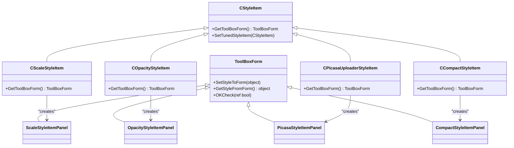

# Style Item Panel Configuration

<cite>
**Referenced Files in This Document**   
- [IStyleItemPanel.cs](file://SETUNA/Main/StyleItems/IStyleItemPanel.cs)
- [ScaleStyleItemPanel.cs](file://SETUNA/Main/StyleItems/ScaleStyleItemPanel.cs)
- [OpacityStyleItemPanel.cs](file://SETUNA/Main/StyleItems/OpacityStyleItemPanel.cs)
- [PicasaStyleItemPanel.cs](file://SETUNA/Main/StyleItems/PicasaStyleItemPanel.cs)
- [CompactStyleItemPanel.cs](file://SETUNA/Main/StyleItems/CompactStyleItemPanel.cs)
- [ToolBoxForm.cs](file://SETUNA/Main/StyleItems/ToolBoxForm.cs)
- [CScaleStyleItem.cs](file://SETUNA/Main/StyleItems/CScaleStyleItem.cs)
- [COpacityStyleItem.cs](file://SETUNA/Main/StyleItems/COpacityStyleItem.cs)
- [CPicasaUploaderStyleItem.cs](file://SETUNA/Main/StyleItems/CPicasaUploaderStyleItem.cs)
- [CCompactStyleItem.cs](file://SETUNA/Main/StyleItems/CCompactStyleItem.cs)
- [ScaleStyleItemPanel.Designer.cs](file://SETUNA/Main/StyleItems/ScaleStyleItemPanel.Designer.cs)
- [OpacityStyleItemPanel.Designer.cs](file://SETUNA/Main/StyleItems/OpacityStyleItemPanel.Designer.cs)
- [PicasaStyleItemPanel.Designer.cs](file://SETUNA/Main/StyleItems/PicasaStyleItemPanel.Designer.cs)
- [CompactStyleItemPanel.Designer.cs](file://SETUNA/Main/StyleItems/CompactStyleItemPanel.Designer.cs)
</cite>

## Table of Contents
1. [Introduction](#introduction)
2. [Core Interface: IStyleItemPanel](#core-interface-istyleitempanel)
3. [ScaleStyleItemPanel](#scalestyleitempanel)
4. [OpacityStyleItemPanel](#opacitystyleitempanel)
5. [PicasaStyleItemPanel](#picasastyleitempanel)
6. [CompactStyleItemPanel](#compactstyleitempanel)
7. [Integration with ToolBoxForm](#integration-with-toolboxform)
8. [UI State Persistence](#ui-state-persistence)
9. [Accessibility Features](#accessibility-features)
10. [Troubleshooting Guide](#troubleshooting-guide)

## Introduction
The style item panel system in SETUNA provides a specialized configuration interface for various style operations through implementations of the `IStyleItemPanel` interface. Each panel offers a tailored user experience for configuring specific style items such as scaling, opacity adjustment, Picasa upload settings, and compact display options. These panels inherit from `ToolBoxForm` and implement the `SetStyleItem` and `GetStyleItem` methods to manage property binding, input validation, and event handling. The system enables users to configure style parameters through intuitive UI controls with real-time preview capabilities where applicable.

## Core Interface: IStyleItemPanel
The `IStyleItemPanel` interface defines the contract for all style configuration panels, requiring implementations of two essential methods:

- `SetStyleItem(CStyleItem item)`: Initializes the panel with a specific style item's configuration
- `GetStyleItem()`: Retrieves the configured style item from the panel's current state

This interface ensures consistency across all style configuration panels while allowing each implementation to provide specialized UI and behavior for its corresponding style item type.

**Section sources**
- [IStyleItemPanel.cs](file://SETUNA/Main/StyleItems/IStyleItemPanel.cs#L4-L12)

## ScaleStyleItemPanel
The `ScaleStyleItemPanel` provides a specialized interface for configuring scale operations on reference images. It inherits from `ToolBoxForm` and is associated with the `CScaleStyleItem` class.

### Configuration Options
The panel offers the following configuration options:
- **Scale Type**: Radio buttons for selecting between fixed (absolute) and incremental (relative) scaling
- **Scale Value**: Numeric up-down control and trackbar for setting the scale percentage (10-200% for fixed, -190 to 190 for relative)
- **Interpolation Method**: Dropdown list with options including Nearest Neighbor, High, High Quality Bilinear, and High Quality Bicubic

### Implementation Details
The panel implements property binding through the `SetStyleToForm` and `GetStyleFromForm` methods, which handle the synchronization between the UI controls and the underlying `CScaleStyleItem` object. When the user changes the scale type (fixed vs. incremental), the appropriate controls are enabled/disabled through the `rdoFixed_CheckedChanged` event handler.

User interactions with the numeric up-down control and trackbar are synchronized - changing one automatically updates the other to maintain consistency. The interpolation method is stored using a generic `ComboItem<T>` class that associates display names with `InterpolationMode` enum values.

**Section sources**
- [ScaleStyleItemPanel.cs](file://SETUNA/Main/StyleItems/ScaleStyleItemPanel.cs#L7-L153)
- [ScaleStyleItemPanel.Designer.cs](file://SETUNA/Main/StyleItems/ScaleStyleItemPanel.Designer.cs#L1-L236)
- [CScaleStyleItem.cs](file://SETUNA/Main/StyleItems/CScaleStyleItem.cs#L1-L211)

## OpacityStyleItemPanel
The `OpacityStyleItemPanel` provides configuration for transparency levels of reference images through the `COpacityStyleItem` class.

### Configuration Options
The panel includes:
- **Opacity Type**: Radio buttons for absolute (fixed) or incremental (relative) opacity changes
- **Opacity Value**: Numeric up-down control and trackbar for setting opacity percentage (1-100% for absolute, -99 to 99 for relative)
- **Preview Section**: Visual preview area showing a sample image with applied opacity settings
- **Preview Controls**: Button to apply relative opacity changes to the preview and a numeric control to show the resulting opacity

### Implementation Details
The panel implements real-time preview functionality using `ColorMatrix` and `ImageAttributes` classes to apply transparency effects to the preview image. The `picPreview_Paint` method draws both the background (captured screen) and the transparent scrap image.

Input validation occurs through the `btnPreview_Click` method, which ensures the resulting opacity stays within valid bounds (1-100%). The panel handles focus management through the `numOpacity_Enter` and `OpacityStyleItemPanel_Shown` events, automatically selecting the appropriate control when it gains focus.

Resource management is implemented through the `OpacityStyleItemPanel_FormClosed` event, which properly disposes of bitmap resources and triggers garbage collection.

**Section sources**
- [OpacityStyleItemPanel.cs](file://SETUNA/Main/StyleItems/OpacityStyleItemPanel.cs#L9-L218)
- [OpacityStyleItemPanel.Designer.cs](file://SETUNA/Main/StyleItems/OpacityStyleItemPanel.Designer.cs#L1-L278)
- [COpacityStyleItem.cs](file://SETUNA/Main/StyleItems/COpacityStyleItem.cs#L1-L124)

## PicasaStyleItemPanel
The `PicasaStyleItemPanel` configures settings for uploading images to Picasa Web Albums through the `CPicasaUploaderStyleItem` class.

### Configuration Options
The panel provides:
- **Google Account**: Text field for entering Google account credentials
- **Password**: Password field (masked) for account authentication
- **Save Settings**: Dropdown with options to save both credentials, save only the account, or save nothing
- **Information Section**: Links and instructions for first-time Picasa users

### Implementation Details
The panel implements input validation through the `OKCheck` method, which prevents submission when required fields are empty. The `comboBox1_SelectedIndexChanged` event handler dynamically enables/disables the password and account fields based on the selected save option.

Credentials are encrypted/decrypted using the `PicasaBar.Encrypto` and `PicasaBar.Decrypto` methods when saving to or retrieving from the style item. The panel includes a link to the Picasa website and a button to copy the URL to the clipboard for user convenience.

**Section sources**
- [PicasaStyleItemPanel.cs](file://SETUNA/Main/StyleItems/PicasaStyleItemPanel.cs#L8-L112)
- [PicasaStyleItemPanel.Designer.cs](file://SETUNA/Main/StyleItems/PicasaStyleItemPanel.Designer.cs#L1-L184)
- [CPicasaUploaderStyleItem.cs](file://SETUNA/Main/StyleItems/CPicasaUploaderStyleItem.cs#L1-L147)

## CompactStyleItemPanel
The `CompactStyleItemPanel` configures the appearance of compacted reference images through the `CCompactStyleItem` class.

### Configuration Options
The panel offers:
- **Opacity**: Numeric up-down control and trackbar for setting transparency (10-100%)
- **Border Style**: Radio buttons for solid or dashed border
- **Border Color**: Clickable color swatch that opens a color dialog
- **Preview Section**: Visual preview showing the compacted scrap appearance

### Implementation Details
The panel implements dynamic border rendering through the `UpdateLine` method, which redraws the preview image with the selected border style and color. The `picLineColor_Click` event handler opens a `ColorDialog` to allow users to select a custom border color.

Like other panels, it synchronizes the numeric up-down control with the trackbar through event handlers. The preview functionality uses the same `ColorMatrix` and `ImageAttributes` approach as the opacity panel to show transparency effects.

Resource cleanup is handled in the form closed event, properly disposing of bitmap resources.

**Section sources**
- [CompactStyleItemPanel.cs](file://SETUNA/Main/StyleItems/CompactStyleItemPanel.cs#L10-L195)
- [CompactStyleItemPanel.Designer.cs](file://SETUNA/Main/StyleItems/CompactStyleItemPanel.Designer.cs#L1-L220)
- [CCompactStyleItem.cs](file://SETUNA/Main/StyleItems/CCompactStyleItem.cs#L1-L84)

## Integration with ToolBoxForm
All style item panels inherit from `ToolBoxForm`, which provides the foundational functionality for style configuration dialogs.

### Base Functionality
`ToolBoxForm` implements:
- Standard OK/Cancel button handling
- The `StyleItem` property that exposes the configured style item
- Virtual methods for form-to-item (`SetStyleToForm`) and item-to-form (`GetStyleFromForm`) conversion
- An `OKCheck` method for validation that can cancel form submission

### GetToolBoxForm Pattern
The style item classes implement the `GetToolBoxForm` method to return an instance of their corresponding panel:

**Diagram sources**
- [ToolBoxForm.cs](file://SETUNA/Main/StyleItems/ToolBoxForm.cs#L7-L64)
- [CScaleStyleItem.cs](file://SETUNA/Main/StyleItems/CScaleStyleItem.cs#L118-L121)
- [COpacityStyleItem.cs](file://SETUNA/Main/StyleItems/COpacityStyleItem.cs#L80-L83)
- [CPicasaUploaderStyleItem.cs](file://SETUNA/Main/StyleItems/CPicasaUploaderStyleItem.cs#L117-L120)
- [CCompactStyleItem.cs](file://SETUNA/Main/StyleItems/CCompactStyleItem.cs#L44-L47)

## UI State Persistence
The style item panels maintain UI state through several mechanisms:

1. **Form Initialization**: Each panel's constructor accepts a style item parameter, allowing it to initialize with existing configuration
2. **Property Binding**: The `SetStyleToForm` method populates UI controls with values from the style item
3. **Value Synchronization**: Numeric up-down controls and trackbars are kept in sync through event handlers
4. **Resource Management**: Bitmap resources are properly disposed in form closed events to prevent memory leaks

The system does not appear to persist UI state between application sessions, focusing instead on maintaining state during the current session and saving configuration changes to the style items themselves.

**Section sources**
- [ScaleStyleItemPanel.cs](file://SETUNA/Main/StyleItems/ScaleStyleItemPanel.cs#L10-L12)
- [OpacityStyleItemPanel.cs](file://SETUNA/Main/StyleItems/OpacityStyleItemPanel.cs#L17-L19)
- [PicasaStyleItemPanel.cs](file://SETUNA/Main/StyleItems/PicasaStyleItemPanel.cs#L16-L18)
- [CompactStyleItemPanel.cs](file://SETUNA/Main/StyleItems/CompactStyleItemPanel.cs#L18-L20)

## Accessibility Features
The style item panels implement several accessibility features:

1. **Keyboard Navigation**: All controls are accessible via keyboard tab navigation
2. **Focus Management**: Panels automatically set focus to the primary input control when shown
3. **Input Selection**: Numeric up-down controls automatically select their entire value when they receive focus, making it easier to replace values
4. **Visual Feedback**: Preview panels provide immediate visual feedback for configuration changes
5. **Clear Labels**: All controls have descriptive labels that clearly indicate their purpose

The panels follow standard Windows form conventions, making them familiar to users of Windows applications. However, there is no explicit support for screen readers beyond standard Windows Forms accessibility features.

**Section sources**
- [OpacityStyleItemPanel.cs](file://SETUNA/Main/StyleItems/OpacityStyleItemPanel.cs#L113-L117)
- [OpacityStyleItemPanel.cs](file://SETUNA/Main/StyleItems/OpacityStyleItemPanel.cs#L120-L128)
- [CompactStyleItemPanel.cs](file://SETUNA/Main/StyleItems/CompactStyleItemPanel.cs#L72-L76)

## Troubleshooting Guide
This section addresses common issues that may occur with the style item panels.

### Unresponsive Inputs
**Symptoms**: Controls do not respond to user input or changes are not reflected in the preview.

**Possible Causes and Solutions**:
- **Event Handler Issues**: Ensure event handlers are properly attached in the designer file
- **Control State**: Verify that controls are not disabled by conditional logic (e.g., radio button selection)
- **Threading Issues**: All UI updates should occur on the main thread

### Incorrect Value Binding
**Symptoms**: Values do not persist between opening and closing the panel, or changes are not saved.

**Possible Causes and Solutions**:
- **Missing Property Updates**: Ensure `SetStyleToForm` and `GetStyleFromForm` methods properly update all properties
- **Type Conversion Errors**: Verify numeric values are properly converted between decimal and integer types
- **Event Synchronization**: Check that trackbar and numeric up-down controls are properly synchronized

### Preview Not Updating
**Symptoms**: Changes to opacity or other visual properties do not reflect in the preview window.

**Possible Causes and Solutions**:
- **Refresh Issues**: Ensure the preview control is properly refreshed after property changes
- **Graphics State**: Verify that `ColorMatrix` and `ImageAttributes` are correctly applied
- **Resource Disposal**: Check that bitmap resources have not been prematurely disposed

### Memory Leaks
**Symptoms**: Application memory usage increases over time when opening and closing panels.

**Possible Causes and Solutions**:
- **Bitmap Disposal**: Ensure all bitmap resources are properly disposed in form closed events
- **Event Handler Detachment**: Verify that event handlers are properly cleaned up
- **Resource Management**: Follow the pattern of disposing resources in `FormClosed` events as implemented in the opacity and compact panels

**Section sources**
- [OpacityStyleItemPanel.cs](file://SETUNA/Main/StyleItems/OpacityStyleItemPanel.cs#L184-L191)
- [CompactStyleItemPanel.cs](file://SETUNA/Main/StyleItems/CompactStyleItemPanel.cs#L107-L119)
- [OpacityStyleItemPanel.cs](file://SETUNA/Main/StyleItems/OpacityStyleItemPanel.cs#L195-L203)
- [CompactStyleItemPanel.cs](file://SETUNA/Main/StyleItems/CompactStyleItemPanel.cs#L122-L131)