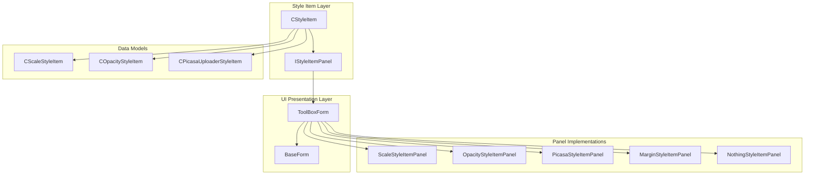
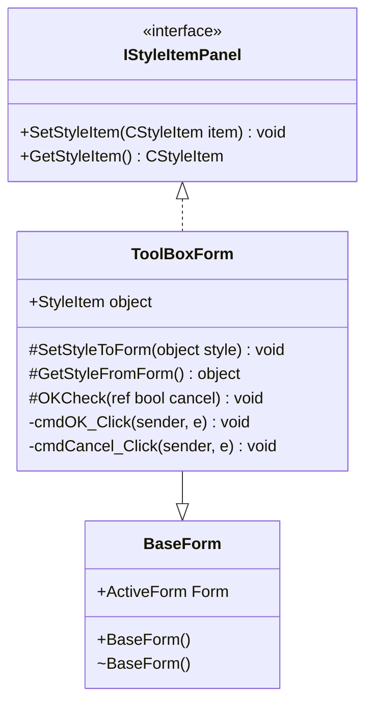
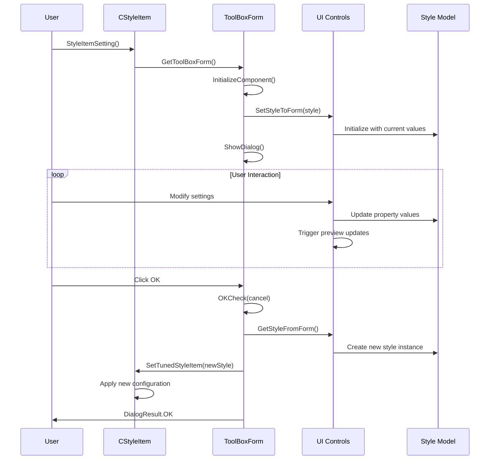
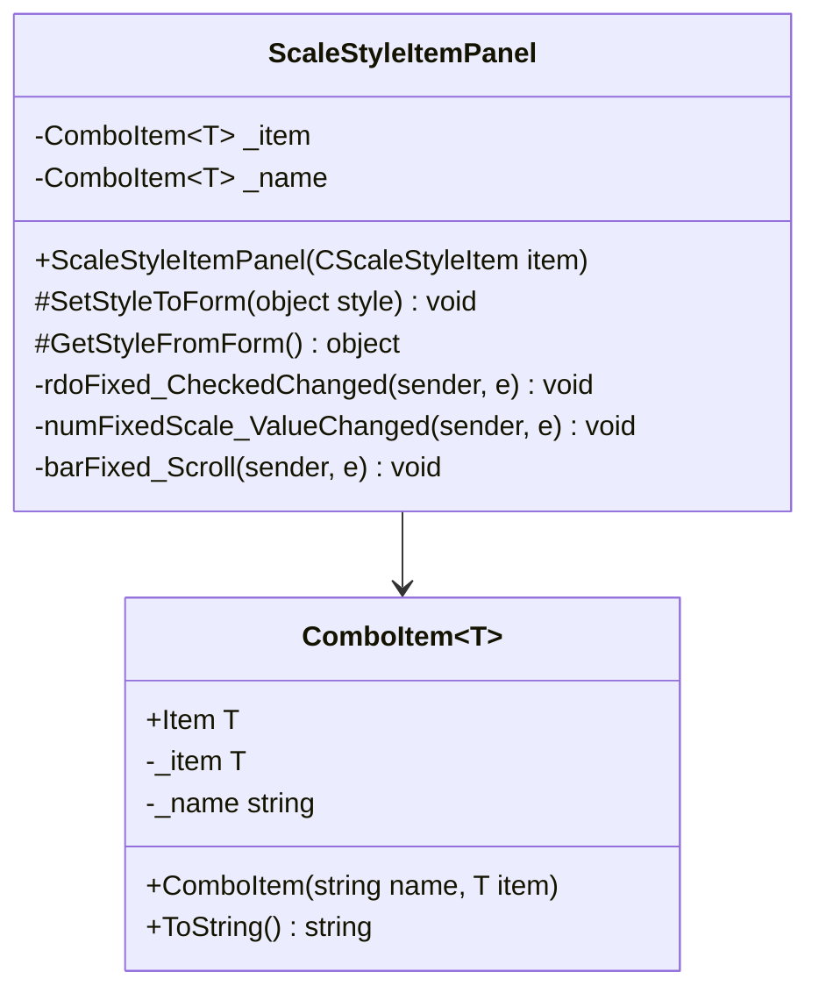
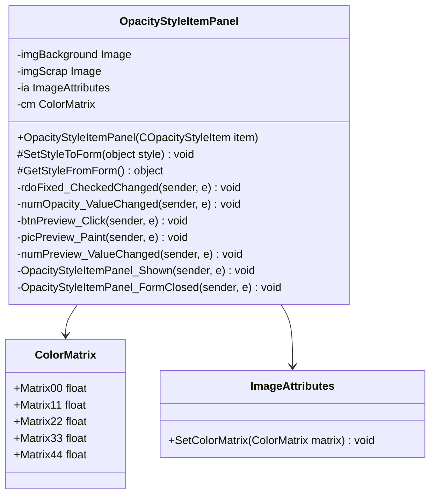
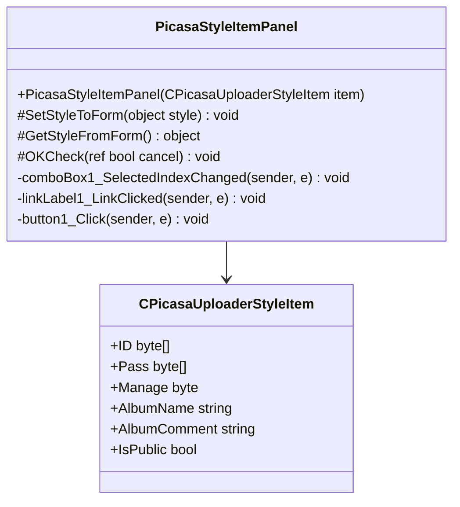
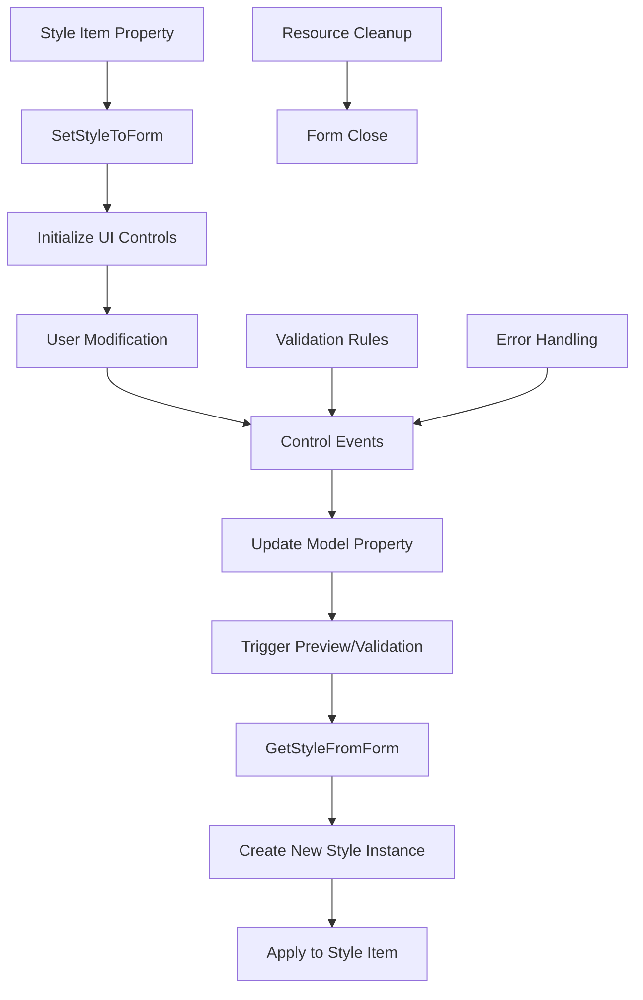

# UI Integration and User Interaction

<cite>
**Referenced Files in This Document**
- [IStyleItemPanel.cs](file://SETUNA/Main/StyleItems/IStyleItemPanel.cs)
- [ToolBoxForm.cs](file://SETUNA/Main/StyleItems/ToolBoxForm.cs)
- [ToolBoxForm.Designer.cs](file://SETUNA/Main/StyleItems/ToolBoxForm.Designer.cs)
- [BaseForm.cs](file://SETUNA/Main/Common/BaseForm.cs)
- [ScaleStyleItemPanel.cs](file://SETUNA/Main/StyleItems/ScaleStyleItemPanel.cs)
- [OpacityStyleItemPanel.cs](file://SETUNA/Main/StyleItems/OpacityStyleItemPanel.cs)
- [PicasaStyleItemPanel.cs](file://SETUNA/Main/StyleItems/PicasaStyleItemPanel.cs)
- [MarginStyleItemPanel.cs](file://SETUNA/Main/StyleItems/MarginStyleItemPanel.cs)
- [NothingStyleItemPanel.cs](file://SETUNA/Main/StyleItems/NothingStyleItemPanel.cs)
- [WindowStyleItemPanel.cs](file://SETUNA/Main/StyleItems/WindowStyleItemPanel.cs)
- [CStyleItem.cs](file://SETUNA/Main/StyleItems/CStyleItem.cs)
- [CScaleStyleItem.cs](file://SETUNA/Main/StyleItems/CScaleStyleItem.cs)
- [COpacityStyleItem.cs](file://SETUNA/Main/StyleItems\COpacityStyleItem.cs)
- [CPicasaUploaderStyleItem.cs](file://SETUNA/Main/StyleItems\CPicasaUploaderStyleItem.cs)
</cite>

## Table of Contents
1. [Introduction](#introduction)
2. [Architecture Overview](#architecture-overview)
3. [Core Interface and Base Classes](#core-interface-and-base-classes)
4. [Component-Based UI Architecture](#component-based-ui-architecture)
5. [Style Configuration Lifecycle](#style-configuration-lifecycle)
6. [Implementation Examples](#implementation-examples)
7. [Data Binding and Validation](#data-binding-and-validation)
8. [State Persistence and Management](#state-persistence-and-management)
9. [Accessibility and Responsive Design](#accessibility-and-responsive-design)
10. [Best Practices and Patterns](#best-practices-and-patterns)

## Introduction

The SETUNA screenshot application implements a sophisticated UI integration system for style items through a component-based architecture centered around the `IStyleItemPanel` interface. This system enables each style item to provide its own configuration interface while maintaining consistent user experience and data flow patterns.

The architecture follows a separation-of-concerns approach where style items define their behavior and data models, while dedicated panels handle the presentation and user interaction. This design promotes modularity, extensibility, and maintainability of the UI components.

## Architecture Overview

The UI integration system is built on several key architectural principles:

**Diagram sources**
- [CStyleItem.cs](file://SETUNA/Main/StyleItems/CStyleItem.cs#L8-L101)
- [ToolBoxForm.cs](file://SETUNA/Main/StyleItems/ToolBoxForm.cs#L7-L63)
- [BaseForm.cs](file://SETUNA/Main/Common/BaseForm.cs#L3-L17)

## Core Interface and Base Classes

### IStyleItemPanel Interface

The `IStyleItemPanel` interface defines the contract for style item configuration panels:

**Diagram sources**
- [IStyleItemPanel.cs](file://SETUNA/Main/StyleItems/IStyleItemPanel.cs#L4-L12)
- [ToolBoxForm.cs](file://SETUNA/Main/StyleItems/ToolBoxForm.cs#L7-L63)
- [BaseForm.cs](file://SETUNA/Main/Common/BaseForm.cs#L3-L17)

### ToolBoxForm Base Class

The `ToolBoxForm` class serves as the foundation for all style item configuration panels, providing common functionality for modal dialogs:

**Section sources**
- [ToolBoxForm.cs](file://SETUNA/Main/StyleItems/ToolBoxForm.cs#L7-L63)
- [ToolBoxForm.Designer.cs](file://SETUNA/Main/StyleItems/ToolBoxForm.Designer.cs#L17-L81)

### BaseForm Foundation

The `BaseForm` class provides essential form management capabilities including registration with the form manager and lifecycle event handling.

**Section sources**
- [BaseForm.cs](file://SETUNA/Main/Common/BaseForm.cs#L3-L17)

## Component-Based UI Architecture

The architecture implements a component-based approach where each style item type has its dedicated panel implementation. This design enables:

### Separation of Concerns

Each panel handles:
- UI layout and controls
- User input validation
- Data binding between UI and model
- Real-time preview updates
- State persistence

### Extensibility Pattern

New style item types can be easily added by:
1. Creating a new style item class inheriting from `CStyleItem`
2. Implementing a corresponding panel class inheriting from `ToolBoxForm`
3. Registering the panel through the `GetToolBoxForm()` method

### Consistent User Experience

All panels share common characteristics:
- Standard OK/Cancel buttons
- Modal dialog presentation
- Automatic form initialization
- Consistent keyboard navigation
- Proper resource cleanup

## Style Configuration Lifecycle

The style configuration process follows a well-defined lifecycle from initiation to result application:

**Diagram sources**
- [CStyleItem.cs](file://SETUNA/Main/StyleItems/CStyleItem.cs#L26-L33)
- [ToolBoxForm.cs](file://SETUNA/Main/StyleItems/ToolBoxForm.cs#L23-L40)

### Step-by-Step Process

1. **Invocation**: The `StyleItemSetting()` method initiates the configuration process
2. **Panel Creation**: The style item creates its corresponding panel instance
3. **Form Initialization**: The panel initializes UI controls with current values
4. **Dialog Display**: A modal dialog is shown to the user
5. **User Interaction**: Users modify settings through the UI controls
6. **Validation**: Input validation occurs during interaction
7. **Result Application**: Successful configuration is applied to the style item

**Section sources**
- [CStyleItem.cs](file://SETUNA/Main/StyleItems/CStyleItem.cs#L26-L33)
- [ToolBoxForm.cs](file://SETUNA/Main/StyleItems/ToolBoxForm.cs#L23-L40)

## Implementation Examples

### ScaleStyleItemPanel

The `ScaleStyleItemPanel` demonstrates comprehensive UI integration for image scaling configuration:

**Diagram sources**
- [ScaleStyleItemPanel.cs](file://SETUNA/Main/StyleItems/ScaleStyleItemPanel.cs#L7-L153)

#### Key Features:
- **Dual Scaling Modes**: Fixed percentage and relative increment modes
- **Interpolation Options**: Five interpolation mode choices
- **Synchronized Controls**: Linked numeric up-down and scrollbar controls
- **Type-Safe ComboBox**: Generic `ComboItem<T>` for type-safe selection

**Section sources**
- [ScaleStyleItemPanel.cs](file://SETUNA/Main/StyleItems/ScaleStyleItemPanel.cs#L15-L75)

### OpacityStyleItemPanel

The `OpacityStyleItemPanel` provides real-time opacity preview functionality:

**Diagram sources**
- [OpacityStyleItemPanel.cs](file://SETUNA/Main/StyleItems/OpacityStyleItemPanel.cs#L9-L218)

#### Advanced Features:
- **Real-Time Preview**: Live opacity preview with screen capture
- **Dual Control Modes**: Absolute and relative opacity adjustment
- **Image Processing**: Hardware-accelerated opacity rendering
- **Resource Management**: Proper disposal of graphics resources

**Section sources**
- [OpacityStyleItemPanel.cs](file://SETUNA/Main/StyleItems/OpacityStyleItemPanel.cs#L22-L202)

### PicasaStyleItemPanel

The `PicasaStyleItemPanel` handles external service configuration with security considerations:

**Diagram sources**
- [PicasaStyleItemPanel.cs](file://SETUNA/Main/StyleItems/PicasaStyleItemPanel.cs#L8-L112)
- [CPicasaUploaderStyleItem.cs](file://SETUNA/Main/StyleItems\CPicasaUploaderStyleItem.cs#L8-L144)

#### Security and Usability Features:
- **Credential Management**: Three modes: with credentials, anonymous, disabled
- **Encryption**: Secure storage of sensitive account information
- **Validation**: Input validation for required fields
- **Convenience**: Quick-copy functionality for URLs

**Section sources**
- [PicasaStyleItemPanel.cs](file://SETUNA/Main/StyleItems/PicasaStyleItemPanel.cs#L21-L75)

### Additional Panel Types

#### MarginStyleItemPanel
- **Visual Preview**: Real-time margin effect demonstration
- **Border Styles**: 3D, solid, and window frame border options
- **Interactive Controls**: Dynamic preview updates

#### WindowStyleItemPanel
- **Simple Configuration**: Binary window/non-window toggle
- **Minimal UI**: Streamlined interface for straightforward settings

**Section sources**
- [MarginStyleItemPanel.cs](file://SETUNA/Main/StyleItems/MarginStyleItemPanel.cs#L9-L198)
- [WindowStyleItemPanel.cs](file://SETUNA/Main/StyleItems/WindowStyleItemPanel.cs#L4-L30)

## Data Binding and Validation

### Two-Way Data Binding

The system implements robust two-way data binding between UI controls and style item properties:

### Validation Strategies

#### Input Validation
- **Range Checking**: Numeric controls enforce minimum/maximum bounds
- **Type Validation**: Proper conversion between UI and model types
- **Required Field Validation**: Mandatory field checking with user feedback

#### Business Logic Validation
- **State Consistency**: Ensuring logical combinations of settings
- **External Dependencies**: Validating service connectivity requirements
- **Security Constraints**: Credential validation and encryption verification

**Section sources**
- [ToolBoxForm.cs](file://SETUNA/Main/StyleItems/ToolBoxForm.cs#L59-L61)
- [PicasaStyleItemPanel.cs](file://SETUNA/Main/StyleItems/PicasaStyleItemPanel.cs#L42-L56)

## State Persistence and Management

### Automatic State Management

The system automatically manages state persistence through several mechanisms:

#### Constructor-Based Initialization
Panels receive style item instances through constructors, ensuring immediate state synchronization.

#### Event-Driven Updates
UI controls trigger events that update the underlying model in real-time, maintaining consistency.

#### Dialog Result Processing
Successful dialog closure triggers the `SetTunedStyleItem` method, applying validated changes to the original style item.

### Memory Management

#### Resource Disposal
Proper cleanup of graphics resources, screen captures, and temporary images ensures memory efficiency.

#### Form Lifecycle Management
Integration with the form manager handles registration and deregistration automatically.

**Section sources**
- [OpacityStyleItemPanel.cs](file://SETUNA/Main/StyleItems/OpacityStyleItemPanel.cs#L184-L192)
- [MarginStyleItemPanel.cs](file://SETUNA/Main/StyleItems/MarginStyleItemPanel.cs#L108-L116)

## Accessibility and Responsive Design

### Keyboard Navigation

The UI components support comprehensive keyboard navigation:

- **Tab Order**: Logical tab sequence through controls
- **Shortcut Keys**: Access keys for primary actions
- **Escape Handling**: Proper cancellation through escape key
- **Enter Confirmation**: Primary action activation via enter key

### Screen Reader Support

#### Semantic Markup
- **Descriptive Labels**: Clear labeling of all interactive elements
- **Role Identification**: Proper ARIA roles for complex controls
- **State Announcements**: Dynamic state updates communicated to assistive technologies

#### Focus Management
- **Logical Focus**: Intuitive focus progression through interface elements
- **Focus Indicators**: Clear visual indication of focused elements
- **Programmatic Focus**: Controlled focus movement for complex interactions

### Responsive Design Patterns

#### Adaptive Layout
- **Flexible Control Sizing**: Controls adapt to container size changes
- **Proportional Spacing**: Consistent spacing regardless of resolution
- **Hierarchical Organization**: Clear visual hierarchy of interface elements

#### Multi-Resolution Support
- **High DPI Awareness**: Proper scaling on high-resolution displays
- **Font Scaling**: Flexible font sizing for accessibility
- **Control Proportioning**: Maintained aspect ratios for visual elements

**Section sources**
- [ToolBoxForm.Designer.cs](file://SETUNA/Main/StyleItems/ToolBoxForm.Designer.cs#L48-L64)

## Best Practices and Patterns

### Design Patterns Implementation

#### Factory Pattern
Style item panels are created through factory methods (`GetToolBoxForm`) rather than direct instantiation, enabling polymorphic panel creation.

#### Template Method Pattern
The `ToolBoxForm` base class defines the template for panel implementation, with abstract methods for customization.

#### Observer Pattern
UI controls observe model changes and update accordingly, maintaining synchronization between presentation and data layers.

### Code Quality Principles

#### Single Responsibility
Each panel focuses on a specific style item type, with clear boundaries between concerns.

#### Open/Closed Principle
New panel types can be added without modifying existing code, following the open/closed principle.

#### Liskov Substitution
All panel implementations adhere to the `ToolBoxForm` contract, ensuring interchangeability.

### Performance Considerations

#### Lazy Loading
UI controls are initialized only when needed, reducing startup overhead.

#### Efficient Rendering
Graphics operations use hardware acceleration where available, optimizing preview performance.

#### Memory Optimization
Proper resource disposal prevents memory leaks and ensures efficient memory usage.

### Testing and Maintenance

#### Unit Testability
Panel logic is separated from UI framework dependencies, enabling comprehensive unit testing.

#### Debugging Support
Clear error messages and logging facilitate issue diagnosis and resolution.

#### Documentation Standards
Consistent commenting and naming conventions improve code maintainability.

**Section sources**
- [CStyleItem.cs](file://SETUNA/Main/StyleItems/CStyleItem.cs#L82-L86)
- [ToolBoxForm.cs](file://SETUNA/Main/StyleItems/ToolBoxForm.cs#L47-L56)