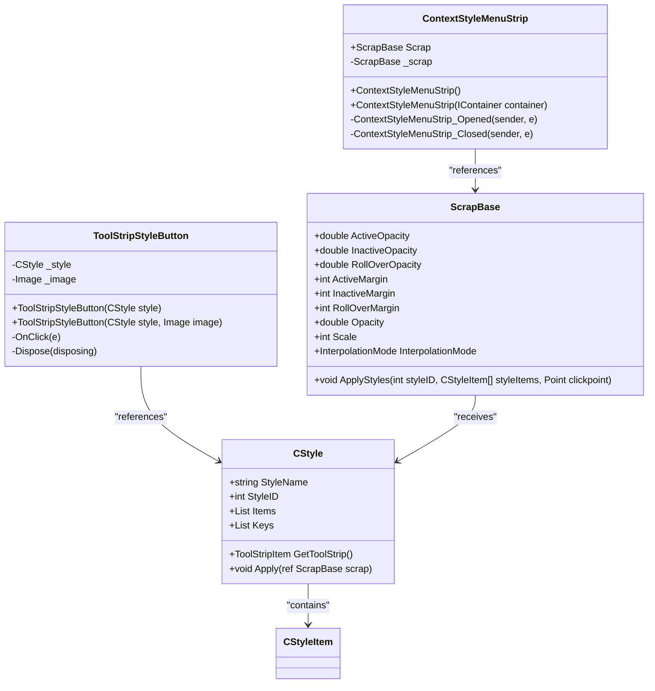
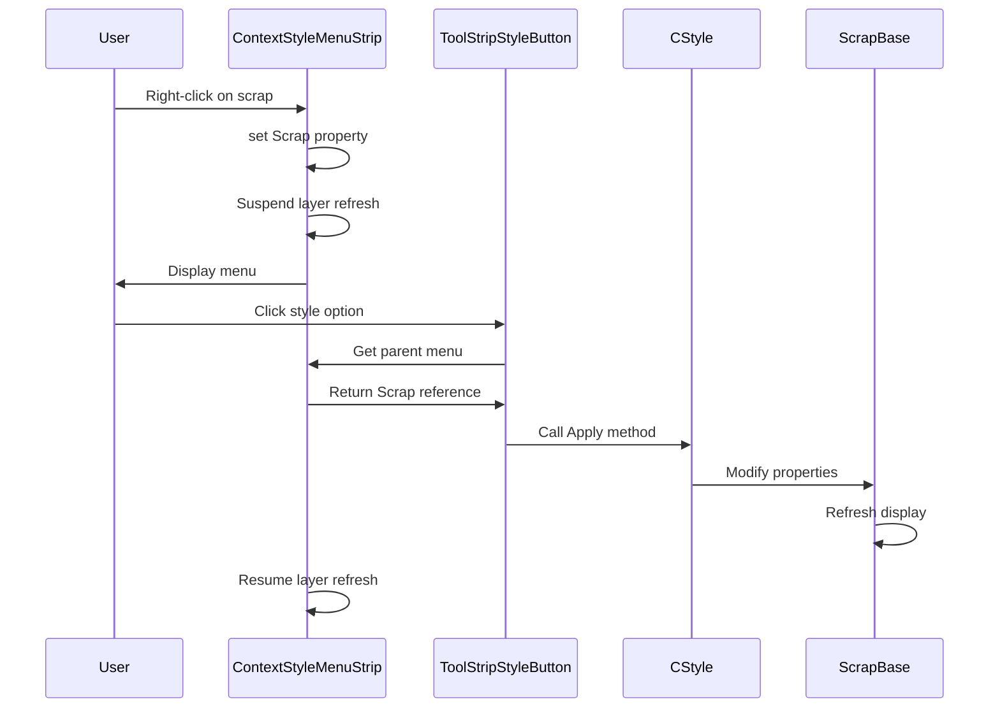
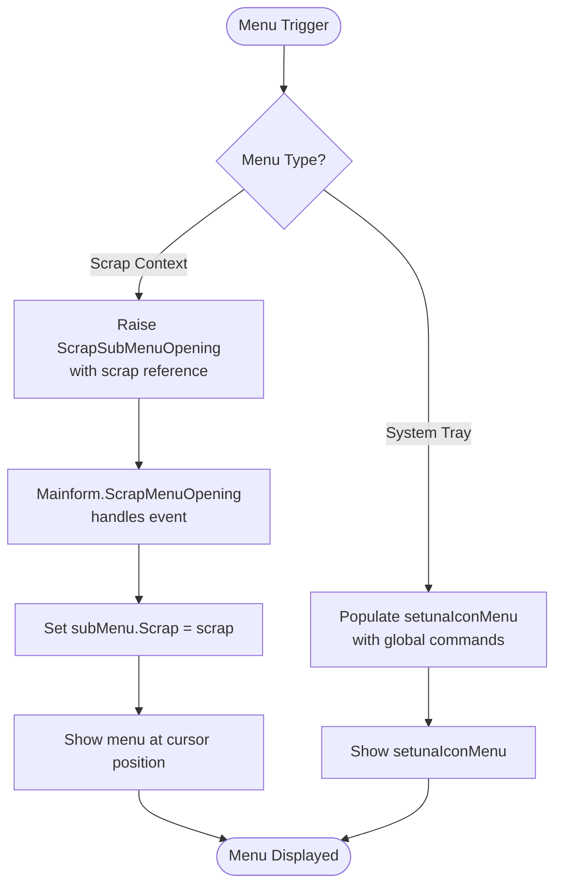

# Context Menu System

<cite>
**Referenced Files in This Document**   
- [ContextStyleMenuStrip.cs](file://SETUNA/Main/ContextStyleMenuStrip.cs)
- [ContextStyleMenuStrip.Designer.cs](file://SETUNA/Main/ContextStyleMenuStrip.Designer.cs)
- [ToolStripStyleButton.cs](file://SETUNA/Main/ToolStripStyleButton.cs)
- [Mainform.cs](file://SETUNA/Mainform.cs)
- [Mainform.Designer.cs](file://SETUNA/Mainform.Designer.cs)
- [ScrapBase.cs](file://SETUNA/Main/ScrapBase.cs)
- [SetunaOption.cs](file://SETUNA/Main/Option/SetunaOption.cs)
- [StyleEditForm.Designer.cs](file://SETUNA/Main/Option/StyleEditForm.Designer.cs)
</cite>

## Table of Contents
1. [Introduction](#introduction)
2. [Core Components](#core-components)
3. [Architecture Overview](#architecture-overview)
4. [Detailed Component Analysis](#detailed-component-analysis)
5. [Event Handling and Lifecycle](#event-handling-and-lifecycle)
6. [Menu Population and Dynamic Behavior](#menu-population-and-dynamic-behavior)
7. [Accessibility and High-DPI Considerations](#accessibility-and-high-dpi-considerations)
8. [Troubleshooting Common Issues](#troubleshooting-common-issues)
9. [Conclusion](#conclusion)

## Introduction
The ContextStyleMenuStrip class serves as the central mechanism for context menu functionality within the SETUNA application. As a specialized extension of the Windows Forms ContextMenuStrip, it provides a unified interface for style application and system interaction through both system tray and scrap-level context menus. This documentation details the implementation, integration, and usage patterns of this critical UI component, focusing on its role in enabling runtime style application, managing scrap interactions, and maintaining application state during user interactions.

**Section sources**
- [ContextStyleMenuStrip.cs](file://SETUNA/Main/ContextStyleMenuStrip.cs#L1-L42)
- [ContextStyleMenuStrip.Designer.cs](file://SETUNA/Main/ContextStyleMenuStrip.Designer.cs#L1-L44)

## Core Components

The ContextStyleMenuStrip class is the foundation of the application's context menu system, inheriting from System.Windows.Forms.ContextMenuStrip to leverage built-in dropdown menu functionality while extending it with application-specific features. The class maintains a reference to a ScrapBase object through its Scrap property, establishing a direct relationship between the menu and the scrap it operates on. This association enables context-aware menu behavior where available styles and actions are determined by the target scrap's state and configuration.

The ToolStripStyleButton class implements the menu items that represent individual styles within the context menu. Each button encapsulates a CStyle object and handles click events by applying the associated style to the scrap referenced by its parent ContextStyleMenuStrip. This design pattern separates style definition from UI presentation while maintaining a clean execution pathway from user interaction to style application.

**Section sources**
- [ContextStyleMenuStrip.cs](file://SETUNA/Main/ContextStyleMenuStrip.cs#L1-L42)
- [ToolStripStyleButton.cs](file://SETUNA/Main/ToolStripStyleButton.cs#L1-L54)

## Architecture Overview

**Diagram sources**
- [ContextStyleMenuStrip.cs](file://SETUNA/Main/ContextStyleMenuStrip.cs#L1-L42)
- [ToolStripStyleButton.cs](file://SETUNA/Main/ToolStripStyleButton.cs#L1-L54)
- [ScrapBase.cs](file://SETUNA/Main/ScrapBase.cs#L1-L200)
- [CStyle.cs](file://SETUNA/Main/Style/CStyle.cs#L201-L276)

## Detailed Component Analysis

### ContextStyleMenuStrip Implementation
The ContextStyleMenuStrip class extends the standard ContextMenuStrip with application-specific functionality centered around scrap management. Its primary feature is the Scrap property, which establishes a direct reference to a ScrapBase object, enabling context-aware menu operations. This property is implemented as a simple getter/setter pair that stores the reference in a private field (_scrap), allowing any menu item within the context menu to access the target scrap.

The class implements event handlers for the Opened and Closed events of the dropdown menu. When the menu opens, it calls LayerManager.Instance.SuspendRefresh(), temporarily suspending layer refresh operations to prevent visual flickering during menu interaction. When the menu closes, it calls LayerManager.Instance.ResumeRefresh(), restoring normal layer refresh behavior. This optimization ensures smooth user experience during context menu usage.

**Section sources**
- [ContextStyleMenuStrip.cs](file://SETUNA/Main/ContextStyleMenuStrip.cs#L1-L42)
- [ContextStyleMenuStrip.Designer.cs](file://SETUNA/Main/ContextStyleMenuStrip.Designer.cs#L1-L44)

### ToolStripStyleButton Functionality
The ToolStripStyleButton class represents individual style options within the context menu. It inherits from ToolStripMenuItem and is initialized with a CStyle object, which it stores in a private field (_style). The key functionality is implemented in the OnClick method, which retrieves the parent ContextStyleMenuStrip, accesses its Scrap property, and applies the associated style to that scrap.

The button can be created with or without a custom image, allowing for visual differentiation of important styles. The class properly implements IDisposable to ensure that any assigned image resources are properly disposed of when the button is destroyed, preventing memory leaks in long-running applications.

**Diagram sources**
- [ToolStripStyleButton.cs](file://SETUNA/Main/ToolStripStyleButton.cs#L1-L54)
- [ContextStyleMenuStrip.cs](file://SETUNA/Main/ContextStyleMenuStrip.cs#L1-L42)
- [ScrapBase.cs](file://SETUNA/Main/ScrapBase.cs#L831-L868)

## Event Handling and Lifecycle

The ContextStyleMenuStrip implements a lifecycle management system through its Opened and Closed event handlers. When the menu is opened, the ContextStyleMenuStrip_Opened method is triggered, which calls LayerManager.Instance.SuspendRefresh(). This prevents the layer manager from updating the display while the user is interacting with the context menu, avoiding visual artifacts and improving performance.

When the menu is closed, the ContextStyleMenuStrip_Closed method is called, which invokes LayerManager.Instance.ResumeRefresh(). This restores normal layer refresh operations, ensuring that any changes made through the context menu are properly reflected in the application's visual state. This suspend/resume pattern is a common optimization technique in UI development to prevent unnecessary redraws during transient states.

The event wiring is established in the InitializeComponent method of the designer file, where delegates are attached to both the Opened and Closed events. This ensures that the lifecycle methods are automatically connected when the menu is instantiated, requiring no additional setup code in consuming classes.

**Section sources**
- [ContextStyleMenuStrip.cs](file://SETUNA/Main/ContextStyleMenuStrip.cs#L32-L40)
- [ContextStyleMenuStrip.Designer.cs](file://SETUNA/Main/ContextStyleMenuStrip.Designer.cs#L36-L38)

## Menu Population and Dynamic Behavior

The context menu system supports dynamic population through two primary instances: the system tray icon menu (setunaIconMenu) and individual scrap menus (subMenu). The system tray menu is configured during application initialization in the SetSubMenu method of Mainform, where it is populated with global application commands such as capture, paste, options, and shutdown.

For individual scrap menus, the application uses a callback pattern through the ScrapMenuOpening event. When a scrap's context menu is about to be displayed, it raises the ScrapSubMenuOpening event, which is handled by the Mainform's ScrapMenuOpening method. This method sets the subMenu's Scrap property to the target scrap and displays the menu at the cursor position relative to the scrap.

Menu items are created through the GetToolStrip method implemented by various CStyle classes. Each style returns a ToolStripItem (typically a ToolStripStyleButton) that represents it in the menu system. The menu structure for the system tray is defined in the Mainform constructor, while scrap-specific menus are dynamically generated based on the scrap's configuration and available styles.

**Diagram sources**
- [Mainform.cs](file://SETUNA/Mainform.cs#L97-L113)
- [Mainform.cs](file://SETUNA/Mainform.cs#L654-L661)
- [SetunaOption.cs](file://SETUNA/Main/Option/SetunaOption.cs#L560-L568)

## Accessibility and High-DPI Considerations

The context menu system inherits standard Windows Forms accessibility features through its inheritance from ContextMenuStrip, including keyboard navigation, screen reader compatibility, and high-contrast mode support. The menu items are automatically focusable and navigable using keyboard shortcuts, allowing users to access all functionality without requiring mouse interaction.

For high-DPI scaling, the application sets ImageScalingSize to 20x20 pixels for both menu instances, providing appropriately sized icons on high-resolution displays. The ToolStripStyleButton class properly handles image disposal to prevent memory leaks when high-resolution images are used in the menu system.

The menu positioning takes into account the current cursor position and converts it to client coordinates relative to the target scrap, ensuring proper placement regardless of display scaling factors. The system tray menu and scrap context menus both use this coordinate conversion to maintain consistent positioning behavior across different DPI settings.

**Section sources**
- [Mainform.Designer.cs](file://SETUNA/Mainform.Designer.cs#L84-L85)
- [Mainform.Designer.cs](file://SETUNA/Mainform.Designer.cs#L92-L93)
- [Mainform.cs](file://SETUNA/Mainform.cs#L657)

## Troubleshooting Common Issues

### Menu Positioning Problems
When context menus appear in incorrect positions, verify that the PointToClient method is properly called with the current cursor position. The subMenu.Show method requires coordinates relative to the owner control, so failing to convert from screen coordinates will result in misplacement. Ensure that the scrap reference passed to PointToClient is the same scrap that triggered the menu.

### Event Leakage and Memory Issues
The SubMenu_MouseWheel event handler demonstrates proper event management by first removing any existing handler before adding a new one. This prevents multiple registrations that could lead to memory leaks or duplicate event processing. Always follow this pattern when attaching event handlers to reusable components like the subMenu instance.

### Style Application Failures
If styles are not being applied correctly, verify that the Scrap property is properly set on the ContextStyleMenuStrip before the menu is displayed. The ToolStripStyleButton.OnClick method depends on this property to access the target scrap. Additionally, ensure that the CStyle.Apply method properly handles the ref parameter and that any required initialization is performed before style application begins.

**Section sources**
- [Mainform.cs](file://SETUNA/Mainform.cs#L654-L664)
- [ToolStripStyleButton.cs](file://SETUNA/Main/ToolStripStyleButton.cs#L25-L32)
- [ContextStyleMenuStrip.cs](file://SETUNA/Main/ContextStyleMenuStrip.cs#L23-L27)

## Conclusion
The ContextStyleMenuStrip class provides a robust foundation for the application's context menu system, enabling both system-level and scrap-specific interactions through a consistent interface. By extending the standard ContextMenuStrip with scrap association and lifecycle management features, it creates a seamless experience for applying styles and managing application state. The integration with ToolStripStyleButton and CStyle classes establishes a clean separation between UI presentation and functionality, while the event-driven architecture allows for dynamic menu population and responsive user interactions. This design effectively balances reusability, performance, and maintainability in the application's user interface.