# Main Window Interface

<cite>
**Referenced Files in This Document**
- [Mainform.cs](file://SETUNA/Mainform.cs)
- [Mainform.Designer.cs](file://SETUNA/Mainform.Designer.cs)
- [ScrapBook.cs](file://SETUNA/Main/ScrapBook.cs)
- [SetunaOption.cs](file://SETUNA/Main/Option/SetunaOption.cs)
- [BaseForm.cs](file://SETUNA/Main/Common/BaseForm.cs)
- [Program.cs](file://SETUNA/Program.cs)
- [ISingletonForm.cs](file://com/clearunit/ISingletonForm.cs)
- [ClickCapture.cs](file://SETUNA/ClickCapture.cs)
- [ScrapBase.cs](file://SETUNA/Main/ScrapBase.cs)
- [ContextStyleMenuStrip.cs](file://SETUNA/Main/ContextStyleMenuStrip.cs)
</cite>

## Table of Contents
1. [Introduction](#introduction)
2. [Class Architecture](#class-architecture)
3. [Singleton Pattern Implementation](#singleton-pattern-implementation)
4. [Core Component Initialization](#core-component-initialization)
5. [UI Layout and Controls](#ui-layout-and-controls)
6. [System Tray Integration](#system-tray-integration)
7. [Event Handling System](#event-handling-system)
8. [Delayed Initialization](#delayed-initialization)
9. [Resource Management](#resource-management)
10. [Performance Optimization](#performance-optimization)
11. [Common Issues and Solutions](#common-issues-and-solutions)
12. [Best Practices](#best-practices)

## Introduction

The Mainform class serves as the primary application window and central hub for the SETUNA screenshot management system. It implements a sophisticated singleton pattern to provide global access throughout the application while managing core components like the ScrapBook for scrap lifecycle management, SetunaOption for configuration persistence, and the dustbox queue for temporary scrap storage.

This form acts as the foundation for the entire application, coordinating between user interactions, system events, and the underlying scrap management infrastructure. Its design emphasizes performance, resource efficiency, and seamless integration with Windows system features.

## Class Architecture

The Mainform class follows a layered architecture pattern with clear separation of concerns:

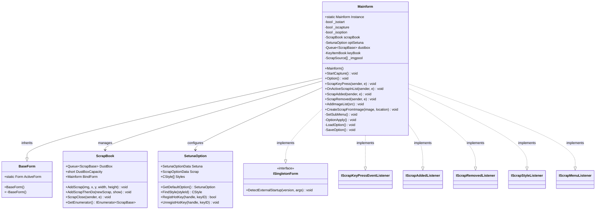

**Diagram sources**
- [Mainform.cs](file://SETUNA/Mainform.cs#L18-L19)
- [BaseForm.cs](file://SETUNA/Main/Common/BaseForm.cs#L3-L17)
- [ScrapBook.cs](file://SETUNA/Main/ScrapBook.cs#L10-L11)
- [SetunaOption.cs](file://SETUNA/Main/Option/SetunaOption.cs#L15-L16)
- [ISingletonForm.cs](file://com/clearunit/ISingletonForm.cs#L3-L7)

**Section sources**
- [Mainform.cs](file://SETUNA/Mainform.cs#L18-L19)
- [BaseForm.cs](file://SETUNA/Main/Common/BaseForm.cs#L3-L17)

## Singleton Pattern Implementation

The Mainform class implements a strict singleton pattern through the static Instance property, ensuring global access to the main application window while maintaining proper lifecycle management.

### Singleton Characteristics

| Property | Description | Implementation |
|----------|-------------|----------------|
| **Instance Property** | Static access point for the main form | `public static Mainform Instance { private set; get; }` |
| **Constructor Logic** | Sets instance reference immediately | `Instance = this;` in constructor |
| **Thread Safety** | Not explicitly thread-safe | Depends on Windows Forms threading model |
| **Lifecycle** | Managed by Windows Forms application | Created during application startup |

### Global Access Pattern

The singleton pattern enables centralized access to the main form from anywhere in the application:

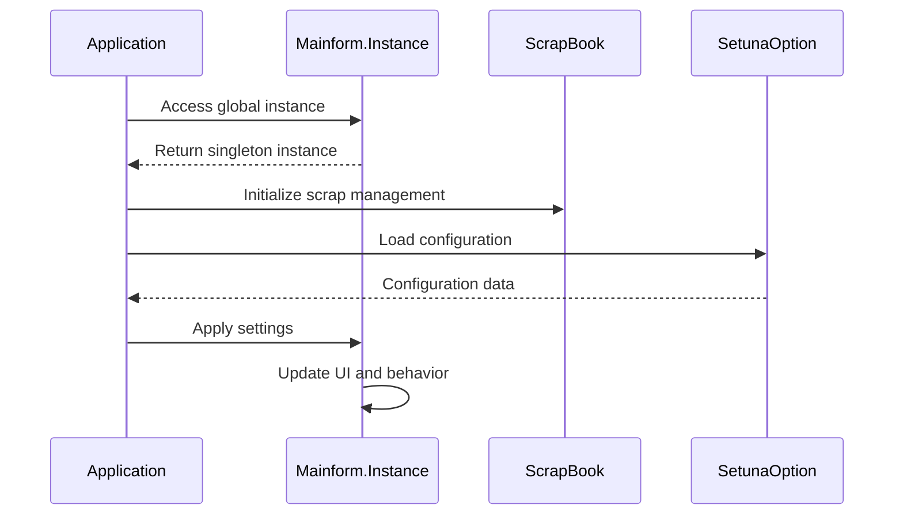

**Diagram sources**
- [Mainform.cs](file://SETUNA/Mainform.cs#L24-L25)
- [ScrapBook.cs](file://SETUNA/Main/ScrapBook.cs#L62-L68)
- [SetunaOption.cs](file://SETUNA/Main/Option/SetunaOption.cs#L589-L597)

**Section sources**
- [Mainform.cs](file://SETUNA/Mainform.cs#L20-L25)

## Core Component Initialization

The Mainform constructor performs critical initialization of core components that form the foundation of the application's functionality.

### Initialization Sequence

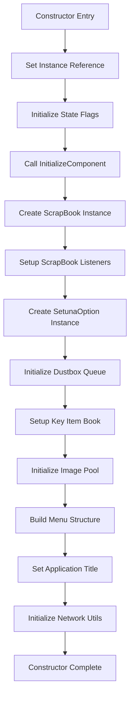

**Diagram sources**
- [Mainform.cs](file://SETUNA/Mainform.cs#L22-L46)

### Component Details

| Component | Purpose | Key Features |
|-----------|---------|--------------|
| **ScrapBook** | Manages scrap lifecycle | Event-driven, persistent storage, dustbox support |
| **SetunaOption** | Configuration management | XML serialization, hotkey registration, theme support |
| **Dustbox Queue** | Temporary scrap storage | FIFO ordering, configurable capacity, automatic cleanup |
| **KeyItemBook** | Keyboard shortcut management | Hotkey binding, key combination parsing, conflict detection |
| **Image Pool** | Asynchronous image processing | Background processing, memory management, batch operations |

### Event Listener Setup

The Mainform establishes comprehensive event listening for scrap lifecycle management:

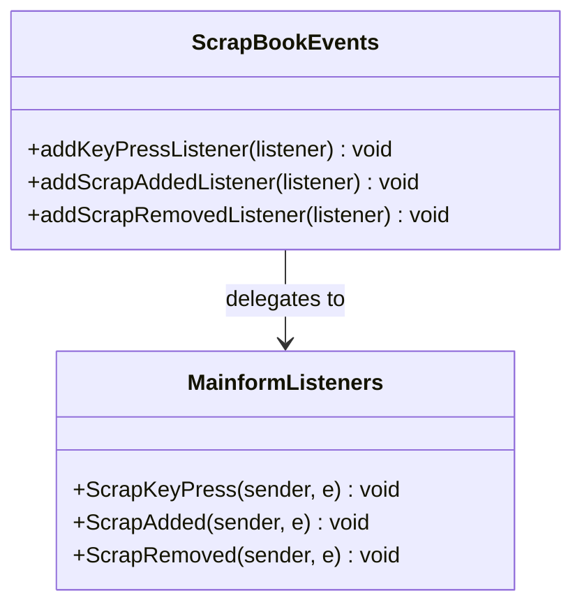

**Diagram sources**
- [Mainform.cs](file://SETUNA/Mainform.cs#L31-L34)
- [ScrapBook.cs](file://SETUNA/Main/ScrapBook.cs#L302-L332)

**Section sources**
- [Mainform.cs](file://SETUNA/Mainform.cs#L22-L46)
- [ScrapBook.cs](file://SETUNA/Main/ScrapBook.cs#L62-L68)

## UI Layout and Controls

The Mainform implements a minimalist yet functional UI design focused on accessibility and performance. The layout consists of two primary buttons arranged horizontally.

### Control Architecture

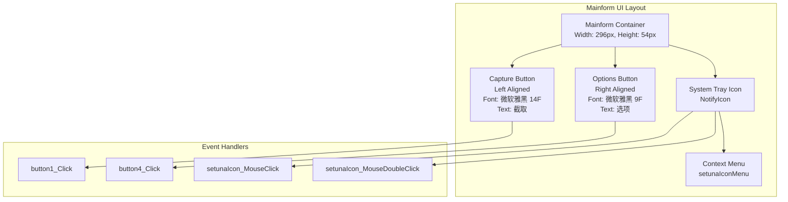

**Diagram sources**
- [Mainform.Designer.cs](file://SETUNA/Mainform.Designer.cs#L35-L62)
- [Mainform.Designer.cs](file://SETUNA/Mainform.Designer.cs#L74-L80)

### Control Specifications

| Control | Properties | Behavior |
|---------|------------|----------|
| **Capture Button** | `button1` | Full-width, top/bottom anchoring, gray text color |
| **Options Button** | `button4` | Right-docked, smaller font, gray text color |
| **Mainform** | Root container | Non-resizable, always-on-top, hidden initially |
| **System Tray** | `setunaIcon` | Persistent icon, context menu support |

### Button Interaction Patterns

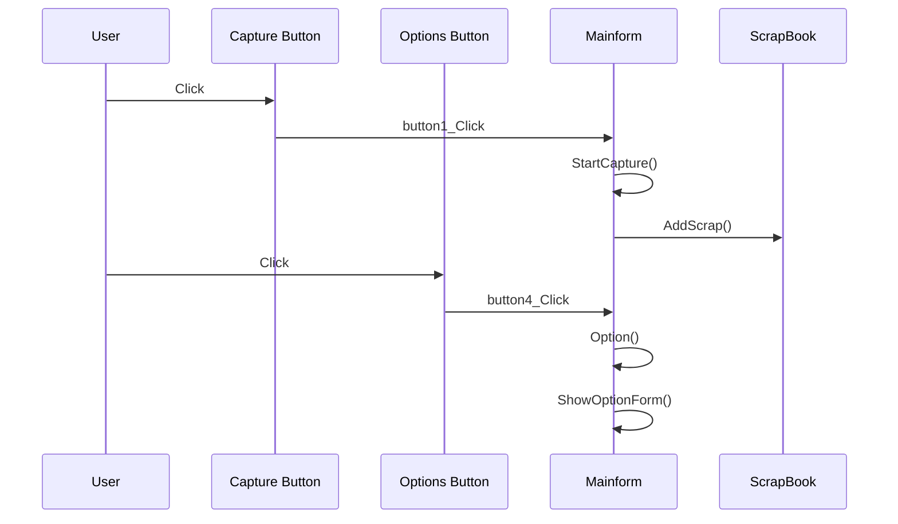

**Diagram sources**
- [Mainform.cs](file://SETUNA/Mainform.cs#L522-L531)
- [Mainform.cs](file://SETUNA/Mainform.cs#L262-L263)

**Section sources**
- [Mainform.Designer.cs](file://SETUNA/Mainform.Designer.cs#L35-L62)
- [Mainform.cs](file://SETUNA/Mainform.cs#L522-L531)

## System Tray Integration

The Mainform integrates seamlessly with Windows system tray functionality through the NotifyIcon component, providing persistent access to application features without cluttering the desktop.

### System Tray Architecture

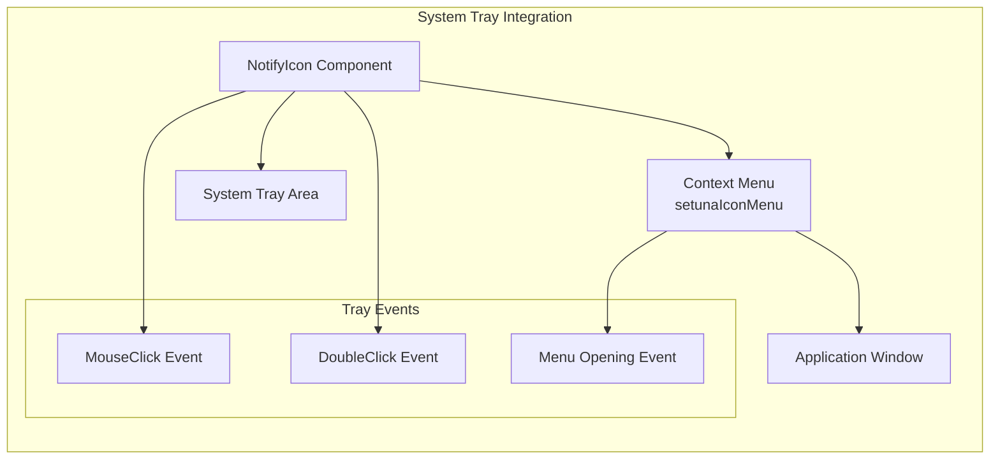

**Diagram sources**
- [Mainform.Designer.cs](file://SETUNA/Mainform.Designer.cs#L74-L80)
- [Mainform.Designer.cs](file://SETUNA/Mainform.Designer.cs#L82-L88)

### Tray Interaction Behaviors

| Event | Handler | Behavior |
|-------|---------|----------|
| **Single Click** | `setunaIcon_MouseClick` | Activates main window, refreshes layer manager |
| **Double Click** | `setunaIcon_MouseDoubleClick` | Opens options dialog |
| **Menu Opening** | `setunaIconMenu_Opening` | Dynamically builds context menu |

### Context Menu Construction

The system tray menu is dynamically constructed based on current application state and user preferences:

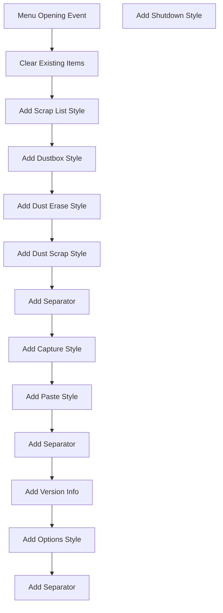

**Diagram sources**
- [Mainform.cs](file://SETUNA/Mainform.cs#L96-L113)

**Section sources**
- [Mainform.Designer.cs](file://SETUNA/Mainform.Designer.cs#L74-L88)
- [Mainform.cs](file://SETUNA/Mainform.cs#L96-L113)

## Event Handling System

The Mainform implements a comprehensive event handling system that coordinates between user interactions, system events, and internal application logic.

### Event Architecture

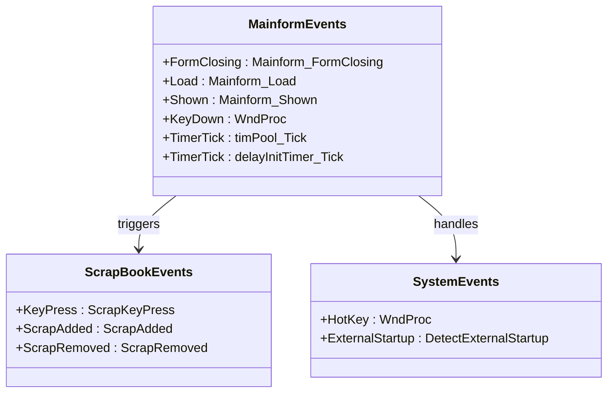

**Diagram sources**
- [Mainform.cs](file://SETUNA/Mainform.cs#L607-L616)
- [Mainform.cs](file://SETUNA/Mainform.cs#L373-L381)
- [Mainform.cs](file://SETUNA/Mainform.cs#L736-L743)

### Key Event Handlers

| Event Handler | Purpose | Trigger Conditions |
|---------------|---------|-------------------|
| **Mainform_Load** | Application startup initialization | Form load event |
| **Mainform_FormClosing** | Cleanup and hotkey deregistration | Form closing event |
| **timPool_Tick** | Image pool processing | Timer tick event |
| **delayInitTimer_Tick** | Delayed initialization completion | Timer tick event |
| **WndProc** | Hotkey and system message handling | Windows message processing |

### Hotkey System Integration

The Mainform handles global hotkeys through the Windows message processing system:

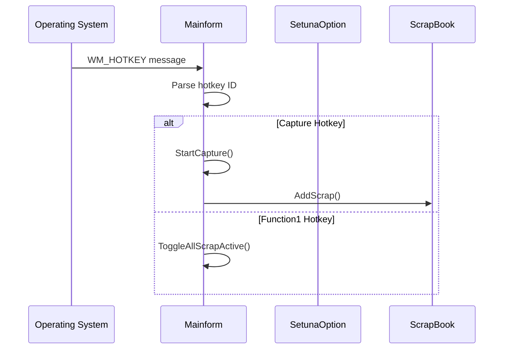

**Diagram sources**
- [Mainform.cs](file://SETUNA/Mainform.cs#L384-L400)

**Section sources**
- [Mainform.cs](file://SETUNA/Mainform.cs#L607-L616)
- [Mainform.cs](file://SETUNA/Mainform.cs#L384-L400)

## Delayed Initialization

The Mainform implements a sophisticated delayed initialization system using the delayInitTimer to optimize startup performance and ensure proper component initialization order.

### Initialization Timeline

```mermaid
gantt
title Mainform Initialization Timeline
dateFormat X
axisFormat %s
section Startup Phase
Constructor Execution :milestone, m1, 0, 0
InitializeComponent :active, init1, 0, 1
Component Setup :active, init2, 1, 2
section Background Tasks
LayerManager Init :active, layer, 2, 3
CacheManager Init :active, cache, 3, 4
Delay Timer Start :active, timer, 4, 5
section Completion
Delay Timer Tick :milestone, dtick, 5, 5
Final Initialization :milestone, finish, 5, 5
```

**Diagram sources**
- [Mainform.cs](file://SETUNA/Mainform.cs#L633-L635)

### Delayed Initialization Process

The delayed initialization ensures that critical components are initialized without blocking the UI thread:

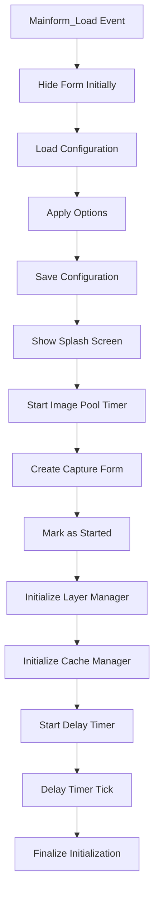

**Diagram sources**
- [Mainform.cs](file://SETUNA/Mainform.cs#L616-L635)

### Performance Benefits

The delayed initialization provides several performance advantages:

| Benefit | Description | Impact |
|---------|-------------|--------|
| **UI Responsiveness** | Prevents UI thread blocking during startup | Faster form appearance |
| **Resource Optimization** | Components initialized on-demand | Reduced memory footprint |
| **Error Isolation** | Failed initializations don't crash app | Graceful degradation |
| **Modular Loading** | Dependencies loaded in optimal order | Improved reliability |

**Section sources**
- [Mainform.cs](file://SETUNA/Mainform.cs#L616-L635)

## Resource Management

The Mainform implements comprehensive resource management strategies to ensure efficient memory usage and proper cleanup throughout the application lifecycle.

### Memory Management Strategy

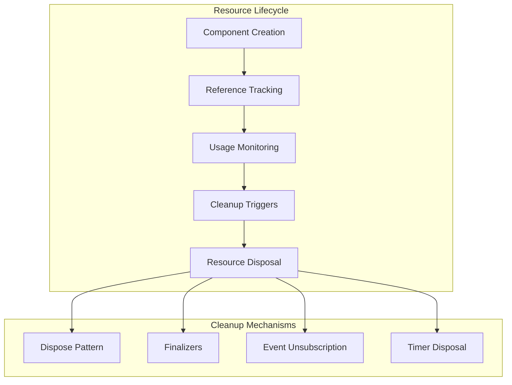

### Resource Types and Management

| Resource Type | Management Strategy | Cleanup Method |
|---------------|-------------------|----------------|
| **Windows Forms Controls** | Dispose pattern | Automatic disposal in designer |
| **Timers** | Manual disposal | Stop and dispose in FormClosing |
| **Images and Graphics** | Using statements | Automatic disposal via using blocks |
| **File Handles** | Stream management | Proper stream closure |
| **Hotkeys** | Explicit unregistration | UnregistHotKey in FormClosing |

### Memory Leak Prevention

The Mainform implements several strategies to prevent memory leaks:

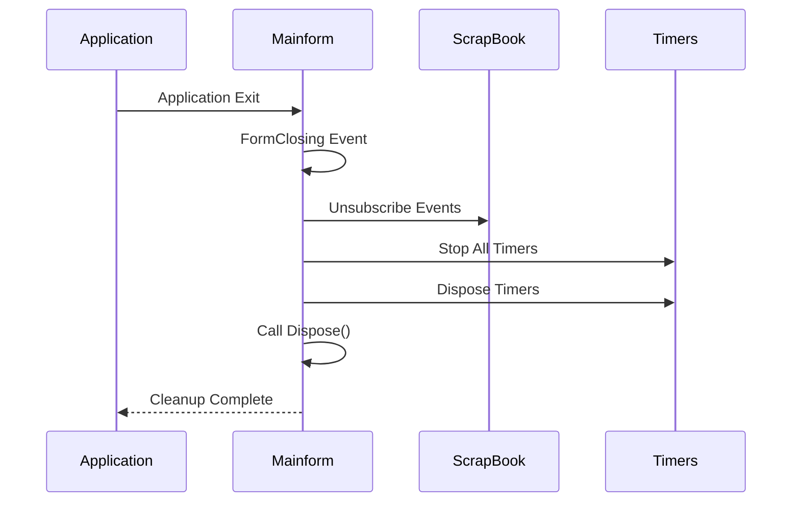

**Diagram sources**
- [Mainform.cs](file://SETUNA/Mainform.cs#L607-L616)

**Section sources**
- [Mainform.cs](file://SETUNA/Mainform.cs#L607-L616)
- [Mainform.Designer.cs](file://SETUNA/Mainform.Designer.cs#L6-L14)

## Performance Optimization

The Mainform incorporates several performance optimization techniques to ensure smooth operation and minimal system impact.

### UI Thread Optimization

The Mainform minimizes UI thread blocking through strategic use of timers and asynchronous processing:

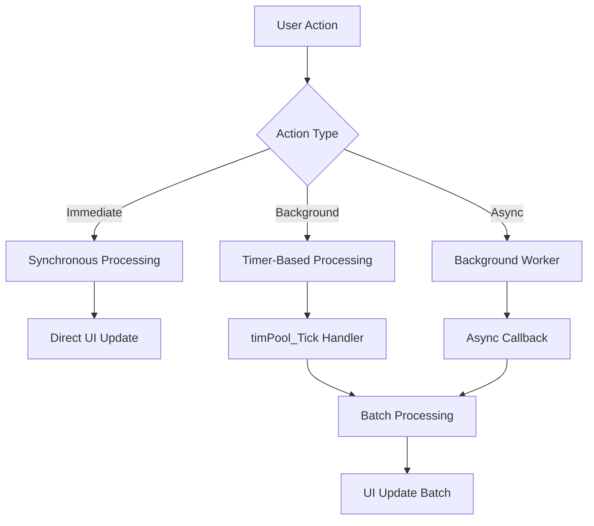

### Performance Monitoring

| Metric | Measurement Point | Optimization Target |
|--------|------------------|-------------------|
| **Startup Time** | Constructor to Shown event | < 2 seconds |
| **Memory Usage** | Heap allocation monitoring | Stable baseline |
| **CPU Usage** | Timer tick frequency | Minimal idle CPU |
| **Response Time** | User interaction latency | < 100ms |

### Optimization Techniques

The Mainform employs several optimization techniques:

1. **Lazy Loading**: Components initialized only when needed
2. **Batch Processing**: Multiple operations grouped in single timer ticks
3. **Resource Pooling**: Reuse of expensive objects
4. **Event Debouncing**: Prevention of rapid event firing
5. **Memory Management**: Proper disposal of graphics resources

**Section sources**
- [Mainform.cs](file://SETUNA/Mainform.cs#L680-L700)
- [Mainform.cs](file://SETUNA/Mainform.cs#L704-L708)

## Common Issues and Solutions

This section addresses frequently encountered issues with the Mainform and provides practical solutions.

### Issue Categories

| Category | Common Problems | Solutions |
|----------|----------------|-----------|
| **Initialization** | Delayed startup, missing components | Verify component creation order |
| **Memory Management** | Memory leaks, high memory usage | Implement proper disposal patterns |
| **Event Handling** | Missing events, event conflicts | Review event subscription/unsubscription |
| **System Integration** | Hotkey conflicts, tray issues | Check Windows API integration |

### Troubleshooting Workflow

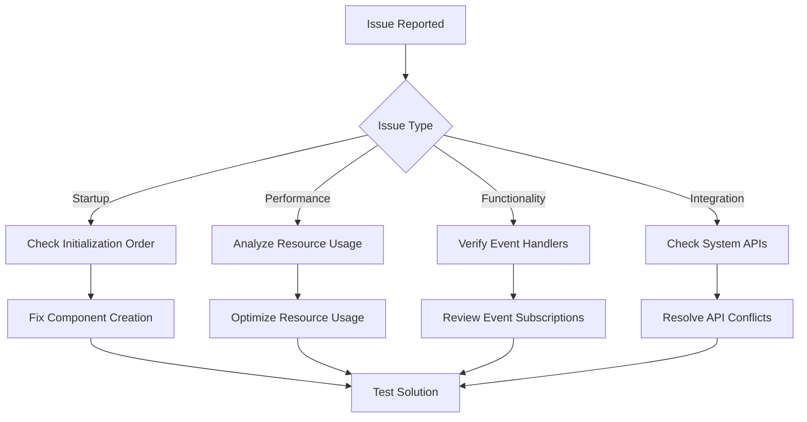

### Specific Issue Solutions

| Issue | Symptoms | Resolution |
|-------|----------|------------|
| **Form Not Showing** | Mainform remains hidden | Check `optSetuna.Setuna.ShowMainWindow` setting |
| **Hotkeys Not Working** | Global shortcuts ineffective | Verify hotkey registration and conflicts |
| **Memory Leaks** | Increasing memory usage | Ensure proper disposal of graphics resources |
| **Timer Issues** | Timers not firing | Check timer enabled state and intervals |

**Section sources**
- [Mainform.cs](file://SETUNA/Mainform.cs#L616-L635)
- [Mainform.cs](file://SETUNA/Mainform.cs#L607-L616)

## Best Practices

Following established best practices ensures reliable and maintainable Mainform implementation.

### Design Principles

1. **Singleton Pattern Compliance**: Maintain single instance throughout application lifecycle
2. **Event-Driven Architecture**: Use events for loose coupling between components
3. **Resource Management**: Implement proper disposal patterns for all resources
4. **Error Handling**: Provide graceful error handling and recovery mechanisms
5. **Performance Awareness**: Minimize UI thread blocking and optimize resource usage

### Implementation Guidelines

| Practice | Rationale | Implementation |
|----------|-----------|----------------|
| **Proper Disposal** | Prevent memory leaks | Implement IDisposable pattern |
| **Event Management** | Avoid memory leaks | Subscribe/unsubscribe from events appropriately |
| **Timer Management** | Prevent resource leaks | Stop and dispose timers in FormClosing |
| **Configuration Loading** | Handle missing files gracefully | Provide default configurations |
| **Hotkey Registration** | Prevent conflicts | Unregister hotkeys before application exit |

### Maintenance Recommendations

Regular maintenance tasks help ensure optimal Mainform performance:

1. **Code Reviews**: Regular review of event handling and resource management
2. **Performance Monitoring**: Track memory usage and response times
3. **Error Logging**: Implement comprehensive error logging for troubleshooting
4. **Unit Testing**: Test critical functionality independently
5. **Documentation Updates**: Keep documentation synchronized with code changes

**Section sources**
- [Mainform.cs](file://SETUNA/Mainform.cs#L22-L46)
- [Mainform.cs](file://SETUNA/Mainform.cs#L607-L616)