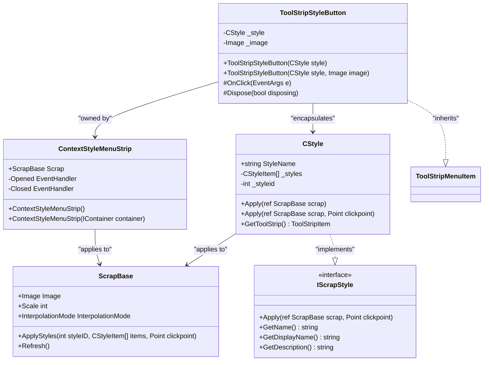
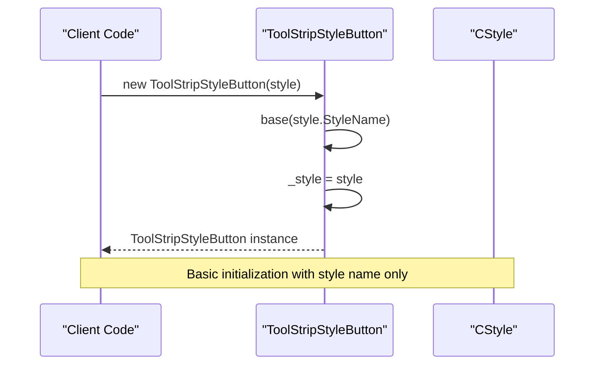
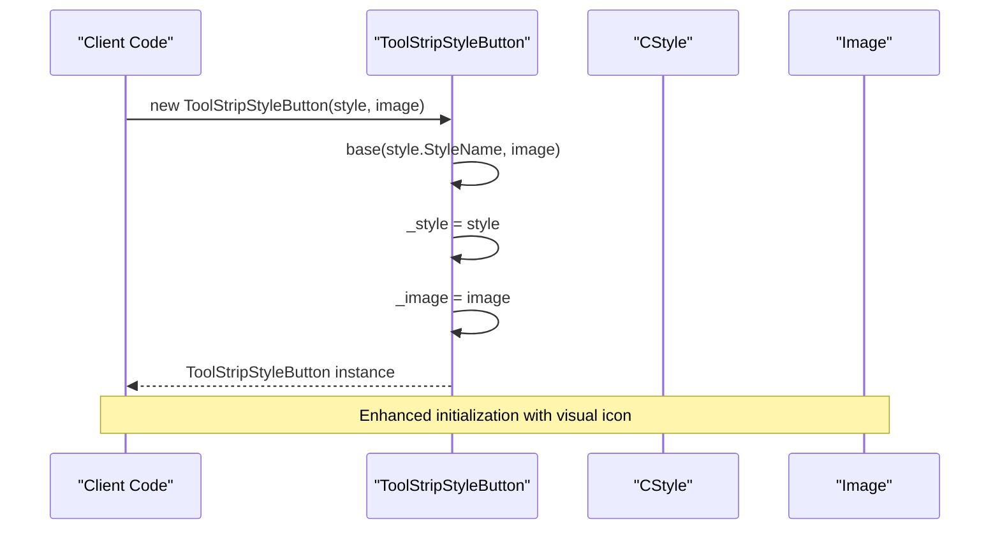
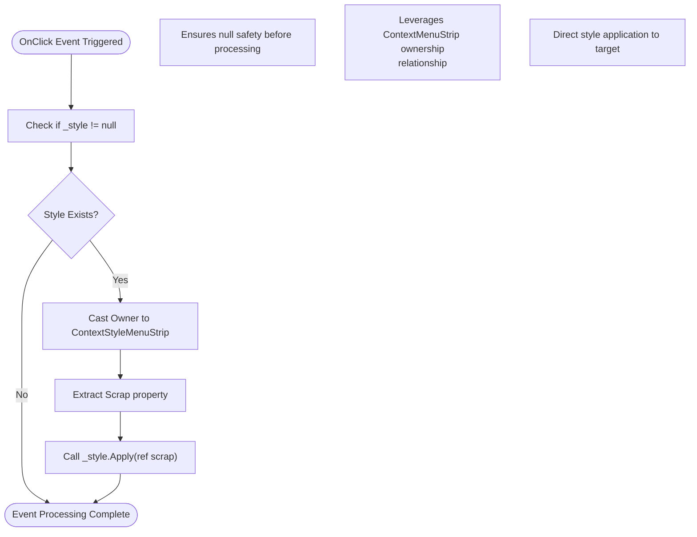
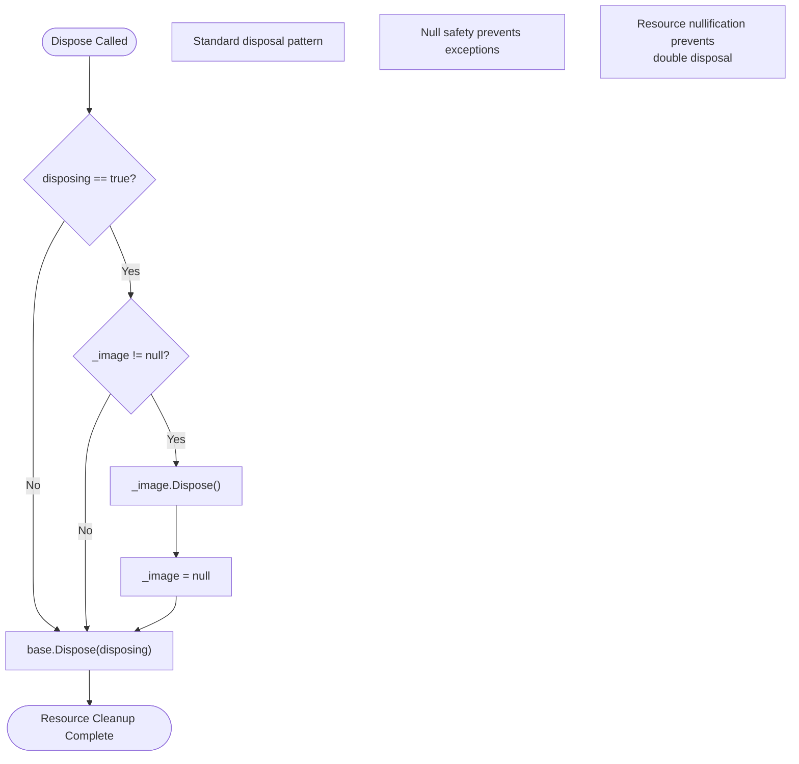
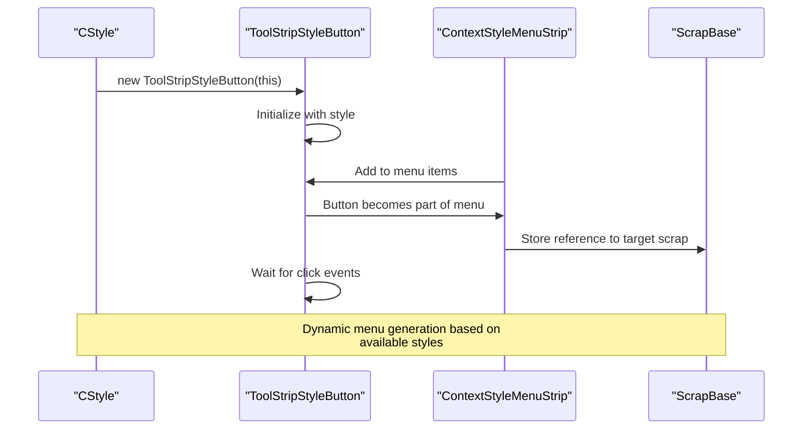
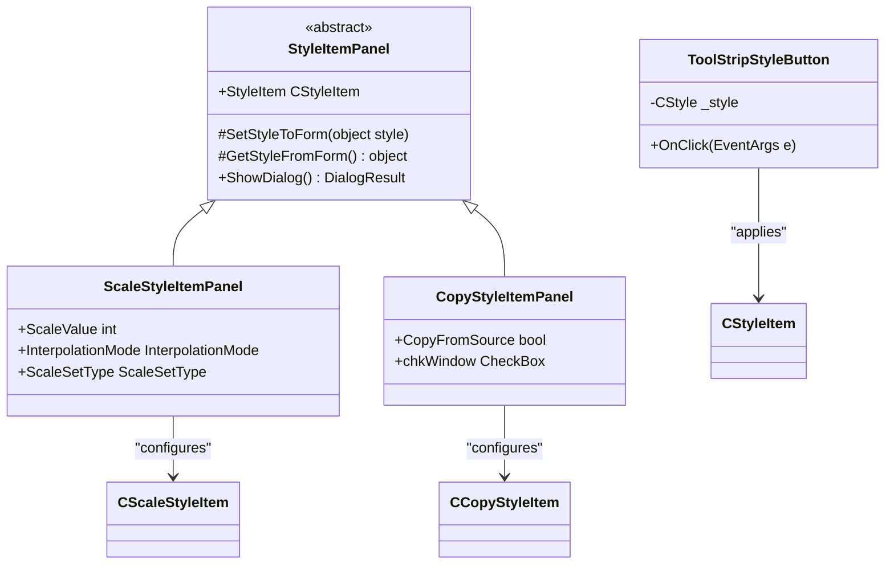
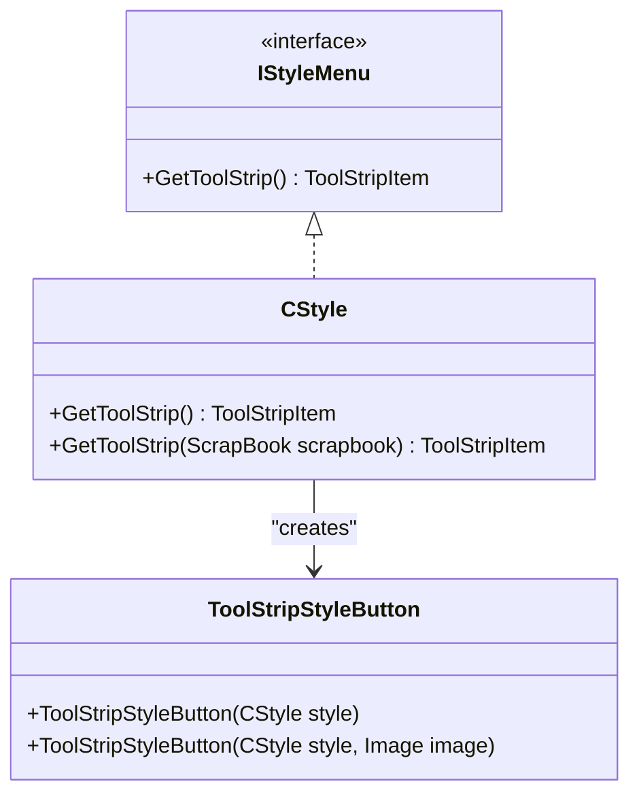
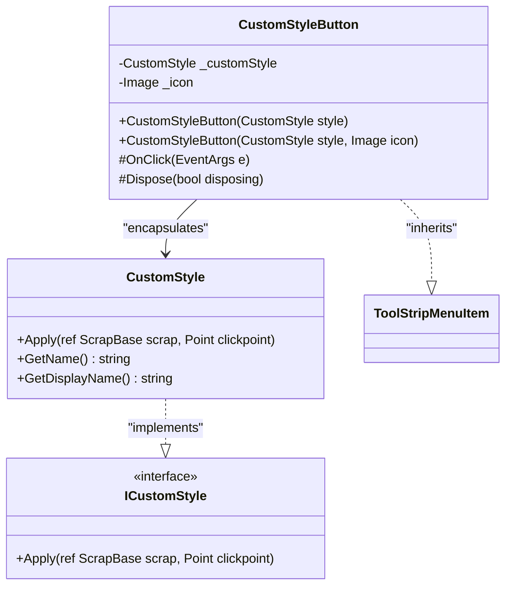
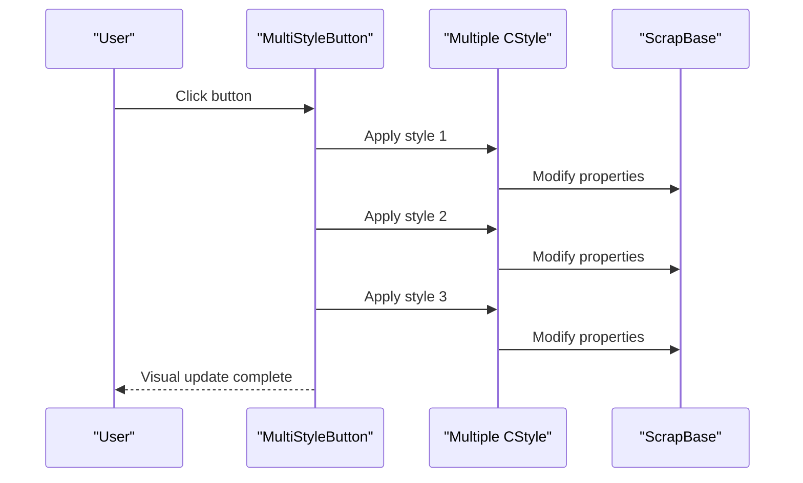

# UI Controls and ToolStrip Elements

<cite>
**Referenced Files in This Document**
- [ToolStripStyleButton.cs](file://SETUNA/Main/ToolStripStyleButton.cs)
- [ContextStyleMenuStrip.cs](file://SETUNA/Main/ContextStyleMenuStrip.cs)
- [CStyle.cs](file://SETUNA/Main/Style/CStyle.cs)
- [ScrapBase.cs](file://SETUNA/Main/ScrapBase.cs)
- [StyleItemDictionary.cs](file://SETUNA/Main/StyleItems/StyleItemDictionary.cs)
- [CStyleItem.cs](file://SETUNA/Main/StyleItems/CStyleItem.cs)
- [CScaleStyleItem.cs](file://SETUNA/Main/StyleItems/CScaleStyleItem.cs)
- [CopyStyleItemPanel.cs](file://SETUNA/Main/StyleItems/CopyStyleItemPanel.cs)
- [ScrapBook.cs](file://SETUNA/Main/ScrapBook.cs)
</cite>

## Table of Contents
1. [Introduction](#introduction)
2. [Architecture Overview](#architecture-overview)
3. [ToolStripStyleButton Implementation](#toolstripstylebutton-implementation)
4. [Constructor Overloads and Initialization](#constructor-overloads-and-initialization)
5. [Event Handling and Style Application](#event-handling-and-style-application)
6. [Image Lifecycle Management](#image-lifecycle-management)
7. [Integration with Context Menus](#integration-with-context-menus)
8. [Serialization and StyleItem Panels](#serialization-and-styleitem-panels)
9. [Best Practices and Design Patterns](#best-practices-and-design-patterns)
10. [Common Pitfalls and Solutions](#common-pitfalls-and-solutions)
11. [Extending the Pattern](#extending-the-pattern)
12. [Conclusion](#conclusion)

## Introduction

ToolStripStyleButton is a specialized custom ToolStripMenuItem that serves as a bridge between style definitions and UI controls in the Screenshot2Doc application. This component encapsulates a CStyle instance and provides direct application capabilities on Scraps through context menus and toolbars. The button acts as a dynamic UI element that enables users to apply various visual styles to captured screenshots and images with immediate visual feedback.

The ToolStripStyleButton exemplifies the Model-View-Controller (MVC) pattern within the Windows Forms ecosystem, where the button serves as the view component that interacts with the underlying style model (CStyle) and applies changes to the target Scrap entity. This design promotes separation of concerns while maintaining tight integration between UI presentation and business logic.

## Architecture Overview

The ToolStripStyleButton operates within a sophisticated style management architecture that encompasses several key components working in harmony:

**Diagram sources**
- [ToolStripStyleButton.cs](file://SETUNA/Main/ToolStripStyleButton.cs#L8-L54)
- [ContextStyleMenuStrip.cs](file://SETUNA/Main/ContextStyleMenuStrip.cs#L4-L43)
- [CStyle.cs](file://SETUNA/Main/Style/CStyle.cs#L80-L124)
- [ScrapBase.cs](file://SETUNA/Main/ScrapBase.cs#L16-L800)

This architecture demonstrates the layered approach to style application, where ToolStripStyleButton acts as a presentation layer that mediates between user interaction and the underlying style system. The ContextStyleMenuStrip provides the container context, while CStyle manages the actual style definitions and application logic.

**Section sources**
- [ToolStripStyleButton.cs](file://SETUNA/Main/ToolStripStyleButton.cs#L1-L55)
- [ContextStyleMenuStrip.cs](file://SETUNA/Main/ContextStyleMenuStrip.cs#L1-L43)
- [CStyle.cs](file://SETUNA/Main/Style/CStyle.cs#L80-L124)

## ToolStripStyleButton Implementation

The ToolStripStyleButton class inherits from ToolStripMenuItem and provides a specialized interface for applying styles to Scraps. Its implementation focuses on three primary responsibilities: encapsulating style information, handling user interactions, and managing resources efficiently.

### Core Class Structure

The class maintains two private fields that serve distinct purposes in the style application process:

- `_style`: A reference to the encapsulated CStyle instance that defines the visual modifications to be applied
- `_image`: An optional Image object that provides visual representation for the button in the UI

The internal accessibility modifier ensures that this component remains tightly integrated with the style system while preventing external misuse that could compromise the style application process.

### Constructor Design Pattern

The ToolStripStyleButton employs a constructor overloading pattern that accommodates different usage scenarios while maintaining backward compatibility and providing flexibility for various UI presentations.

**Section sources**
- [ToolStripStyleButton.cs](file://SETUNA/Main/ToolStripStyleButton.cs#L8-L54)

## Constructor Overloads and Initialization

The ToolStripStyleButton provides two constructor overloads that cater to different UI requirements and styling preferences:

### Basic Constructor (Single Parameter)

The primary constructor accepts only a CStyle instance, creating a button that displays the style name as its text label. This constructor is ideal for scenarios where the style definition itself provides sufficient contextual information for users.

**Diagram sources**
- [ToolStripStyleButton.cs](file://SETUNA/Main/ToolStripStyleButton.cs#L12-L15)

### Enhanced Constructor (With Image)

The overloaded constructor accepts both a CStyle instance and an optional Image object, enabling richer visual presentation in the UI. This constructor is particularly useful for providing visual cues alongside textual descriptions, enhancing the user experience in complex applications.

**Diagram sources**
- [ToolStripStyleButton.cs](file://SETUNA/Main/ToolStripStyleButton.cs#L18-L22)

Both constructors ensure proper initialization by calling the base ToolStripMenuItem constructor with appropriate parameters while establishing internal references to the style and optional image resources.

**Section sources**
- [ToolStripStyleButton.cs](file://SETUNA/Main/ToolStripStyleButton.cs#L12-L22)

## Event Handling and Style Application

The ToolStripStyleButton implements sophisticated event handling through the OnClick override method, which orchestrates the application of encapsulated styles to target Scraps. This method demonstrates careful consideration of null safety, type casting, and the relationship between UI controls and their underlying data models.

### Click Event Processing

The OnClick method follows a defensive programming approach that validates the presence of the encapsulated style before attempting any operations:

**Diagram sources**
- [ToolStripStyleButton.cs](file://SETUNA/Main/ToolStripStyleButton.cs#L25-L32)

### Type Safety and Casting

The implementation demonstrates careful type safety through explicit casting from the base Owner property to ContextStyleMenuStrip. This approach assumes a specific relationship between ToolStripStyleButton instances and their containing ContextStyleMenuStrip, which is validated through the application's design patterns.

The cast operation is safe within the application's architecture because ToolStripStyleButton instances are exclusively created and managed by the style system, ensuring that the Owner property consistently references a ContextStyleMenuStrip instance.

### Style Application Process

The style application process involves passing the target Scrap reference by reference to the Apply method, allowing the style to modify the Scrap's properties directly. This approach provides immediate visual feedback to users while maintaining the integrity of the style application pipeline.

**Section sources**
- [ToolStripStyleButton.cs](file://SETUNA/Main/ToolStripStyleButton.cs#L25-L32)

## Image Lifecycle Management

The ToolStripStyleButton implements comprehensive resource management through the Dispose method, ensuring proper cleanup of image resources and prevention of memory leaks. This implementation follows the IDisposable pattern and demonstrates best practices for managing unmanaged resources in .NET applications.

### Disposal Pattern Implementation

The Dispose method follows the standard .NET disposal pattern with proper null checking and resource cleanup:

**Diagram sources**
- [ToolStripStyleButton.cs](file://SETUNA/Main/ToolStripStyleButton.cs#L35-L46)

### Memory Leak Prevention

The disposal logic specifically targets the optional image resource, ensuring that bitmap data and associated GDI+ resources are properly released. This is crucial for applications dealing with potentially large image collections, as failure to dispose image resources can lead to significant memory consumption over time.

The implementation prevents double disposal by setting the image reference to null after disposal, protecting against potential exceptions that could occur if Dispose were called multiple times.

### Resource Management Best Practices

The disposal implementation demonstrates several best practices:

- **Conditional Disposal**: Only disposes managed resources when disposing is true, following .NET conventions
- **Null Safety**: Checks for null references before attempting disposal operations
- **Resource Nullification**: Sets disposed references to null to prevent reuse and double disposal
- **Base Class Integration**: Properly delegates to the base class disposal mechanism

**Section sources**
- [ToolStripStyleButton.cs](file://SETUNA/Main/ToolStripStyleButton.cs#L35-L46)

## Integration with Context Menus

ToolStripStyleButton integrates seamlessly with the ContextStyleMenuStrip system, providing dynamic style application capabilities through context menus. This integration demonstrates the power of Windows Forms extensibility and the flexibility of the ToolStrip control framework.

### Context Menu Architecture

The ContextStyleMenuStrip serves as the container for ToolStripStyleButton instances, providing the necessary context for style application operations. The integration occurs through the GetToolStrip method override in CStyle classes:

**Diagram sources**
- [CStyle.cs](file://SETUNA/Main/Style/CStyle.cs#L241-L244)
- [ContextStyleMenuStrip.cs](file://SETUNA/Main/ContextStyleMenuStrip.cs#L23-L27)

### Dynamic Menu Generation

The integration pattern allows for dynamic menu generation where CStyle instances automatically create ToolStripStyleButton instances when requested. This approach eliminates the need for manual menu construction and ensures consistency between style definitions and UI presentation.

The GetToolStrip method provides a factory pattern implementation that creates appropriate ToolStripStyleButton instances based on the style's requirements and available resources.

### Event Coordination

The integration coordinates multiple event handlers to provide seamless user experience:

- **Menu Opening Events**: ContextStyleMenuStrip_Opened suspends layer refresh operations during menu display
- **Menu Closing Events**: ContextStyleMenuStrip_Closed resumes layer refresh operations after menu closure
- **Click Events**: ToolStripStyleButton_OnClick handles individual style application requests

**Section sources**
- [ContextStyleMenuStrip.cs](file://SETUNA/Main/ContextStyleMenuStrip.cs#L32-L40)
- [CStyle.cs](file://SETUNA/Main/Style/CStyle.cs#L241-L244)

## Serialization and StyleItem Panels

ToolStripStyleButton participates in the broader serialization system through the StyleItemDictionary and StyleItemPanel infrastructure. This integration enables persistent storage of style configurations and provides user-friendly interfaces for style customization.

### StyleItem Dictionary Integration

The StyleItemDictionary provides centralized management of style item types and their serialization capabilities:

| Style Item Type | Serialization Capability | Description |
|----------------|-------------------------|-------------|
| CScaleStyleItem | Full | Supports scale factor and interpolation mode persistence |
| CMarginStyleItem | Full | Manages margin settings with visual consistency |
| COpacityStyleItem | Full | Handles opacity values with animation support |
| CRotateStyleItem | Full | Preserves rotation angles and transformation matrices |
| CCompactStyleItem | Full | Maintains compact layout preferences |
| CMoveStyleItem | Limited | Position-based styles with coordinate persistence |
| CCopyStyleItem | Limited | Copy operations with source reference preservation |

### Panel Integration Pattern

StyleItem panels provide user interfaces for configuring style parameters, with ToolStripStyleButton serving as the execution endpoint:

**Diagram sources**
- [CScaleStyleItem.cs](file://SETUNA/Main/StyleItems/CScaleStyleItem.cs#L11-L210)
- [CopyStyleItemPanel.cs](file://SETUNA/Main/StyleItems/CopyStyleItemPanel.cs#L4-L35)

### Serialization Benefits

The integration provides several benefits for style persistence and restoration:

- **Configuration Preservation**: Style parameters are maintained across application sessions
- **User Customization**: Users can create personalized style sets
- **Template Management**: Styles can be shared and reused across different scraps
- **Version Compatibility**: The serialization system handles version differences gracefully

**Section sources**
- [StyleItemDictionary.cs](file://SETUNA/Main/StyleItems/StyleItemDictionary.cs#L1-L84)
- [CScaleStyleItem.cs](file://SETUNA/Main/StyleItems/CScaleStyleItem.cs#L1-L210)

## Best Practices and Design Patterns

ToolStripStyleButton exemplifies several software engineering best practices and design patterns that contribute to its effectiveness and maintainability.

### Factory Pattern Implementation

The button serves as a factory for creating style application interfaces, following the Factory Method pattern. This approach centralizes creation logic and provides flexibility for future extensions:

**Diagram sources**
- [CStyle.cs](file://SETUNA/Main/Style/CStyle.cs#L241-L249)
- [ToolStripStyleButton.cs](file://SETUNA/Main/ToolStripStyleButton.cs#L8-L54)

### Resource Management Patterns

The disposal implementation demonstrates proper resource management through the IDisposable pattern, ensuring that both managed and unmanaged resources are handled appropriately.

### Defensive Programming Practices

The implementation incorporates several defensive programming techniques:

- **Null Safety**: Comprehensive null checking prevents runtime exceptions
- **Type Safety**: Explicit casting with validation ensures type integrity
- **Resource Validation**: Pre-disposal checks prevent unnecessary operations

### Separation of Concerns

The design separates UI presentation (ToolStripStyleButton) from business logic (CStyle) and data management (ScrapBase), promoting maintainability and testability.

**Section sources**
- [ToolStripStyleButton.cs](file://SETUNA/Main/ToolStripStyleButton.cs#L25-L46)
- [CStyle.cs](file://SETUNA/Main/Style/CStyle.cs#L241-L249)

## Common Pitfalls and Solutions

Understanding common issues and their solutions helps developers avoid problems when working with ToolStripStyleButton and similar components.

### Improper Image Disposal

**Problem**: Failure to properly dispose image resources can lead to memory leaks, especially in applications that frequently create and destroy ToolStripStyleButton instances.

**Solution**: Always call Dispose on ToolStripStyleButton instances when they are no longer needed, allowing the proper cleanup of image resources.

### Event Handler Retention

**Problem**: Event handlers attached to ToolStripStyleButton instances may prevent garbage collection of parent objects, causing memory leaks.

**Solution**: Ensure proper event handler cleanup by removing event subscriptions when components are disposed or removed from the UI.

### Type Casting Issues

**Problem**: Incorrect assumptions about the Owner property type can cause InvalidCastException during runtime.

**Solution**: Verify the relationship between ToolStripStyleButton and ContextStyleMenuStrip instances, ensuring that the casting assumption holds true throughout the application lifecycle.

### Null Reference Exceptions

**Problem**: Accessing the _style field without null checking can cause NullReferenceException when buttons are created without proper style initialization.

**Solution**: Implement null checks in event handlers and provide graceful degradation when style information is unavailable.

### DPI Scaling Issues

**Problem**: Images may appear pixelated or incorrectly sized on high-DPI displays, affecting visual consistency.

**Solution**: Implement DPI-aware image scaling and consider using vector graphics where appropriate for better scalability.

**Section sources**
- [ToolStripStyleButton.cs](file://SETUNA/Main/ToolStripStyleButton.cs#L35-L46)

## Extending the Pattern

The ToolStripStyleButton pattern provides a solid foundation for creating additional UI elements that integrate with the style system. Several extension approaches are available for different use cases.

### Custom Style UI Elements

Developers can extend the pattern by creating custom ToolStripMenuItem derivatives that handle specific style application scenarios:

### Advanced Image Management

Extensions can incorporate advanced image management features such as:

- **Lazy Loading**: Load images only when needed to improve startup performance
- **Caching**: Implement image caching for frequently used icons
- **Dynamic Scaling**: Automatically scale images based on DPI settings
- **Animation Support**: Add animated icons for interactive feedback

### Multi-Style Support

The pattern can be extended to support multiple styles per button, enabling compound operations and batch style application:

### Context-Aware Behavior

Advanced implementations can incorporate context-aware behavior that adapts button functionality based on the current application state or selected scrap properties.

**Section sources**
- [ToolStripStyleButton.cs](file://SETUNA/Main/ToolStripStyleButton.cs#L8-L54)
- [CStyle.cs](file://SETUNA/Main/Style/CStyle.cs#L241-L249)

## Conclusion

ToolStripStyleButton represents a sophisticated implementation of the Model-View-Controller pattern within the Windows Forms ecosystem, demonstrating how custom UI controls can effectively bridge user interface concerns with business logic. The component's design emphasizes resource management, type safety, and extensibility while providing a seamless user experience for style application operations.

The implementation showcases several important software engineering principles:

- **Separation of Concerns**: Clear boundaries between UI presentation, style logic, and resource management
- **Resource Management**: Proper implementation of the IDisposable pattern for memory leak prevention
- **Defensive Programming**: Comprehensive null checking and type validation
- **Extensibility**: Well-defined interfaces that enable future enhancements and customizations

The integration with ContextStyleMenuStrip and the broader style system demonstrates how individual components can work together to create cohesive user experiences. The pattern established by ToolStripStyleButton can serve as a template for developing additional UI elements that require tight integration with application logic and resource management.

For developers working with similar requirements, the ToolStripStyleButton implementation provides valuable insights into handling complex UI scenarios while maintaining code quality and performance standards. The component's success lies in its balance between functionality, maintainability, and extensibility, making it a robust foundation for style-driven UI applications.