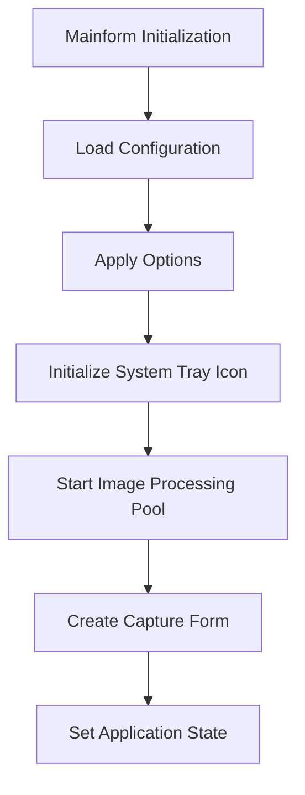
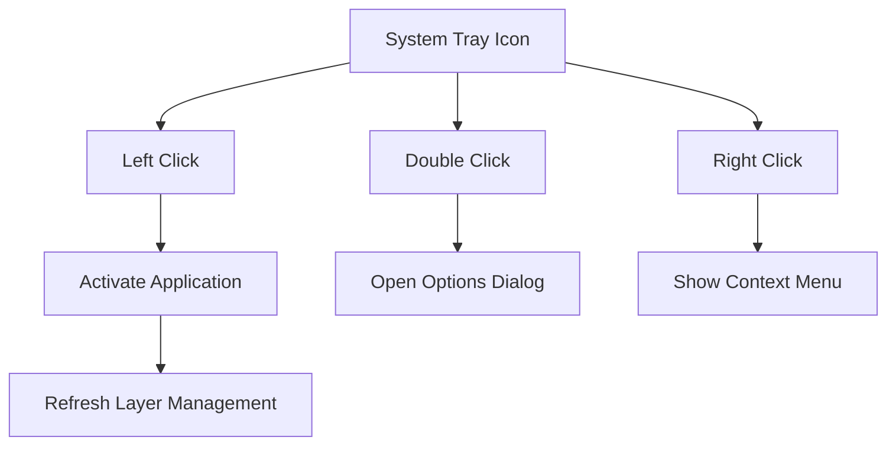
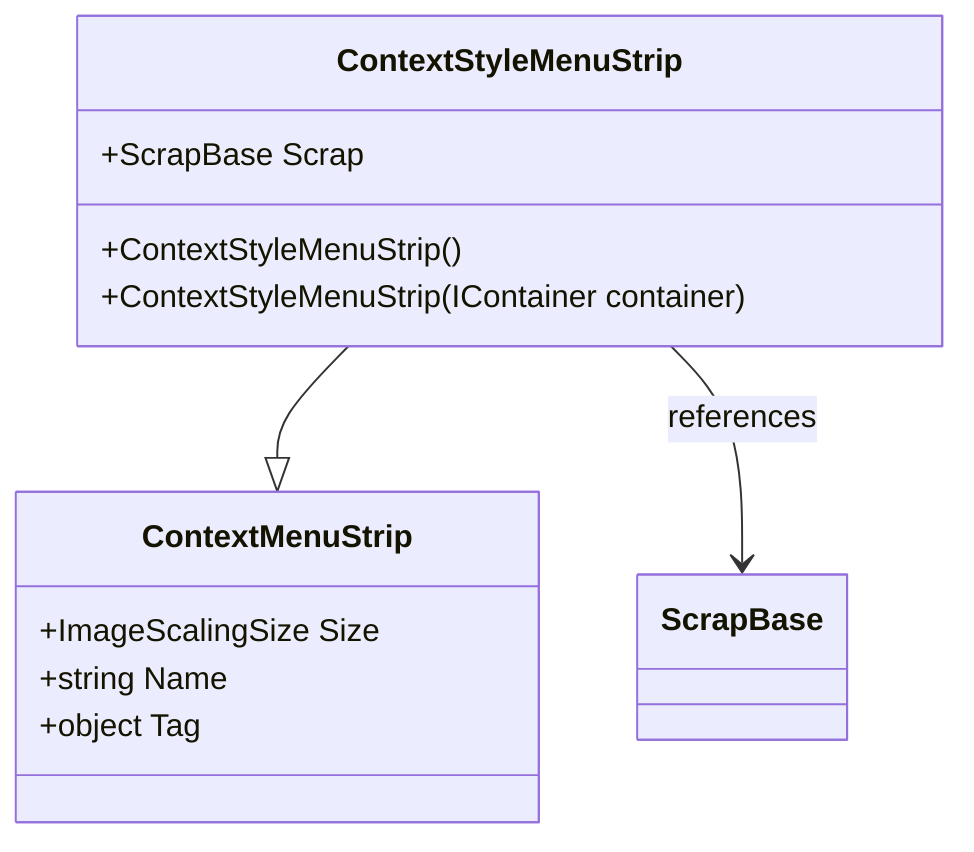
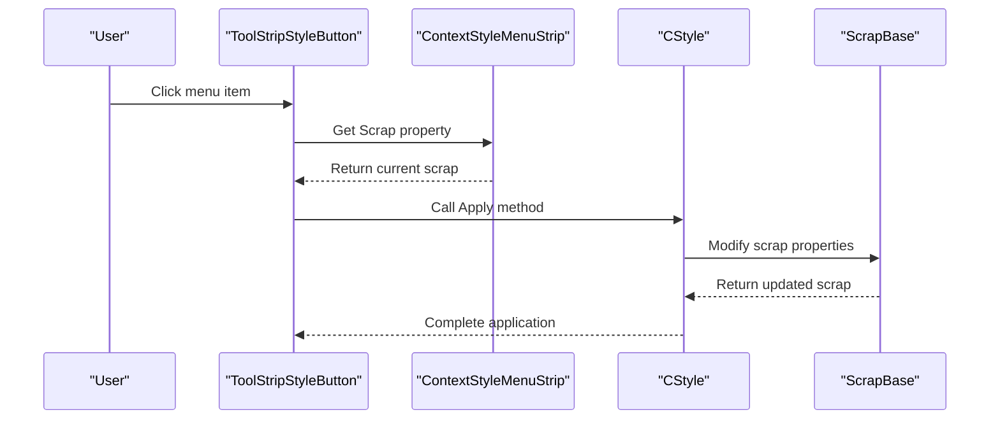
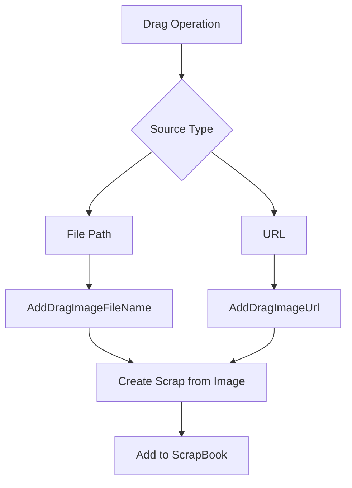
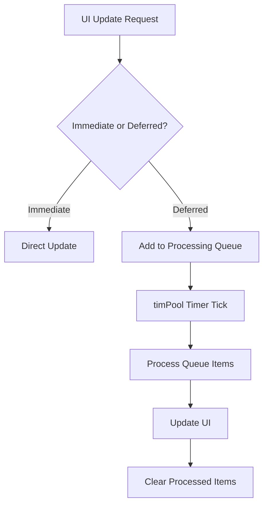

# User Interface

<cite>
**Referenced Files in This Document**   
- [Mainform.cs](file://SETUNA/Mainform.cs)
- [Mainform.Designer.cs](file://SETUNA/Mainform.Designer.cs)
- [ContextStyleMenuStrip.cs](file://SETUNA/Main/ContextStyleMenuStrip.cs)
- [ContextStyleMenuStrip.Designer.cs](file://SETUNA/Main/ContextStyleMenuStrip.Designer.cs)
- [ToolStripStyleButton.cs](file://SETUNA/Main/ToolStripStyleButton.cs)
- [ToolStripAbstractList.cs](file://SETUNA/Main/ToolStripAbstractList.cs)
- [ToolStripScrapList.cs](file://SETUNA/Main/ToolStripScrapList.cs)
- [ToolStripDustboxList.cs](file://SETUNA/Main/ToolStripDustboxList.cs)
- [ScrapBase.cs](file://SETUNA/Main/ScrapBase.cs)
- [ScrapBook.cs](file://SETUNA/Main/ScrapBook.cs)
- [SetunaListBox.cs](file://SETUNA/Main/SetunaListBox.cs)
</cite>

## Table of Contents
1. [Introduction](#introduction)
2. [Mainform Interface](#mainform-interface)
3. [System Tray Integration](#system-tray-integration)
4. [Context Menu System](#context-menu-system)
5. [ToolStripStyleButton and UI Controls](#toolstripstylebutton-and-ui-controls)
6. [User Interaction Patterns](#user-interaction-patterns)
7. [Accessibility and High-DPI Support](#accessibility-and-high-dpi-support)
8. [Performance Optimization](#performance-optimization)

## Introduction
The SETUNA application provides a comprehensive user interface for managing screenshot scraps with extensive customization options. The interface is designed around a system tray icon with context menus, main window controls, and dynamic style application. This documentation details the UI components, their interactions, and implementation patterns that enable users to capture, manage, and manipulate image scraps efficiently.

## Mainform Interface
The Mainform serves as the primary interface for the SETUNA application, providing access to core functionality through a minimalistic window with dedicated buttons for capture and options. The interface is designed to remain unobtrusive while providing quick access to essential features.

The Mainform contains two primary buttons:
- **Capture Button**: Initiates the screenshot capture process
- **Options Button**: Opens the configuration interface for application settings

The form is configured to be topmost and has a fixed size to maintain consistency across different display configurations. The interface is initialized in the `Mainform_Load` method, which handles loading user preferences, applying options, and setting up the system tray icon.

**Section sources**
- [Mainform.cs](file://SETUNA/Mainform.cs#L23-L636)
- [Mainform.Designer.cs](file://SETUNA/Mainform.Designer.cs#L19-L135)

## System Tray Integration
The system tray integration is a core component of the SETUNA user interface, providing persistent access to application functionality even when the main window is hidden. The notification icon behavior is implemented through the `NotifyIcon` component, which displays the SETUNA icon in the system tray.

The notification icon supports multiple interaction modes:
- **Left-click**: Activates the application and refreshes the layer management system
- **Double-click**: Opens the options dialog for configuration
- **Right-click**: Displays the context menu with scrap management options

The system tray icon visibility is controlled by the application mode setting. When running in tray mode, the main window is hidden from the taskbar, and all interactions occur through the system tray icon. In application mode, the main window appears in the taskbar, and the system tray icon is hidden.

**Diagram sources**
- [Mainform.cs](file://SETUNA/Mainform.cs#L638-L651)
- [Mainform.Designer.cs](file://SETUNA/Mainform.Designer.cs#L74-L80)

**Section sources**
- [Mainform.cs](file://SETUNA/Mainform.cs#L292-L306)
- [Mainform.cs](file://SETUNA/Mainform.cs#L638-L651)

## Context Menu System
The context menu system in SETUNA is implemented through the `ContextStyleMenuStrip` class, which extends the standard `ContextMenuStrip` to provide dynamic style application and scrap management functionality. The system supports two primary context menus: the system tray menu (`setunaIconMenu`) and the scrap context menu (`subMenu`).

The context menu structure is dynamically generated based on user configuration and available scraps. The menu items are organized into logical groups:
- **Scrap List**: Displays recently captured scraps with thumbnails
- **Dustbox**: Shows deleted scraps that can be restored
- **Capture Options**: Provides access to screenshot capture functionality
- **Paste Options**: Enables pasting from clipboard
- **Application Controls**: Includes version information, options, and shutdown

The `SetSubMenu` method initializes the system tray context menu by creating ToolStrip items for each available style and separator. The menu is updated dynamically based on the current application state and user preferences.

**Diagram sources**
- [ContextStyleMenuStrip.cs](file://SETUNA/Main/ContextStyleMenuStrip.cs#L4-L42)
- [ContextStyleMenuStrip.Designer.cs](file://SETUNA/Main/ContextStyleMenuStrip.Designer.cs#L30-L38)

**Section sources**
- [Mainform.cs](file://SETUNA/Mainform.cs#L97-L113)
- [ContextStyleMenuStrip.cs](file://SETUNA/Main/ContextStyleMenuStrip.cs#L4-L42)

## ToolStripStyleButton and UI Controls
The `ToolStripStyleButton` class is a custom implementation that extends `ToolStripMenuItem` to provide style-specific functionality for the context menu system. This control is responsible for applying predefined styles to scraps when selected from the context menu.

Key features of the ToolStripStyleButton include:
- **Style Reference**: Maintains a reference to the associated `CStyle` object
- **Image Support**: Optionally displays an image alongside the menu text
- **Click Handling**: Applies the associated style to the current scrap when clicked
- **Resource Management**: Properly disposes of image resources when the control is disposed

The button's `OnClick` method retrieves the current scrap from the parent `ContextStyleMenuStrip` and applies the associated style. This implementation enables dynamic style application without requiring direct references between UI components and style implementations.

**Diagram sources**
- [ToolStripStyleButton.cs](file://SETUNA/Main/ToolStripStyleButton.cs#L9-L53)

**Section sources**
- [ToolStripStyleButton.cs](file://SETUNA/Main/ToolStripStyleButton.cs#L9-L53)
- [Mainform.cs](file://SETUNA/Mainform.cs#L101-L112)

## User Interaction Patterns
SETUNA implements several user interaction patterns to enhance usability and accessibility. These patterns include right-click interactions, drag-and-drop support, and compact mode toggling.

### Right-Click Interactions
Right-click interactions are primarily handled through the context menu system. When a user right-clicks on a scrap or the system tray icon, the appropriate context menu is displayed with relevant options. The `ScrapMenuOpening` event handler in Mainform is responsible for preparing the scrap context menu by setting the current scrap and positioning the menu at the cursor location.

### Drag-and-Drop Support
The application supports drag-and-drop operations for importing images from external sources. The `ScrapBook` class provides methods for handling dragged image files and URLs:
- `AddDragImageFileName`: Processes dragged image files by path
- `AddDragImageUrl`: Handles images dragged from web browsers

This functionality enables users to drag images directly from web browsers or file explorers into the application for processing.

### Compact Mode Toggling
Compact mode is implemented through the `CompactScrap` class, which provides a minimized view of scraps. Users can toggle between normal and compact modes to reduce screen clutter when managing multiple scraps. The mode switching is handled through style application, with specific styles designed to transform scraps into compact representations.

**Section sources**
- [Mainform.cs](file://SETUNA/Mainform.cs#L653-L668)
- [ScrapBook.cs](file://SETUNA/Main/ScrapBook.cs#L334-L342)
- [ScrapBase.cs](file://SETUNA/Main/ScrapBase.cs#L15-L200)

## Accessibility and High-DPI Support
The SETUNA interface includes several features to support accessibility and high-DPI displays. The application handles different DPI settings through standard Windows Forms scaling mechanisms, ensuring that UI elements remain properly sized and positioned across different display configurations.

Accessibility features include:
- **Keyboard Navigation**: Support for keyboard shortcuts and hotkeys
- **Tooltip Support**: Informational tooltips for UI elements
- **High Contrast Mode**: Compatibility with Windows high contrast themes
- **Screen Reader Compatibility**: Standard Windows Forms accessibility features

The interface uses relative positioning and anchoring to maintain layout integrity across different screen resolutions and DPI settings. Font sizes are specified in points rather than pixels to ensure proper scaling on high-DPI displays.

**Section sources**
- [Mainform.Designer.cs](file://SETUNA/Mainform.Designer.cs#L36-L44)
- [ScrapBase.cs](file://SETUNA/Main/ScrapBase.cs#L15-L200)

## Performance Optimization
The user interface implements several performance optimizations to ensure smooth operation during frequent UI updates and high-volume scrap management.

Key optimization strategies include:
- **Lazy Loading**: Context menu items are created only when needed
- **Resource Management**: Images and other resources are properly disposed
- **Event Throttling**: UI updates are batched to reduce flicker
- **Asynchronous Operations**: Long-running operations are performed off the UI thread

The `ToolStripEx` class implements a technique to increase the size of scroll arrows in context menus, improving usability while maintaining performance. The implementation uses BeginInvoke to update UI elements without blocking the main thread.

The application also implements a pooling mechanism for image processing through the `timPool` timer, which processes queued image operations at regular intervals rather than immediately. This approach prevents UI freezing during bulk operations.

**Section sources**
- [Mainform.cs](file://SETUNA/Mainform.cs#L677-L709)
- [ToolStripEx.cs](file://SETUNA/Main/ToolStripEx.cs#L25-L160)
- [ScrapBook.cs](file://SETUNA/Main/ScrapBook.cs#L334-L342)